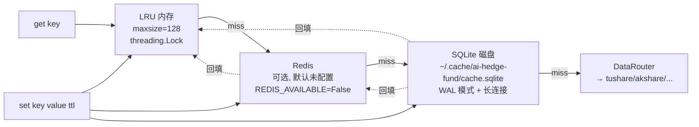

# 数据层与缓存

## 核心判断

数据层有两套并存机制:一套是 `src/data/enhanced_cache.py` 实现的 LRU / Redis / SQLite 三级缓存(给 tushare / akshare 等远端调用去重),另一套是 `data/` 目录下的 CSV / JSON 数据资产(给两条管线读历史)。它们名字都叫"缓存",但 TTL、写入路径、深度限制完全不同。把它们写成一条故事会让读者误以为 `price_cache/*.csv` 也走三级缓存——实际不走,它们是 `--auto` 收尾时直接原子写的 CSV 文件。

理解这一层的关键是先看清"哪些数据有什么深度限制":price_cache 只有 6 个月,regime_history 有 1588 天,fund_flow_cache 部分文件只有 1 行。深度不足不是 bug,是数据源接入时间点不同导致的——但用户不知道这点会误判系统"无故不出信号"。

## 三级缓存结构

入口在 `src/data/enhanced_cache.py::EnhancedCache.get`,严格按 LRU → Redis → SQLite 顺序查询;命中下层时**同步回填**上层;`set()` 三层同时写入。

### L1: LRU 内存缓存

`LRUCache`(`enhanced_cache.py:26-119`)用 `dict + access_time` 手写实现。R20.9 后所有读写通过 `self._lock = threading.Lock()` 保护,线程安全(R20.9 之前非线程安全,eviction 的 `min() + delete()` 非原子组合会让 `_cache` 和 `_access_time` 不同步)。

- 默认 `maxsize=128`,可由 `EnhancedCache(lru_size=...)` 覆盖
- eviction O(n):`_evict_lru` 用 `min(self._access_time, key=self._access_time.get)` 扫描最旧条目(不是 O(1) 的 `OrderedDict` LRU)
- 单进程隔离:进程重启即丢失,不跨进程

### L2: Redis 缓存(占位层)

`RedisCache`(`enhanced_cache.py:122-249`)在 `is_available()=False` 时所有方法都返回 sentinel(未命中)。`REDIS_AVAILABLE` 在大多数环境为 False(redis 包未装或连接失败)——**生产部署未配置 Redis**,此层基本是占位。

- key 前缀 `ai-hedge-fund:`(避免与其它项目冲突)
- pickle 序列化 + TTL(默认 3600s)
- 设计意图是跨进程共享,但当前实际不工作

### L3: SQLite 磁盘缓存

`DiskCache`(`enhanced_cache.py:252-596`)是当前真正在跑的持久层。R20 修复后改为长连接 + WAL 模式。

| 项 | 值 |
|---|---|
| 路径 | `DISK_CACHE_PATH` env → `~/.cache/ai-hedge-fund/cache.sqlite` |
| 表结构 | `cache(key PRIMARY KEY, value BLOB, expires_at INTEGER)` |
| 模式 | `PRAGMA journal_mode=WAL` + `synchronous=NORMAL` + `temp_store=MEMORY` |
| 连接 | 长连接 + `threading.RLock()` 序列化访问 |
| 重建 | `_ensure_conn()` 失效时自动重建一次 |
| TTL 检查 | read 路径上 lazy 执行(`get` 中 `if expires_at < now: self.delete`) |

**R20.10 优化**:`_is_alive` 结果缓存 5 秒,避免每次 `get/set/delete` 都 `SELECT 1`(批量 2500+ 次调用时省 1.25-2.5s)。

### BatchDataFetcher 独立短期缓存

`BatchDataFetcher` 维护**独立**的 `BatchDataCache`(TTL=60s),不与 `EnhancedCache` 共享。定位是"同一进程同一分钟对同一 trade_date 的批量请求去重"。key 命名:`daily_price_batch:{trade_date}`、`daily_basic_batch:{trade_date}`。

R20 后 `_fetch_single_ticker_prices_sync` 先检查 BatchDataCache 是否已缓存同 trade_date 的批量 DataFrame,命中则直接 filter 该 ticker 的行返回,避免重复调 tushare。

## 数据资产清单与深度限制

### 真实深度对照

| 数据源 | 位置 | 深度 | 状态 |
|---|---|---|---|
| price_cache | `data/price_cache/*.csv` | 2026-01-12 → 2026-07-08 (~117 行/股) | ⚠️ 仅 6 个月 |
| regime_history | `data/reports/regime_history.json` | 2020-2026 (1588 天) | ✅ 完整 |
| industry_index_cache | `data/industry_index_cache/*.csv` | 2020-2026 (31 行业, 1577 行) | ✅ 完整 |
| fund_flow_cache | `data/fund_flow_cache/*.csv` | 370 文件, 深度不一(部分仅 1 行) | ⚠️ 浅 |
| paper_trading_backtest | `data/paper_trading_backtest/journal.jsonl` | 2026-01-15 → 2026-07-06 (403 条) | ✅ 回测数据 |
| tracking_history | `data/reports/tracking_history.json` | 跨日 T+1/T+3/T+5 收益 | ✅ `--auto` 推荐 |

## 关键数据陷阱

### 1. paper_trading vs paper_trading_backtest

**位置**:`data/paper_trading/`(运行时实例,0 笔 EXIT) vs `data/paper_trading_backtest/`(回测,192 EXIT)。

**为什么容易混淆**:两个目录名字几乎一样,运行时实例会持续追加新 BUY,但没有 EXIT 记录。曾因此误判系统"0 笔成交",实际回测数据在另一个目录。

**正确口径**:查 setup 表现、regime 分层、止损逻辑的真实成交,用 `paper_trading_backtest/journal.jsonl`(403 条,含 211 BUY + 192 EXIT,覆盖 2026-01 → 07)。`paper_trading/portfolio_state.json` 显示 nav=2.10、realized_pnl=+110%(2026 H1 回测结果)。

### 2. price_cache 6 个月深度

**事实**:`data/price_cache/*.csv` 每股一个文件,只有 2026-01-12 → 2026-07-08,约 117 行/股。

**影响**:`scripts/setup_research.py` 直接跑会 **n=0**——IS/OOS 切分按 2020-2026,但价格数据只有 2026。Phase 0 报告 `data/reports/setup_research/phase0_report_20260708.md` 声称的 n=1762 **无法从本地数据复现**,它在更深历史生成。

**避免误判**:引用 Phase 0 报告的结论前,先与 paper_trading_backtest 真实数据交叉验证。曾因盲信 Phase 0(声称 OB E=+3.42%/n=1113)对 OversoldBounce 统一加仓,但真实回测(n=59/E=+0.34%/CI 跨 0)显示无 alpha 可放大 → 有害。

### 3. fund_flow_cache 浅数据降级

**事实**:`data/fund_flow_cache/*.csv` 370 文件,深度不一,部分仅 1 行。

**影响**:BTST 的"主力净流入 > 20d 均值"条件无法判定。`btst_breakout.py` 的处理是 `degraded=True`:历史不足 20d 时用 ≥5 天的短窗口均值,不足 5d 跳过该条件。渲染时标 `⚠残缺`。

**Operator 须知**:运行时检测口径比回测分布更宽松——回测用的是当时的完整数据,运行时遇到浅数据降级。回测显示"有信号"的票,运行时可能因 fund_flow 浅而 degraded。

### 4. known_distributions 是硬编码常量

`src/screening/offensive/known_distributions.py` 的 n=1762 等数值是硬编码常量,**无自动刷新**。引用前需交叉验证。这些常量是 Kelly 先验,改它们等于改仓位计算——必须先跑 `scripts/setup_research.py` 在更深历史上重跑 Phase 0。

## 采用顺序与边界

**先看磁盘缓存路径**。`DISK_CACHE_PATH` env 决定 SQLite 落盘位置,默认 `~/.cache/ai-hedge-fund/cache.sqlite`。生产部署若未配置 Redis,L3 是唯一持久层——若 `~/.cache` 被清理,所有缓存归零,远端调用会重新打满 tushare 配额。

**price_cache 不走三级缓存**。`--auto` 收尾时 `atomic_write_csv` 直接写 CSV 文件,不进 EnhancedCache。查个股价格历史直接读 `data/price_cache/{ticker}.csv`,不要查 SQLite。

**`--daily-action` 扫描空间 = price_cache 文件名集合**。曾因只含候选池"好股票"而漏掉涨停小盘股——已用涨停注入修复(`cache_refresh.py`),但 operator 须知晓:不在候选池的票,只要 price_cache 文件存在就会被扫到。

**引用回测结论前先交叉验证**。Phase 0 报告的数字(n=1762)无法从本地复现;真实回测(n=133/59)样本期仅 6 个月。这些数字是"当前最佳依据",不是定论。补全历史数据重跑后,所有 setup 表现、regime 分层、Kelly 先验都可能变。

## 深入阅读

- [凸性 setup 系统](./daily-action-system.md):setup 如何读 fund_flow_cache 并降级
- [LLM 多 provider 系统](./llm-system.md):LLM 调用如何复用三级缓存
- [数据基建设计](../04-design/README.md):数据路由的 provider 选择
