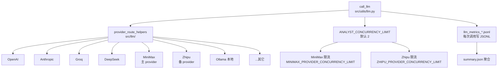

# LLM 多 provider 系统

## 核心判断

LLM 系统真正解决的不是"调哪个模型",而是"如何在多个 provider 之间做并发调度而不让某一个被限流打死"。默认模型必须显式配置 `LLM_DEFAULT_MODEL_PROVIDER` + `LLM_DEFAULT_MODEL_NAME`,**不再回退**到 `MINIMAX_MODEL` / `MINIMAX_FALLBACK_MODEL` 等 provider 变量——这个设计不是为了刁难用户,是因为静默回退会让 operator 误以为跑的是高质量模型,实际跑的是降级模型,而且这种降级在日志里几乎看不出来。

这条规则来自 `src/llm/defaults.py::get_default_model_config`:env 缺任一个就抛 `DefaultModelConfigurationError`,提示"必须成对设置"。这是把"模型选择"从隐式偏好变成显式契约——出错时立即报错,而不是在结果里事后发现。

## 多 provider 路由



支持 7+ 个 provider:OpenAI / Anthropic / Groq / DeepSeek / MiniMax / Zhipu / Ollama。模型清单由 `src/llm/api_models.json` 和 `src/llm/ollama_models.json` 维护,`scripts/list-models.py` 可列。

## 默认模型解析:为什么不回退

`src/llm/defaults.py` 的解析逻辑:

```python
_MODEL_NAME_ENV_VARS = ("LLM_DEFAULT_MODEL_NAME", "BACKTEST_MODEL_NAME")
_MODEL_PROVIDER_ENV_VARS = ("LLM_DEFAULT_MODEL_PROVIDER", "BACKTEST_MODEL_PROVIDER")

def get_default_model_config() -> tuple[str, str]:
    _ensure_default_env_loaded()
    env_model_name = _read_env(*_MODEL_NAME_ENV_VARS)
    env_provider = _read_env(*_MODEL_PROVIDER_ENV_VARS)

    if not env_model_name and not env_provider:
        raise DefaultModelConfigurationError(_build_missing_default_model_message())

    if bool(env_model_name) != bool(env_provider):
        raise DefaultModelConfigurationError(
            "默认模型配置不完整。LLM_DEFAULT_MODEL_PROVIDER 与 LLM_DEFAULT_MODEL_NAME "
            "或 BACKTEST_MODEL_PROVIDER 与 BACKTEST_MODEL_NAME 必须成对出现。"
        )

    return env_model_name or DEFAULT_MODEL_NAME, normalize_provider_name(env_provider or DEFAULT_MODEL_PROVIDER)
```

错误信息明确指出:"系统不再从 `MINIMAX_MODEL`、`MINIMAX_FALLBACK_MODEL` 等 provider 变量推断默认模型"。

### 设计动机

旧的回退链路是:`LLM_DEFAULT_MODEL_NAME` 缺失 → 回退到 `MINIMAX_MODEL` → 再缺回退到 `MINIMAX_FALLBACK_MODEL`。这条链路有两个问题:

1. **静默降级不可观测**:operator 设置了 `MINIMAX_MODEL=abab6.5-chat` 但忘了设 `LLM_DEFAULT_MODEL_NAME`,系统静默用 `MINIMAX_MODEL` 跑,日志里看不出区别。事后发现回测结果异常,排查几小时才发现跑的是降级模型。
2. **provider 与 model 名不匹配**:`MINIMAX_MODEL` 隐含 provider=MiniMax,但如果同时设了 `LLM_DEFAULT_MODEL_PROVIDER=Zhipu`,系统会用 Zhipu 的 client 调 MiniMax 的模型名,直接报错。成对要求消除了这种隐式不匹配。

新规则:**配置不完整就立即抛错,不跑**。这是把"模型选择"的契约从运行时隐式偏好提前到启动时显式校验——fail fast,而不是 fail silent。

## 并发控制与限流

入口在 `src/utils/llm.py::build_parallel_provider_execution_plan`,按 provider 分并发桶。

| 配置 | 默认 | 作用 |
|---|---|---|
| `ANALYST_CONCURRENCY_LIMIT` | 2 | 全局并发上限 |
| `MINIMAX_PROVIDER_CONCURRENCY_LIMIT` | (env) | MiniMax 单 provider 限流 |
| `ZHIPU_PROVIDER_CONCURRENCY_LIMIT` | (env) | Zhipu 单 provider 限流 |
| `LLM_PRIMARY_PROVIDER` | (env, 如 `MiniMax`) | 主 provider 偏置 |

**双 provider 模式**:总并发 ≈ MiniMax limit + Zhipu limit。主 provider 拿大头流量,备 provider 接溢出。这避免单 provider 被打到限流阈值后整批请求阻塞——溢出部分自动切到备 provider,不抛错。

### Ollama 本地模型

`src/utils/ollama.py` 支持本地模型,自动下载缺失模型。适合无网络或想省 API 费用的场景,但延迟通常比远端 provider 高(本地 GPU 推理 vs 远端集群)。

## LLM 指标收集

每次调用写 JSONL 到 `logs/llm_metrics_*.jsonl`,聚合到 `summary.json`:

| 字段 | 含义 |
|---|---|
| provider | 哪个 provider 处理 |
| model | 实际跑的模型名 |
| latency_ms | 调用耗时 |
| tokens_in / tokens_out | 上下文 / 输出 token 数 |
| cost | 估算费用 |
| success | 是否成功 |
| error | 失败原因 |

`scripts/summarize_llm_metrics.py` 出聚合报告。这是 operator 确认"系统真的在跑高质量模型,不是降级"的可观测性兜底——如果 metrics 显示 model=abab5.5-chat 而 operator 期望的是 abab6.5-chat,说明 env 配置错了。

## 任务流案例:`--pipeline` 模式如何调度多 provider

`--auto` 默认不走 LLM(纯因子评分),只有 `--pipeline` 子模式会调 `src/agents/` 下的 18 个 agent(上游 13 个大师 + 5 个本分叉新增)。假设 operator 配置:

```bash
LLM_DEFAULT_MODEL_PROVIDER=MiniMax
LLM_DEFAULT_MODEL_NAME=abab6.5-chat
LLM_PRIMARY_PROVIDER=MiniMax
MINIMAX_PROVIDER_CONCURRENCY_LIMIT=3
ZHIPU_PROVIDER_CONCURRENCY_LIMIT=2
ANALYST_CONCURRENCY_LIMIT=5
```

`build_parallel_provider_execution_plan` 调度 5 个 agent 并发:
- 主路径:3 个走 MiniMax(限流 3),命中并发桶上限
- 溢出:2 个走 Zhipu(限流 2),备 provider 接管
- 任一 provider 限流 → 该桶排队,不阻塞其它桶

如果 operator 忘了设 `LLM_DEFAULT_MODEL_NAME`,启动时直接抛 `DefaultModelConfigurationError`,根本进不了 pipeline——这就是"显式契约"的兜底效果。

## 采用顺序与边界

**先设两个 env**:`LLM_DEFAULT_MODEL_PROVIDER` + `LLM_DEFAULT_MODEL_NAME`。这两个是最低要求,缺一不可。配完跑 `python -c "from src.llm.defaults import get_default_model_config; print(get_default_model_config())"` 验证不抛错。

**再设并发限制**:`ANALYST_CONCURRENCY_LIMIT` 默认 2 太保守,跑 `--pipeline` 时可调到 5-10。但不要超过 provider 的实际并发上限——MiniMax 的 API 限流是按账号计算的,超了会被拒。

**Redis 未配置时 LLM 指标只落本地 JSONL**。`logs/llm_metrics_*.jsonl` 是按日期轮转的本地文件,不跨进程聚合。多机部署需要自己搭日志收集(见 [data-layer.md](./data-layer.md) 的 Redis 占位说明)。

**Ollama 模式只适合研究**。本地模型延迟高、质量不稳定,生产 `--pipeline` 用远端 provider 更稳。Ollama 适合无网络环境下做接口调试,不要拿来跑正式回测。

## 深入阅读

- [数据层与缓存](./data-layer.md):LLM 调用如何复用三级缓存去重
- [Agent 系统](../04-design/README.md):18 个 agent 的设计
- [LLM 系统功能](../product/features/llm-system.md):旧版功能清单
