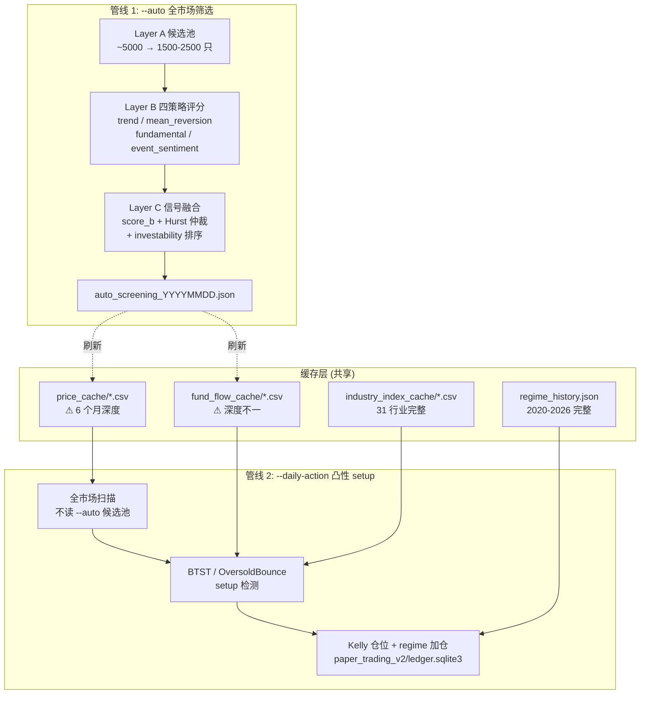

# 系统架构总览

## 核心判断

这套系统真正解决的不是"如何选股",而是"如何让两个目标冲突的决策流程不互相污染"。`--auto` 想从全市场挑出 1500-2500 只可投标的,按四策略打分排序;`--daily-action` 想从全市场挑出今日涨停的极端股票,用 Kelly 仓位下注。前者的候选池是"好股票",后者要的是"极端股票"——如果把 `--auto` 的 Top N 当成 `--daily-action` 的输入,涨停 setup 会因为候选池里没有涨停股而集体失效。

两条管线只在缓存层握手:`--auto` 跑完会刷新 `data/price_cache/`、`data/fund_flow_cache/`,供 `--daily-action` 读;除此之外它们各自独立运行、各自落盘、各自有退出条件。

## 系统总览图



图里两条竖向管线看起来像流水线,但它们由不同的命令触发、读不同的输入、写不同的产物。缓存层是它们之间唯一的桥。

## 两条管线对比

| 维度 | `--auto` 管线 | `--daily-action` 管线 |
|---|---|---|
| 命令 | `uv run python src/main.py --auto` | `uv run python src/main.py --daily-action` |
| 入口 | `src/main.py::run_auto` | `src/cli/dispatcher.py::_resolve_daily_action` |
| 触发时机 | 收盘后 ~4PM 跑全流程 | 读缓存,~3 秒 |
| 扫描空间 | Layer A 候选池 (已过滤 ST/停牌/低流动) | 全市场 `price_cache/*.csv` 文件名集合 |
| 评分逻辑 | 四策略因子 → score_b | setup 触发条件 + trigger_strength |
| 仓位 | 不输出仓位 | half-Kelly, 单票 10% 上限 |
| 退出条件 | 排序 Top N 即结束 | T+10 (BTST) / T+5 (OB) 时间退出 + 止损 |
| 产物 | `data/reports/auto_screening_YYYYMMDD.json` | `data/paper_trading_v2/ledger.sqlite3` + 控制台渲染 |
| 依赖 LLM | 仅 `--pipeline` 模式调用 18 个 agent | 不调用 LLM |

这张表回答了最常见的一个混淆:用户问"为什么 `--daily-action` 没出信号",答案通常是 `--auto` 还没跑、`price_cache` 没刷新到当日,而不是 `--daily-action` 本身坏了。

## 任务流案例:从 `--auto` 到次日买入信号

以 2026-07-13 (周一) 收盘后为例,用户依次执行:

**第一步:17:30 跑 `--auto`**

```bash
uv run python src/main.py --auto
```

`run_auto` 进入 `src/screening/candidate_pool.py::build_candidate_pool` 执行 Layer A:
- 从 tushare 拉全市场 ~5000 只股票
- 过滤 ST/*ST、北交所、次新 (<60 交易日)、停牌、当日涨停、低流动 (<5000 万成交额)
- 输出 1500-2500 只可投标的

接着 `src/screening/strategy_scorer.py::score_batch` 对每只票跑四策略评分,输出 trend_score、mean_reversion_score、fundamental_score、event_sentiment_score 四个子分。

`src/screening/signal_fusion.py::fuse_batch` 把四个子分加权融合成 score_b,过 Hurst 仲裁(趋势 vs 反转冲突时按 Hurst 指数取舍),再由 `src/screening/investability.py::rank_recommendations_by_investability` 按 investability 排序取 Top 10。结果写入 `data/reports/auto_screening_20260713.json`。

**第二步:`--auto` 的尾部副作用——刷新缓存**

`src/screening/offensive/cache_refresh.py` 在 `--auto` 收尾时把涨停股注入 `price_cache`,因为候选池会过滤掉涨停股,但 `--daily-action` 的 BTST setup 需要涨停股的价格历史。这是两条管线在缓存层的唯一显式握手点。

**第三步:次日 09:00 跑 `--daily-action`**

```bash
uv run python src/main.py --daily-action
```

`_resolve_daily_action` 不读 `auto_screening_20260713.json` 的 Top 10。它直接 glob `data/price_cache/*.csv` 拿到全市场文件名集合,逐只跑 `BtstBreakoutSetup.detect`:
- 读 `prices` DataFrame 判断是否涨停(板块自适应:主板 9.5%、科创创业 19.5%、北交所 29.0%)
- 读 `fund_flow_records` 判断主力净流入是否 > 20 日均值
- 读 `industry_day_pct` 判断行业涨幅是否 > 2%
- 计算 trigger_strength (5 因子 ranker:weekday + board + position + squeeze + volume)

命中的票进 `DailyActionService`,结合 regime_history 的当前 regime 标签和 known_distributions 的 Kelly 先验,输出 BUY 计划写入 `data/paper_trading_v2/ledger.sqlite3`。控制台渲染包含 ticker、setup、entry_price、kelly_pct、止损价。

**关键边界**:`--daily-action` 的扫描空间是 `price_cache` 文件名集合,不是 `--auto` 的 Top 10。如果某只涨停小盘股不在候选池里(被低流动过滤),只要它的 price_cache 文件存在,BTST 仍会扫描到它。`cache_refresh.py` 的涨停注入逻辑就是为了保证这些"坏股票"的价格历史能进缓存。

**17:00 guard 的统一性**:`--auto` 和 `--daily-action` 共用同一套 17:00 规则(`resolve_signal_date`)。A 股资金流 ~17:00 才完成当日入库,盘中 price_cache 可能已含当日收盘价但资金流未就绪。两条管线都把信号日回退到昨日,避免用不完整数据出信号。这是它们在缓存层之外的第二个共享约定——保证两条管线的信号日对齐,不触发 staleness 保护。

## LLM 第三条线

`--auto` 的 `--pipeline` 子模式会调用 `src/agents/` 下的 18 个 agent(上游 13 个大师 + 5 个本分叉新增)做 LLM 分析,但默认 `--auto` 不走 pipeline,只用纯因子评分。LLM 系统是独立的第三条线,有自己的多 provider 路由、并发限流、默认模型契约——细节见 [llm-system.md](./llm-system.md)。

LLM 线与前两条管线的关系是"可选叠加":不调 LLM 时 `--auto` 仍能跑完整 Layer A/B/C;调 LLM 时是给每只票额外加一个 agent 分析维度。不要把 LLM 当成 `--auto` 的必需依赖。

## 采用顺序与边界

**先跑 `--auto` 再跑 `--daily-action`**。顺序反过来会让 `--daily-action` 拿到昨日的 price_cache,17:00 guard 会回退到昨日信号日,出的是"昨日信号 → 今日买入"——研究上可用,但不是当日决策。

**`--auto` 不依赖 `--daily-action`**。`--auto` 可以单独跑,只是产物里没有 BUY 计划和止损价;`--daily-action` 不能单独跑,它需要 `--auto` 刷新的 price_cache 和 fund_flow_cache。

## 深入阅读

- [三层管线架构](./three-layer-pipeline.md):Layer A/B/C 各自的过滤规则与排序逻辑
- [凸性 setup 系统](./daily-action-system.md):BTST 触发条件、Kelly 仓位、止损披露
- [数据层与缓存](./data-layer.md):三级缓存的实现与 6 个月深度限制
- [LLM 多 provider 系统](./llm-system.md):为什么默认模型必须显式配置
