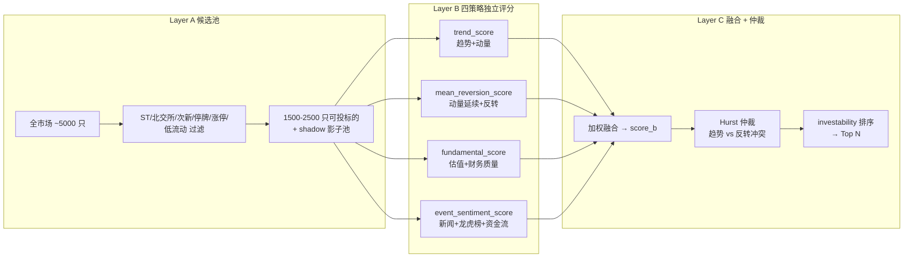

# 三层管线架构

## 核心判断

Layer A/B/C 不是一条流水线的三个步骤,而是三种职责分离:Layer A 决定"哪些股票能进评价体系"(过滤),Layer B 决定"每只票多符合某种风格"(独立评分),Layer C 决定"四套评分怎么合成一个排序键"(融合 + 仲裁)。把它们写成一条直线会让读者误以为前一层出错就会污染后一层,实际是每一层都有自己的降级路径——Layer A 滤掉的票不会进 Layer B,但 Layer B 某个策略数据缺失也只降权该策略,不会让整只票出列。

## 总览图



四策略并行,互不依赖。Layer C 的 score_b 是它们的加权融合,而不是"挑选其中之一"。

## Layer A:候选池快筛

入口在 `src/screening/candidate_pool.py::build_candidate_pool`,从 tushare 拉全市场列表后按以下规则过滤:

| 规则 | 阈值 | 作用 |
|---|---|---|
| ST/*ST 排除 | 名称含 ST | 避免退市风险 |
| 北交所排除 | 4xxxxx / 8xxxxx / 92xxxx | 流动性与数据完整性不足 |
| 次新股排除 | 上市 <60 交易日 | 缺乏历史数据 |
| 停牌排除 | 当日停牌 | 无法买入 |
| 涨停排除 | 当日涨停 | 买入排队失败 |
| 长停复牌排除 | 停牌 >5 日后复牌 <3 交易日 | 价格未稳定 |
| 低流动排除 | 近 20 日均成交额 <5000 万 | 滑点过大 |
| 冷却期排除 | 冲突仲裁标记后 15 日 | 避免重复触发 |

边界候选(流动性刚低于阈值)进 shadow 影子池,不参与排序但保留观察。这一步把全市场压到 1500-2500 只可投标的,后续 Layer B/C 只处理这一集合。

**为什么过滤涨停股**:`--auto` 的目标是挑"可买入"的票,涨停日排队买不到。但 `--daily-action` 的 BTST setup 需要涨停股——`cache_refresh.py` 会在 `--auto` 收尾时把涨停股注入 `price_cache`,供 `--daily-action` 全市场直扫。这是两条管线的握手点,见 [overview.md](./overview.md)。

## Layer B:四策略独立评分

每只票被四个策略独立评分,输出 0-1 的分数 + 子因子三元组(direction, confidence, completeness)。入口在 `src/screening/strategy_scorer.py::score_batch`。

| 策略 | 评分器 | 主因子 | 数据源 |
|---|---|---|---|
| trend 趋势 | `strategy_scorer_trend.py` | ADX 趋势强度、动量延续 | price_cache |
| mean_reversion 均值回归 | `strategy_scorer_mean_reversion.py` | 短期动量、反转信号 | price_cache |
| fundamental 基本面 | `strategy_scorer_fundamental.py` | 估值(PE/PB)、财务质量 | 财务指标缓存 |
| event_sentiment 事件情绪 | `strategy_scorer.py` | 新闻情绪、龙虎榜、资金流 | fund_flow_cache、新闻接口 |

**completeness 子因子**:每个策略输出 completeness 指标,表示该策略依赖的数据有多少缺失。数据不全时该策略自动降权,而不是让整只票出列。这是 Layer B 的降级路径——某只票的财务数据缺失只会让 fundamental_score 偏低,不会影响 trend_score。

**mean_reversion 的设计反转**:早期版本按"反转"逻辑(短期跌多了买),后改为"动量延续主导"(commit 023acd74)。这意味着 mean_reversion_score 高的票是"短期涨势强"的票,不是"超跌"的票。读代码时不要被名字误导。

## Layer C:信号融合与仲裁

### score_b 加权融合

`src/screening/signal_fusion.py::fuse_batch` 把四个策略分加权融合成 score_b。权重默认四等分 (各 0.25),可由 `--custom-weights` 覆盖;`--calibrate-weights` 会基于历史因子 IC 自动调权。

score_b 阈值定义在 `src/main.py` 顶部:

```python
SCORE_B_GREEN_FLOOR = 0.35   # >= 0.35 → 绿色 (看多) / high_pool 候选
SCORE_B_YELLOW_FLOOR = 0.0   # >= 0.0 (但 < 0.35) → 黄色 (中性); < 0.0 → 红色 (看空)
```

这两个常量同时用于表格颜色编码和 high_pool 过滤,集中定义避免分叉。

### Hurst 仲裁

当 trend 和 mean_reversion 同时高分但方向冲突(趋势说涨,反转说跌)时,Layer C 不简单相加,而是用 Hurst 指数判断当前是趋势市场还是均值回归市场:
- Hurst > 0.5 → 趋势持续性强,采信 trend_score,压制 mean_reversion_score
- Hurst < 0.5 → 均值回归性强,采信 mean_reversion_score,压制 trend_score

这是 Layer C 的核心仲裁机制——避免趋势和反转信号互相抵消导致 score_b 居中无信号。

### investability 排序

`src/screening/investability.py::rank_recommendations_by_investability` 把 score_b 作为主排序键,叠加质量守卫(数据完整度、行业集中度)输出 Top N。`profit_aware` 排序模式默认关闭(代码注释称 composite_score 有负预测值,但未经本环境验证)。

## 数据流案例:000001 平安银行如何在三层管线流转

以 2026-07-13 收盘后跑 `--auto` 为例,假设 000001 当日上涨 3.2%、成交 12 亿、行业(银行)涨 1.5%:

**Layer A**:`build_candidate_pool` 拉到 000001 后逐条检查过滤规则——非 ST、非北交所、上市远超 60 日、当日未停牌、未涨停(涨 3.2% < 9.5%)、近 20 日均成交 12 亿 > 5000 万、未在冷却期。000001 进可投标的集合 (~2000 只之一)。

**Layer B**:四策略并行评分:
- `trend_score`:近 20 日 ADX 35 (强趋势)、5 日动量 +3.2% → score 0.72
- `mean_reversion_score`:短期动量延续(非反转逻辑)→ score 0.55
- `fundamental_score`:PE 6.2、ROE 12% → score 0.68,但 completeness=0.85 (财务数据部分缺失)
- `event_sentiment_score`:无龙虎榜、资金流小幅净流入 → score 0.40

**Layer C**:`fuse_batch` 默认四等分权重,score_b = (0.72 + 0.55 + 0.68 + 0.40) / 4 = 0.588 → 绿色 (>= 0.35)。Hurst 仲裁:trend 与 mean_reversion 同向(都看多),不触发压制。`rank_recommendations_by_investability` 按 score_b 排序,000001 在 Top 10 内 → 进 `auto_screening_20260713.json` 的 recommendations。

**假设场景**:如果 fundamental_score 因数据缺失降到 0.20,score_b = (0.72 + 0.55 + 0.20 + 0.40) / 4 = 0.468,仍是绿色,但排名会下滑——这就是 completeness 降权的效果,不是把票踢出列。

## 采用顺序与边界

**先调 Layer A 的过滤阈值,再调 Layer B 的策略权重**。Layer A 的过滤规则决定了 Layer B 看到什么样本;改 Layer B 的权重不会让被滤掉的票回来。常见错误是抱怨"某只票 score_b 很低",实际是它在 Layer A 就因为低流动被踢了,根本没进 Layer B。

**Layer C 的 Hurst 仲裁不能关闭**。它不是可选优化,是避免 trend + mean_reversion 互相抵消的必需机制。如果 Hurst 数据缺失,Layer C 会降级为纯加权融合,但 score_b 的趋势票和反转票会混在一起,排序噪声变大。

**`profit_aware` 模式谨慎开启**。代码注释称 composite_score 在历史回测里有负预测值,但这个结论未经本环境验证。默认关闭是安全选择;开启前应先用 `--calibrate-weights` 看因子 IC,确认 composite_score 在当前样本里仍有预测力。

## 深入阅读

- [凸性 setup 系统](./daily-action-system.md):`--daily-action` 如何绕开 Layer A/B/C 全市场直扫
- [数据层与缓存](./data-layer.md):Layer B 各策略读的 price_cache / fund_flow_cache 的深度限制
- [因子评分设计](../04-design/factor-scoring-design.md):四策略的子因子详细定义
