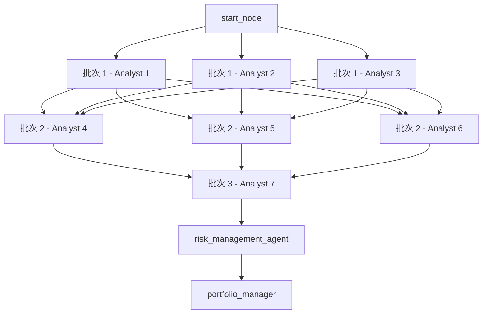
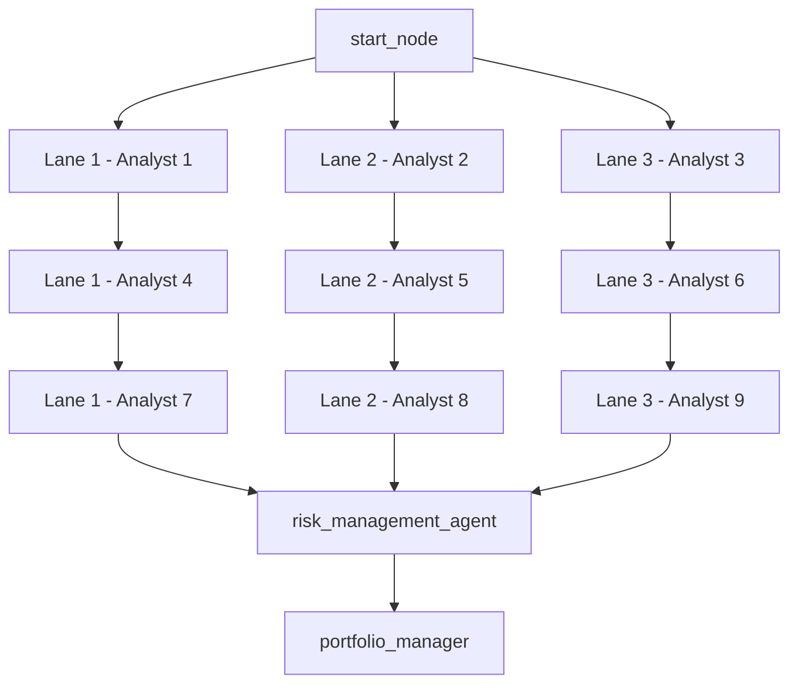

# Analyst 批次 Barrier 优化方案说明

**文档日期**：2026 年 3 月 11 日  
**文档目标**：详细解释下一阶段性能优化中两个候选动作分别要做什么、为什么这么做、风险在哪里，以及是否存在更优方案。  
**适用范围**：CLI / backtester 默认工作流，即 [src/main.py](src/main.py) 中通过 `create_workflow()` 构造的 analyst 执行图。  

---

## 1. 背景

当前这轮调优已经把 provider 层面的低垂果实基本摘完了：

1. 去掉了非 OpenAI 路径下重复的 precise 阶段。
2. 用 `LLM_PARALLEL_PROVIDER_ALLOWLIST` 把 Zhipu 从 analyst 并行波次里剥离出去。
3. 实测把 5 日 wall-clock 从 `1691.04` 秒压到了 `933.64` 秒。

但这还不是当前结构的理论极限。原因是默认工作流本身仍然有一个更深层的结构性瓶颈：**批次 barrier**。

默认工作流在 [src/main.py](src/main.py#L129) 中是这样构造的：

1. 先按 `concurrency_limit` 把 analyst 切成若干批次。
2. `start_node` 只连接第一批。
3. 后一批的每个 analyst，都依赖前一批的所有 analyst。
4. 只有最后一批结束，才会进入 `risk_management_agent`。

这意味着：

1. 并发上限虽然被控制住了。
2. 但“下一批何时启动”不是由单个 lane 完成决定，而是由上一批最慢那个 analyst 决定。
3. 这就是典型的 barrier 行为。

---

## 2. 当前结构到底慢在哪里

### 2.1 现在的图结构

把 [src/main.py](src/main.py#L145) 到 [src/main.py](src/main.py#L164) 的逻辑抽象出来，当前默认工作流更接近下面这张图：



这不是普通的“最多同时跑 3 个 analyst”，而是：

1. 批次 2 必须等批次 1 全部完成。
2. 批次 3 必须等批次 2 全部完成。

只要每批里有一个慢任务，整批都会被拖住。

### 2.2 为什么 provider 调优已经说明了这个问题

前面的 MiniMax / Doubao / Zhipu 实验已经给了一个很强的旁证：

1. 把 Zhipu 留在 analyst 并行波次里，整体 wall-clock 改善不明显。
2. 一旦把 Zhipu 排除出 analyst 并行波次，速度立刻显著提升。

这说明当前系统不是简单的“总吞吐不够”，而是“**慢尾会拖死整批**”。

换句话说，当前瓶颈不是“缺 lane”，而是“lane 之间耦合得太紧”。

---

## 3. 你问的方案 1 和方案 2，分别是什么

我前面提的两个动作，含义并不一样：

### 3.1 方案 1

> 分析 [src/main.py](src/main.py) 的批次屏障，并给出一版最小改动的结构优化方案。

这不是直接改代码，而是先做一版**可落地的设计说明**。重点是回答：

1. 哪些边依赖其实只是为了限并发，而不是业务语义必须。
2. 怎样改图结构，才能在不破坏结果聚合逻辑的前提下，减少 barrier。
3. 改完以后要补哪些测试和验证。

### 3.2 方案 2

> 直接开始实现一轮 barrier 降低方案，并补回归测试与小样本验证。

这一步是工程落地：

1. 真正修改 [src/main.py](src/main.py) 的默认工作流构图逻辑。
2. 增加或修改测试，确保并发上限和业务输出不被破坏。
3. 跑小样本 backtest / pipeline 验证 wall-clock 是否继续下降。

因此，方案 1 更像“设计与评审”，方案 2 是“实现与验证”。

---

## 4. 方案 1 具体应该怎么做

### 4.1 目标

方案 1 的目标不是提速本身，而是先把下面三件事讲清楚：

1. 当前 barrier 的具体来源。
2. 最小改动的可行替代结构。
3. 改动影响面和验证方法。

### 4.2 需要做的工作

如果按工程任务拆分，方案 1 应该至少包含下面几项：

#### 工作 A：画出当前默认 analyst 图的真实依赖模型

不是只看“有几批”，而是要明确下面两件事：

1. 当前批次之间是**全连接依赖**，不是单 lane 串行。
2. `risk_management_agent` 需要的是“全部 analyst 信号都到齐”，但并不意味着“第 2 批必须等待第 1 批全部到齐”。

#### 工作 B：区分业务依赖和限流依赖

这是最关键的一步。

当前默认图里的依赖边实际上混合了两种含义：

1. **业务依赖**：risk manager 必须在 analyst 信号齐备后再执行。
2. **限流依赖**：为了不让所有 analyst 一次性放开执行，才人为把他们切成批次。

方案 1 的核心就是把这两类依赖拆开分析。

#### 工作 C：给出一版“最小改动”的替代构图

在当前代码结构下，最值得优先评估的最小改动方案其实不是“更复杂的调度器”，而是把批次 barrier 改成**lane 链式执行**。

也就是：

1. 仍然保留 `concurrency_limit` 作为并发上限。
2. 但不再让“后一批每个 analyst 依赖前一批全部 analyst”。
3. 改成“每条 lane 内串行，lane 与 lane 之间独立推进”。

抽象图如下：



这样一来：

1. 同时运行的 analyst 数量仍然不超过 lane 数。
2. 某条 lane 先完成，就能立刻启动它自己的下一位 analyst。
3. 不需要等待别的 lane 里那个慢任务收尾。

#### 工作 D：定义验证口径

方案 1 最后必须给出一套明确验证口径，否则方案 2 会变成盲改。

建议至少定义下面四类验证：

1. 图结构验证：确保从“批次全连接”切成“lane 串行”后，边数量和依赖形态符合预期。
2. 并发上限验证：任意时刻同时活跃的 analyst 数不应超过 `concurrency_limit`。
3. 业务结果验证：`analyst_signals`、`risk_management_agent`、`portfolio_manager` 的输入输出语义不变。
4. 性能验证：在相同 provider 配置下，对比 wall-clock 和慢尾影响。

### 4.3 为什么要先做方案 1

原因很直接：

1. 现在已经不是“没有方向”，而是“方向很清楚，但要避免把默认图改坏”。
2. 默认工作流是 CLI/backtester 的主入口，改错了影响面比单个 provider 参数大得多。
3. 先把结构、边界和验证方法写清楚，能把方案 2 的返工风险显著压低。

### 4.4 方案 1 的优点和缺点

优点：

1. 风险最低。
2. 能先确认是否真的只需要改 [src/main.py](src/main.py)，还是还要同步考虑其他路径。
3. 有利于把“为什么这么改”讲清楚，便于团队评审。

缺点：

1. 不直接产出速度收益。
2. 如果设计结论已经很明显，再单独做一轮纯分析，可能会让节奏变慢。

---

## 5. 方案 2 具体应该怎么做

### 5.1 目标

方案 2 的目标是：

1. 在不放开无限并发的前提下，减少默认 analyst 工作流中的 barrier。
2. 把“批次等待全部完成”改成“单 lane 自治推进”。
3. 用测试和小样本验证证明它值得保留。

### 5.2 最值得先做的实现版本

如果直接进入实现，我不建议一上来就做复杂调度器，而是建议先做一版**lane 链式构图**。

原因是它满足三个条件：

1. 改动位置集中。
2. 并发上限可控。
3. 和当前 `build_parallel_provider_execution_plan()` 的分配模式天然兼容。

### 5.3 具体实现步骤

#### 步骤 1：新增 lane 构造辅助函数

当前 [src/main.py](src/main.py#L191) 里是 `_build_analyst_batches()`，返回的是按批次切片的二维列表。

方案 2 更适合新增一个类似下面语义的 helper：

```python
def _build_analyst_lanes(selected_analysts: list[str], concurrency_limit: int) -> list[list[str]]:
    ...
```

推荐做法是按轮转方式分配：

1. 前 `concurrency_limit` 个 analyst 作为各 lane 的起点。
2. 后续 analyst 依次挂到对应 lane 尾部。

如果 `concurrency_limit = 3`，分析师序列是 `A1..A9`，则 lanes 可以是：

1. `Lane 1 = [A1, A4, A7]`
2. `Lane 2 = [A2, A5, A8]`
3. `Lane 3 = [A3, A6, A9]`

这样能让每一轮 provider slot 和 lane 序号天然对齐。

#### 步骤 2：重写默认工作流的 analyst 边连接方式

当前 [src/main.py](src/main.py#L149) 到 [src/main.py](src/main.py#L160) 的逻辑是批次之间全连接。

方案 2 中应改成：

1. `start_node` 只连每条 lane 的第一个 analyst。
2. 每条 lane 内部前后串联。
3. 每条 lane 的最后一个 analyst 连到 `risk_management_agent`。

这样仍然能保证：

1. risk manager 在所有 lane 尾部完成后才执行。
2. 但每条 lane 的下一位 analyst 不再被其他 lane 的慢任务卡住。

#### 步骤 3：保留现有 provider override 机制

[src/utils/llm.py](src/utils/llm.py#L229) 的 `build_parallel_provider_execution_plan()` 不一定需要同步大改。

原因是它本来就是按“每一波最多 `wave_size` 个 analyst”去分配 overrides。lane 链式构图仍然保留相同的并发上限，只是把“波次切换条件”从“整批完成”改成“单 lane 空出”。

也就是说：

1. provider override 分配逻辑可以先保持不动。
2. 先观察仅靠图结构调整，是否已经拿到显著收益。
3. 如果后续还要更进一步，再考虑让 provider 调度器和 lane 拓扑更紧密地协同。

#### 步骤 4：补测试

至少应补下面两层测试：

1. **结构测试**：验证 lane 构造结果和边连接结果是否正确。
2. **回归测试**：验证风险管理和投资组合管理的收尾顺序没被破坏。

最实用的测试切入点是：

1. 先把 lane 构造函数做成纯函数，单测它的输出。
2. 再对 `create_workflow()` 产出的图结构做断言，确保不存在原来那种“上一批到下一批的全连接边”。

#### 步骤 5：做小样本性能验证

实现后不需要立刻跑超长样本，先跑最有代表性的短样本即可：

1. 仍然用当前最佳 provider 配置：MiniMax=5 + Doubao=4 + allowlist 排除 Zhipu analyst 波次。
2. 先跑 3 到 5 个交易日。
3. 重点看 wall-clock 是否继续下降，以及“慢尾对后续 analyst 启动的阻塞”是否减弱。

### 5.4 为什么方案 2 值得优先实现

方案 2 值得做，不是因为它最“高级”，而是因为它的性价比最高：

1. 真正的瓶颈已经被定位到默认图结构。
2. lane 链式改造不需要重写 LLM 调度层。
3. 影响面主要集中在默认 workflow 构图逻辑，回滚成本相对可控。
4. 它有机会在不提高 provider 压力的前提下，继续降低 wall-clock。

### 5.5 方案 2 的风险

它不是零风险，主要有三类：

1. **状态合并风险**：LangGraph 对并行节点状态写入的合并行为必须确认仍然与当前 analyst_signals 累积模式兼容。
2. **测试覆盖不足风险**：如果只测速度，不测输出结构，可能把隐藏的时序问题带进来。
3. **适用范围误判风险**：这个改动主要针对默认 CLI/backtester workflow，不一定自动覆盖 Web 自定义图路径。

---

## 6. 为什么我会建议优先考虑 lane 链式，而不是别的做法

因为它是当前代码形态下最平衡的选择。

### 6.1 它保留了当前系统的几个重要约束

lane 链式不是完全推翻当前架构，而是保留了下面这些关键约束：

1. analyst 总数和执行顺序仍然来自 [src/utils/analysts.py](src/utils/analysts.py)。
2. 并发上限仍然由 `ANALYST_CONCURRENCY_LIMIT` 控制。
3. risk manager 和 portfolio manager 的收尾顺序保持不变。
4. provider override 的分配机制不必先重写。

### 6.2 它直接切掉了当前最贵的结构性等待

当前最昂贵的等待不是“risk manager 等 analyst 全部完成”，而是“某条 lane 明明空了，但因为同批别的 lane 还没收尾，所以它也不能继续”。

lane 链式正好把这一类等待切掉。

### 6.3 它比引入外部任务队列更容易验证

只要改图结构，很多现有测试和运行入口都还能复用；但如果直接引入新的调度器、队列或 semaphore 层，就会把验证面扩得更大。

---

## 7. 是不是还有更好的方案

有，但“更好”要分成两种：

1. **更适合当前代码库的下一步**。
2. **理论上更强，但改动更大**。

下面把几种候选方案放在一起看。

### 7.1 方案对比总表

| 方案 | 核心思路 | 预期收益 | 实现复杂度 | 风险 | 适合现在吗 |
|------|----------|----------|------------|------|-----------|
| 方案 1：先做结构分析 | 先出设计和验证计划 | 无直接收益 | 低 | 低 | 适合做评审前置 |
| 方案 2：lane 链式实现 | 把批次 barrier 改成 lane 自治推进 | 中高 | 中 | 中 | **最适合当前阶段** |
| 方案 3：显式任务队列 / worker pool | 用独立调度器控制 analyst 任务发放 | 高 | 高 | 高 | 暂不建议先做 |
| 方案 4：risk manager 改成准实时聚合 | analyst 结果分批到达就增量聚合 | 高 | 很高 | 很高 | 当前不建议 |
| 方案 5：彻底拆分 coding_plan 与 analyst 主波次 | 慢路径异步旁路化 | 中高 | 高 | 中高 | 适合作为后续专题 |

### 7.2 方案 3：显式任务队列 / worker pool

这是理论上更强的一类方案。

思路是：

1. 不再把“限并发”编码到图边里。
2. 改成在运行时用 semaphore、任务池或显式队列发放 analyst 任务。
3. 哪个任务完成，就补发下一个。

它的优点是调度最灵活，最接近真正的 work-stealing 或 worker-pool 模型。

但它的问题也很明显：

1. 改动不再只局限于 [src/main.py](src/main.py)。
2. 会把图结构、状态合并、运行时调度三层耦到一起。
3. 对当前项目来说，实现和验证成本偏高。

所以它可能是长期更强的方向，但不是此刻最优的第一步。

### 7.3 方案 4：risk manager 改成准实时聚合

这类方案更激进。

思路是：

1. 不等所有 analyst 全部完成再汇总。
2. 达到某个 quorum 或关键 analyst 子集后，就先触发风险评估。
3. 后续结果继续增量修正。

它理论上可能继续压缩尾部时间，但会直接改变业务语义：

1. 风险管理何时触发不再和今天一样。
2. 投资组合决策是否允许增量修正，也需要重新定义。

这已经不是单纯性能优化，而是策略执行语义调整。当前不建议作为下一步。

### 7.4 方案 5：把 coding_plan 慢路径彻底旁路化

这个方向比方案 4 保守一些，但比方案 2 更大。

思路是：

1. analyst 主波次只跑快路径。
2. 类似 coding_plan 的慢路径不参与主批次 barrier。
3. 它们改走旁路，必要时再在后面汇合。

这类方案很有价值，尤其适合当前已经看到 Zhipu 慢尾效应的项目。但它仍然需要先处理默认 workflow 内部的 barrier 结构，否则旁路后的收益仍然会被批次等待稀释。

所以从顺序上说：

1. 先做 lane 链式。
2. 再评估是否还要旁路化慢路径。

---

## 8. 这两种动作里，我更推荐哪个

如果只让我在“方案 1”和“方案 2”里二选一，我的建议是：

1. **如果你要先对齐团队共识、准备做评审**，先做方案 1。
2. **如果你要尽快继续拿真实 wall-clock 收益**，直接做方案 2，但实现范围要控制在 lane 链式这一版，不要一上来做大改。

换句话说：

1. 方案 1 适合“先写设计文档，再开干”。
2. 方案 2 适合“方向已经很清楚，直接做最小可验证实现”。

就当前上下文来看，前面 provider 实验已经把根因定位得比较扎实，所以**最优实务路线其实是：文档化方案 1 的关键结论，然后直接进入方案 2 的最小实现**。

---

## 9. 推荐执行顺序

如果按最稳妥又不拖节奏的方式推进，建议顺序是：

### 第一步：冻结设计边界

确认本轮只优化默认 CLI/backtester workflow，也就是 [src/main.py](src/main.py)。

不把目标扩散到：

1. Web 自定义图构造 [app/backend/services/graph.py](app/backend/services/graph.py)
2. provider override 调度器的大改
3. risk manager / portfolio manager 的语义调整

### 第二步：实现 lane 链式构图

实现上只做三件事：

1. 新增 lane 构造 helper。
2. 改默认 workflow analyst 边连接方式。
3. 保持收尾节点不变。

### 第三步：补最小测试集

至少补：

1. lane 构造单测。
2. workflow 边结构单测。
3. 一条默认工作流回归测试。

### 第四步：跑短样本验证

继续使用当前最佳 provider 配置，验证：

1. wall-clock 是否继续下降。
2. 调用量和限流是否没有反弹。
3. 输出结果是否没有明显异常。

---

## 10. 一句话结论

你问的“1 和 2 怎么做、为什么这么做”，核心答案是：

1. 方案 1 是把问题讲透，确认当前慢点确实来自默认 workflow 的批次 barrier，并把最小可行改法和验证口径先定下来。
2. 方案 2 是在这个结论基础上，直接把默认 analyst 图从“批次全连接 barrier”改成“lane 串行推进”，在不提高并发上限的前提下减少慢尾拖累。

如果再问“是不是有更好的方案”，答案也是有的，但对当前代码库最合适的下一步，不是立刻上更复杂的调度器，而是先把 lane 链式这一步做出来。它是当前风险、收益、实现成本三者之间最平衡的方案。

---

## 11. 2026-03-12 实施结果补充

本节记录方案 1 和方案 2 的真实落地情况。

### 11.1 方案 1 已完成

方案 1 已经完成，结论就是本文件本身：

1. 已明确当前默认 workflow 的慢点来自 [src/main.py](src/main.py) 的批次全连接 barrier。
2. 已明确默认 workflow 与 provider 调度层的关系边界。
3. 已给出 lane 链式作为最小可行实现方向。

### 11.2 方案 2 已实施并完成回归验证

方案 2 也已经实际做过一轮实现：

1. 把默认 analyst workflow 改成了 lane 串行推进。
2. 补了对应单测。
3. 跑了聚焦回归测试，全部通过。

对应回归测试结果是：

1. `55 passed`
2. 没有新增错误
3. provider 调度、pipeline 逻辑、执行层测试都保持通过

### 11.3 真实 5 日跑数结果：lane 链式反而更慢

虽然代码正确、测试也通过，但真实 5 日 benchmark 结果并没有继续优化，反而退化了。

本轮 lane-chain 实验产物如下：

1. [data/reports/ab_dual_provider_validation_20260311_5d_lane_chain_mx5_doubao4_allowlist.mvp.walltime.txt](data/reports/ab_dual_provider_validation_20260311_5d_lane_chain_mx5_doubao4_allowlist.mvp.walltime.txt)
2. [data/reports/ab_dual_provider_validation_20260311_5d_lane_chain_mx5_doubao4_allowlist.mvp.timings.jsonl](data/reports/ab_dual_provider_validation_20260311_5d_lane_chain_mx5_doubao4_allowlist.mvp.timings.jsonl)
3. [logs/llm_metrics_ab_dual_provider_validation_20260311_5d_lane_chain_mx5_doubao4_allowlist.summary.json](logs/llm_metrics_ab_dual_provider_validation_20260311_5d_lane_chain_mx5_doubao4_allowlist.summary.json)

关键数字如下：

| 配置 | 5 日 wall-clock |
|------|----------------:|
| 当前最优基线：批次 barrier + MiniMax=5 + Doubao=4 + allowlist | 933.64 秒 |
| lane-chain 实现 + 相同 provider 配置 | 1047.14 秒 |

也就是说：

1. lane-chain 版本比当前最优基线慢了 `113.50` 秒。
2. 相对退化约 `12.16%`。
3. 因此这版实现不应保留在线上主路径中。

### 11.4 为什么会退化

从 metrics 看，最明显的变化不是限流，也不是错误重试，而是 Volcengine 的单次平均耗时显著变慢：

| 配置 | Volcengine 平均耗时 |
|------|-------------------:|
| 当前最优基线 | 18.79 秒 / 次 |
| lane-chain 实现 | 32.89 秒 / 次 |

同时：

1. `rate_limit_errors` 仍然是 `0`。
2. 总调用全部成功，没有出现新的 provider 异常。
3. `precise_stage_skipped` 仍然为 true，说明不是 precise 去重失效。

这说明问题不在“功能出错”，而在“lane 链式改变了 provider 与 analyst 执行时序的组合方式”，使当前 provider 负载形态变差了。

换句话说：

1. 默认批次 barrier 的确是一个结构瓶颈。
2. 但当前这版 lane 链式，并没有和现有 provider override 分配方式形成更好的耦合。
3. 所以它在当前代码形态下不是正收益改动。

### 11.5 最终处理决定

由于真实 benchmark 退化，本轮已经做了如下处理：

1. 保留方案 1 的分析结论。
2. 保留方案 2 的实验记录。
3. **撤回 lane-chain 运行代码改动**，恢复到当前最优实现。

因此，当前仓库状态仍然以“批次 barrier + allowlist 排除 Zhipu + MiniMax=5 + Doubao=4”为推荐配置，而不是 lane-chain 版本。

### 11.6 这次实施给出的新结论

这轮实施很有价值，因为它把一个原本只是“看起来合理”的结构方案，变成了一个已被证伪的具体实现版本。

当前更准确的结论应该改写成：

1. 默认 workflow 的 barrier 仍然是值得继续优化的方向。
2. 但“简单 lane 链式”不是当前代码库下的最优实现。
3. 下一步如果继续动这一层，应优先研究“provider slot 分配”和“执行拓扑”联动，而不是只改单一图结构。
