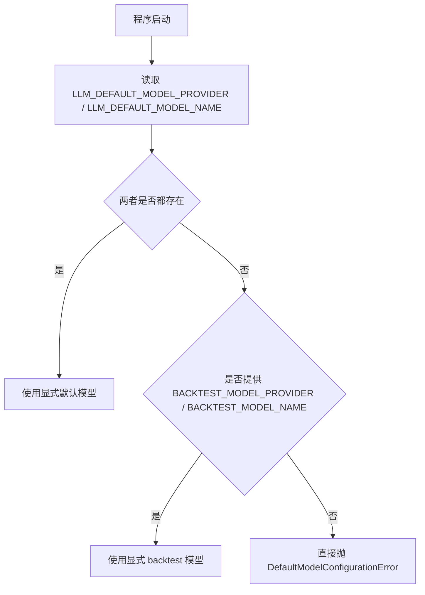
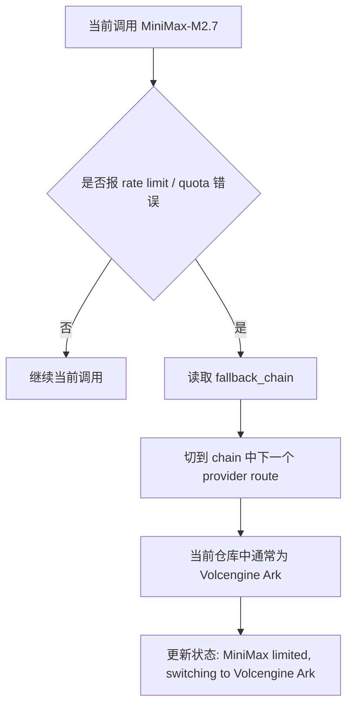

# LLM 路由图与 MiniMax 配置说明

**文档日期**：2026 年 3 月 19 日  
**用途**：说明当前仓库的默认模型解析、MiniMax 触发 rate limit 后的 fallback 路径，以及 `MINIMAX_MODEL` / `ARK_MODEL` 的职责边界。  
**适用范围**：`src/llm/defaults.py`、`src/llm/models.py`、`src/utils/llm.py`。

---

## 1. 结论摘要

当前代码里，MiniMax 发生 rate limit 时，**不会先从 `MiniMax-M2.7` 自动降到 `MiniMax-M2.5`**。

当前实际行为是：

1. 先用当前选中的 MiniMax 模型运行，例如 `MiniMax-M2.7`。
2. 如果异常命中 rate limit / quota 规则，则进入 provider fallback chain。
3. 对 MiniMax 来说，下一个 fallback route 是 **Volcengine Ark**，不是同 provider 的 `MiniMax-M2.5`。

因此：

1. 默认模型必须显式由 `LLM_DEFAULT_MODEL_PROVIDER + LLM_DEFAULT_MODEL_NAME` 成对指定。
2. `MINIMAX_MODEL` 只负责 MiniMax provider route 的主模型名，不再承担默认模型推断，也不再表示同 provider fallback。
3. `ARK_MODEL` 只负责 Volcengine Ark provider route 的主模型名。
4. MiniMax 触发 rate limit 时，仍然是切到下一个 provider route，也就是 Volcengine Ark，而不是切到 `MiniMax-M2.5`。
5. 同一轮收口后，其他 provider route 也采用相同原则：Zhipu 统一读取 `ZHIPU_MODEL`，OpenRouter 统一读取 `OPENROUTER_MODEL`，主链路不再依赖 `*_FALLBACK_MODEL`。
6. 2026-03-19 的 W1 重跑还验证了一个运行时前提：env 中显式使用的模型名必须进入能力识别链路，否则系统会误判其支持 structured output。

---

## 2. 当前默认模型解析图

默认模型的解析入口在 [src/llm/defaults.py](src/llm/defaults.py#L79) 到 [src/llm/defaults.py](src/llm/defaults.py#L107)。



这意味着：

1. 如果你配置了 `LLM_DEFAULT_MODEL_NAME=MiniMax-M2.7`，那么默认入口会直接使用它。
2. 如果你只配了 provider、不配 model name，系统会直接报错。
3. `MINIMAX_MODEL`、`ARK_MODEL` 这类 provider 变量不再参与默认模型推断。

---

## 3. 当前 rate limit fallback 图

rate limit 检测在 [src/utils/llm.py](src/utils/llm.py#L81) 到 [src/utils/llm.py](src/utils/llm.py#L91)。命中以下文本就会触发 fallback：

1. `429`
2. `rate_limit`
3. `rate limit`
4. `too many requests`
5. `usage limit exceeded`

真正切换 fallback route 的逻辑在 [src/utils/llm.py](src/utils/llm.py#L432) 到 [src/utils/llm.py](src/utils/llm.py#L440)。



为什么是 Ark？因为 provider registry 的优先级顺序是：

1. MiniMax route_order = 10
2. Volcengine route_order = 20
3. Zhipu coding plan route_order = 30
4. Zhipu standard route_order = 40

对应代码：

1. [src/llm/models.py](src/llm/models.py#L327) 到 [src/llm/models.py](src/llm/models.py#L340)
2. [src/llm/models.py](src/llm/models.py#L349) 到 [src/llm/models.py](src/llm/models.py#L369)

所以当前活跃 route 是 MiniMax 时，fallback chain 的下一个 route 是 Volcengine Ark，而不是另一个 MiniMax 模型。

---

## 4. `MINIMAX_MODEL` 和 `ARK_MODEL` 分别做什么

### 4.1 `MINIMAX_MODEL`

`MINIMAX_MODEL` 的职责是：

1. 作为 MiniMax provider route 的主模型名。
2. 当运行时需要切到 MiniMax 这条 provider route 时，决定真正调用哪个 MiniMax 模型。

对应入口在 [src/llm/models.py](src/llm/models.py#L181) 到 [src/llm/models.py](src/llm/models.py#L196) 和 [src/llm/models.py](src/llm/models.py#L328) 到 [src/llm/models.py](src/llm/models.py#L339)。

### 4.2 `ARK_MODEL`

`ARK_MODEL` 的职责是：

1. 作为 Volcengine Ark provider route 的主模型名。
2. 当运行时 fallback 到 Ark 时，决定真正调用哪个 Doubao / Ark 模型。

对应入口在 [src/llm/models.py](src/llm/models.py#L349) 到 [src/llm/models.py](src/llm/models.py#L360)。

### 4.3 `MINIMAX_FALLBACK_MODEL` / `ARK_FALLBACK_MODEL`

当前主链路代码已经不再读取这两个变量作为默认模型或 provider route 主模型。

这意味着：

1. 它们不再控制默认模型解析。
2. 它们也不再控制 MiniMax / Ark 的 provider route 主模型。
3. 如果继续保留，只会制造“系统还存在同 provider 自动降级”的误解。

这里最重要的结论是：

> 当前仓库的自动 fallback 只发生在 provider 之间，不发生在同 provider 的模型之间。

---

## 5. 只保留一个可不可以

### 5.1 如果你已经固定了全局默认模型

如果你明确保留：

1. `LLM_DEFAULT_MODEL_PROVIDER=MiniMax`
2. `LLM_DEFAULT_MODEL_NAME=MiniMax-M2.7`

那么默认模型已经由全局显式配置锁定，`MINIMAX_MODEL` 只需要承担 MiniMax provider route 的主模型职责。

### 5.2 当前代码下，最不混淆的保留方式

如果你的目标是“默认就跑 M2.7，同时避免配置语义混淆”，当前最稳妥的做法是：

1. 保留 `LLM_DEFAULT_MODEL_PROVIDER=MiniMax`
2. 保留 `LLM_DEFAULT_MODEL_NAME=MiniMax-M2.7`
3. 保留 `MINIMAX_MODEL=MiniMax-M2.7`
4. 保留 `ARK_MODEL=doubao-seed-2.0-pro`

这样语义会更清楚：

1. 全局默认模型是谁：看 `LLM_DEFAULT_MODEL_NAME`
2. MiniMax provider route 主模型是谁：看 `MINIMAX_MODEL`
3. Volcengine Ark provider route 主模型是谁：看 `ARK_MODEL`

相比之下，如果同时保留：

1. `LLM_DEFAULT_MODEL_NAME=MiniMax-M2.7`
2. `MINIMAX_MODEL=MiniMax-M2.7`
3. `MINIMAX_FALLBACK_MODEL=MiniMax-M2.5`

那么第三项会额外制造“同 provider 自动降级仍然生效”的误导。

### 5.3 现在为什么可以删 `MINIMAX_FALLBACK_MODEL`

在当前实现已经改完之后，可以删掉 `MINIMAX_FALLBACK_MODEL`，因为：

1. `src/llm/defaults.py` 已经不再从它推断默认模型。
2. `src/llm/models.py` 的 MiniMax provider route 也改成显式读取 `MINIMAX_MODEL`。

删掉以后语义反而更清楚：MiniMax 是否使用 M2.7 还是 M2.5，只能通过人工修改 `LLM_DEFAULT_MODEL_NAME` 和 `MINIMAX_MODEL` 来决定。

---

## 6. 推荐配置模板

如果你当前就想减少啰嗦，同时保留现有语义，推荐这样写：

```dotenv
LLM_DEFAULT_MODEL_PROVIDER=MiniMax
LLM_DEFAULT_MODEL_NAME=MiniMax-M2.7
MINIMAX_MODEL=MiniMax-M2.7
ARK_MODEL=doubao-seed-2.0-pro
```

不再保留：

```dotenv
MINIMAX_FALLBACK_MODEL=MiniMax-M2.5
ARK_FALLBACK_MODEL=doubao-seed-2.0-code
```

原因是：

1. `LLM_DEFAULT_MODEL_NAME` 负责主入口默认模型。
2. `MINIMAX_MODEL` 和 `ARK_MODEL` 负责 provider route 的主模型。
3. 去掉 `*_FALLBACK_MODEL` 以后，不会再误导出同 provider 自动降级语义。

同样的语义现在也适用于：

1. `ZHIPU_MODEL`
2. `OPENROUTER_MODEL`

---

## 7. 如果未来还想做同 provider fallback

那就需要改代码，而不是只改 `.env`。

因为当前 fallback chain 是按 provider route 切换，不会在 MiniMax provider 内部自动生成：

1. `MiniMax-M2.7`
2. `MiniMax-M2.5`
3. `Volcengine Ark`

这样的模型级链路。

如果以后要实现这个行为，应该单独设计成：

1. 先做 model-level fallback
2. 再做 provider-level fallback

当前仓库也不建议再引入这层逻辑，除非后续明确接受“同故障域内自动换模型”的风险。

---

## 8. 更适合金融系统的严格配置原则

如果目标是高严谨度金融系统，那么当前这套“默认模型 + fallback 模型 + provider route 默认值”混合设计并不理想。

更稳妥的原则应该是：

1. **缺配置即失败**。主模型没有明确配置时，系统应在启动前直接报错，而不是静默退回到 `FALLBACK_MODEL` 或 provider 内置默认值。
2. **同 provider 不自动降级**。`MiniMax-M2.7` 出问题时，不应自动切到 `MiniMax-M2.5`，因为两者很可能共享同一故障域。
3. **跨 provider 才算容灾**。真正有意义的可用性 fallback 应该是 MiniMax -> Volcengine / Zhipu / OpenAI 这类跨 provider 切换。
4. **同 provider 切换只允许人工执行**。如果是输出质量、JSON 稳定性、成本控制问题，应该由人工把默认模型从 `M2.7` 改成 `M2.5`，问题解决后再人工切回。
5. **结果必须带模型指纹**。所有报告和 summary 都要明确记录实际运行的 provider 与 model，避免事后混淆。

对应到 MiniMax 的实践建议：

1. 只保留一个当前生效的主模型配置入口。
2. 不把 `MINIMAX_FALLBACK_MODEL` 当作自动降级机制。
3. 如果以后需要“输出质量降级”，也不要自动触发，而是通过人工改 `.env` 完成。

### 8.1 clean validation 的运行时补充

2026-03-19 又补了一条更适合 validation rerun 的运行时控制：

1. 如果要做 `clean rerun`，并且目标是证明本轮 run 没有发生跨 provider 污染，可以显式设置 `LLM_DISABLE_FALLBACK=true`。
2. 该开关不会改变默认模型解析，也不会引入同 provider 自动降级；它只会在运行中遇到 rate limit / quota 错误时，阻止 `MiniMax -> Volcengine Ark` 这样的自动 provider 切换。
3. 开启后，如果主 provider 顶不住，这轮 run 会按原 provider 连续重试并最终失败或返回默认响应，而不是静默生成一份被 fallback 污染的 mixed artifact。

这条开关的用途不是提升可用性，而是提升可审计性。对于像 W2 这种要区分 `clean validation` 和 `fallback_contaminated_probe` 的长窗口验证，它比单纯依赖终端日志更稳。

---

## 9. 当前建议的运维口径

### 9.0 运行时补充说明

2026-03-19 在 W1 live 重跑中，额外暴露并修复了一类运行时问题：

1. `MiniMax-M2.7` 和 `doubao-seed-2.0-pro` 如果没有被 `get_model_info()` 正确认出，`call_llm()` 会把它们当成“支持 json_mode 的未知模型”。
2. 这会错误触发 `with_structured_output(..., method="json_mode")`。
3. 结果表现为两类问题：Volcengine 侧报 `response_format.type=json_object is not supported by this model`，MiniMax 侧更容易把 `<think>` 包裹输出交给 LangChain 解析器。
4. 当前代码已通过两层方式收口：一是把 `MiniMax-M2.7` 与 `doubao-seed-2.0-pro` 加入模型清单；二是即便未来 env 中再出现未登记但 provider 已知的模型，也会先按 provider 家族能力推断是否禁用 structured output。

这条补充不改变 strict config 原则，只是说明配置源与运行时能力识别必须同步。

对于当前仓库，推荐把概念严格拆成三类：

### 9.1 主模型

主模型是“本次运行本来就应该使用的模型”。

例如：

```dotenv
LLM_DEFAULT_MODEL_PROVIDER=MiniMax
LLM_DEFAULT_MODEL_NAME=MiniMax-M2.7
```

### 9.2 人工切换模型

如果 `MiniMax-M2.7` 出现：

1. 输出格式脏
2. JSON 不稳定
3. 成本不合适
4. 质量回退

则由人工把主模型改成：

```dotenv
LLM_DEFAULT_MODEL_PROVIDER=MiniMax
LLM_DEFAULT_MODEL_NAME=MiniMax-M2.5
```

这不是 fallback，而是一次显式的运维决策。

### 9.3 容灾 fallback

只有在 provider 故障、429、quota、网关异常等场景下，才考虑跨 provider fallback。

也就是说：

1. `MiniMax-M2.7 -> MiniMax-M2.5` 不应被当成容灾。
2. `MiniMax -> Volcengine Ark` 才更接近容灾。

---

## 10. 最终建议

如果追求严谨，推荐最终把系统演进到下面这条规则：

> 主模型必须显式配置；缺失时直接报错；同 provider 模型切换只允许人工修改配置；自动 fallback 只允许跨 provider。

这条规则比当前的 `FALLBACK_MODEL` 设计更清晰，也更符合金融系统对可审计性、可解释性和故障隔离的要求。
