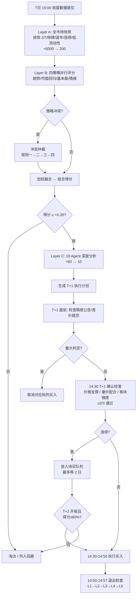

# 机构级多策略量化交易决策框架

> **版本**：v1.4  
> **日期**：2026-03-06  
> **角色**：多策略量化研究总监 + 首席风控官（A股）  
> **上游文档**：[stock_selection_mvp_design_v0.md](stock_selection_mvp_design_v0.md)  
> **变更记录**：v1.3→v1.4 修复 Score 命名冲突、子因子聚合规则补全、市场状态检测互斥规则、规则二循环依赖修复、浮盈回撤止损 Level 2.5、回避冷却期、盘中数据源映射、相关系数方法说明、事件衰减显式公式、LLM 运营成本估算

---

## 0. 执行摘要

**目标函数**：最大化风险调整后收益（以 Sortino Ratio 为第一衡量），而非追求单次预测命中率。

**约束域**：T+1 交易制度、涨跌停板、滑点与手续费、停牌风险、流动性限制——任何信号和仓位计算都不得旁路这些硬约束。

**核心架构**：全市场轻量快筛 → 四类策略并行评分与冲突仲裁 → 多智能体深度分析 → T+1 延迟确认入场 → 多层退出级联 → 市场状态自适应。

本框架相对 v0 版的核心升级：

| 维度 | v0 | v1.4（本文） |
|------|-----|-----------|
| 目标函数 | 隐式（降追高） | 显式：Sortino Ratio 最大化，组合级最大回撤不超过 15% |
| 策略覆盖 | 5 因子评分 | 4 类策略并行 + 冲突仲裁 + 跨策略融合 |
| 风控 | 护栏参数 | 硬约束矩阵 + 失效条件 + 极端场景预案 + 参数敏感性备案 |
| 入场 | T+1 确认（定性） | T+1 确认（可量化指标） + 信号衰减判断 + 涨跌停前置过滤 |
| 退出 | 硬止损 / 软止盈 | 五层退出级联（层级优先级明确、互不冲突） |
| 反脆弱 | 无 | 市场风格切换检测 + 策略权重自适应 + 熔断日预案 + 数据降级方案 |

---

## 1. 先验约束矩阵（A股硬事实）

任何策略信号、仓位计算、回测逻辑都必须首先通过此层。不满足则信号作废、仓位归零。

| 约束 | 具体参数 | 处理规则 |
|------|---------|---------|
| **T+1** | 买入当日不可卖出 | 信号 T 日收盘后生成，T+1 日执行。回测中严格校验 |
| **涨跌停** | 主板 ±10%，创业板/科创板 ±20%，北交所 ±30% | 涨停则买入排队失败（跳过或次日重评）；跌停则卖出失败（纳入极端压力测试） |
| **滑点** | 常规标的单边 0.15%，日均成交额低于 1 亿的标的提升至 0.3% | 回测中总成本 = 手续费 + 印花税 + 滑点 |
| **手续费** | 佣金万 2.5（买卖双边），印花税千 1（仅卖方） | 单次往返佣金+印花税合计约 0.15%（不含滑点）。含滑点的总成本约 0.45%（常规标的）或 0.75%（低流动性标的），高频换仓时不可忽略 |
| **停牌** | 不可预测 | 单票仓位默认不超过组合 10%；仅在强买入且满足放宽条件时可临时放宽至 12%，即使遭遇停牌也不致流动性枯竭 |
| **流动性** | 近 20 日平均成交额 ≥ 5000 万元 | 低于此阈值一律不入池，不论信号多强 |
| **最小交易** | 每笔最少 100 股（1 手） | 所有仓位计算结果向下取整至 100 的倍数 |

**特殊股票事件处理**（v1.0 版缺失）：

| 事件类型 | 处理规则 |
|---------|---------|
| **除权除息** | 所有历史价格和技术指标统一使用**前复权**数据计算，确保均线、ATR、止损价的连续性。回测引擎中同步处理 |
| **新股 / 次新股** | 上市不满 60 个交易日的标的**不进入候选池**（历史数据不足以计算 EMA(60)、50 日均线偏离、Hurst 指数等关键指标） |
| **财报窗口期** | 每年 4 月（年报）、8 月（中报）、10 月（三季报）为集中披露期。窗口期内基本面/估值策略（策略 C）的 completeness 自动下调 30%（因估值锚定随时可能因新财报跳变），同时对尚未披露财报的标的标注"待披露"风险标签 |
| **停牌复牌** | 停牌超过 5 个交易日后复牌的标的，复牌首日**不进入候选池**（补涨/补跌行情波动极端且不可预测）。复牌后需满足连续 3 个正常交易日（非涨跌停）方可重新纳入 Layer A 筛选。复牌期间若因跌停触发已有持仓的止损，按 4.4 节涨跌停卖出协议执行 |

---

## 2. 四类策略并行评估

每只标的需经过以下四类策略的独立评估。每个策略输出标准三元组：**方向（看涨 / 看跌 / 中性）、置信度（0–100）、数据完整度（0–1）**。

> **置信度截断规则**：各子因子的置信度调节（如"上调 30%"）采用乘法修正后，最终置信度必须截断至 [0, 100] 区间——即 `confidence = min(100, max(0, adjusted_value))`。融合公式中 $confidence$ 归一至 0~1 时，取 `confidence / 100`。

**子因子聚合为策略级三元组的规则（v1.4 新增）**：

每个策略包含 4~5 个子因子，需聚合为该策略的 (direction, confidence, completeness) 三元组。聚合方法如下：

1. **子因子权重**：同一策略内各子因子**等权**（如策略 A 有 4 个子因子，每个权重 25%）。未来版本可根据回测 IC（信息系数）差异化权重，但 MVP 阶段采用等权以避免二次过拟合。

2. **方向（direction）聚合**：
   - 每个子因子独立判定方向：满足看涨条件 → +1，满足看跌条件 → -1，两者均不满足 → 0
   - 策略级方向 = 各子因子方向的加权平均值的符号。即 $d_{strategy} = \text{sign}(\sum_k w_k \times d_k)$
   - 若加权平均值为 0（多空完全对冲），则 direction = 0（中性）

3. **置信度（confidence）聚合**：
   - 每个子因子独立给出基础置信度（0~100），经其置信度调节条件修正后截断至 [0, 100]
   - 策略级置信度 = 各子因子修正后置信度的加权平均值。即 $conf_{strategy} = \sum_k w_k \times conf_k$
   - **方向一致性折扣**：若子因子方向不完全一致（存在分歧），策略级置信度额外乘以方向一致率（= 多数方向子因子数 / 总子因子数）。例如 4 子因子中 3 看涨 1 看跌，一致率 = 75%

4. **完整度（completeness）聚合**：
   - 每个子因子的 completeness = 该子因子所需数据字段中实际可用字段数 / 应有字段数
   - 策略级 completeness = 各子因子 completeness 的加权平均值（非最小值，以避免单一数据源故障导致整个策略失效）
   - 若某子因子 completeness = 0（完全无数据），该子因子从聚合中剔除，其权重重新分配给其余子因子

### 2.1 策略 A：趋势跟踪

捕捉正在形成或已确立的价格趋势，核心假设是"趋势一旦形成倾向于延续"。

**已有能力**：技术分析 Agent 中的趋势跟踪子策略和动量子策略可直接复用。

**技术指标精确定义**：
- 均线类型统一使用 **EMA**（指数移动均线），而非 SMA，因 EMA 对近期价格更敏感，适合趋势判断
- 短期均线 = EMA(10)，中期均线 = EMA(30)，长期均线 = EMA(60)
- ATR(14) 使用 Wilder 平滑法（即 RMA），与主流行情软件一致
- 布林带（2.2 节）使用 SMA(20) 为中轨，±2 倍标准差为上下轨
- Hurst 指数采用 **R/S 分析法**（重标极差法），计算窗口 120 个交易日。**窗口选择依据**：R/S 分析在样本量过小时估计偏差大（< 60 日时标准误 > 0.15），120 日（约半年交易日）在统计稳定性和时效性之间取平衡——更长窗口（如 250 日）会过度平滑近期市场状态变化。此参数属于中敏感级（见 7.2 节），需定期回测验证
- 本框架中除布林带中轨外，所有"均线"默认指 EMA；如用 SMA 会显式标注

| 子因子 | 计算方法 | 看涨条件 | 看跌条件 | 置信度调节 |
|--------|---------|---------|---------|-----------|
| 均线排列 | EMA(10)、EMA(30)、EMA(60) 三条指数移动均线 | 三线多头排列 | 三线空头排列 | 趋势强度指标（ADX(14)）大于 25 时上调 30% |
| 价格动量 | 近 1/3/6 个月涨跌幅加权（权重 40/30/30） | 加权动量 > +5% | 加权动量 < -5% | 成交量同步放大时上调 20% |
| 趋势质量 | 均线斜率方向 + 趋势持续天数 | 斜率加速且持续超过 10 个交易日 | 下跌趋势持续 | 持续超过 30 日需警惕反转，置信度打折 |
| 突破确认 | 价格突破近 20 日最高/最低价 + 量能配合 | 放量突破高点 | 放量跌破低点 | 突破需持续 2 日以上才确认，过滤假突破 |

**何时失效（自动降权至零）**：
- 市场处于窄幅震荡：近 20 日平均真实波幅占股价比重低于 1.5%
- 板块轮动过快：题材热点 3 日内切换
- 趋势强度指标低于 15 且均线纠缠

**参数敏感性**：均线周期组合和动量窗口对结果影响大，属于"高敏感参数"，必须做滚动窗口验证。

---

### 2.2 策略 B：均值回归

捕捉短期价格过度偏离后的回归运动，核心假设是"价格围绕均值波动，极端偏离终将修复"。

**已有能力**：技术分析 Agent 中的均值回归和统计套利子策略可直接复用。

| 子因子 | 计算方法 | 看涨条件 | 看跌条件 | 置信度调节 |
|--------|---------|---------|---------|-----------|
| 标准化偏离 | 当前价格与 50 日均价的标准差倍数 | 偏离低于 -2 倍标准差（超卖） | 偏离高于 +2 倍标准差（超买） | Hurst 指数低于 0.5（确认均值回归特性）时上调 30% |
| 布林带位置 | 价格在布林带中的相对位置 | 处于下轨 20% 以内 | 处于上轨 80% 以上 | 带宽先收窄后扩张为强信号 |
| 相对强弱极值 | RSI 指标交叉超卖/超买线 | 从 25 以下上穿 30 | 从 75 以上下穿 70 | 短周期与长周期 RSI 共振时上调 50% |
| 偏离率 | 价格偏离 20 日均线的百分比 | < -8% | > +12% | 与同行业平均偏离率对比，相对更极端才加分 |

**何时失效（自动降权至零）**：
- 强单边趋势中（Hurst 指数持续高于 0.65）——价格偏离不会回归反而加速
- 个股发生结构性变化（业绩暴雷、重大资产重组）——均值本身已移动
- 流动性枯竭期——买卖盘悬空，技术指标失真

---

### 2.3 策略 C：基本面与估值

评估公司内在价值与市场价格的偏离，核心假设是"价格终将回归价值，但价值本身可以增长"。

**已有能力**：基本面分析 Agent、估值分析 Agent、成长分析 Agent 的组合输出可直接复用。

| 子因子 | 评估方法 | 正向信号 | 负向信号 | 数据来源 |
|--------|---------|---------|---------|---------|
| 估值锚定 | TTM 市盈率与自身 5 年中位数及行业中位数对比 | 当前 PE 低于两个中位数的 70% | 高于 130% | tushare 财务指标 |
| 内在价值安全边际 | 四模型加权内在价值 vs 当前市值 | 安全边际超过 30% | 负安全边际 | 估值 Agent 多模型输出 |
| 盈利质量 | 自由现金流 / 净利润比率 + 应计比率 | 比率 > 0.7 且应计比率偏低 | 利润高但现金流差 | tushare 财报明细 |
| 增长趋势 | 连续季度营收/利润同比增速 | 增速加速或持续双位数增长 | 增速连续放缓或转负 | 成长分析 Agent |
| 财务健康 | 流动比率、资产负债率、利息覆盖倍数 | 流动比 > 1.5，负债率 < 60%，利息覆盖 > 3 倍 | 任一不达标 | 基本面分析 Agent |

**何时失效**：
- **周期股陷阱**：周期顶部 PE 最低——低 PE 反而是卖出信号
- **成长股错杀**：高增长股 PE 长期偏高，传统估值框架会系统性错过
- **财报质量风险**：A 股财报质量参差，需交叉验证审计意见和关联交易异常

**当前缺失数据及替代方案**：

| 缺失数据 | 影响 | MVP 替代方案 |
|---------|------|-------------|
| 行业 PE 中位数 | 无法做相对估值 | 用 tushare 行业指数估值接口，或头部 30 行业手工维护 |
| 分析师一致预期 | 无法估前瞻 PE | 用历史增速线性外推（标注低可靠度） |
| 审计意见类型 | 无法排除财报造假 | 过滤 ST 股 + 对非标审计意见公司不给基本面加分 |

---

### 2.4 策略 D：事件与情绪

捕捉短期信息冲击和市场情绪极端值，核心假设是"有效催化事件可加速价格向价值收敛或偏离"。

**已有能力**：新闻情感分析 Agent 和情绪混合分析 Agent 可直接复用。

| 子因子 | 信息来源 | 正向信号 | 负向信号 | 置信度调节 |
|--------|---------|---------|---------|-----------|
| 新闻情感 | LLM 逐条新闻分类后加权聚合 | 正面新闻占比 > 65% | 负面占比 > 65% | 新闻数量不足 3 条则降权 50% |
| 内部人交易 | 近 90 日高管净买入/卖出统计 | 连续净买入 | 连续净卖出 | 按高管级别加权（实际控制人 > 董事长 > 高管） |
| 资金流向 | 大单主力净流入/流出 | 连续 3 日净流入 | 连续 3 日净流出 | **当前缺失**，需接入 akshare 资金流数据 |
| 事件催化 | 政策利好、业绩预告、回购、重组 | 正面催化 | 负面催化 | 事件信息按指数衰减函数 $w(t) = e^{-0.35t}$（$t$ 为事件后自然日数）加权：第 1 天 100%，第 3 天 ≈50%，第 7 天 ≈12%，第 10 天 ≈3%。超过 10 天的事件不再计入 |

**何时失效**：
- **一致预期反转**：当全市场情绪极度一致（恐慌或狂热）时，情绪信号应反向解读
- **信息已定价**：新闻往往滞后于价格，特别是公告类消息，发布时可能已被充分交易
- **噪声放大**：A 股散户占比高，情绪指标的信噪比天然低于机构主导的市场

---

## 3. 跨策略信号融合与冲突仲裁

### 3.1 融合公式

四类策略各输出一个标准化信号后，按自适应权重融合为 Layer B 组合得分：

$$Score_B = \sum_{i} w_i \times direction_i \times confidence_i \times completeness_i \quad \text{s.t.} \quad \sum_{i} w_i = 1,\; w_i \geq 0$$

其中 $direction$ 取值为看涨 +1、中性 0、看跌 -1；$confidence$ 归一至 0~1；$completeness$ 为数据完整度惩罚系数（数据缺失越多越接近 0）。权重 $w_i$ 经市场状态自适应调整（见 3.2 节）和冲突仲裁调权（见 3.3 节）后，必须重新归一化至总和为 1。

> **命名约定**：本公式输出称为 $Score_B$（Layer B 得分），用于 3.4 节决策阈值判定。经过 Layer C 后的最终得分 $Score_{final} = 0.4 \times Score_B + 0.6 \times Score_C$（见 5.1 节），用于仓位计算等后续环节。全文中"组合得分"如无特别说明，在 Layer B 语境下指 $Score_B$，在最终决策语境下指 $Score_{final}$。

**执行顺序**：先由 3.2 节市场状态指标调整基准权重 → 再由 3.3 节冲突仲裁规则在调整后权重基础上进一步修正 → 将最终权重归一化 → 代入上述融合公式计算 $Score_B$。即市场状态调整在前、仲裁在中、融合在后。

**得分可达性分析**：理论最大值 $Score_{max} = 1.0$（四策略全部看涨、满置信度、满完整度），理论最小值 $Score_{min} = -1.0$。但实际运行中，completeness 通常在 0.6~0.9（情绪策略数据常缺失），confidence 归一后通常在 0.4~0.8，且四策略很少完全一致。蒙特卡洛模拟估算典型得分分布：均值约 ±0.15，标准差约 0.2，|Score| > 0.50 约出现在 8~12% 的标的上，|Score| > 0.35 约出现在 20~30% 的标的上。阈值 ±0.35/±0.50 的设定依据即来自此分布——确保强买入信号具有足够区分度，同时不至于过滤率过高导致无标的可买。

**阈值再标定机制（新增）**：
- 每月首个交易日按最近 60 个交易日的实际 $Score_B$ 分布重估阈值：入池阈值参考 P80，强买入阈值参考 P90
- 单月调整幅度受限：任一阈值相对上月变动不超过 ±0.05，避免因短期噪声导致频繁漂移
- 风险护栏：若重估后入池覆盖率低于 10% 或高于 40%，回退至上月阈值并触发人工复核

### 3.2 基准权重与市场状态自适应

**默认权重**：

| 策略 | 基准权重 | 战略定位 |
|------|---------|---------|
| 趋势跟踪 | 30% | A 股趋势性强时的主收益驱动 |
| 均值回归 | 20% | 震荡市的主要收益来源 |
| 基本面/估值 | 30% | 提供中长期价值锚定，降低短期噪声 |
| 事件/情绪 | 20% | 短期催化剂，捕捉信息冲击 |

**市场风格检测与权重调整**：

每日收盘后根据以下五项指标判断市场状态，动态调整策略权重（调整后归一化至总和 100%）：

> **归一化计算示例**：趋势市场景下，趋势权重从 30% 上调 40% = 42%，均值回归从 20% 下调 50% = 10%，基本面 30% 不变，情绪 20% 不变。调整后总和 = 42+10+30+20 = 102%。归一化后：趋势 41.2%、均值回归 9.8%、基本面 29.4%、情绪 19.6%。**附录 C 速查表中的数值均为归一化后结果。**

| 检测指标 | 判定阈值 | 调整动作 |
|---------|---------|---------|
| 沪深 300 近 20 日趋势强度（ADX） | 超过 30 → 趋势市 | 趋势权重上调 40%，均值回归权重下调 50% |
| 沪深 300 近 20 日波幅占比（ATR/Price） | 低于 1.2% → 震荡市 | 均值回归权重上调 50%，趋势权重下调 40% |
| 全市场涨停/跌停家数比 | 超过 3:1 或低于 1:3 → 情绪极端 | 情绪策略权重下调 50%（按反向信号解读），基本面权重上调 30% |
| 两市成交额 | 低于 5000 亿 → 缩量市 | **不调权重，而是降低整体仓位至 50%** |
| 北向资金 | 连续 3 日以上净流出 | 基本面权重上调 20%，趋势权重下调 20% |

**多指标同时触发的优先级规则（v1.4 新增）**：

上述五项检测指标可能同时满足多个条件（如低波幅但有方向性的慢趋势），产生矛盾调整。按以下优先级处理：

1. **缩量市（成交额 < 5000 亿）优先级最高**——此条不调权重而是降仓位，与其他条件不冲突，始终独立执行
2. **趋势市与震荡市互斥**——若 ADX > 30 且 ATR/Price < 1.2% 同时成立（理论罕见但可能出现在指数慢涨行情中），以 ADX 判定为准（ADX 是方向性指标，ATR/Price 仅衡量绝对波幅），执行趋势市调整
3. **情绪极端独立叠加**——涨跌停比触发后的权重调整与趋势/震荡判定的调整可叠加，因其作用于不同策略维度
4. **北向资金独立叠加**——与其他条件不冲突，可与任意市场状态叠加
5. **所有调整叠加后再统一归一化至总和 100%**

### 3.3 策略冲突仲裁机制

> **v1.0 版缺失此节。** 线性加权融合在策略方向一致时有效，但当两类以上策略发出相反信号时（例如趋势看涨但均值回归认为已超买），简单加权会导致信号互相抵消、得分趋近于零，既不买也不卖——这是最差的结果。

**仲裁规则（按优先级排序，高优先级规则无条件覆盖低优先级）**：

**规则一：安全优先原则（最高优先级，不可被其他规则覆盖）**——当任何策略发出强看跌信号（置信度 ≥ 75），且基本面分同时为负面时，不论其他策略多看好，最终信号强制为"回避"。理由：基本面恶化叠加技术面走坏，风险远大于机会。**注意**：此规则中"基本面为负面"指基本面/估值策略（策略 C）的 direction = -1，与规则二中的权重调整无关——即便规则二将基本面权重降至 10%，只要策略 C 自身方向为看跌，规则一仍然生效。

> **回避冷却期（v1.4 新增）**：被规则一标记为"回避"的标的，进入 **15 个交易日冷却期**，期间不再纳入 Layer A 候选池。冷却期结束后自动解除，重新参与正常筛选流程。冷却期内若该标的基本面方向由负面转为中性或正面（如发布正面业绩公告），可提前解除冷却，但需满足至少 5 个交易日的最短冷却时间。

**规则二：时间框架分级**——短周期策略（趋势、情绪）与长周期策略（基本面、估值）冲突时，按持仓目标期限仲裁。持仓目标期限由**主导策略类型**推断：以 **3.2 节市场状态调整后的权重**（仲裁前权重）为基准，计算各策略的绝对贡献度 $|w_i \times direction_i \times confidence_i \times completeness_i|$，若趋势+情绪的绝对贡献合计占四策略绝对贡献总和的 60% 以上，则计划持仓 5 日以内；若基本面+估值的绝对贡献合计占 60% 以上，则计划持仓 20 日以上；其余情况为 5–20 日。具体规则：
- 计划持仓 5 日以内：以趋势和情绪策略为主导，基本面权重下调至 10%
- 计划持仓 5–20 日：维持默认权重
- 计划持仓 20 日以上：以基本面和估值为主导，趋势权重下调至 10%

**规则三：趋势-回归互斥处理**——趋势跟踪和均值回归天然矛盾（一个追涨，一个抄底）。当两者同时给出反向强信号时：
- 查看 Hurst 指数：若 > 0.55，信任趋势策略；若 < 0.45，信任均值回归
- 若 Hurst 在 0.45–0.55 之间（无法区分），两者信号均降权 50%

**规则四：共识加成**——当三个以上策略方向一致且平均置信度 > 60%，组合得分额外上浮 15%（上浮后截断至 [-1, +1]）。强共识本身就是一个信号。

### 3.4 决策阈值

> **得分适用范围说明**：以下阈值应用于 Layer B 输出的 $Score_B$（即四策略融合得分），用于判定标的是否进入 Layer C 深度分析。经过 Layer C 后的最终得分 $Score_{final} = 0.4 \times Score_B + 0.6 \times Score_C$，其淘汰阈值见 5.1 节 Layer C 聚合规则第 6 条（≥ +0.25 方可进入观察名单）。

| 组合得分区间 | 决策 | 说明 |
|-------------|------|------|
| 高于 +0.50 | **强买入候选** | 优先分配仓位，允许适度放宽单票仓位至 12% |
| +0.35 至 +0.50 | **入池观察** | 放入 T+1 确认队列，通过确认后方可买入 |
| -0.35 至 +0.35 | **中性 / 持有** | 不做新动作；已持仓则继续按退出规则管理 |
| -0.50 至 -0.35 | **卖出 / 回避** | 已持仓启动退出流程；未持仓列入黑名单 |
| 低于 -0.50 | **强卖出** | 优先退出，不等待更多确认 |

---

## 4. 仓位管理与风控硬约束

### 4.1 仓位计算逻辑

每只标的的最终可买入仓位取以下四个约束的**最小值**：

1. **波动率约束**：组合净值 × 波动率调整后仓位比例上限（已有风控 Agent 逻辑） × 相关性调整系数
2. **现金约束**：可用现金总额
3. **流动性约束**：近 20 日平均成交额的 2%——避免单笔交易对市场造成冲击
4. **行业约束**：该行业剩余可配额度（= 行业仓位上限 - 该行业已有持仓市值）

计算出的股数向下取整至 100 的倍数（最小交易单位）。若取整后为 0，则本次不建仓。

**信号强度与仓位联动**（v1.0 版缺失）：基础仓位按上述约束计算后，根据 $Score_{final}$（即 Layer C 处理后的最终得分）做最后调节：

| 组合得分区间 | 仓位执行比例 | 说明 |
|-------------|------------|------|
| 强买入（$Score_{final}$ > +0.50） | 基础仓位 × 100% | 高确定性满额建仓 |
| 入池观察（$Score_{final}$ +0.25 ~ +0.50） | 基础仓位 × 60% | 中等确定性，预留加仓空间 |
| 中性持有（$Score_{final}$ 0 ~ +0.25，仅对已持仓标的） | 维持现有仓位不变 | 不加仓也不减仓，等待信号明确化 |

> **v1.4 修正说明**：仓位联动使用 $Score_{final}$ 而非 $Score_B$，因为买入决策发生在 Layer C 之后。阈值相应调整为与 5.1 节 Layer C 淘汰阈值（+0.25）对齐，详见 3.1 节命名约定。

这样"更确定的信号拿更大仓位"才能最大化信息比率。对已持仓标的，当 $Score_{final}$ 降入中性区间时，不主动调仓，由五层退出级联机制管理。

### 4.2 硬约束矩阵

以下约束无条件执行，任何策略信号不得覆盖：

| 约束项 | 参数值 | 触发后果 |
|--------|--------|---------|
| 单票仓位上限 | 组合净值的 10%（仅在强买入且满足放宽条件时可至 12%） | 超出部分不执行，记录日志 |
| 单行业暴露上限 | 组合净值的 25%（行业分类采用**申万一级**，共 31 个行业） | 同行业新买入被拒绝 |
| 单日新开仓数量 | 最多 3 只 | 按组合得分排序，仅执行前 3 名 |
| 单日交易总额 | 不超过组合净值的 20% | 超出推迟至次日执行 |
| 组合最大回撤预警 | 从最高净值回落 10% | 触发预警，暂停新开仓，仅允许减仓 |
| 组合最大回撤强制减仓 | 从最高净值回落 15% | 全组合比例缩减 50%，进入"恢复模式" |
| 单票最大亏损 | -7% | 触发硬止损，次日开盘优先卖出 |
| 高相关性合并 | 任意两票相关系数 > 0.8 | 合并视为同一敞口，共享单票仓位上限 |
| 停牌应急 | 单票停牌且占仓超过 10% | 剩余可交易持仓按比例减仓，释放流动性缓冲 |

**单票仓位放宽条件（10%→12%）**：必须同时满足以下三项，否则维持 10% 上限。
- 信号条件：组合得分 > +0.50（强买入）
- 相关性条件：该票所属相关敞口组内不存在与其相关系数 > 0.7 的已持仓标的
- 流动性条件：近 20 日平均成交额 >= 2 亿元，且计划买入金额不超过其近 20 日平均成交额的 1%

**相关性约束补充说明**（v1.0 版缺失）：
- **计算窗口**：使用近 60 个交易日的日收益率计算 Pearson 相关系数，每日滚动更新
- **Pearson 相关的局限性（v1.4 补充）**：A 股收益率呈显著尖峰厚尾分布（本文 CVaR 部分已承认这一点），Pearson 相关系数对极端值敏感，可能高估尾部共振风险或低估常态相关性。MVP 阶段仍采用 Pearson（计算简单、业界通用），但后续版本建议对比 **Spearman 秩相关**的效果——秩相关对分布形态无假设，更适合厚尾场景。若 Spearman 与 Pearson 结果差异系统性超过 0.1，应优先采用 Spearman
- **传递性处理**：采用聚类合并——若 A 与 B 相关 > 0.8，B 与 C 相关 > 0.8，即使 A 与 C 相关仅 0.6，三者仍合并为一个敞口组，共享单票仓位上限
- **市场状态修正**：牛市中相关性系统性上升。当全市场平均相关性（用沪深 300 成份股间相关性的中位数衡量）高于 0.6 时，合并阈值从 0.8 **收紧至 0.7**，避免系统性风险暴露

**组合尾部风险度量**（v1.0 版缺失）：

最大回撤仅反映历史已发生的最坏情况，无法前瞻性评估极端损失。补充以下指标：

| 指标 | 定义 | 预警阈值 | 响应 |
|------|------|---------|------|
| CVaR(95%) | 最差 5% 情景下的条件期望损失。**计算方法**：采用**历史模拟法**——取近 252 个交易日（1 年）的组合日收益率序列，按从小到大排序，取最差 5%（约 13 个交易日）的平均损失。选择历史模拟法而非参数法的原因：A 股收益率呈显著尖峰厚尾特征，正态分布假设下的参数法会低估极端风险 | 单日 CVaR > 组合净值的 3% | 触发减仓预警，暂停新开仓 |
| 组合 Beta | 组合收益对沪深 300 的回归系数 | Beta > 1.3 | 增配低 Beta 标的或减仓高 Beta 标的 |
| 行业集中度 HHI | 赫芬达尔指数（各行业持仓占比的平方和） | HHI > 0.15 | 行业过度集中，拒绝向头部行业增仓 |

### 4.3 五层退出级联

每一层独立判定，**高优先级层触发后立即执行，不等待低优先级层确认**。当多层同时触发时，执行优先级最高的那层规则。

> **v1.0 版问题修复**：原版 Level 1（硬止损 -7%）和 Level 2（ATR 止损）可能冲突——当 ATR 止损线距入场价超过 7% 时，ATR 止损永远不会触发。v1.1 版明确了互踩解决规则。

| 优先级 | 退出类型 | 触发条件 | 执行方式 | 与其他层的关系 |
|--------|---------|---------|---------|---------------|
| **Level 1** | 硬止损 | 单票浮亏达到或超过 7% | T+1 开盘市价卖出（若跌停则挂单排队，见涨跌停协议） | **最高优先级，覆盖所有其他层** |
| **Level 2** | 波动止损 | 收盘价跌破"入场价减去 2 倍 ATR(14)"，**且**该止损线在硬止损线之内（即波动止损比硬止损更紧时才有意义） | 次日卖出 | 仅当 2×ATR < 7%×入场价 时激活；若 ATR 止损线比硬止损线更远，本层自动休眠 |
| **Level 2.5** | 浮盈回撤止损（v1.4 新增） | 持仓期间最高浮盈一度达到 +8% 以上，随后回落至 +1% 以下 | 次日卖出 | 介于价格止损与逻辑止损之间。仅当历史最高浮盈 ≥ 8% 时激活；未达 8% 浮盈的标的不受此层约束。与 Level 5 止盈互斥——已触发 Level 5 第一阶段止盈（卖出 50%）的剩余仓位，回撤保护由 Level 5 移动止盈接管 |
| **Level 3** | 逻辑止损 | 买入逻辑被证伪：趋势结构破坏、业绩公告不及预期、催化事件失效 | Agent 重新评估或人工确认后卖出 | 独立于价格止损，即使不亏损也可触发 |
| **Level 4** | 时间止损 | 持仓超过 20 个交易日且累计收益低于 +3% | 卖出全部，释放资金给更优机会 | 与 Level 5 互斥——已触发止盈分批的不再触发时间止损 |
| **Level 5** | 分批止盈 | 阶梯式止盈（三步执行，见下方说明） | 按比例分批卖出 | 最低优先级，被任何更高层覆盖 |

**Level 5 止盈执行细节**：
- 累计收益达到 **15%** 时，卖出持仓的 50%
- 累计收益达到 **25%** 时，再卖出剩余的 60%（即原始仓位的 30%）
- 最后 20% 仓位采用移动止盈：从最高收益回落幅度超过"5% 与最高收益的 30% 二者取大值"时清仓

### 4.4 涨跌停处理协议

涨跌停导致买卖单无法正常成交的情况在 A 股市场频繁发生，必须有明确预案：

**买入方向**：
- T 日评分后标的在 T+1 涨停 → 不追买，放入"待买队列"
- T+2 日如果开板且组合得分仍然有效（≥ 原始得分的 80%） → 执行买入
- 连续 2 日涨停仍未开板 → 从待买队列移除，标注为"短期过热"，30 日内不再纳入候选
- 买入时设置价格上限：不超过评分当日收盘价的 105%，避免开板后跳价过高追入

**卖出方向**：
- 止损触发但 T+1 跌停无法卖出 → 记入"待卖队列"，次日集合竞价（9:15–9:25）挂跌停价优先卖出
- 连续跌停无法卖出 → 每日重新评估极端亏损敞口。若连续 3 日跌停仍无法卖出，将该票的潜在亏损按"持有至开板"情景计入组合风险，并对其余持仓按比例预防性减仓

---

## 5. 日度执行流水线

### 5.1 执行时序总览

整个流程分为 7 步，横跨 T 日收盘后至 T+1 日收盘前。

**第一阶段：T 日 15:00 之后（收盘数据就位后启动）**

| 步骤 | 名称 | 输入 | 处理内容 | 输出 | 预估耗时 |
|------|------|------|---------|------|---------|
| Step 1 | 全市场快筛（Layer A） | 全 A 股约 5000 只 | 排除 ST、停牌、退市风险、北交所（当前版本，见说明）、当日涨停、流动性不达标 | 约 150~300 只候选池（动态范围，见下方说明） | 约 10 分钟 |
| Step 2 | 四策略并行评分（Layer B） | 候选池标的 | 趋势 / 均值回归 / 基本面 / 情绪四策略独立打分 → 冲突仲裁 → 融合得分 | 约 60 只高分池 | 约 5 分钟 |
| Step 3 | 多智能体深度分析（Layer C） | 60 只高分标的 | 12 位投资大师 + 6 位技术分析师并行分析 → 风险管理 → 组合决策 | 约 10 只观察名单 | 约 30 分钟 |

> **Layer A 候选池规模说明**：文中多处提到"约 200 只"是中性市场下的经验估计。实际产出随市场状态波动：极端低迷期（如 2024 年 1 月）满足流动性+非停牌+非 ST 的标的可能仅 120~150 只；牛市活跃期可能超过 300 只。系统不强制截断至固定数量，而是输出所有通过筛选条件的标的。Layer B 评分环节对输入规模不敏感（纯规则计算），因此候选池波动不影响后续流程。

> **北交所排除说明**：当前版本排除北交所标的，原因：(a) 北交所上市时间较短，多数标的历史数据不满足 120 个交易日的 Hurst 计算窗口；(b) 北交所行情数据在 tushare/akshare 中的覆盖和质量尚需系统性验证；(c) ±30% 涨跌幅限制下的波动特征与主板/创业板差异显著，当前各策略参数未针对此做适配。后续版本在数据验证通过且参数适配后可纳入。

**Layer C 聚合规则**（v1.0 版缺失）：

Layer B 输出 60 只高分标的后进入 Layer C，由 18 个 Agent 独立评估。聚合方式如下：

1. **Agent 输出标准化**：每个 Agent 输出标准三元组（方向 / 置信度 / 理由），与 Layer B 策略信号格式一致
2. **加权投票聚合**：12 位投资大师权重各 6%（合计 72%），6 位技术分析师权重各 4.67%（合计 28%）——基本面类大师权重略高，因 Layer C 定位为深度确认而非短线择时
3. **Layer C 得分计算**：$Score_C = \sum_{j} w_j \times direction_j \times confidence_j \times completeness_j$，归一至 [-1, +1]。其中 $completeness_j$ 为该 Agent 所依赖数据的完整度——例如新闻情感 Agent 在无新闻可分析时 $completeness = 0$，与 Layer B 保持一致
4. **与 Layer B 的关系**：Layer C 作为**二次过滤而非覆盖**——最终得分 = $0.4 \times Score_B + 0.6 \times Score_C$。Layer B 提供量化宽度，Layer C 提供智能深度。**权重依据**：Layer C 的 60% 权重基于以下考量——(a) 18 个 Agent 的多角度深度分析在信息维度上严格优于 Layer B 的规则计算；(b) Layer C 对"逻辑一致性"的检验（如业绩增长能否支撑估值）是纯量化信号无法覆盖的；(c) 该比例属于高敏感参数（见 7.2 节），必须通过 walk-forward 验证确认。若验证显示 Layer C 信号噪声过大，应向 0.5/0.5 方向调整
5. **Layer B/C 冲突处理**：若 Layer B 得分为强买入（> +0.50）但 Layer C 得分为负，则降级为"入池观察"而非直接买入；若 Layer B 为正但 Layer C 强看跌（< -0.30），则强制标记为"回避"
6. **淘汰阈值**：Layer C 聚合后得分低于 +0.25 的标的不进入观察名单，确保最终 10 只标的均为强共识标的
| Step 4 | 生成 T+1 执行计划 | 观察名单 + 现有持仓 | 仓位计算（全约束）、退出条件检查、确认条件清单 | 执行计划文件 | 约 2 分钟 |

**第二阶段：T+1 日盘前（09:15 之前）**

| 步骤 | 名称 | 处理内容 |
|------|------|---------|
| Step 5 | 开盘前确认 | 检查隔夜重大公告/新闻、竞价阶段跳空幅度、涨跌停预判 → 对执行计划做最后增删 |

**第三阶段：T+1 日盘中（09:30–15:00）**

| 步骤 | 名称 | 处理内容 | 时间窗口 |
|------|------|---------|---------|
| Step 6 | 确认入场并执行买入 | 对观察名单中每只标的检查确认条件（见 5.2 节），满足则执行买入 | 买入操作集中在 14:30–14:50 |
| Step 7 | 退出执行 | 检查全部持仓的五层退出条件，触发则执行卖出 | 卖出操作在 14:50–14:57 执行 |

### 5.2 T+1 确认条件（可量化定义）

> **v1.0 版问题修复**：原版"回踩不破关键均线""量价配合"为定性描述，无法回测。v1.1 版给出精确定义。

观察名单中的标的，在 T+1 日需满足以下三个条件中的**至少两个**，才最终触发买入：

| 条件 | 精确定义 | 判定时点 | 理由 |
|------|---------|---------|------|
| **价格支撑** | T+1 日盘中最低价不低于 T 日收盘时 EMA(30) 价格的 99%（即允许微幅穿刺但不可有效跌破） | 14:30 时回顾当日最低价 | 确认选股时的技术结构未被破坏（此处采用 EMA(30) 而非 EMA(20)，与 2.1 节中期均线定义一致） |
| **量价配合** | T+1 日截至 14:30，累计成交量 ≥ 前 5 日同时段平均成交量的 80%，且当前价格高于 VWAP（成交量加权均价） | 14:30 实时检查 | 确认有真实资金承接，而非缩量虚涨 |
| **板块强度** | T+1 日标的所属申万一级行业指数涨跌幅在全市场行业排名前 50%（即不弱于市场中位数） | 14:30 计算行业指数日涨跌 | 避免逆板块操作——个股再好，板块整体走弱时胜率下降。**尾盘异动容忍**：若 14:30 时板块排名处于后 50%，但该标的个股涨跌幅强于其所属行业指数 2 个百分点以上，视为个股独立于板块，此条件仍判定为通过 |

> **确认时间窗口可行性说明**：14:30 判定确认条件、14:30–14:50 执行买入，仅有 20 分钟窗口。实际操作中：(a) 当日最多买入 3 只标的（硬约束），确认+下单时间充足；(b) 确认逻辑为纯规则计算（取最低价、比较 VWAP、查行业排名），单标的计算耗时 < 1 秒；(c) 下单为预生成指令一键提交。若未来扩展至更多标的同时确认，可将确认窗口前移至 14:00，但需在回测中验证 14:00 vs 14:30 的确认有效性差异。

**盘中数据源依赖（v1.4 新增）**：

T+1 确认条件依赖盘中实时/分钟级数据，而非日频收盘数据。数据源映射如下：

| 确认条件所需数据 | 数据源 | 接口 | 降级方案 |
|----------------|--------|------|---------|
| 盘中最低价、当前价 | akshare 实时行情（`stock_zh_a_spot_em`） | 轮询间隔 ≥ 3 秒 | 若接口不可用，改用 14:30 时刻的 1 分钟 K 线近似 |
| 累计成交量 | akshare 实时行情 | 同上 | 若不可用，该确认条件视为"未通过"（保守处理） |
| VWAP | 由当日成交额 / 成交量计算（akshare 实时行情含 amount 和 volume 字段） | 实时计算 | 若数据不全，跳过此条件 |
| 申万一级行业指数涨跌幅 | akshare 行业指数实时行情（`stock_board_industry_name_em`） | 轮询间隔 ≥ 5 秒 | 若不可用，该确认条件视为"通过"（宽松处理，因行业判断非核心过滤） |

> **回测中的处理**：回测无法获取历史盘中实时数据。替代方案：(a) 价格支撑条件使用日线最低价；(b) 量价配合条件使用日成交量 vs 前 5 日均量；(c) 板块强度使用日频行业指数涨跌幅。回测结果与实盘的偏差主要来自此处，需在模拟盘阶段（8.4 节）重点验证。

### 5.3 信号衰减处理

> **v1.0 版缺失此节。** T 日 15:30 生成的信号到 T+1 日 14:30 才执行，间隔约 23 小时。在此期间，价格、消息面、板块格局都可能发生显著变化。

**衰减规则**：
- 信号有效期默认为 **2 个交易日**。T 日生成的信号在 T+1 有效，T+2 若仍在待买队列中（因涨停等原因未成交），需重新计算组合得分。新得分若低于原始得分的 80%，则移出队列。
- T+1 日如果该标的跳空高开幅度**超过前一日 ATR 的 1.5 倍**，视为信号已被市场提前消化，取消买入。
- T+1 日如果出现针对该标的的重大负面新闻（公告违规、监管处罚、业绩预警等），无条件取消买入。

---

## 6. 极端场景预案

> **v1.0 版缺失本章。** 顶级风控框架必须回答"最坏情况下怎么办"。

### 6.1 熔断日与系统性暴跌

当全市场出现以下任一情况时，触发"**全面防御模式**"：

| 触发条件 | 响应动作 |
|---------|---------|
| 沪深 300 单日跌幅超过 5% | 当日不执行任何买入；次日起整体仓位上限降至 30%，持续 5 个交易日观察 |
| 两市跌停家数超过 500 家 | 同上 |
| 连续 3 日两市成交额低于 4000 亿 | 逐日减仓至半仓，暂停新开仓，等待成交额恢复至 6000 亿以上 |

**历史压力测试场景库**：

以下真实危机场景必须在回测中逐一回溯验证，确认框架在极端环境下的行为符合预期（不爆仓、不违反硬约束、退出机制正常触发）：

| 场景 | 时间段 | 核心特征 | 验证重点 |
|------|--------|---------|---------|
| 2015.6 股灾 | 2015-06-15 至 2015-09-15 | 杠杆牛崩溃，千股跌停，流动性枯竭 | 连续跌停无法卖出的处理、回撤触发链路、停牌应急 |
| 2016.1 熔断 | 2016-01-04 至 2016-01-07 | 4 个交易日两次熔断，恐慌性抛售 | 全面防御模式触发时机、仓位缩减速度 |
| 2020.2 疫情冲击 | 2020-02-03 至 2020-03-23 | 开盘即暴跌后快速反弹，V 型反转 | 止损后是否过早卖出错过反弹、信号衰减逻辑 |
| 2024.9–10 急涨急跌 | 2024-09-24 至 2024-10-18 | 政策利好引发暴涨后回调 30%+ | 追高信号过滤、涨停板阻塞频率、情绪极端时权重调整 |

**多票同时止损的执行优先级**：

当系统性暴跌触发多只持仓标的同时达到止损条件时，集中卖出会叠加市场冲击。按以下优先级排序执行卖出（受"单日交易额 ≤ 组合净值 20%"约束）：

1. **第一优先：亏损幅度最大的标的** — 止损越深越优先退出，避免继续扩大损失
2. **第二优先：流动性最好的标的** — 亏损幅度相同时，优先卖出近 20 日平均成交额最高的标的，因其市场冲击成本最低
3. **第三优先：策略贡献最低的标的** — 前两项均相同时，优先退出组合得分最低的标的
4. 超出单日交易额上限的止损单推迟至次日执行，但推迟的止损单在次日享有**最高执行优先级**（优先于新开仓）

### 6.2 强制减仓后的恢复协议

组合回撤触及 -15% 并强制减仓 50% 后，不可立即恢复至满仓。恢复路径如下：

1. **冷却期**：强制减仓后至少保持 5 个交易日的低仓位状态
2. **逐步恢复**：每满足以下一项，允许仓位上限恢复 10%：
   - 组合净值从减仓点反弹超过 3%
   - 沪深 300 连续 3 日收阳
   - 市场成交额恢复至 6000 亿以上
3. **完全恢复**：当组合净值回到回撤前最高点的 95% 时，取消所有仓位限制

### 6.3 数据源故障降级方案

> **v1.0 版缺失此节。**

| 故障场景 | 降级方案 |
|---------|---------|
| tushare 接口不可用（超时或 500 错误） | 优先切换至 akshare 对应接口；若两者均不可用，当日暂停 Layer A/B 评分，仅对现有持仓执行退出检查 |
| tushare 返回数据明显异常（如价格为 0、成交量为负） | 触发数据质量校验器（已有 validator），标记异常标的并从当日候选池中剔除 |
| LLM 接口不可用 | Layer C（多智能体深度分析）跳过，Layer B 高分池直接作为候选。仓位按 60% 折算（因缺少深度确认） |
| 新闻数据为空 | 情绪策略完整度设为 0，融合时该策略权重自动归零 |

### 6.4 日常监控与告警机制

> **v1.0 版缺失此节。** 框架详述了"做什么"，但缺少"出了问题怎么知道"。

**策略漂移检测**：

| 监控项 | 检测方法 | 告警阈值 | 响应 |
|--------|---------|---------|------|
| 信号分布偏移 | 每周统计各策略信号方向分布，与回测期分布做 KS 检验 | p < 0.05 | 该策略可能在当前市场失效，需人工审查 |
| 胜率滚动监控 | 近 20 笔已平仓交易的胜率 | 低于 30%（连续低迷） | 触发策略参数复查，考虑暂停新开仓 |
| 单日异常交易 | 单日买卖标的数超过正常值 2 倍标准差 | 自动标记 | 检查是否因数据异常导致批量误触发 |
| 策略贡献集中度 | 观察名单中所有标的的组合得分中，单一策略加权贡献占比的最大值 | 最大占比 > 70% | 当日买入仓位整体折算至 70%。说明：若 10 只候选标的的得分几乎全部由趋势策略驱动，组合实际暴露在单一因子上，一旦趋势反转将同时受损 |

**数据质量健康度（新增）**：

| 监控项 | 定义 | 告警阈值 | 响应 |
|--------|------|---------|------|
| DQR（Data Quality Rate） | 通过数据校验的字段数 / 应有字段数 | < 98% | 当日禁止新开仓，仅允许减仓；排查数据源与解析逻辑 |
| 关键字段缺失率 | OHLCV、成交额、行业分类、财务主字段缺失占比 | 任一字段缺失率 > 1% | 对应策略 completeness 置 0，触发数据告警工单 |
| 行情延迟率 | 收盘后 30 分钟仍未就绪的标的占比 | > 5% | 延后当日评分窗口，超时则降级为仅风控模式 |
| 异常值率 | 价格<=0、成交量<0、涨跌幅绝对值异常等记录占比 | > 0.5% | 自动剔除异常标的并生成审计清单 |

**每日执行报告结构**（标准化输出格式，方便后续自动化审计）：

1. 执行摘要：日期、市场状态判定、策略权重配置
2. 新买入列表：标的代码、组合得分、仓位比例、确认条件通过情况
3. 退出列表：标的代码、退出层级（L1~L5）、盈亏金额
4. 持仓快照：各票持仓占比、行业暴露、组合 Beta、CVaR
5. 异常记录：数据缺失、涨跌停阻塞、LLM 调用失败等

### 6.5 运行手册与职责边界（新增）

| 事件级别 | 触发示例 | 响应时限（SLA） | 责任角色 | 标准动作 |
|---------|---------|----------------|---------|---------|
| P1（阻断级） | 数据源双活同时失败、下单逻辑异常、风险约束失效 | 15 分钟内 | 当值风控 + 值班工程 | 立即暂停新开仓，切换至仅减仓模式，启动事故复盘 |
| P2（严重级） | DQR < 98%、连续 3 日信号分布显著漂移、成交阻塞异常上升 | 60 分钟内 | 量化研究 + 数据工程 | 降级执行（仓位折算或策略降权），当日收盘前提交诊断报告 |
| P3（提示级） | 单项指标轻微越阈、模型延迟上升 | 当日内 | 值班工程 | 记录并跟踪，纳入周度稳定性评审 |

**暂停交易权限**：当值风控拥有单独暂停新开仓权限；恢复交易需当值风控与量化研究双签确认。

---

## 7. 反脆弱与过拟合防护

### 7.1 过拟合风险清单

| 风险类型 | 检测方法 | 缓解措施 |
|---------|---------|---------|
| **回测过拟合** | 训练集与验证集 Sharpe Ratio 差异超过 0.5 | 必须做 walk-forward 验证；对所有高敏感参数做 ±20% 扰动观察 |
| **数据窥探** | 同一数据集上调参超过 3 次 | 保留 30% 数据为绝对盲测集，仅在最终版本上使用一次 |
| **存活偏差** | 仅分析仍在市的股票 | 回测样本中必须包含已退市和被 ST 的股票历史数据 |
| **前视偏差** | 使用财报"报告期"而非"披露日"获取数据 | 所有基本面数据加 45 天披露延迟（后续版本实现） |
| **策略拥挤** | 持仓与市场热门题材高度重合 | 监控组合与市场热度的重合度，超过阈值时主动降仓 |
| **小样本陷阱** | 某策略在回测中触发信号次数不足 30 次 | 该策略置信度自动打五折 |

### 7.2 参数敏感性分级

将所有可调参数分为三级，不同级别采用不同的验证强度：

| 敏感级别 | 参数举例 | 验证要求 |
|---------|---------|---------|
| **高（必须 walk-forward）** | 均线周期组合、偏离阈值、硬止损比例、融合得分阈值、单票仓位上限、Layer B/C 融合权重（0.4/0.6） | ±20% 扰动后 Sharpe 变化超过 15% 即判定过拟合，需扩大验证窗口 |
| **中（需定期回测）** | ATR 止损倍数、止盈目标比例、最大持仓天数、流动性阈值、Hurst 计算窗口、Agent 权重分配 | 每月回测一次，观察参数漂移 |
| **低（初版固定）** | 手续费率、印花税率、滑点率、最小交易单位 | 这些是市场制度参数，除非政策变更否则不调 |

---

## 8. 回测验证规范

### 8.1 回测硬要求

每一条都是"必须满足，否则回测结果不可信"的底线：

| 要求 | 是否已实现 | 备注 |
|------|-----------|------|
| 含手续费（佣金 + 印花税） | ✅ | 已在回测引擎中支持 |
| 含滑点（0.15% 单边；低流动性标的 0.30%） | ✅ | 两档滑点均需在回测日志中可审计 |
| T+1 限制 | ✅ | 回测引擎已校验 |
| 涨跌停限制 | ✅ | 涨停不可买、跌停不可卖 |
| 最小交易 100 股 | ✅ | |
| 排除退市/长停股 | ✅ | |
| 前视偏差检查 | ⬜ 后续版本 | 需对财报数据加 45 天延迟 |
| 股票代码去重（防代码复用） | ⬜ 后续版本 | A 股存在退市后代码回收再分配的情况（如 000033 曾为新都酒店，退市后分配给新大正）。回测时必须按"代码+上市日期"唯一标识标的，而非仅按代码关联历史数据，否则会将两家完全不同的公司数据混淆 |

### 8.2 评估指标矩阵

| 指标 | 定义 | MVP 首版目标 | 优先级 |
|------|------|-------------|--------|
| **Sortino Ratio** | 超额收益 / 下行波动率 | > 1.0（首版务实目标，后续迭代提升） | 🥇 主目标 |
| **最大回撤** | 净值从峰值到谷值的最大回落比例 | < 15% | 🥇 硬约束 |
| **Calmar Ratio** | 年化收益 / 最大回撤 | > 0.8 | 🥈 |
| **Sharpe Ratio** | 超额收益 / 总波动率 | > 0.8 | 🥈 |
| **盈亏比** | 平均盈利交易金额 / 平均亏损交易金额 | > 1.8 | 🥈 比胜率更重要 |
| **胜率** | 盈利交易数 / 总交易数 | > 42% | 🥉 辅助指标 |
| **年化换手率** | 总交易金额 / 平均净值 | < 30 倍 | 🥉 控制交易成本侵蚀 |
| **超额收益** | 组合收益 - 基准收益 | > 0 | 🥉 基准 = 中证 500 全收益指数 |

> **v1.0 版目标调整说明**：首版 Sortino > 1.5 的目标缺乏合理性论证。MVP 阶段策略参数尚未充分验证、数据源仍有缺失项，设定过高目标会导致过拟合压力。建议首版以 > 1.0 为合格线，后续版本逐步提升。

### 8.3 A/B 实验设计

**实验分组**：

| 组别 | 策略流程 |
|------|---------|
| Group A（基线） | 涨幅榜筛股 → 多智能体分析 → 买入 |
| Group B（MVP-v1） | 全市场快筛 → 四策略评分 + 冲突仲裁 → 多智能体分析 → T+1 确认 → 买入 |

**时间窗口**：

| 用途 | 时段 | 说明 |
|------|------|------|
| 训练/调参 | 2025-06-01 至 2025-12-31（6 个月） | 参数搜索和初步策略验证 |
| 样本外验证 | 2026-01-01 至 2026-02-28（2 个月） | 不可修改参数，验证泛化能力 |
| Walk-forward | 滚动窗口 2 个月训练 + 1 个月测试 | 模拟实际运行中参数定期更新 |

**统计检验（稳健版）**：
- 主检验：单侧 t 检验比较两组 Sortino Ratio，p < 0.05 作为显著性门槛
- 稳健性检验：对日收益序列进行 1000 次 bootstrap，比较 Sortino 差值的 95% 置信区间是否全大于 0
- 分布无关检验：补充 Mann-Whitney U 检验作为非参数佐证，避免收益厚尾导致 t 检验失真

**最小训练窗口约束**：每个 walk-forward 窗口内，每个策略的信号触发次数不得少于 30 次。若不足，该策略在该窗口内的信号置信度自动打五折。

### 8.4 模拟盘过渡方案

> **v1.0 版缺失此节。** 回测和实盘之间存在系统性偏差（滑点估计、数据延迟、执行失败等），必须有模拟阶段验证。

**从回测到上线的三阶段**：

| 阶段 | 最短持续时间 | 升级条件 | 关键验证内容 |
|------|------------|---------|------------|
| **阶段一：纸上交易** | 4 周 | 实际执行偏差 < 回测偏差的 1.5 倍 | 每日生成执行计划但不下单，对比"假设执行"的收益与回测预期 |
| **阶段二：小资金实盘** | 4 周 | Sortino > 0.8，最大回撤 < 12% | 用不超过目标资金 10% 的规模实际执行，验证滑点、成交率、涨跌停阻塞频率 |
| **阶段三：正式运行** | 持续 | 按评审决策清单定期复盘 | 逐步加仓至目标规模 |

**降级规则**：任一阶段若连续 5 个交易日的实际收益偏离回测预期超过 2 个标准差，自动回退至前一阶段排查。

---

## 9. 与现有系统的实现映射

### 9.1 可直接复用模块

| 框架组件 | 对应现有代码 | 复用说明 |
|---------|------------|---------|
| 趋势跟踪信号 | 技术分析 Agent（5 子策略） | 直接提取趋势和动量子信号 |
| 均值回归信号 | 技术分析 Agent（均值回归 + 统计套利） | 直接提取 |
| 基本面评分 | 基本面 Agent + 估值 Agent + 成长 Agent | 三个 Agent 组合输出 |
| 情绪信号 | 新闻情感 Agent + 情绪混合 Agent | 直接使用 |
| 波动率 + 相关性风控 | 风险管理 Agent | 在此基础上扩展行业约束 |
| 仓位决策 | 组合管理 Agent | 增加硬约束层和信号强度联动 |
| 回测引擎 | backtesting 模块（含 Sharpe、Sortino、MDD 指标） | 增加含费回测和 Calmar Ratio |
| A 股数据接口 | tushare + akshare API 封装 | 直接使用 |

### 9.2 需新增模块

| 模块名称 | 建议位置 | 核心功能 | 优先级 |
|---------|---------|---------|--------|
| 候选池构建器 | scripts/ | Layer A 全市场快筛逻辑 | P0 |
| 多策略评分器 | scripts/ | Layer B 四策略评分 + 冲突仲裁 + 融合 | P0 |
| 仓位计算器 | src/utils/ | 四约束取最小值 + 信号强度联动 + 按手取整 | P0 |
| 退出管理器 | src/utils/ | 五层退出级联 + 涨跌停待卖队列 | P0 |
| 市场状态检测器 | src/utils/ | 五项指标检测 + 权重自适应 + 极端场景判定 | P1 |
| T+1 确认执行器 | scripts/ | 三条确认规则量化判定 + 信号衰减检查 | P1 |
| 执行计划生成器 | scripts/ | 每日执行计划结构化输出 | P1 |
| 行业暴露计算器 | src/utils/ | 申万一级行业分类 + 暴露度统计 | P1 |
| 参数敏感性分析器 | scripts/ | ±20% 扰动扫描 + Sharpe 变化热力图 | P2 |

### 9.3 四周最小可执行路径

| 周次 | 交付物 | 验证标准 |
|------|--------|---------|
| **Week 1** | 候选池构建器完成，验证 tushare/akshare 全市场数据可用性 | 能稳定输出每日约 200 只候选池文件 |
| **Week 2** | 多策略评分器完成，复用技术分析 Agent 子信号，实现融合和冲突仲裁 | 能输出每日约 60 只高分标的及其得分明细 |
| **Week 3** | 仓位计算器 + 退出管理器完成，接入批量分析入口 | 能生成含完整约束的每日执行计划 |
| **Week 4** | 含费回测 vs 基线对比，walk-forward 基础验证 | 输出 A/B 对比报告，包含全部 8 项评估指标 |

---

## 10. 评审决策清单

以下决策点需要在开发启动前明确，每项列出默认值和调整依据：

| # | 决策点 | 当前默认值 | 关键考量 |
|---|--------|-----------|---------|
| 1 | 硬止损比例 | -7% | A 股日均波动 2–3%，-7% 约 2–3 个标准差。若回测中触发过于频繁（> 30% 的交易被止损），应放宽至 -8% 或 -10% |
| 2 | 行业暴露上限 | 25%（申万一级） | A 股板块效应强，若回测显示行业集中度与回撤正相关，应收紧至 20% |
| 3 | 涨幅榜策略是否保留 | 保留为第五策略，权重 10% | 强趋势日有独立价值，但不再作为选股入口 |
| 4 | 做空信号 | 仅标记，不执行做空 | A 股融券门槛高、券源有限，MVP 阶段不可行 |
| 5 | 最大持仓天数 | 20 日 | 基本面/估值策略的价值兑现通常需 1–3 个月。若仅由基本面策略驱动的持仓，可将上限延长至 40 日 |
| 6 | Sortino 目标 | > 1.0（首版） | v1.0 原设 > 1.5 过于激进。建议首版合格线 1.0，迭代至 v2 再追求 1.5 |
| 7 | 信号有效期 | 2 个交易日 | 若回测显示 T+2 执行的信号仍有超额收益，可延长至 3 日；若无则维持 2 日 |
| 8 | Layer B/C 融合权重 | 0.4 / 0.6 | Layer C 60% 权重基于信息维度优势假设。若 walk-forward 显示 Layer C 噪声大于预期，应向 0.5/0.5 调整 |
| 9 | Agent 权重分配 | 大师 72% / 分析师 28% | 当前假设基本面类 Agent 更适合深度确认。若回测中技术分析师信号的 IC（信息系数）系统性高于大师，应缩小差距 |
| 10 | 阈值再标定频率 | 月度 | 月度调整幅度 ±0.05。若市场风格切换过快（如季度内 ADX 从 > 30 切换至 < 15 再回到 > 30），可考虑缩短至双周 |
| 11 | 策略资金容量 | 未限定 | 见下方容量估算，预计框架在 1~5 亿 AUM 下运行稳健，超过 10 亿需重新评估流动性约束和市场冲击模型 |

---

## 11. 策略容量估算

> **v1.2.1 新增。** 框架的流动性约束（"近 20 日平均成交额的 2%"）直接决定了可管理资金规模的上限。

**瓶颈分析**：

| 约束因素 | 计算逻辑 | 容量推算 |
|---------|---------|---------|
| 单票流动性 | 候选池标的的 20 日平均成交额中位数约 2~3 亿元，2% 约 400~600 万元/标的 | 同时持仓 10 只，总持仓约 4000~6000 万元 |
| 单票仓位上限 | 10% × AUM | AUM = 6000 万 / 10% = 6 亿元上限 |
| 单日交易总额 | 20% × AUM | 1 亿 AUM 下单日最大交易额 2000 万元，覆盖 3 只标的的建仓绑绑有余 |
| 市场冲击 | 单笔交易占日均成交额 > 1% 时冲击成本显著上升 | 中位数标的约 2.5 亿日均成交额，1% = 250 万/笔 |

**结论**：
- **1~5 亿 AUM**：框架各项流动性约束均可满足，市场冲击成本在滑点预算内
- **5~10 亿 AUM**：部分低流动性标的会被流动性约束频繁过滤，实际可投标的池收窄，需将流动性下限提升至 1 亿元以上
- **> 10 亿 AUM**：需重新设计流动性约束模型（如引入动态冲击成本函数），考虑 TWAP/VWAP 拆单执行，已超出 MVP 框架范围

---

## 12. 本框架边界（明确不做的事）

以下能力不在 MVP 范围内，列出以防止范围蔓延：

- **组合优化**（Markowitz / 风险平价）——当前使用波动率加权，暂不做均值方差优化
- **多周期嵌套**——当前仅日频视角，不涵盖周频/月频信号
- **宏观因子叠加**——利率、汇率、信用利差等宏观变量暂不纳入
- **交易执行算法**——不做 TWAP/VWAP 拆单，按收盘前窗口单笔下单
- **实盘券商对接**——不对接券商 API，仅输出执行计划文件
- **绩效归因**——暂不做 Brinson 归因或因子归因分析

---

## 附录 A：数据依赖与可用性

| 数据类型 | 来源 | 可用性 | 数据延迟 |
|---------|------|--------|---------|
| 日线行情（OHLCV） | tushare | ✅ 可用 | 收盘后 15 分钟 |
| 财务指标（TTM） | tushare | ✅ 可用 | 报告期 + 约 45 天 |
| 财报明细（利润表/资产负债表/现金流量表） | tushare | ✅ 可用 | 报告期 + 约 45 天 |
| 内部人交易 | tushare | ✅ 可用 | T+1 |
| 每日基础面（PE/PB/换手率等） | tushare | ✅ 可用 | 收盘后 |
| 公司新闻 | akshare | ✅ 可用 | 近实时 |
| 市值 | tushare | ✅ 可用 | 收盘后 |
| 行业分类（申万） | tushare | ✅ 可用 | 静态数据 |
| 板块指数行情 | tushare | ✅ 可用 | 收盘后 |
| 主力资金流向 | akshare | ⚠️ 需验证 | 收盘后 |
| 融资融券余额 | akshare | ⚠️ 需验证 | T+1 |
| 盘中实时行情（价格/成交量/成交额） | akshare（`stock_zh_a_spot_em`） | ✅ 可用 | 实时（轮询 ≥ 3 秒） |
| 行业指数实时行情 | akshare（`stock_board_industry_name_em`） | ✅ 可用 | 实时（轮询 ≥ 5 秒） |

## 附录 B：执行成本预估

| 阶段 | 处理标的数 | API 调用量 | LLM 调用量 | 预估耗时 |
|------|-----------|-----------|-----------|---------|
| Layer A 快筛 | 约 5000 → 200 | 约 4700 次 | 0 次 | 约 10 分钟 |
| Layer B 评分 | 200 → 60 | 约 800 次 | 0 次（纯规则计算） | 约 5 分钟 |
| Layer C 深度 | 60 → 10 | 约 600 次 | 约 1080 次（60 标的 × 18 Agent） | 约 30 分钟 |
| **合计** | — | **约 6100 次** | **约 1080 次** | **约 45 分钟** |

在 tushare 接口每分钟 200 次限流和 LLM 并发能力下，单日全流程可在 1 小时内完成。

**运营成本预估（v1.4 新增）**：

| 成本项 | 商业 API 方案 | 本地部署方案（Ollama） |
|--------|-------------|---------------------|
| **LLM 调用费（日）** | 每次调用约 1K input + 0.5K output tokens，1080 次/日。GPT-4o-mini：约 $0.15~$0.30/日；Claude Sonnet：约 $3~$6/日；GPT-4o：约 $15~$30/日 | 电力 + GPU 折旧。按 RTX 4090 满载 3 小时/日计，约 ¥5~¥10/日 |
| **LLM 调用费（年）** | GPT-4o-mini：$40~$80；Claude Sonnet：$800~$1,600；GPT-4o：$4,000~$8,000 | ¥1,300~¥2,600 + GPU 硬件折旧 |
| **数据源订阅费（年）** | tushare 基础接口免费（200 积分/分钟限流）；高级接口（5000 积分）约 ¥500/年 | 同左 |
| **服务器成本（月）** | 轻量云服务器（2C4G）运行调度器：约 ¥100~¥200/月 | 自有硬件无额外成本 |
| **日均总成本** | $0.5~$35/日（取决于 LLM 选型） | ¥15~¥20/日 |

> **成本优化建议**：Layer C 是成本主体（占 LLM 调用的 100%）。可考虑对 60 只标的先用低成本模型（如 GPT-4o-mini）做初筛，仅对 Top 20 使用高精度模型（如 Claude Sonnet），可将 LLM 成本降低约 60%。

> **耗时预估说明**：Layer C 的 1080 次 LLM 调用按 18 Agent 全并发计算，每个 Agent 需串行处理 60 只标的，单次调用延迟约 5~15 秒。乐观估计（5 秒/次）= 60 × 5 = 5 分钟；悲观估计（15 秒/次 + 10% 重试）= 60 × 15 × 1.1 ≈ 17 分钟。上表取中间值 30 分钟含裕量。**实际部署时需配置**：LLM 并发数上限（建议 ≤ 20，避免触发 rate limit）、单次调用超时（30 秒）、最大重试次数（2 次）。若使用本地 LLM（Ollama），并发能力取决于 GPU 显存，通常仅支持 2~4 并发，总耗时可能增至 2~3 小时。

## 附录 C：关键参数速查

### 筛选参数

| 参数 | 默认值 | 说明 |
|------|--------|------|
| 候选池规模 | 约 150~300 只（动态） | Layer A 快筛后的输出，随市场状态波动 |
| 深度分析规模 | 60 只 | Layer B 高分池 |
| 最终观察名单 | 10 只 | Layer C 输出 |
| 流动性下限 | 5000 万元（20 日均成交额） | 低于此不入池 |

### 信号融合参数

| 参数 | 默认值 | 说明 |
|------|--------|------|
| 趋势跟踪权重 | 30% | 趋势市归一化后约 41%（30%×1.4=42%, 总102%, 42/102≈41%） |
| 均值回归权重 | 20% | 震荡市归一化后约 31%（20%×1.5=30%, 总98%, 30/98≈31%） |
| 基本面权重 | 30% | 情绪极端时归一化后约 39%（30%×1.3=39%, 总99%, 39/99≈39%） |
| 情绪权重 | 20% | 情绪极端时归一化后约 10%（20%×0.5=10%, 总99%, 10/99≈10%） |
| 入池观察阈值 | +0.35 | |
| 强买入阈值 | +0.50 | |
| 卖出/回避阈值 | -0.35 | |
| Layer B/C 融合权重 | 0.4 / 0.6 | Layer B 量化宽度 40%，Layer C 智能深度 60%，高敏感参数 |
| Layer C 大师权重 | 各 6%（12 位合计 72%） | |
| Layer C 分析师权重 | 各 4.67%（6 位合计 28%） | |
| Layer C 淘汰阈值 | +0.25 | 低于此不进入观察名单 |
| 信号跳空取消阈值 | 1.5 × ATR | T+1 跳空高开超过此值则取消买入 |
| 信号衰减有效期 | 2 个交易日 | T+2 后需重新评分 |

### 风控参数

| 参数 | 默认值 | 说明 |
|------|--------|------|
| 单票仓位上限 | 10%（仅在强买入+低相关+高流动性时可至 12%） | 12% 放宽需满足 4.2 节三项条件 |
| 行业暴露上限 | 25% | 基于申万一级分类 |
| 单日新开仓上限 | 3 只 | |
| 单日交易额上限 | 组合净值的 20% | |
| 回撤预警线 | -10% | 暂停新开仓 |
| 回撤强制减仓线 | -15% | 减仓 50% + 进入恢复协议 |

### 止损止盈参数

| 参数 | 默认值 | 说明 |
|------|--------|------|
| 硬止损 | -7% | 无条件触发 |
| 波动止损 | 入场价 - 2 × ATR(14)，但仅当此线比硬止损更紧时生效 | |
| 浮盈回撤止损 | 最高浮盈 ≥ +8% 后回落至 +1% 以下 | v1.4 新增，与 Level 5 止盈互斥 |
| 时间止损 | 持仓 20 日且收益 < +3% | |
| 第一止盈 | 收益 +15%，卖出 50% | |
| 第二止盈 | 收益 +25%，再卖出 30% | |
| 移动止盈 | 最高收益回落超过 max(5%, 最高收益 × 30%) | |

### 交易成本参数

| 参数 | 默认值 | 说明 |
|------|--------|------|
| 佣金率 | 万分之 2.5（双边） | |
| 印花税率 | 千分之 1（卖方单边） | |
| 滑点 | 0.15%（单边） | 低流动性标的提升至 0.3% |
| 最小交易单位 | 100 股 | |

---

## 附录 D：日度决策流程图

## 附录 E：术语表

| 术语 | 全称 / 含义 |
|------|-----------|
| **ADX** | Average Directional Index，平均趋向指标，衡量趋势强度（不区分方向），> 25 为强趋势 |
| **ATR** | Average True Range，平均真实波幅，衡量价格波动幅度 |
| **Calmar Ratio** | 年化收益 / 最大回撤，衡量单位回撤风险获取的收益 |
| **CVaR** | Conditional Value at Risk（条件风险价值），也称 Expected Shortfall，最差 N% 情景下的平均损失 |
| **EMA** | Exponential Moving Average，指数移动均线，对近期数据赋予更高权重 |
| **HHI** | Herfindahl-Hirschman Index，赫芬达尔指数，衡量集中度 |
| **Hurst 指数** | 衡量时间序列的长期记忆性。H > 0.5 趋势持续，H < 0.5 均值回归，H ≈ 0.5 随机游走 |
| **R/S 分析** | Rescaled Range Analysis（重标极差分析），计算 Hurst 指数的经典方法 |
| **RSI** | Relative Strength Index，相对强弱指标，衡量超买超卖 |
| **RMA** | Running Moving Average（Wilder 平滑），ATR 的标准平滑方法 |
| **Sharpe Ratio** | 超额收益 / 总波动率，衡量风险调整后收益 |
| **SMA** | Simple Moving Average，简单移动均线 |
| **Sortino Ratio** | 超额收益 / 下行波动率，只惩罚亏损波动，比 Sharpe 更适合评估交易策略 |
| **VWAP** | Volume Weighted Average Price，成交量加权平均价 |
| **Walk-forward** | 滚动前进验证，在历史数据上模拟"训练→测试→更新"的循环，检测策略泛化能力 |
| **申万一级** | 申银万国行业分类标准一级行业，共 31 个行业大类 |
| **前复权** | 以最新价格为基准，向前调整历史价格以消除除权除息影响 |
| **TTM** | Trailing Twelve Months，滚动最近四个季度的数据 |

## 附录 F：变更日志

| 版本 | 日期 | 主要变更 |
|------|------|---------|
| v1.0 | 2026-03-03 | 初始版本。基于 v0 选股框架升级为四策略并行架构 |
| v1.1 | 2026-03-04 | 修复策略冲突仲裁缺失（新增 3.3 节）；修复退出层级互踩（Level 1/2 关系明确化）；新增极端场景预案（第 6 章）；T+1 确认条件可量化（5.2 节）；全文去代码块化 |
| v1.2 | 2026-03-05 | 新增置信度截断规则（2 节）；技术指标精确定义补全（EMA 周期、ATR 平滑法、Hurst 计算方法）（2.1 节）；新增融合得分可达性分析（3.1 节）；归一化计算示例及附录 C 修正（3.2 节 + 附录 C）；仲裁规则优先级交叉问题修复（3.3 节）；Layer C 聚合规则补全（5.1 节）；仓位联动三档化（4.1 节）；特殊股票事件处理（1 节）；相关性动态化 + 组合尾部风险度量（4.2 节）；日常监控告警机制（6.4 节）；模拟盘过渡方案（8.4 节）；执行成本估算修正（附录 B）；决策流程图（附录 D）；术语表（附录 E）；变更日志（附录 F） |
| v1.2.1 | 2026-03-05 | 文档精修版：统一版本口径（标题/摘要/参数表）；补充阈值再标定机制（P80/P90 + 月度变动上限）；统一单票仓位放宽条件（强买入+低相关+高流动性）；补充数据质量健康度指标（DQR/缺失率/延迟率/异常值率）；新增运行手册与职责边界（6.5 节）；A/B 统计检验升级为 t 检验 + bootstrap + Mann-Whitney U；回测滑点要求修订为双档可审计 |
| v1.3 | 2026-03-05 | **数学与逻辑一致性**：融合公式增加归一化约束声明 $\sum w_i = 1$（3.1 节）；Layer C 得分补充 completeness 因子与 Layer B 保持一致（5.1 节）；Layer B/C 融合权重 0.4/0.6 增加论证依据（5.1 节）；明确仲裁→融合执行顺序（3.1 节）。**风控补充**：CVaR 指定为历史模拟法（4.2 节）；新增历史压力测试场景库含 4 个 A 股真实危机（6.1 节）；新增多票同时止损执行优先级排序（6.1 节）；新增策略贡献集中度监控（6.4 节）。**操作性**：Layer A 候选池改为动态范围 150~300（5.1 节）；T+1 确认时间窗口可行性论证（5.2 节）；板块强度增加尾盘异动容忍规则（5.2 节）。**市场特殊性**：新增停牌复牌处理规则（1 节）；北交所排除增加原因说明（5.1 节）；Hurst 120 日窗口增加选择依据（2.1 节）；回测增加股票代码去重要求（8.1 节）。**文档结构**：附录 C 补全散落参数（Layer B/C 权重、Agent 分配、信号衰减等）；评审决策清单扩充至 11 项（10 节）；新增策略容量估算章节（11 节）；参数敏感性分级补充 Layer B/C 权重和 Hurst 窗口（7.2 节） |
| v1.4 | 2026-03-06 | **公式/逻辑一致性修复**：融合公式输出变量从 $Score_{final}$ 更正为 $Score_B$，增加命名约定说明（3.1 节）；规则二循环依赖修复——明确使用 3.2 节市场状态调整后权重计算绝对贡献度（3.3 节）；仓位联动得分基准明确为 $Score_{final}$，阈值与 Layer C 淘汰阈值对齐（4.1 节）；执行顺序从"仲裁在前、融合在后"细化为"市场状态调整→仲裁→归一化→融合"三步（3.1 节）。**可实现性补全**：新增子因子聚合为策略级三元组的完整规则（方向投票、置信度加权、完整度平均、方向一致性折扣）（2 节）；新增市场状态检测多指标同时触发的优先级与互斥规则（3.2 节）；新增盘中数据源依赖映射表（5.2 节 + 附录 A）；新增 LLM 运营成本预估（附录 B）。**风控增强**：新增 Level 2.5 浮盈回撤止损（最高浮盈 ≥8% 后回落至 +1%）（4.3 节）；新增规则一"回避"标签的 15 个交易日冷却期机制（3.3 节）；Pearson 相关系数局限性说明及 Spearman 替代建议（4.2 节）。**参数更新**：事件催化衰减函数显式化为 $w(t)=e^{-0.35t}$（2.4 节）；附录 C 止损止盈参数表补充 Level 2.5 |