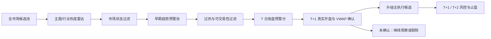

# BTST 提前发现主升浪股票研究方案 v4

> 研究日期：2026-05-26  
> 关联报告：`data/reports/btst_full_report_20260525.md`  
> 用途：把“已经涨很多才看见”的问题，拆成可回测、可上线观察、可控制风险、可工程验收的早期预警方案。  
> 边界：本文是策略研究文档，不构成任何个股投资建议。

## v4 更新重点

v3 已经解决了工程化研究框架：预警分和确认分分离、市场状态过滤、真实成交约束、二买模块和失败日志。v4 继续往“实现前验收规格”推进，重点补 6 个缺口：

1. 把 `GREEN / YELLOW / RED` 映射到仓库已有的 `btst_regime_gate`：`aggressive_trade`、`normal_trade`、`shadow_only`、`halt`。
2. 增加机器可读的 `feature_time_map` 规格，让防前视不只停留在文字约束。
3. 增加 `limit_rule_profile` 和 `universe_filter`，覆盖 ST / 风险警示、新股、停牌、市场板块和涨跌幅制度差异。
4. 把成本参数和现有 `TradingConstraints` 对齐，要求回测报告打印实际使用的佣金、印花税、滑点和冲击成本。
5. 把手拍阈值升级为 walk-forward 校准流程，输出阈值稳定性而不是只给固定数字。
6. 增加分账评估和上线前验收清单，确保 early runner 首买、二买、full report 强势确认不混算。

## 学习目标

读完这份文档后，应该能回答 6 个问题：

1. 为什么当前 BTST 完整报告会偏向“强势确认”，而不是“起涨前发现”。
2. 未来 5 日大涨、10 日继续加速的股票，起涨前更可能有哪些共性。
3. 如何在现有 BTST 链路前面加一层早期预警，而不是简单追高或放宽门槛。
4. 如何用回测标签、执行确认和风控规则，把“提前布局”变成可验证的流程。
5. 如何把研究信号变成不前视、可成交、可复盘的系统组件。
6. 如何判断这套方案是否已经达到 shadow rollout 或正式上线的最低门槛。

## 核心判断

你看到的担心是对的：在 `btst_full_report_20260525.md` 里，很多高分股已经进入了主升段中后部。比如 Top 40 中至少有 17 只股票 5 日涨幅超过 30%，Top 10 里索辰科技 10 日涨幅达到 +90.7%，威龙股份达到 +98.9%。这些票当然强，但对“新开仓”来说，很多已经不再是赔率最好的位置。

最好的处理办法不是追更强的票，也不是把现有 selected 阈值一味降低，而是在 full report 前面新增一层“早期主升浪预警池”。这层只负责发现，不负责直接下单：

- 先用趋势加速和题材共振找出正在蓄势的票。
- 再用过热惩罚排除 5 日、10 日已经严重透支的票。
- 再用市场状态判断今天是否适合做短线右侧。
- 最后只允许通过次日盘中确认的股票，从预警池升级为主执行候选。

这套方案的目标不是保证每笔 5 日 +15%、10 日 +50%。那会把系统逼成高风险追涨器。更合理的目标是提高右尾行情的捕捉概率，同时让亏损样本可控。

## 当前报告暴露出的迟到问题

`btst_full_report_20260525.md` 的 Top 40 里，5 日涨幅超过 30% 的股票包括：

| 代码 | 名称 | 5 日涨幅 | 当日状态 |
| --- | --- | ---: | --- |
| 002421 | 达实智能 | +36.0% | 日涨 +10.1%，量比 2.65 |
| 688507 | 索辰科技 | +44.6% | 日涨 +14.5%，量比 2.66 |
| 000518 | 四环生物 | +40.6% | 日涨 +9.9%，量比 3.14 |
| 600888 | 新疆众和 | +30.9% | 日涨 +7.2%，量比 2.21 |
| 688079 | 美迪凯 | +31.7% | 日涨 +3.2%，量比 1.95 |
| 688360 | 德马科技 | +35.9% | 日涨 +2.2%，量比 2.90 |
| 301269 | 华大九天 | +32.3% | 日涨 +15.0%，量比 1.80 |
| 300715 | 凯伦股份 | +34.0% | 日涨 +7.3%，量比 1.92 |
| 688419 | 耐科装备 | +38.9% | 日涨 +5.6%，量比 1.90 |
| 603989 | 艾华集团 | +39.6% | 日涨 +8.0%，量比 2.10 |
| 300939 | 秋田微 | +41.4% | 日涨 +20.0%，量比 1.66 |
| 000417 | 合百集团 | +31.5% | 日涨 +1.1%，量比 2.76 |
| 603005 | 晶方科技 | +30.3% | 日涨 +10.0%，量比 1.80 |
| 688082 | 盛美上海 | +35.5% | 日涨 +17.7%，量比 1.64 |
| 688362 | 甬矽电子 | +42.2% | 日涨 +20.0%，量比 1.50 |
| 688072 | 拓荆科技 | +37.3% | 日涨 +16.9%，量比 1.53 |
| 688981 | 中芯国际 | +32.6% | 日涨 +18.8%，量比 1.58 |

Top 10 深度分析里，索辰科技的 10 日涨幅为 +90.7%，威龙股份为 +98.9%。这些数字说明当前榜单已经非常擅长识别“已经被市场确认的强势”，但它不是专门为“主升浪前夜”设计的。

当前报告里 Top 10 的共性也很清楚：

- `close_strength` 大多已经打满到 1.0。
- `catalyst_freshness` 大多接近或等于 1.0。
- `volume_expansion_quality`、`momentum_strength`、`layer_c_alignment` 同时贡献。
- 量比普遍在 1.7 到 3.1 附近。

这是一组确认型特征。它适合判断“今天很强”，但新开仓时容易遇到三个问题：

- 入场位置离起涨点太远。
- 次日稍微低开或冲高回落，盈亏比立刻变差。
- 模型容易把“后验好看”误当成“前瞻可买”。

## 先把 3 种信号分清

提前发现不是把现有分数提前一天看，而是把不同信号的职责拆开。

| 层级 | 要回答的问题 | 典型信号 | 交易含义 |
| --- | --- | --- | --- |
| 早期预警 | 哪些票可能正在起势，但还没彻底拥挤？ | 趋势加速、题材共振、温和放量、未过热 | 收盘后进观察池，不直接重仓 |
| 强势确认 | 哪些票已经被市场确认？ | 高 `close_strength`、高 `breakout_freshness`、高量比 | 适合做次日确认交易，不适合无条件追 |
| 风险降级 | 哪些票虽然强，但新入场赔率差？ | 5 日涨幅过高、10 日涨幅过高、逼近涨停、上影线放量 | 降为观察或等待二买 |

真正的主升浪早期系统，要把第一层做强；当前 full report 主要强在第二层。



## v4 保留的第一原则：收盘预警和盘中交易分开

提前发现策略最容易被前视偏差污染。收盘后生成名单时，系统只能使用 T 日收盘前已经知道的信息；T+1 的开盘跳空、分时 VWAP、成交额衰竭、主题是否继续扩散，都只能用于次日确认，不能回填到 T 日预警分里。

因此，系统必须拆成两张分数：

| 分数 | 计算时间 | 允许使用的字段 | 产物 | 交易含义 |
| --- | --- | --- | --- | --- |
| `early_runner_pre_score` | T 日收盘后 | 趋势、题材、量价结构、历史先验、过热惩罚 | `early_runner_watchlist` / `early_runner_priority` | 只说明明天值得盯 |
| `early_runner_confirm_score` | T+1 开盘后 30 到 60 分钟 | 真实 gap、VWAP、成交额节奏、同题材延续、无法成交标记 | `short_trade_candidate` | 通过后才允许进入执行 |

这条边界要写进代码和回测。任何 T+1 字段如果进入 T 日预警分，回测命中率都会虚高，实盘会在最危险的位置买到票。

## 仓库里已经给出的关键证据

### 1. `trend_continuation` 比“盲猜点火”更可靠

在 `data/reports/btst_5d_15pct_factor_research_round1_latest.md` 里，`trend_continuation` 样本的 5 日内 +15% 命中率为 25.87%，平均最大收益为 10.50%。它不是完美信号，但比无结构地押突然点火更像可研究的底座。

`data/reports/btst_5d_15pct_trend_breakout_drilldown_latest.md` 进一步显示：

| 切片 | closed 样本 | 5 日内 +15% 命中率 | 平均最大收益 | 判断 |
| --- | ---: | ---: | ---: | --- |
| `trend_continuation` 基线 | 656 | 27.44% | 10.06% | 可作为底层雷达 |
| `trend_acceleration_top_20pct` | 278 | 34.53% | 13.44% | 有提升，但仍需过滤 |
| `trend_acceleration_top_20pct_gap_le_3pct` | 243 | 36.21% | 13.79% | 最适合做早期预警池 |
| `trend_acceleration_top_20pct_selected_only` | 114 | 23.68% | 9.43% | 已进 selected 反而不一定更好 |

这组数据的重点是：趋势加速有效，但 selected-only 不一定有效。换句话说，“太早没有确认”不行，“太晚全市场都看见”也不行，中间那段才是赔率区。

### 2. `close_strength` 太高未必是好事

`data/reports/btst_5d_15pct_trend_top20_gate_diagnostics_latest.md` 里，`close_strength_ge_0_90` 被降级：raw 命中率只有 20.11%，去重后也只有 20.48%。这和直觉相反，但对交易很重要。

`close_strength` 高说明股票已经站在短期区间高位。对确认趋势有用，但对提前布局未必有利。早期预警池更应该找“接近强势，但尚未完全打满”的状态，而不是等它已经成为全场最亮。

### 3. 最像早期 alpha 的窄门：题材催化 + close 未打满

同一份 diagnostics 里，最值得跟踪的是：

- `catalyst_theme_close_strength_lt_0_90`
- closed=62，raw 命中率 83.87%，平均最大收益 32.90%
- 去重后 closed=10，命中率 50.00%，去重提升仍然明显，但样本太小

这个结果不能直接上线成主策略，因为样本少、稳定性还不够。但它非常像“提前发现”的正确方向：有题材、有趋势，但还没被 `close_strength=1.0` 完全确认。

### 4. OOS 稳定性还不够，不能把研究信号当成确定性

`data/reports/btst_5d_15pct_trend_gate_oos_validation_latest.md` 给出的 OOS 结论是 `continue_research_not_rollout`。其中：

- 2026-04 的 hit_rate_15pct 为 62.50%。
- 2026-05 的 hit_rate_15pct 降到 30.43%。
- stable_oos_test_month_count 为 0。

这说明研究方向有价值，但还不能直接升级为默认买入规则。它应该先作为“早期预警层”，继续积累样本。

## 起涨前画像：最值得盯的 7 个特征

下面这些特征更接近“起涨前”，不是“已经大涨后”。

### 1. 趋势已经抬头，但涨幅还没有透支

核心不是 5 日涨幅越高越好，而是：

- `trend_acceleration` 进入当日前 20%，或绝对值接近 0.80。
- 5 日涨幅最好在 3% 到 18% 之间。
- 10 日涨幅最好在 5% 到 35% 之间。
- 如果 5 日已经超过 25% 到 30%，新开仓要默认降级。

强势股可以继续强，但从新开仓角度看，过高涨幅会明显压缩盈亏比。

### 2. 题材或行业有共振，但个股还不是最拥挤

优先找：

- 行业均涨幅、行业入选率正在抬升。
- 个股属于当日强主题，但还不是全市场最拥挤的高位票。
- `candidate_source` 优先看 `catalyst_theme`、`catalyst_theme_shadow`、上游影子召回，而不是只看 selected 排名前列。

这点和动量研究一致：单票动量更容易受噪音影响，题材和行业共振能过滤掉一部分孤立脉冲。

### 3. `close_strength` 不能太低，也不能太满

建议早期池把 `close_strength` 分成三段：

| 区间 | 含义 | 动作 |
| --- | --- | --- |
| < 0.60 | 结构还没站稳 | 观察，不急 |
| 0.65 - 0.90 | 最适合提前预警 | 重点跟踪 |
| >= 0.90 | 已经强势确认 | 只做确认交易，避免追高 |

特别是 `catalyst_theme + close_strength < 0.90`，目前是最值得继续扩样本的窄门。

### 4. 放量要健康，不要爆量失控

起涨前更理想的是第一次或第二次放量，而不是连续放量后的情绪高潮。

优先：

- 量比 1.2 到 2.5。
- `amount_ratio_5` 逐渐上升。
- 放量时收盘靠近当日高位，而不是长上影。
- 量价背离低，放量不是出货形态。

降级：

- 量比突然超过 4，且上影线明显。
- 当日涨幅很大，但收盘弱于 VWAP。
- 连续几天放量，价格却开始走平。

### 5. 突破要新鲜，但不要太远

早期预警不是等价格离 20 日高点很远，也不是等它已经连板后再看。

可用的结构指标包括：

- `breakout_quality_20_atr`：收盘相对过去 20 日高点的 ATR 距离。
- `breakout_freshness`：突破或催化的新鲜度。
- `failed_breakout_10`：最近 10 日失败突破次数。
- `supply_pressure_60`：当前价附近是否有密集套牢盘。

理想状态是“刚过或将过关键区间”，不是“已经远离所有参照物”。

### 6. 次日可交易性必须放在信号之前

A 股主板通常有 10% 日涨跌幅限制，科创板和创业板通常为 20%。这会让强票出现“看对但买不到”“买到就是最高”的执行问题。

所以早期预警池必须加执行过滤：

- 次日高开超过 3% 先降级观察。
- 接近涨停或一字开，不能追。
- 开盘 30 分钟不能站稳 VWAP，不升级。
- 盘中冲高后快速跌破开盘价，取消升级。

### 7. 历史先验要参与，但不能盲信

现有 `btst_next_day_trade_brief_latest.json` 已经会给同票历史、同层同源历史、next_high 命中率、next_close 正收益率等信息。例如 2026-05-25 的正式主票 688008，同票历史 29 例中 next_high>=2% 命中率为 86.21%，next_close 正收益率为 68.97%。

这类历史先验很有用，但它只能回答“相似样本过去怎么样”，不能保证这次也一样。最好的用法是：

- 作为仓位大小和优先级调整。
- 不作为绕过盘中确认的理由。
- 样本数不足时自动收缩，不给高权重。

## 推荐方案：Early Runner 四层模型

我建议把方案命名为 `early_runner_v1`，它不是替代当前 BTST，而是插在 full report 前面的预警层。

### 第 1 层：主题与行业雷达

每天收盘后，先生成主题热度列表。

入池条件：

- 行业或题材当日强度位于市场前 20%。
- 行业内上涨占比高于全市场。
- 行业内至少有 2 到 3 只股票同时出现趋势加速或突破结构。
- 排除只靠单只大票拉动的孤立行业。

输出：

- `hot_theme_board`
- `theme_breadth_score`
- `theme_leader_count`
- `theme_midfield_candidates`

这一层的作用是先找“风往哪里吹”，不要一开始就从 5000 多只股票里硬挑个股。

### 第 1.5 层：市场状态过滤器

早期主升浪策略不是每天都该用。市场整体退潮时，动量信号会突然失效，强票也容易从“主升浪”变成“冲高回落”。所以在进入个股预警前，要先算 `btst_regime_gate`。

v4 不再单独创造 `GREEN / YELLOW / RED` 三档，而是贴合仓库已有的 `btst_regime_gate` 口径。现有 `src/screening/market_state_helpers.py` 已经能输出 `aggressive_trade`、`normal_trade`、`shadow_only`、`halt`，后续实现应该复用这套语义。

建议字段：

```text
breadth_ratio          = advancing_stock_ratio
daily_return           = major_index_daily_return
limit_ratio            = limit_up_count / max(limit_down_count, 1)
style_dispersion       = narrow_leadership_or_index_breadth_divergence
regime_flip_risk       = breadth_deterioration + style_dispersion + flow_headwind
total_volume           = market_total_turnover
```

分层动作：

| `btst_regime_gate` | 旧文档直觉 | 动作 |
| --- | --- | --- |
| `aggressive_trade` | GREEN+ | A / B 级预警正常输出，允许略提高候选覆盖 |
| `normal_trade` | GREEN | 正常输出，执行仍需 T+1 确认 |
| `shadow_only` | YELLOW / RED 边界 | 只输出观察表，不进入正式买入流 |
| `halt` | RED | 暂停交易候选，只记录研究样本 |

这层不应该太复杂。第一版直接复用仓库已有 `src/screening/market_state.py` 和 `src/screening/market_state_helpers.py`；文档、回测和日报都只展示同一套 `btst_regime_gate`，避免“文档一套、代码一套”的漂移。

### 第 2 层：早期趋势预警池

从热主题和全市场趋势样本里筛出还没过热的票。

建议入池条件：

```text
trend_acceleration_rank_pct <= 20%
ret_5d between 3% and 18%
ret_10d between 5% and 35%
close_strength between 0.65 and 0.90
volume_expansion_quality between 0.20 and 0.80
failed_breakout_10 == 0
supply_pressure_60 <= 0.12
```

如果数据暂时不齐，可以先用已有字段做降级版本：

```text
trend_acceleration >= 0.78
close_strength < 0.90
ret_5d <= 18%
gap_to_limit >= 1%
```

输出：

- `early_runner_watchlist`
- 每日最多 30 只
- 每个行业最多 3 到 5 只
- 同一股票连续出现时合并为一个 run，不重复计数

### 第 3 层：窄门提纯池

这是最接近“提前布局”的部分。

优先条件：

```text
candidate_source in {catalyst_theme, catalyst_theme_shadow, upstream_liquidity_corridor_shadow}
trend_acceleration >= 0.75
0.65 <= close_strength < 0.90
ret_5d <= 18%
ret_10d <= 35%
volume_expansion_quality >= 0.20
sector_resonance >= 0.28
```

降级条件：

```text
ret_5d > 25%
ret_10d > 50%
close_strength >= 0.95
gap_to_limit <= 1%
failed_breakout_10 >= 1
```

输出：

- `early_runner_priority`
- 每天最多 10 只
- 用于次日重点盯盘，不等于直接买入

### 第 4 层：次日确认与升级

开盘后不急着买，先用 30 到 60 分钟确认。

升级条件：

- 高开不超过 3%，或高开后能回踩 VWAP 不破。
- 前 30 分钟价格不跌破昨收太多，且能重新站上 VWAP。
- 成交额节奏健康，不是开盘爆量后快速衰竭。
- 同主题至少仍有 1 到 2 只票同步强势。
- 没有长上影、炸板、冲高回落等失败突破信号。

通过后，才从 `early_runner_priority` 升级为 `short_trade_candidate`。

## 双分数设计：预警分和确认分

先用规则分，不急着上复杂模型。规则分透明，便于定位误伤。这里必须拆成 `T 日收盘预警` 和 `T+1 盘中确认` 两段。

### T 日收盘预警分

```text
early_runner_pre_score =
  0.22 * trend_acceleration
+ 0.16 * breakout_proximity
+ 0.14 * volume_expansion_quality
+ 0.14 * close_structure
+ 0.12 * sector_resonance
+ 0.10 * catalyst_theme_score
+ 0.08 * retention_proxy
+ 0.04 * historical_prior_score
- overheat_penalty
- regime_penalty
```

其中：

```text
overheat_penalty =
  0.10 if ret_5d > 18%
+ 0.18 if ret_5d > 25%
+ 0.25 if ret_10d > 50%
+ 0.10 if close_strength >= 0.95
+ 0.10 if volume_ratio > 4 and upper_shadow_ratio high

regime_penalty =
  0.10 if btst_regime_gate == shadow_only
+ 0.25 if btst_regime_gate == halt
+ 0.08 if theme_breadth_score falling for 2 days
+ 0.08 if supply_pressure_60 > 0.18
```

`early_runner_pre_score` 不能使用 `next_open_gap`、`first_30m_vwap_hold`、`next_day_failed_breakout` 这类 T+1 才知道的字段。它只能决定“明天盯不盯”，不能直接决定“买不买”。

### T+1 盘中确认分

```text
early_runner_confirm_score =
  0.25 * open_gap_quality
+ 0.22 * vwap_reclaim_or_hold
+ 0.16 * intraday_volume_rhythm
+ 0.14 * theme_continuation
+ 0.10 * no_failed_breakout_intraday
+ 0.08 * tradable_liquidity
+ 0.05 * pre_score_rank_quality
- execution_penalty

execution_penalty =
  0.18 if next_open_gap > 3%
+ 0.25 if next_open_limit_up_or_one_price
+ 0.15 if first_30m_below_vwap_and_weak
+ 0.12 if intraday_volume_exhaustion
+ 0.10 if gap_to_limit <= 1%
```

分层建议：

| 分数 | 分层 | 动作 |
| ---: | --- | --- |
| `pre_score >= 0.72` | A 级预警 | 次日重点盯盘，但不直接买 |
| `pre_score 0.62 - 0.72` | B 级预警 | 观察，只有强确认才升级 |
| `pre_score 0.52 - 0.62` | C 级观察 | 记录，不主动交易 |
| `pre_score < 0.52` | 剔除 | 不进入次日盘中卡片 |
| `confirm_score >= 0.70` | 执行候选 | 允许进入 `short_trade_candidate` |
| `confirm_score < 0.70` | 未确认 | 保留观察或剔除 |

## 回测标签设计

为了避免“看了未来才觉得它早”的问题，必须重新做标签。

### 主标签

```text
future_5d_hit_15 = max(high[t+1:t+5]) / close[t] - 1 >= 15%
future_10d_hit_50 = max(high[t+1:t+10]) / close[t] - 1 >= 50%
```

主优化目标只用 `future_5d_hit_15`。`future_10d_hit_50` 只做右尾分析标签，用来回答“哪些结构可能放大成大行情”。如果直接优化 10 日 +50%，模型很容易偏向极端高波动和高位连板样本，最后变成追涨系统。

如果要更贴近真实交易，可以再加执行标签：

```text
tradable_entry = next_open_gap <= 3% and next_open_not_limit_up
confirmed_entry = first_30m_vwap_hold and theme_breadth_not_collapse
unfilled_due_to_limit = next_open_limit_up_or_one_price
abandoned_due_to_gap = next_open_gap > 3%
```

### 负标签

不能只看没涨，还要看风险：

```text
future_3d_drawdown_8 = min(low[t+1:t+3]) / close[t] - 1 <= -8%
next_day_failed_breakout = high[t+1] breaks prior high but close[t+1] < open[t+1]
```

### 训练样本必须排除的后验污染

如果目标是“提前发现”，训练时要剔除这些日子：

```text
ret_5d > 25%
ret_10d > 50%
close_strength >= 0.98 and pct_chg_today >= 8%
limit_up_memory_259 very high and already extended
```

否则模型会学成“追已经涨完的强票”。

### 防前视字段清单

回测表必须显式标注每个字段的可用时间：

| 字段类型 | 示例 | 允许进入预警分 | 允许进入确认分 |
| --- | --- | --- | --- |
| T 日收盘前已知 | `ret_5d`、`trend_acceleration`、`close_strength`、`volume_expansion_quality` | 是 | 是 |
| T 日收盘后派生 | `theme_breadth_score`、`historical_prior_score`、`btst_regime_gate` | 是 | 是 |
| T+1 开盘后才知道 | `next_open_gap`、`first_30m_vwap_hold`、`intraday_volume_rhythm` | 否 | 是 |
| T+1 收盘后才知道 | `next_day_failed_breakout`、`next_close_return` | 否 | 只能做结果评估 |
| T+5 / T+10 未来结果 | `future_5d_hit_15`、`future_10d_hit_50` | 否 | 否，只能做标签 |

如果某个字段的时间戳不清楚，默认不进入预警分。宁可少用一个字段，也不要让回测被未来信息抬高。

### `feature_time_map` 机器可读规格

文字约束不够，后续实现必须生成一份机器可读字段表。它可以是 YAML、JSON 或 Python 常量，关键是能被单元测试和回测脚本读取。

建议结构：

```yaml
feature_time_map:
  trend_acceleration:
    available_at: t_close
    allowed_in_pre_score: true
    allowed_in_confirm_score: true
    allowed_as_label: false
    source_module: src.targets.short_trade_target_signal_snapshot_helpers
  first_30m_vwap_hold:
    available_at: t_plus_1_30m
    allowed_in_pre_score: false
    allowed_in_confirm_score: true
    allowed_as_label: false
    source_module: intraday_confirmation
  future_5d_hit_15:
    available_at: future_label
    allowed_in_pre_score: false
    allowed_in_confirm_score: false
    allowed_as_label: true
    source_module: src.targets.short_trade_forward_label_helpers
```

允许的 `available_at` 取值先固定为：

| 值 | 含义 | 默认用途 |
| --- | --- | --- |
| `t_close` | T 日收盘前或收盘后即可确定 | 可以进入预警分 |
| `t_post_close_derived` | T 日收盘后批处理派生 | 可以进入预警分，但必须记录生成时间 |
| `t_plus_1_open` | T+1 开盘后才知道 | 禁止进入预警分 |
| `t_plus_1_30m` | T+1 开盘 30 分钟后才知道 | 只允许进入确认分 |
| `t_plus_1_close` | T+1 收盘后才知道 | 只能用于结果评估 |
| `future_label` | T+5 / T+10 以后才知道 | 只能作为训练或评估标签 |

验收测试要简单粗暴：

```text
assert all(pre_score_features.allowed_in_pre_score)
assert no feature with available_at in {t_plus_1_open, t_plus_1_30m, t_plus_1_close, future_label} enters pre_score
assert every report column used by early_runner_v1 appears in feature_time_map
```

如果某个新字段没有出现在 `feature_time_map`，默认不允许进入 `early_runner_pre_score`。

## 股票池过滤与涨跌幅制度

早期主升浪策略最怕把制度差异误当成 alpha。主板、科创板、创业板、风险警示股票、新股上市初期的涨跌幅限制不同，直接影响 `gap_to_limit`、`unfilled_rate`、一字板无法成交和追高风险。

第一版先加 `universe_filter`：

```text
eligible_universe =
  listed_days >= min_listed_days
  and not is_suspended
  and not is_st_or_risk_warning
  and board in allowed_boards
  and avg_turnover_20d >= min_avg_turnover
  and price >= min_price
  and not abnormal_delisting_risk
```

建议默认值：

| 条件 | 第一版默认 | 说明 |
| --- | ---: | --- |
| `min_listed_days` | 60 | 避开上市初期无涨跌幅或交易机制特殊阶段 |
| `min_avg_turnover` | 5000 万元 | 与现有 `TradingConstraints.low_liquidity_turnover_threshold` 对齐 |
| `allowed_boards` | 主板、创业板、科创板 | 北交所等先单独评估，不混入第一版 |
| `is_st_or_risk_warning` | 排除 | 涨跌幅限制和流动性结构不同 |
| `is_suspended` | 排除 | 避免理论信号不可交易 |

再加 `limit_rule_profile`：

```yaml
limit_rule_profile:
  main_board:
    daily_limit_pct: 10
    risk_warning_limit_pct: 5
  star_market:
    daily_limit_pct: 20
    ipo_no_limit_days: 5
  chinext:
    daily_limit_pct: 20
    ipo_no_limit_days: 5
```

这张表不能硬编码成永远正确。实现时要留配置入口，并在日报里打印当前使用的版本。交易所制度有调整时，回测和实盘报告必须能追溯当时用的是哪套 `limit_rule_profile`。

## 成交成本和真实可交易性

早期主升浪策略在纸面上最容易被三个问题骗到：涨停买不到、开盘高开后买在尖峰、右尾收益被少数样本拉高。回测必须加交易约束。

建议第一版模拟：

```text
entry_allowed =
  next_open_gap <= 3%
  and not next_open_limit_up_or_one_price
  and first_30m_liquidity_ok

sim_entry_price =
  max(next_open_price, first_30m_vwap) * (1 + slippage_bps / 10000)

round_trip_cost =
  commission_bps + stamp_tax_bps + slippage_bps + market_impact_bps
```

第一版成本假设可以保守一点：

| 项目 | 默认假设 | 说明 |
| --- | ---: | --- |
| 单边滑点 | 10 到 20 bps | 高波动小票取高值 |
| 佣金 | 按账户实际费率配置 | 不写死到策略里 |
| 印花税 | 卖出侧计入 | 回测必须计入 |
| 冲击成本 | 成交额越低越高 | 用计划买入金额 / 30 分钟成交额估算 |
| 无法成交 | 涨停、一字、有效报价不足 | 记为 `unfilled`，不能按最低价成交 |

仓库已有 `src/backtesting/trading_constraints.py`，其中 `TradingConstraints` 已经包含：

```text
commission_rate
stamp_duty_rate
base_slippage_rate
low_liquidity_slippage_rate
low_liquidity_turnover_threshold
```

v4 的要求不是另写一套成本模型，而是把 early runner 的回测接到这套约束上。特别注意：成本参数必须配置化，并在每次回测报告中打印实际值。比如当前代码里的 `stamp_duty_rate = 0.001` 可能不适合作为未来默认值，因为中国财政部、税务总局在 2023-08-28 起已将证券交易印花税减半。系统不应该让旧默认值静默影响结论。

报告里至少打印：

```text
cost_profile_version
commission_rate
stamp_duty_rate
base_slippage_rate
low_liquidity_slippage_rate
market_impact_model
limit_rule_profile_version
```

输出指标里要同时列出纸面收益和可交易收益：

```text
paper_hit_rate_5d15
tradable_hit_rate_5d15
paper_mean_max_return
tradable_mean_max_return_after_cost
unfilled_rate
abandoned_gap_rate
```

如果 `paper_hit_rate` 很高但 `tradable_hit_rate` 明显下降，说明系统抓到的是“看得见但买不到”的票，不能上线。

## 验证指标

不要只看命中率。右尾策略很容易被少数大牛股欺骗。

必须同时看：

| 指标 | 作用 |
| --- | --- |
| daily_top20_hit_rate_5d15 | 每天前 20 只里，5 日 +15% 的命中率 |
| deduped_runner_hit_rate | 去重后是否仍有效，防止同一股票重复贡献 |
| mean_max_future_return | 捕捉右尾能力 |
| median_max_future_return | 防止均值被极端值拉高 |
| t_plus_1_drawdown_p10 | 次日最差 10% 风险 |
| false_positive_rate | 看起来很强但很快失败的比例 |
| tradeable_rate | 看对后能不能买到 |
| unfilled_rate | 涨停或一字导致无法成交的比例 |
| abandoned_gap_rate | 高开超过阈值后放弃的比例 |
| after_cost_expectancy | 扣成本后的单笔期望 |
| sector_concentration_hhi | 是否过度押一个板块 |
| month_oos_pass_count | 是否跨月份稳定 |
| regime_split_performance | 不同市场状态下是否都能解释 |

最低晋升门槛建议：

```text
deduped_closed >= 60
month_oos_pass_count >= 2
daily_top20_hit_rate_5d15 >= baseline + 8pct
median_max_future_return > 6%
t_plus_1_drawdown_p10 > -6%
tradeable_rate >= 80%
unfilled_rate <= 15%
after_cost_expectancy > 0
halt_trade_count == 0
```

如果达不到这些条件，只能做预警池，不能变成默认交易池。

## 阈值校准与稳定性

文档里出现的 `ret_5d <= 18%`、`ret_10d <= 35%`、`gap <= 3%`、`confirm_score >= 0.70` 都只是第一版研究阈值。它们不能被当作永久常数，必须进入 walk-forward 校准。

仓库已有 `src/backtesting/walk_forward.py`，可以直接复用 rolling / expanding 窗口。建议第一版校准范围：

| 参数 | 候选范围 | 观察目标 |
| --- | --- | --- |
| `ret_5d_max` | 12%、15%、18%、22% | 过热过滤是否太严 |
| `ret_10d_max` | 25%、35%、45% | 是否漏掉慢热主升浪 |
| `gap_max` | 2%、3%、4% | 可成交率和高开陷阱的平衡 |
| `close_strength_max` | 0.85、0.90、0.95 | 提前发现和确认强度的平衡 |
| `confirm_score_min` | 0.65、0.70、0.75 | 交易数量和失败突破的平衡 |
| `volume_quality_max` | 0.70、0.80、0.90 | 是否过早排除强量价样本 |

输出不只看最优参数，还要看稳定性：

```text
best_param_set_by_window
param_set_frequency
median_rank_of_chosen_param
after_cost_expectancy_by_param
unfilled_rate_by_param
drawdown_p10_by_param
regime_split_by_param
```

晋升规则要保守：如果某个阈值组合只在 1 个窗口表现很好，在其他窗口不稳定，不能上线。更好的组合是收益不一定最高，但跨月份、跨市场状态、扣成本后都不崩。

## 失败样本日志

系统不能只保存成功样本。每只进入 `early_runner_priority` 的股票，都要在之后 5 到 10 个交易日形成一条复盘记录。失败样本越完整，下一轮规则越不容易过拟合。

建议日志字段：

| 字段 | 含义 |
| --- | --- |
| `signal_date` | 进入预警池日期 |
| `confirm_date` | 是否在次日通过确认 |
| `pre_score` / `confirm_score` | 两段分数，方便定位错在预警还是执行 |
| `btst_regime_gate` | 当时市场门控状态 |
| `theme_status_t1` | 次日题材是否延续 |
| `entry_status` | `filled` / `unfilled` / `abandoned_gap` / `not_confirmed` |
| `max_favorable_excursion` | 入场后最大浮盈 |
| `max_adverse_excursion` | 入场后最大浮亏 |
| `failure_reason` | 假突破、题材退潮、爆量出货、高开低走、流动性不足等 |
| `rule_version` | 记录规则版本，防止不同版本混算 |

失败原因建议固定枚举，不要只写自由文本：

```text
fake_breakout
theme_collapse
overheated_entry
gap_trap
liquidity_unfilled
volume_exhaustion
btst_regime_halt
unknown
```

每周复盘时，先看失败样本是否集中在同一种原因。如果连续两周都被 `gap_trap` 或 `volume_exhaustion` 击中，说明执行确认条件还太松；如果失败集中在 `theme_collapse`，说明主题热度雷达需要加强。

## 一次完整任务流案例

假设某天收盘后，系统发现半导体板块继续走强，但板块前排已有多只股票 5 日涨幅超过 30%。旧逻辑容易把最强的几只推到 full report 前列；新逻辑会这样处理：

1. 主题雷达确认半导体是强主题，但先不追板块最高涨幅股票。
2. 早期趋势池在半导体中寻找 `trend_acceleration` 高、`close_strength` 低于 0.90、5 日涨幅未透支的股票。
3. 窄门池优先保留 `catalyst_theme` 来源、量能刚开始扩张、没有失败突破的票。
4. 次日开盘如果高开超过 5%，不追；如果回踩 VWAP 后再次放量站上，才升级。
5. 入场后按 T+1 / T+2 管理，不预设一定拿到 T+10 +50%。如果 2 日内没有继续创新高，主动降级。

这个流程的关键不是“猜中哪只会翻倍”，而是让系统在大涨前夜先看见它，并且只在执行条件成立时下注。

## 高位强票二买模块

已经 5 日 +30% 或 10 日 +50% 的股票，不应该继续走 `early_runner` 首买逻辑。它们如果还有价值，应该进入独立的 `second_entry_reentry` 模块。

二买模块只解决一个问题：强票第一次高潮后，是否出现了可控风险的二次入场位置。

入池条件：

```text
ret_5d > 25% or ret_10d > 50%
theme_status still active
not one_price_limit_up
pullback_depth between 3% and 12%
volume_contraction_on_pullback
close_above_key_ma_or_prior_breakout_level
no_two_day_large_upper_shadow
```

确认条件：

- 回踩后不跌破前一日低点或关键突破位。
- 缩量回落、再放量上穿 VWAP。
- 同题材前排没有集体炸板或大幅低开。
- 高开超过 3% 不做二买，避免把反抽当延续。

退出条件更严格：

- 跌破二买确认低点立刻退出。
- 次日不能新高或不能维持 VWAP，降级。
- 出现连续放量上影，按衰竭处理。

这套二买逻辑要和 `early_runner_v1` 分开回测。早期首买追求赔率，高位二买追求确定性和止损距离，两者混在一起会让规则互相污染。

## 分账评估

从 v4 开始，三类信号必须分账统计：

| 账本 | 样本来源 | 目的 | 禁止事项 |
| --- | --- | --- | --- |
| `early_runner_first_entry_ledger` | 早期预警首买 | 提前发现主升段前半程 | 不混入已 5 日 +30% 的强票 |
| `second_entry_reentry_ledger` | 高位强票回踩二买 | 捕捉强票第二段机会 | 不用二买收益美化首买胜率 |
| `full_report_confirmation_ledger` | full report 强势确认 | 管理已确认强票和底仓 | 不作为提前发现的成功样本 |

每个账本都要单独输出：

```text
sample_count
deduped_sample_count
filled_rate
unfilled_rate
abandoned_gap_rate
hit_rate_5d15
right_tail_10d50_rate
after_cost_expectancy
max_drawdown_p10
failure_reason_distribution
theme_concentration_hhi
```

总汇总可以保留，但只能作为资金层观察。策略是否升级，必须看对应账本自己的表现。

## 实盘执行规则

### 入场

只允许 3 种入场：

1. 收盘预警后，次日回踩 VWAP 不破，再重新上穿分时均线。
2. 开盘不高于 3%，前 30 分钟放量但不冲高回落。
3. 强主题内，非最高位候选率先完成换手确认。

禁止：

- 高开 5% 以上直接追。
- 5 日涨幅超过 30% 还按首买处理。
- 接近涨停时用市价单抢。
- 仅因为 full report 排名很高就买。

### 仓位

早期预警票要小仓试错：

- A 级预警：单票 0.5R 到 0.8R。
- B 级预警：单票 0.25R 到 0.5R。
- 同一主题最多 2 只。
- 全部 early runner 仓位不超过短线资金的 30%。

### 止损与降级

硬规则：

- 入场后跌破确认低点，退出。
- 收盘跌回前一日突破位下方，退出。
- 次日不能维持 VWAP，降级。
- 3 日内没有新高，降为普通观察。

盈利管理：

- +8% 到 +12% 可先减一部分。
- +15% 后用 5 日均线或前一日低点做跟踪止盈。
- 如果 2 日内出现连续放量上影，按右侧衰竭处理。

## 对当前 2026-05-25 报告的具体建议

对今天报告里已经 5 日 +30%、10 日 +50% 以上的股票，不建议作为“提前布局”的首买对象。它们应该被放入“强势确认 / 高位风险观察”层：

- 如果已有底仓，可以用分时强弱和 T+1 / T+2 规则管理。
- 如果没有持仓，只能等 `second_entry_reentry` 条件出现，不做无条件开盘追价。
- 如果次日高开过大，直接放弃首买，不为了错过而交易。

真正该新增的是三张表：

| 表 | 用途 |
| --- | --- |
| `early_runner_watchlist_YYYYMMDD` | 收盘后输出最多 30 只早期预警 |
| `early_runner_priority_YYYYMMDD` | 收盘后输出最多 10 只次日重点盯盘 |
| `second_entry_reentry_YYYYMMDD` | 对已大涨强票单独寻找低风险二买 |

这三张表不和 full report 争排名。full report 继续回答“今天谁最强”，它们负责回答“明天哪里还有较好的入场赔率”。

## 可以直接给 agent 的研究提示词

下面这段可以作为后续自动研究任务的提示词。

```markdown
请基于本仓库 BTST 历史报告和 data_snapshots，构建 early_runner_v1 预警研究。

目标：
1. 发现买入后 5 个交易日内最高涨幅 >= 15% 的股票；
2. 额外标记 10 个交易日内最高涨幅 >= 50% 的右尾样本，但不要把它作为主优化目标；
3. 重点提前发现，不允许模型只学习已经 5 日涨幅 > 25% 的追高样本；
4. 必须区分 T 日收盘预警分和 T+1 盘中确认分，禁止 T+1 字段进入 T 日预警分；
5. 输出机器可读的 feature_time_map、limit_rule_profile、cost_profile 和分账评估结果。

数据：
- 使用 paper_trading_window、btst_full_report、btst_next_day_trade_brief、data_snapshots 中的已有字段；
- 字段优先包括 trend_acceleration、breakout_freshness、volume_expansion_quality、close_strength、sector_resonance、catalyst_freshness、layer_c_alignment、ret_5d、ret_10d、gap_to_limit、failed_breakout_10、supply_pressure_60、retention_proxy、historical_prior；
- 市场状态字段复用 src/screening/market_state.py 和 src/screening/market_state_helpers.py，沿用 btst_regime_gate 的 aggressive_trade / normal_trade / shadow_only / halt 口径；
- 成本约束复用 src/backtesting/trading_constraints.py，并在报告中打印实际 commission_rate、stamp_duty_rate、slippage 和 market_impact 配置；
- 按股票 run 去重，避免同一股票连续多天重复贡献。

标签：
- future_5d_hit_15：t+1 到 t+5 最高价相对 t 日收盘 >= 15%；
- future_10d_hit_50：t+1 到 t+10 最高价相对 t 日收盘 >= 50%；
- tradable_entry：次日高开 <= 3%，且非一字涨停；
- failed_entry：次日或 3 日内触发 -6% 到 -8% 风险。
- unfilled_due_to_limit：涨停、一字或有效报价不足导致无法成交；
- abandoned_due_to_gap：次日高开 > 3% 后按规则放弃。

候选规则：
- 先通过 universe_filter，排除 ST / 风险警示、停牌、上市天数不足、流动性不足和非目标板块；
- trend_acceleration 位于当日前 20%，或 >= 0.78；
- 0.65 <= close_strength < 0.90；
- 3% <= ret_5d <= 18%；
- 5% <= ret_10d <= 35%；
- volume_expansion_quality 在 0.20 到 0.80；
- candidate_source 优先 catalyst_theme / catalyst_theme_shadow / upstream_shadow；
- 排除 ret_5d > 25%、ret_10d > 50%、close_strength >= 0.95 的追高样本。

确认规则：
- T+1 高开 <= 3%，且非涨停、一字；
- 开盘后 30 到 60 分钟能站稳或重新收复 VWAP；
- 同主题至少仍有 1 到 2 只股票维持强势；
- 成交额节奏健康，不能是开盘爆量后快速衰竭；
- `btst_regime_gate` 为 `shadow_only` 或 `halt` 时，只观察不交易。

二买模块：
- 对 ret_5d > 25% 或 ret_10d > 50% 的强票单独进入 second_entry_reentry；
- 只研究回踩、缩量、换手、再确认的低风险二买；
- 不允许把高位二买样本混入 early_runner 首买样本。

输出：
- feature_time_map：每个字段的 available_at、allowed_in_pre_score、allowed_in_confirm_score、source_module；
- limit_rule_profile：主板、科创板、创业板、风险警示和新股上市初期的涨跌幅规则配置；
- cost_profile：实际使用的佣金、印花税、滑点、冲击成本和版本；
- 每日 early_runner_watchlist top30；
- early_runner_priority top10；
- second_entry_reentry top10；
- 每月 OOS 验证；
- walk-forward 阈值校准表，包含最优参数、参数稳定性和扣成本后的表现；
- 去重前后命中率、平均最大收益、中位数最大收益、t+1 drawdown p10、tradeable_rate、unfilled_rate、abandoned_gap_rate、after_cost_expectancy、行业集中度、市场状态分层表现；
- 失败样本日志，包含 failure_reason 枚举；
- early_runner_first_entry、second_entry_reentry、full_report_confirmation 三个账本分开统计；
- 明确写出不能上线的原因，除非满足 deduped_closed >= 60、至少 2 个 OOS 月稳定通过。
```

## 三种备选方案对比

| 方案 | 做法 | 优点 | 缺点 | 建议 |
| --- | --- | --- | --- | --- |
| 直接追 full report Top 强票 | 继续买高分、高涨幅股票 | 简单，容易解释 | 入场晚，盈亏比差，回撤大 | 不建议作为主方案 |
| 放宽 selected / near-miss 阈值 | 把更多边界票纳入 | 能提高覆盖率 | 噪音大，误买弱结构样本 | 只适合辅助研究 |
| 新增 early_runner 预警层 | 趋势加速 + 题材共振 + 未过热 + 次日确认 | 更接近提前发现，风险可控 | 需要额外回测和样本积累 | 推荐 |
| early_runner + 二买模块 | 早期首买和高位二买分开建模 | 不浪费强票后续机会，规则更干净 | 实现复杂度更高 | v4 推荐路线 |

## 采用顺序

第一步，先在每日文档中增加 `early_runner_watchlist` 和 `early_runner_priority` 两张表，但不改变主交易名单。

第二步，给所有字段标注可用时间，保证 T+1 字段不会进入 T 日预警分。

第三步，加入 `btst_regime_gate`，先做到 `halt` 不交易、`shadow_only` 只观察。

第四步，用 2026-03 到 2026-05 的已有闭环样本做去重回测，先验证 5 日 +15% 的命中率、次日回撤和可成交率。

第五步，补交易成本和无法成交模拟，输出纸面收益与扣成本后收益的差异。

第六步，单独生成 `second_entry_reentry`，只研究高位强票的二买机会，不混入 early runner 首买。

第七步，只把通过盘中确认的 early runner 写入执行卡，不允许因为预警分高而直接买。等至少 2 个 OOS 月稳定通过后，再考虑把某个窄门从预警层升级到 shadow rollout。

## 落地任务拆分

为了让下一步编码更稳，可以把实现拆成 9 个小任务，每个任务单独验收：

| 任务 | 产物 | 验收条件 |
| --- | --- | --- |
| 字段时点审计 | `feature_time_map` | 每个字段都有 `available_at`，未知字段默认不可进预警分 |
| 股票池过滤 | `universe_filter` | ST / 风险警示、停牌、新股特殊期、低流动性样本可解释地排除 |
| 涨跌幅规则 | `limit_rule_profile` | 主板、科创板、创业板、风险警示和新股特殊期有独立配置 |
| 市场状态门控 | `btst_regime_gate` | `aggressive_trade` / `normal_trade` / `shadow_only` / `halt` 四档能解释当天输出变化 |
| 成本与成交模拟 | `cost_profile` / `execution_simulator` | 报告打印成本参数，无法成交和高开放弃不计作成交 |
| 预警分生成 | `early_runner_pre_score` | 每日 top30 / top10 去重输出，且无 T+1 字段 |
| 确认分生成 | `early_runner_confirm_score` | 能标记确认、未确认、无法成交、高开放弃 |
| 阈值校准 | `walk_forward_threshold_report` | 输出跨窗口稳定性，不只输出单一最优参数 |
| 失败样本与分账 | `early_runner_failure_log` / `signal_ledgers` | 每个入池 run 都能在 5 到 10 日后归因，三类账本分开统计 |

## 上线前验收清单

只有同时满足下面条件，才能从研究预警升级到 shadow rollout；正式买入还要再经过更长 OOS 和资金层风控。

```text
feature_time_map_coverage == 100%
no_lookahead_fields_in_pre_score == true
universe_filter_applied == true
limit_rule_profile_version_logged == true
cost_profile_version_logged == true
tradable_after_cost_expectancy > 0
month_oos_pass_count >= 2
deduped_closed >= 60
unfilled_rate <= 15%
abandoned_gap_rate <= 25%
t_plus_1_drawdown_p10 > -6%
max_single_theme_exposure <= configured_cap
failure_log_coverage >= 95%
ledgers_separated == true
halt_trade_count == 0
promotion_blockers == []
```

不满足清单时，日报可以继续输出 `early_runner_watchlist`，但必须标记为 `research_only` 或 `shadow_only`，不能进入正式买入流。

## 什么时候不要用这套方案

以下情况应该暂停或大幅降权：

- 市场整体大跌、波动率急升，动量容易发生 crash。
- 板块已经连续多日高潮，前排大量一字或 20cm 涨停。
- 候选股 5 日涨幅已经超过 30%，但没有新的低风险入场结构。
- 样本数不足，只有少数个股贡献了全部收益。
- 次日可交易性差，理论收益无法真实执行。
- 回测字段时点不清楚，无法确认是否存在前视。
- 纸面收益显著高于扣成本后收益，且差异主要来自无法成交样本。

## 最终建议

如果只保留一个动作：不要把当前 full report 的强票榜当成“提前发现大牛股”的主入口。它应该继续做强势确认；新增的 `early_runner_v1` 才负责找“还没完全涨出来”的票。

v4 最值得优先实现的是“双分数 + 字段时点审计 + 市场门控 + 成交模拟”的窄门：

```text
前置：
  feature_time_map 完整
+ universe_filter 通过
+ limit_rule_profile 已记录
+ cost_profile 已记录

T 日：
  trend_acceleration top 20%
+ catalyst_theme / catalyst_theme_shadow
+ 0.65 <= close_strength < 0.90
+ ret_5d <= 18%
+ ret_10d <= 35%
+ btst_regime_gate in {aggressive_trade, normal_trade}

T+1：
  gap <= 3%
+ 非涨停/一字
+ VWAP 站稳或重新收复
+ 主题延续
+ 扣成本后期望为正
```

这条路不会每次都抓到 10 日 +50%，但它比追 5 日已涨 30% 的股票更接近你要的提前布局，也更容易把亏损控制在可承受范围内。已经大涨的强票不要硬塞进首买逻辑，交给 `second_entry_reentry` 等回踩换手后的二买机会；三类信号必须分账评估，不能用总胜率掩盖某一类信号的问题。

## 参考资料

### 本仓库证据

- `data/reports/btst_full_report_20260525.md`
- `data/reports/btst_5d_15pct_factor_research_round1_latest.md`
- `data/reports/btst_5d_15pct_trend_breakout_drilldown_latest.md`
- `data/reports/btst_5d_15pct_trend_top20_gate_diagnostics_latest.md`
- `data/reports/btst_5d_15pct_trend_gate_oos_validation_latest.md`
- `data/reports/btst_latest_close_validation_latest.md`
- `data/reports/p0_btst_0422_baseline_freeze.md`
- `data/reports/p5_btst_execution_contract_eval.md`
- `data/reports/p6_btst_risk_budget_overlay_eval.md`
- `src/screening/market_state.py`
- `src/screening/market_state_helpers.py`
- `src/screening/strategy_scorer_trend.py`
- `src/targets/short_trade_target_signal_snapshot_helpers.py`
- `src/targets/short_trade_target_committee_helpers.py`
- `src/backtesting/trading_constraints.py`
- `src/backtesting/walk_forward.py`
- `src/backtesting/promotion_gate.py`

### 外部研究和制度资料

- Jegadeesh 与 Titman 的横截面动量研究：<https://ideas.repec.org/a/bla/jfinan/v48y1993i1p65-91.html>
- George 与 Hwang 的 52 周新高动量研究：<https://doi.org/10.1111/j.1540-6261.2004.00695.x>
- Moskowitz、Ooi 与 Pedersen 的时间序列动量研究：<https://w4.stern.nyu.edu/facdir/lpederse/papers/TimeSeriesMomentum.pdf>
- Daniel 与 Moskowitz 的 momentum crash 研究：<https://econpapers.repec.org/paper/nbrnberwo/20439.htm>
- 中国政府网关于证券交易印花税减半的公告：<https://english.www.gov.cn/news/202308/27/content_WS64eb30fdc6d0868f4e8dedd2.html>
- 上海证券交易所交易机制说明：<https://english.sse.com.cn/start/trading/mechanism/>
- 深圳证券交易所创业板特别交易规则：<https://www.szse.cn/English/rules/siteRule/P020200811392728112984.pdf>
