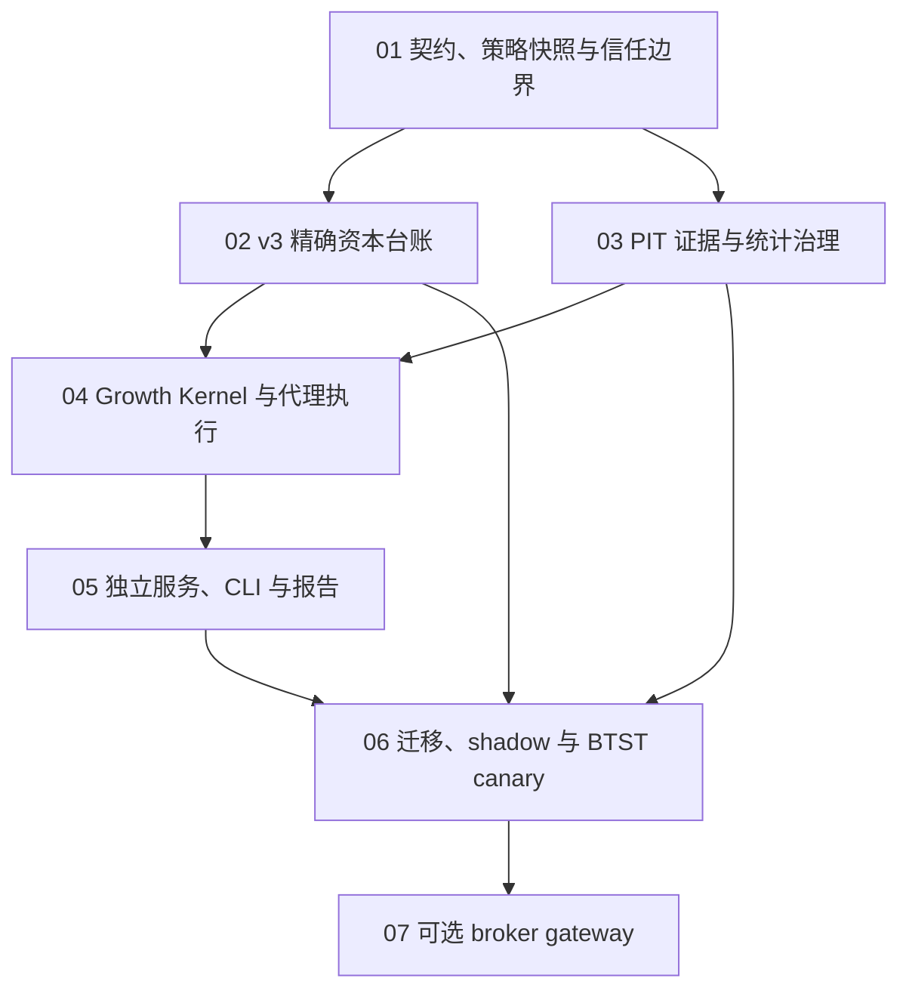

# Evidence-Gated Growth Kernel Roadmap Implementation Plan

> **For agentic workers:** REQUIRED SUB-SKILL: Use superpowers:subagent-driven-development (recommended) or superpowers:executing-plans to implement this plan task-by-task. Steps use checkbox (`- [ ]`) syntax for tracking.

**Goal:** 把已批准的 Evidence-Gated Growth Kernel 目标架构拆成可独立开发、验证、回滚和审阅的子项目，并在不双写资本真相的前提下，从 v2 安全迁移到 v3 shadow、BTST canary 与可选 broker gateway。

**Architecture:** 新代码进入独立的 `src/screening/offensive/v3/`，沿“契约与权限 → 精确资本台账 → 证据治理 → 纯决策与代理执行 → 服务边界与 CLI → 迁移/canary → broker gateway”单向推进。每个子项目先交付不可执行或 fail-closed 能力，只有后续验收门显式通过后才扩大权限。

**Tech Stack:** Python 3.11+、Pydantic 2 strict models、SQLAlchemy 2 Core、Alembic、SQLite WAL（本地权威存储）、FastAPI/httpx（窄服务边界）、Ed25519/cryptography（签名验证）、pytest。

## Global Constraints

- 权威规范是 `docs/superpowers/specs/2026-07-19-evidence-gated-growth-kernel-design.md`；计划与规范冲突时以规范为准。
- `data/paper_trading_backtest/`、`data/paper_trading/` 和当前 `data/paper_trading_v2/` 不得被测试或 shadow 运行修改。
- v3 在原子 authority flip 前不得写 v2；flip 后 v2 只读，任何阶段都禁止 v2/v3 资本双写。
- 默认运行模式是 `off` 或 `shadow`；计划完成不等于自动获得资金授权。
- producer 只能提交候选；Publisher、Finalizer、Authorizer 与 Capital Gateway 分别使用独立 capability 和持久化 namespace。
- 金额使用整数分，股数使用整数，比例使用 `Decimal`/规范化字符串；SQLite `REAL` 不得作为资本真相。
- `RESEARCH_RECONSTRUCTION`、`DAILY_BAR_PROXY`、`MANUAL_CONFIRMED`、`BROKER_CONFIRMED` 永久分池。
- 未知、冲突、stale、版本不匹配和过期授权停止新增风险，但不得阻断退出、公司行动、对账或补偿事件。
- 每项实现都先写失败测试；测试路径必须来自 pytest `tmp_path`。
- 不修改用户现有的 `docs/prompt/often/beta_loop.md` 变更。

---

## 学习目标

完成全部子项目后，执行者应能证明：资本事件精确守恒、决策只消费 PIT 证据、同一风险只缩放一次、shadow 无法伪装成 executable seal、授权样本不能重复消费、v2/v3 交接没有无人写入或双写窗口，以及 broker 回报乱序/重复/更正不会重复入账。

## 架构与依赖图



关键路径是 `01 → 02/03 → 04 → 05 → 06`。`07` 是独立安全工程，不能为了“先接券商”跳过前六项。

## 子项目索引

| 顺序 | 计划 | 独立交付物 | 完成后仍禁止 |
|---|---|---|---|
| 01 | [契约、策略快照与信任边界](2026-07-19-growth-kernel-01-contracts-policy-trust.md) | strict schema、canonical hash、PolicySnapshot、trusted registry verifier | 写资本、签正式授权 |
| 02 | [v3 精确资本台账](2026-07-19-growth-kernel-02-sealed-capital-ledger.md) | append-only events、整数分、NAV/flow、公司行动、checkpoint | 接收 producer 直写、启用交易 |
| 03 | [PIT 证据与统计治理](2026-07-19-growth-kernel-03-evidence-stat-governance.md) | evidence blob/store、Outcome、Trial/SAP、消费账本、Authorizer | 用 readiness 代替 edge、用旧样本授权 |
| 04 | [Growth Kernel 与代理执行](2026-07-19-growth-kernel-04-kernel-proxy-execution.md) | 纯内核、ShadowDecision/DecisionSeal、proxy/manual 状态机 | broker 标记、超过授权档位 |
| 05 | [独立服务、CLI 与报告](2026-07-19-growth-kernel-05-services-cli-reporting.md) | ACL 服务边界、`--auto`/`--daily-action` 编排、ledger 投影 | v2/v3 authority flip、资本 canary |
| 06 | [迁移、shadow 与 BTST canary](2026-07-19-growth-kernel-06-migration-shadow-canary.md) | CAS handoff、parity、故障注入、2% gate | 自动升 5%/10%、broker-live |
| 07 | [可选 broker gateway](2026-07-19-growth-kernel-07-broker-gateway.md) | permit/fence/outbox、broker adapter、对账与 handoff | 未验收即启用生产 broker |

## 跨计划稳定接口

以下依赖方向不得反转：

```text
v3.capital imports v3.contracts
v3.evidence imports v3.contracts
v3.kernel imports v3.contracts + capital.ports + evidence.ports
v3.services imports kernel + capital + evidence
src/cli/dispatcher.py imports v3.services clients/orchestrators
v3.broker adapters implement v3.execution gateway ports
```

稳定端口由子项目 01 定义：

```python
class CapitalViewPort(Protocol):
    def snapshot(self, portfolio_id: str, as_of: datetime) -> CapitalSnapshot: ...

class EvidenceQueryPort(Protocol):
    def snapshot(self, evidence_id: str) -> SnapshotEvidence: ...
    def authorization(self, authorization_id: str) -> CapitalAuthorization: ...

class SealWriterPort(Protocol):
    def publish(self, command: PublishDecisionCommand) -> DecisionSeal: ...

class CapabilityVerifier(Protocol):
    def verify(self, signed: SignedEnvelope, required: Capability) -> VerifiedIssuer: ...
```

子项目只能依赖这些端口，不得直接读取另一个子项目的 SQLite 表。

## 统一执行纪律

每个子项目按以下循环执行：

1. 创建独立分支/工作树；运行该计划的 baseline 测试。
2. 一次只执行一个 Task；严格 RED → GREEN → 重构 → 小提交。
3. 运行本子项目测试、`tests/offensive/` 回归和静态契约检查。
4. 使用规范第 18 节验收矩阵做对抗性审阅；发现新 P0/P1 先修计划或规范，不带风险上线。
5. 合并前更新 `AGENTS.md` 的“已实现范围”，只勾选有测试证据的条目。

## 总体验收门

- [ ] 01–05 在 `off/shadow` 模式下完成，且 `uv run pytest tests/offensive/v3/ -v` 全绿。
- [ ] 全量 `uv run pytest tests/offensive/ tests/test_main_auto_cache_refresh.py -q` 通过。
- [ ] 生产目录写入监视测试证明 shadow 不触碰 v2 或 production v3 ledger。
- [ ] 资本守恒属性测试覆盖成交、费用、外部 flow、分红、送股、换股和 late correction。
- [ ] 权限负面测试证明 producer/CLI/shadow/manual issuer 无法写越权 namespace。
- [ ] 同 key 同 payload 幂等；同 key 异 payload、旧 epoch/permit、未知 schema 均零写。
- [ ] 迁移故障注入覆盖 verify/flip 间的 fill、dividend、fee、crash 和 inbox replay。
- [ ] BTST 2% 前，独立治理者核验 Trial/SAP、非复用 evidence、执行匹配、最低样本门与尾部/容量门。
- [ ] broker-live 前，07 的全部测试与独立安全审阅通过；否则系统只能标 proxy/manual。

## 规范覆盖矩阵

| 规范章节 | 主实现计划 | 独立验收重点 |
|---|---|---|
| §5–§6 不变量/证据契约 | 01、03 | strict schema、issuer capability、六类证据、模式分池 |
| §7–§8 经济合约/执行模式 | 02、04、07 | T+1/T+10、精确费用、proxy/manual/broker 隔离 |
| §9 producers | 04、05 | BTST raw target、OB disabled、Auto shadow-only |
| §10 决策内核 | 04 | 单次风险缩放、容量、整数股、seal 幂等/supersede |
| §11 风险恢复 | 02、04、06 | 10–15% 曲线、15% latch、RiskEpoch、2% 恢复 |
| §12 NAV/公司行动 | 02 | 单位净值、外部 flow、checkpoint、法律终局 |
| §13 统计与 canary | 03、06 | Trial/SAP、ITT、非复用样本、MEE/ESS/tail、stage loss |
| §14 PIT | 01、03、05 | 双时态、payload 保留、独立故障域 |
| §15 台账/broker | 02、04、07 | append-only 资本、订单状态机、outbox/reconcile/handoff |
| §16 端到端任务流 | 05 | 两命令编排、lifecycle-first、真实报告状态 |
| §17 迁移 | 06 | source-version CAS、共享 inbox、无双写/无人写窗口 |
| §18 验收矩阵 | 全部 | 幂等、冲突、乱序、迟到、故障注入、权限负面测试 |

## 明确的停止条件

出现任一情况时暂停扩大权限，但继续修复和退出：

- 资本或头寸无法守恒；
- v2/v3 writer 身份不唯一；
- NAV、calendar、price-limit、company-action 或 broker 状态未知；
- evidence revision 未触发 authorization revalidation；
- 迁移 CAS source version 已变化；
- shadow 与 executable 类型或 namespace 可互换；
- 测试需要读取或覆盖 production ledger 才能通过。

## 路线图文档验收

- [ ] 所有七个链接存在且无循环依赖。
- [ ] 每个规范第 5–18 节至少映射到一个子项目验收项。
- [ ] 运行文档质量脚本，拒绝未完成标记、模糊交叉引用和把浮点数声明为权威资金类型；测试中用于证明拒绝行为的字符串应加入显式 allowlist。
- [ ] 检查状态：`git diff --check -- docs/superpowers/plans/2026-07-19-growth-kernel-*.md` 应无输出。
