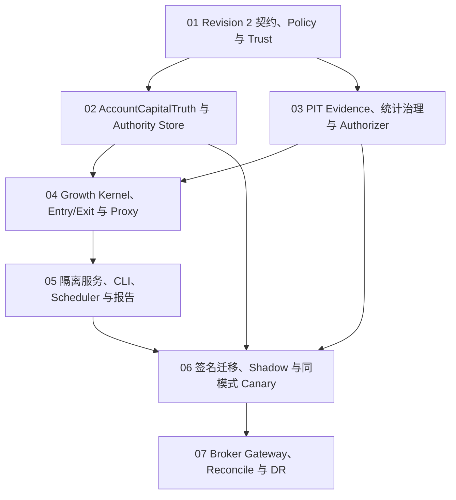

# Evidence-Gated Growth Kernel Roadmap Implementation Plan

> **For agentic workers:** REQUIRED SUB-SKILL: Use superpowers:subagent-driven-development (recommended) or superpowers:executing-plans to implement this plan task-by-task. Steps use checkbox (`- [ ]`) syntax for tracking.

**Goal:** 把已批准的 Revision 2 架构拆成七个可独立验证、可停止、可回滚的子项目，在不伪造权限、不跨库假装原子、也不双写资本真相的前提下，从当前 Plan 01 Revision 1 基线推进到 v3 shadow、同模式 BTST canary 和可选 broker gateway。

**Architecture:** 所有新能力位于 `src/screening/offensive/v3/`。依赖方向固定为“Revision 2 契约/控制面 → 精确资本与证据治理 → 纯 Growth Kernel/Capital Gateway → 隔离服务与 CLI → 签名迁移和 mode-specific canary → broker/DR”。Growth Kernel 只提出完整组合决策；Capital Gateway Authority Store 是 policy/envelope activation、entry admission、reserve、risk/stage latch 与 `SEND_CLAIMED` 的唯一线性化域；退出由独立 `ExitMandate` lane 持续推进。

**Tech Stack:** Python 3.11+、Pydantic 2 strict/frozen models、SQLAlchemy 2 Core、Alembic、SQLite WAL、整数最小货币/数量/单位 quanta、FastAPI/httpx UDS、Ed25519/cryptography、Hypothesis、pytest。

## Global Constraints

- 唯一权威规范是 `docs/superpowers/specs/2026-07-19-evidence-gated-growth-kernel-design.md` Revision 2；计划冲突时以规范为准，并先修计划。
- Plan 01 Revision 2 contracts/policy/trust/ports 已实现；Revision 1 compatibility 中的旧 `CapitalAuthorization`、`DecisionSeal` 和本地 registry 不是最终接口。该实现仍无 store、activation、签发、资本 authority、Kernel/Gateway 或可执行路径，Plan 02–07 不得把结构 port 当作权限。
- `data/paper_trading_backtest/`、`data/paper_trading/`、`data/paper_trading_v2/` 不得被 v3 测试或 shadow 修改；所有测试存储使用 `tmp_path`。
- v3 在签名 migration CAS flip 前不是资本 writer；flip 后 v2 只读，任何时刻禁止资本双写或无人接收外部事件。
- producer 只写候选证据；Governance、Authorizer、Publisher、Finalizer、Capital Gateway 和 broker adapter 使用独立 capability/namespace。
- 本地配置不是权限；只有有效签名、前驱链和 authority-store activation 能改变 trust、policy、authorization、stage、writer 或 broker enablement。
- 持久化资本禁止 float/SQLite `REAL`；money、quantity、units、rational entitlement 均使用整数或显式分子/分母。
- 四种执行模式的业绩/样本分池；同一真实 broker account 的经济事实进入一个 `AccountCapitalTruth`。
- 任一 unknown/conflict/stale/version mismatch/expiry 只阻断新增风险；退出、公司行动、对账、bust/correction 和补偿事件继续。
- 每个 Task 执行 RED → GREEN → refactor → scoped commit；实现状态只在对应测试和验收门通过后更新。
- 不修改用户现有的 `docs/prompt/often/beta_loop.md` 变更。

---

## 目标依赖图


```mermaid
flowchart TD
    P1["01 Revision 2 契约、Policy 与 Trust"] --> P2["02 AccountCapitalTruth 与 Authority Store"]
    P1 --> P3["03 PIT Evidence、统计治理与 Authorizer"]
    P2 --> P4["04 Growth Kernel、Entry/Exit 与 Proxy"]
    P3 --> P4
    P4 --> P5["05 隔离服务、CLI、Scheduler 与报告"]
    P5 --> P6["06 签名迁移、Shadow 与同模式 Canary"]
    P6 --> P7["07 Broker Gateway、Reconcile 与 DR"]
    P3 --> P6
    P2 --> P6
```

关键路径是 `01 → 02/03 → 04 → 05 → 06`。Plan 07 只有在前六项验收完成且另获 broker enablement 批准后才能开始生产启用；写 adapter skeleton 不构成批准。

## 子项目索引与权限上限

| 顺序 | 计划 | 独立交付物 | 计划完成后仍禁止 |
|---|---|---|---|
| 01 | [Revision 2 契约、策略与信任](2026-07-19-growth-kernel-01-contracts-policy-trust.md) | 最终 schemas、domain-separated hash、TrustBundle/Policy activation、稳定 ports | 写资本、激活授权、下单 |
| 02 | [精确资本真相与 Authority Store](2026-07-19-growth-kernel-02-sealed-capital-ledger.md) | AccountCapitalTruth、CapitalRiskSnapshot、stage loss、company action、Gateway transaction surface | 接受 producer 直写、宣称 writer 已迁移 |
| 03 | [PIT 证据与统计治理](2026-07-19-growth-kernel-03-evidence-stat-governance.md) | revisioned Evidence Store、Trial/SAP/Attempt/消费账本、Authorizer/Governance issuance | 用 readiness/legacy 样本授权、直接修改资本 |
| 04 | [Kernel、Gateway admission 与代理执行](2026-07-19-growth-kernel-04-kernel-proxy-execution.md) | 纯组合 proposal、原子 seal/reserve、entry/exit 状态机、proxy/manual | broker 标记、绕过 active envelope、自动升档 |
| 05 | [服务、CLI、Scheduler 与报告](2026-07-19-growth-kernel-05-services-cli-reporting.md) | OS/DB ACL、控制面/Gateway API、durable lifecycle scheduler、两命令 shadow 编排 | authority flip、真实 canary、broker-live |
| 06 | [迁移、Shadow 与 Canary](2026-07-19-growth-kernel-06-migration-shadow-canary.md) | signed migration/adoption、durable inbox、CAS flip、同模式 2% activation/monitor | proxy/manual 证据转 broker、自动升 5%/10% |
| 07 | [Broker Gateway 与 DR](2026-07-19-growth-kernel-07-broker-gateway.md) | capability certification、SEND_CLAIMED、broker inbox/reconcile、credential fencing、DR | 未签 BrokerEnablementManifest 即连生产账户 |

## 跨计划稳定接口

Plan 01 定义下列不可变契约；后续计划只通过 port 交互，不读取其他 authority 的 SQLite 表：

```python
class CapitalGatewayReadPort(Protocol):
    def risk_snapshot(
        self, portfolio_id: str, as_of: datetime
    ) -> CapitalRiskSnapshot: ...

ActiveEvidenceRecord = (
    EvidenceRecord[SnapshotEvidence]
    | EvidenceRecord[SignalEvidence]
    | EvidenceRecord[OutcomeEvidence]
    | EvidenceRecord[PlanEvidence]
)

class EvidenceQueryPort(Protocol):
    def active_revision(
        self, evidence_id: str, cutoff: datetime
    ) -> ActiveEvidenceRecord: ...
    def outcome(self, outcome_id: str, revision: int) -> EvidenceRecord[OutcomeEvidence]: ...

class AuthorizationQueryPort(Protocol):
    def active_envelope(self, portfolio_id: str) -> CapitalAuthorizationEnvelope: ...
    def status(self, authorization_id: str) -> AuthorizationStatus: ...

KernelInputT = TypeVar("KernelInputT", bound=CanonicalModel, contravariant=True)
NoTradeDecisionT = TypeVar("NoTradeDecisionT", bound=CanonicalModel, covariant=True)

class GrowthKernelPort(Protocol[KernelInputT, NoTradeDecisionT]):
    def decide(
        self, frozen: KernelInputT
    ) -> NoTradeDecisionT | ShadowDecision | PortfolioDecision: ...

class CapitalGatewayCommandPort(Protocol):
    def publish_entry(
        self, proposal: PortfolioDecision, expected: GatewayExpectedVersions
    ) -> PortfolioDecisionSeal: ...

class CapabilityVerifier(Protocol):
    def verify(
        self,
        signed: SignedEnvelope,
        required: Capability,
        *,
        current_head: CurrentTrustHeadWitness,
        trusted_at: datetime,
    ) -> VerifiedIssuer: ...
```

Plan 01 不提前定义 Plan 04 的 `KernelInput`/`NoTradeDecision`。在 Plan 04 边界被独立审阅并替换前，production `src` 的 `*.py`/`*.pyi` 必须保持 zero static `GrowthKernelPort` references；只允许 `contracts/ports.py` 的 top-level Protocol 定义/精确 `__all__`，以及 `contracts/__init__.py` 的 top-level 精确 import/`__all__`。There is no downstream typing or runtime exception：concrete alias、annotation、runtime check、quoted/reflection token、stub 与 contracts star import 均不例外。Plan 04 若要以 `GrowthKernelPort[KernelInput, NoTradeDecision]` 绑定，必须先提交新的 strict/frozen DTO、真实入口重验和替代 acceptance gate，不能借 Task 5 的 generic port 预先扩散。Evidence active query 继续使用四种严格具体 payload 的闭合 record union；`OutcomeEvidence` 不得绕过 record revision/commit-time 语义，`CapabilityVerifier` 的 `current_head`/`trusted_at` 也不授予权限。旧 Revision 1 interface acceptance scan 仍覆盖整个 production `src`、仅排除两个冻结 compatibility 模块；tests 不计入生产扫描，控制文档历史标记仅是 lexical guard。

Dynamic or fragmented string construction is outside this static proof. Plan 04 must keep default-deny and use new RED-to-GREEN TDD to allow only an exact consumer module and the exact `GrowthKernelPort[KernelInput, NoTradeDecision]` signature; alias, runtime-check, and star-import exceptions remain forbidden.

依赖方向固定：

```text
v3.capital -> v3.contracts
v3.evidence -> v3.contracts
v3.kernel -> v3.contracts + read-only ports
v3.gateway -> v3.contracts + v3.capital + kernel port
v3.services -> domain services/ports
src/cli/dispatcher.py -> unprivileged v3 clients/orchestrators
v3.broker.adapters -> broker ports only
```

Evidence/Authorizer 与 Capital Gateway 可以分库，但不得声称跨库同一事务。会使授权失效的 evidence correction 必须先准备 correction，再向 Gateway 持久化并 ACK `EntryFenceRaised`，最后才激活新 evidence revision。资本 correction/stage latch 在 Gateway 资本事务内直接递增版本并 tombstone 尚未 `SEND_CLAIMED` 的 entry。

## 统一执行纪律

1. 读取本 Roadmap、目标 Plan、规范相关章节和 `AGENTS.md`；先确认当前代码/迁移状态，不能把计划文本当已实现事实。
2. 创建隔离分支/工作树；运行该 Plan 的 baseline。若 baseline 红，先按 systematic debugging 定位并记录，不把已有失败归因于新改动。
3. 一次执行一个 Task；先加入能因缺失行为而失败的测试，再实现最小闭合语义。
4. 每个跨权限边界的 happy path 必须配 unknown、stale、wrong issuer、old epoch、duplicate、same-key/different-payload、crash/restart 和竞争测试。
5. 每个 Task 完成后运行目标测试；每个 Plan 完成后运行本 Plan 套件、`tests/offensive/v3/` 与明确列出的 legacy 回归。
6. 独立代码审阅必须以规范 §18 矩阵和本 Roadmap 覆盖矩阵逐项给证据；P0/P1 先修规范/计划再扩权。
7. 只有可重跑命令和持久化记录证明完成后，才能更新 `AGENTS.md` 当前实现范围。

## 总体验收门

- [ ] Plan 01 Revision 2 schema/ports 完成验收仍 pending；implementation is present，仓库内不再有下游代码依赖旧 `CapitalAuthorization`/`DecisionSeal` 作为最终接口，但 full checked-in snapshot acceptance remains open，故 Plan 01 completion gate 尚未关闭。
- [ ] Plan 02–05 在 `off|shadow` 下完成，`uv run pytest tests/offensive/v3/ -q` 全绿，且不生成 executable entry。
- [ ] 资本属性测试覆盖 genesis、subscription/redemption、TERMINATING/INSOLVENT、fill/fee/reserve、公司行动、bust/correction、stage loss、as-observed/restated-final。
- [ ] 权限测试证明本地配置、producer、CLI、shadow、manual issuer 和旧 epoch 无法激活 policy/envelope、写 Capital Gateway 或发送 broker entry。
- [ ] `(portfolio_id, signal_session, decision_cycle_id)` 同 payload 幂等；异 payload 冲突；epoch 变化不能生成第二份经济决策。
- [ ] `SEND_CLAIMED` 竞争测试证明最终发送前同事务重验 active seal/permit/fence/envelope/capital/risk/stage/deadline。
- [ ] Authorizer correction 测试证明先 Gateway fence ACK 后 evidence activation；故障只会多阻断，不会漏放 entry。
- [ ] ExitMandate/scheduler 在 Publisher、Authorizer、entry API、CLI 全停时仍推进 due exit/reconcile；unknown quantity 不超卖。
- [ ] 迁移故障注入覆盖旧 fd/credential/session、verify/flip 间 fill/dividend/fee/correction/crash、handoff cursor 和 inbox replay。
- [ ] 任一 2% activation 前，治理者核验 mode-specific Trial/SAP/Stage、新样本、完整组合 envelope、整数 loss budget 和风险快照。
- [ ] broker-live 前，账户/环境绑定、分页/cursor/retention、auction TIF/cutoff、client ID 幂等、credential/network fencing、handoff 与 DR 全部通过独立审阅。

## 规范覆盖矩阵

| 规范主题 | 主计划 | 必须独立验收的核心 |
|---|---|---|
| 不变量、控制面、完整授权包络 | 01、03、04 | TrustBundle/PolicyActivation 前驱；一 portfolio 一 active envelope；joint CAS |
| 经济合约、模式与账户真相 | 02、04、07 | T+1/T+10；mode-pure performance；single AccountCapitalTruth |
| producers 与纯内核 | 04、05 | Auto/BTST 独立；完整 proposal；risk exactly once；OB disabled |
| 回撤、恢复与 stage loss | 02、04、06 | 10–15% 曲线；15% latch；RECOVERY 2%；不可回补整数 budget |
| 单位 NAV、赎回、破产、公司行动 | 02 | genesis；pending units；TERMINATING/INSOLVENT；rational entitlements |
| PIT、Trial/SAP、样本与 multiplicity | 03 | trusted ingest sequence；expected spine；双 unique key；decision-day 分离 |
| Entry/Exit 生命周期 | 02、04、05 | seal/reserve 原子；ExitMandate 独立；bust reopen；negative shares halt |
| 服务、CLI 与报告 | 05 | 真实 ACL；durable scheduler；状态不伪装；两命令可在 off 下运行 |
| Migration/authority flip | 06 | signed manifests；source/target proof；durable inbox；handoff cursor；old writer fence |
| Broker/SEND_CLAIMED/DR | 07 | capability certification；same-ID rule；pagination；credential/session/network fencing |

## 明确停止条件

出现任一情况时停止新增风险和扩权，但继续退出/对账/修复：

- 现金、股份、单位、应收应付、reserve 或 stage loss 无法逐项守恒；
- writer、active policy/envelope、broker account/environment 或 epoch 身份不唯一；
- NAV/calendar/price-limit/company-action/broker order/fill/cursor 任一关键事实 unknown；
- evidence revision 未先取得 Gateway entry-fence ACK；
- `SEND_CLAIMED` 前无法同事务重验全部 authority/capital 条件；
- v2/v3 source version、inbox handoff cursor、adoption manifest 或 migration root 变化；
- shadow/executable 或 proxy/manual/broker 类型/namespace 可互换；
- 测试必须读取或覆盖生产 ledger 才能通过。

## 路线图文档验收

- [ ] 七个相对链接全部存在，且依赖图无循环。
- [ ] 规范 Revision 2 每个 P0/P1 约束都映射到至少一个任务和一个负面/故障测试。
- [ ] 运行 `rg -n '[T]BD|[T]ODO|待[定]|Capital[S]napshot|\bEdge[A]uthorization\b|\bExploration[A]uthorization\b|\(portfolio.*authority_[e]poch\)' docs/superpowers/plans/2026-07-19-growth-kernel-*.md`；应无输出。另由 Plan 01 的 repository scan test 精确限制旧 `CapitalAuthorization`/`DecisionSeal` 只出现在 Revision 1 fixture/adapter 和历史状态文字中。
- [ ] 运行 `git diff --check -- AGENTS.md docs/superpowers/specs/2026-07-19-evidence-gated-growth-kernel-design.md docs/superpowers/plans/2026-07-19-growth-kernel-*.md`；应无输出。
