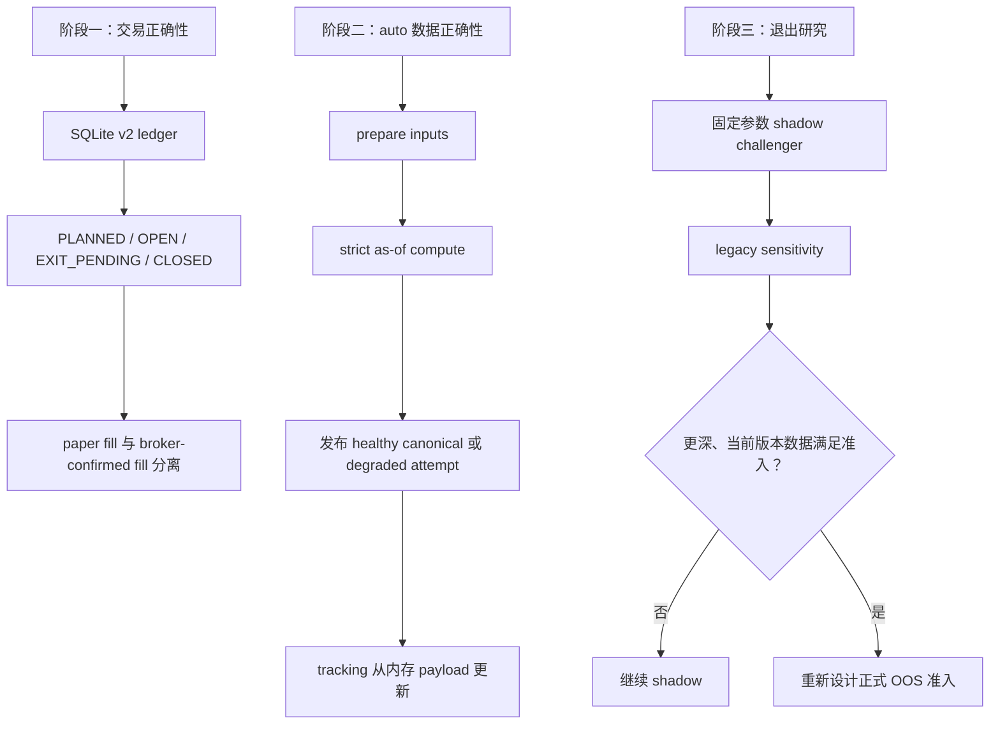

# `--auto` 与 `--daily-action` 对抗性审计及 T+10 动态退出设计

> 初版：2026-07-12
>
> 对抗性复核修订：2026-07-13
>
> 状态：修订完成，可拆分编写实施计划
>
> 目标读者：策略开发者、回测维护者和每日操作者

## 1. 核心判断

系统当前最需要修复的不是因子权重，而是交易事实不够清楚：信号日计划被立即记成成交，信号日收盘价与次日开盘价混用，退出日期无法还原，组合状态又分散在 journal 与 state 两个文件里。在这些口径没有统一前继续调阈值，会把记账偏差或执行假设误认为策略收益。

本轮工作拆为三个独立阶段：

1. 先保证交易计划、模拟成交、持仓和退出能被准确记录；
2. 再保证 `--auto` 只使用严格 as-of 数据并发布一致报告；
3. 最后实现一个固定参数的动态退出 challenger，只做 shadow 观察。

当前本地数据不允许为动态退出选参，也不允许自动升级默认退出策略。策略转正必须等待当前 setup 的版本化全信号数据和更深历史。

## 2. 阅读目标

维护者读完本文后，应能明确：

- `--auto` 和 `--daily-action` 的职责边界；
- paper fill 与用户真实成交的区别；
- 第 10 个持仓交易日采用什么可执行退出时点；
- 组合敞口如何同时计算已成交仓位和待成交预留；
- 哪个存储是交易真值，崩溃后如何恢复；
- 现有回测数据能证明什么、不能证明什么；
- 三个阶段各自的完成条件和停止条件。

## 3. 修订后的系统地图



三个阶段独立验收。阶段一失败时不开始阶段二；阶段三失败不影响前两个阶段已经交付的确定性修复。

## 4. 已确认的代码问题

### 4.1 交易生命周期

1. `generate_daily_action()` 在信号日生成次日计划，却立即调用 `record_buy()`，未成交计划因此占用敞口并进入收益统计。
2. `daily_action.py` 用信号日收盘价生成 `entry_price` 与止损价；`paper_tracker.py` 的收益又优先使用次日开盘价，同一字段承担两种语义。
3. EXIT 事件把 `date` 写成原买入信号日，没有实际退出日期。
4. 到期日仍使用 `N + 2 * floor(N / 5)` 的日历日近似，长假会提前到期。
5. `record_buy()` 的读、去重、append、state 写入不在同一事务里；顺序幂等测试不能覆盖并发竞态。
6. 当前 `t_plus_1_lock` 配置没有真正参与 `adjust_returns()` 的执行分支。

### 4.2 组合与风险

1. BTST 单票上限被提高到正常 15%、regime 放大后 18%，与项目约定的正常 10%、硬上限 12% 冲突。
2. `open_exposure` 只累加计划权重，不按当前持仓市值和 NAV 重新计算。
3. drawdown 只在平仓时更新已实现收益，没有每日 mark-to-market，风险状态会滞后。
4. 现有 v1 journal 缺成交数量、名义金额、费用拆分和真实退出日期，不能无歧义地重建现金、NAV 与回撤。

### 4.3 数据与报告

1. 资金流历史不足时 BTST 仍可命中，只标 `degraded=True`，但仓位展示使用完整版 setup 的历史先验。
2. `compute_auto_screening_results()` 声明不做 IO，内部却提前保存报告。
3. `update_tracking_history()` 又从磁盘读取本次报告，形成“先写报告才能追踪、追踪后再覆写报告”的自引用链。
4. expected-return 与部分 composite 维度没有显式 `as_of` 和 `model_version` 隔离，历史重跑可能读到未来报告或未来标签。
5. 当前流程先按 `score_b` 截断约 Top 30，再做 investability，完整候选池无法参加最终比较。
6. `--auto` 锁 fd 没有在函数 finally 中明确关闭；busy 分支返回 0，会让监控误报成功。

## 5. 目标与非目标

### 5.1 目标

- 明确区分研究信号、paper 模拟成交和用户真实成交；
- 用交易所开市日计算持仓日，周末和节假日不计数；
- 第 9 日收盘生成强制退出计划，第 10 日开盘卖出；
- 正常单票不超过 10%，regime 放大后不超过 12%，组合不超过 60%；
- 组合 NAV 每个交易日按持仓市值 mark-to-market；
- `--auto` 的历史特征严格使用交易日前已知数据；
- 动态退出先以固定参数 shadow 运行，不用当前六个月数据选参。

### 5.2 非目标

- 不接入特定券商 API，也不假装能够确认用户账户成交；
- 不在 v2 首阶段支持复杂部分成交路由或智能订单拆分；
- 不重写 `--auto` 的四策略因子体系；
- 不恢复 OversoldBounce；
- 不修改 legacy backtest artifact；
- 不在六个月数据上做两参数网格搜索、机器学习或生产策略转正。

## 6. 阶段一：交易正确性

### 6.1 唯一交易真值

冻结以下 v1 文件，不覆盖、不迁移改写：

```text
data/paper_trading/journal.jsonl
data/paper_trading/portfolio_state.json
data/paper_trading_backtest/journal.jsonl
data/paper_trading_backtest/portfolio_state.json
```

v2 使用 Python 标准库 `sqlite3`，数据库为 `data/paper_trading_v2/ledger.sqlite3`。SQLite 是唯一交易真值；不再让 JSONL 与 state 文件共同承担真值。

数据库至少包含：

- `ledger_meta`：`ledger_id`、schema version、初始现金、cutover 时间；
- `trades`：当前交易状态、确定性 `trade_id`、策略版本、计划和成交字段；
- `trade_events`：单调 `seq`、唯一 `event_id`、幂等键、状态转换和现金/持仓变化；
- `daily_valuations`：每日现金、持仓市值、NAV、peak、drawdown；
- `execution_configs`：成交代理、费用、涨跌停规则和日历版本。

所有状态转换、事件写入和资金变化在一个 SQLite transaction 中提交。数据库损坏时 fail closed，不创建 NAV=1 的空状态继续交易。

### 6.2 确定性身份与状态

`trade_id` 由以下自然键确定生成：

```text
ledger_id + setup + setup_version + ticker + signal_date + planned_entry_date
```

状态只保留：

```text
PLANNED → OPEN → EXIT_PENDING → CLOSED
       └→ SKIPPED
```

`HOLD` 是每日输出视图，不写成持久状态。动态退出的 `armed_at`、`highest_close`、`exit_line`、`last_evaluated_date` 和 `forced_exit_target_date` 是 OPEN 交易的策略字段。

跌停、停牌或队列不确定导致无法退出时，状态保持 `EXIT_PENDING`，追加带 `attempt` 和 `reason` 的 `EXIT_DEFERRED` 事件。

### 6.3 真实与模拟成交

每笔成交必须保存：

- `execution_mode=paper|broker_confirmed`；
- `fill_source=synthetic_open|manual_confirmation|broker_import`；
- `raw_fill_price`、quantity、gross notional；
- slippage、commission、tax、other fee；
- net cash flow。

paper 模式可以按版本化规则生成 synthetic fill，但输出必须明确标记“模拟成交”。真实 `broker_confirmed` fill 只能来自人工确认文件或未来券商回报接口；日线 OHLC 不能自动升级为用户真实成交。

本阶段实现 paper 模式与人工确认数据接口，不实现特定券商适配器。paper 使用全额成交代理；broker-confirmed 模式允许按确认 quantity 更新持仓。

### 6.4 订单协议

`BUY_PLAN` 必须包含：计划日期、计划权重、稳定优先级、参考价、订单类型、限价规则和有效期。未在 `planned_entry_date` 确认或模拟成交的计划转为 `SKIPPED/EXPIRED`，不能顺延到另一日开盘。

计划阶段同时计算：

- `open_exposure`：已成交持仓当前市值 / NAV；
- `reserved_exposure`：待成交计划预留权重；
- `available_exposure = 60% - open_exposure - reserved_exposure`。

fill transaction 再次检查现金、当前 NAV 和上限。若价格变化或其他计划先成交导致容量不足，按稳定优先级 resize 或 skip。

### 6.5 交易日与 T+10

交易日历提供三个 fail-closed 接口：

```python
next_session(date) -> date
nth_holding_session(entry_date, n) -> date
session_distance(start, end) -> int
```

`nth_holding_session(entry_date, 1)` 返回 entry date；第 10 个持仓交易日是 entry 后第 9 个开市日。

系统只在收盘后运行，因此生产可执行基线固定为：

1. 第 9 日收盘生成 `EXIT_PENDING`；
2. 第 10 日开盘执行卖出代理；
3. 第 10 日开盘在跌停队列、停牌或数据未知时追加 `EXIT_DEFERRED`；
4. 后续第一个可执行交易日继续尝试。

第 10 日收盘价只可用于旧口径对照，不能冒充真实可执行退出。

### 6.6 涨跌停与停牌三态

仅有日线数据时，成交代理返回：

```text
EXECUTABLE_PROXY
UNEXECUTABLE_PROXY
UNKNOWN_QUEUE
```

基本规则：

- 非停牌且开盘严格位于涨跌停价之间，可按 open 生成 paper fill；
- 开盘等于涨停或跌停价，标记 `UNKNOWN_QUEUE`，默认不成交；
- OHLC 全部锁在板价可标 `UNEXECUTABLE_PROXY`，但文案仍称“保守代理”；
- 停牌与行情缺失是不同状态，缺数据不能冒充停牌；
- 队列真实成交只能由 broker-confirmed 数据证明。

涨跌停价格不能只按代码前缀和 9.5%/19.5%/29% 近似。解析器输入至少包括 ticker、date、exchange、previous close、ST 状态、上市天数和当日规则版本；信息不足时返回 unknown 并禁止新 paper fill。

个股停牌日仍推进组合持仓日，但不可成交。退市、长期停牌或公司行为无法自动判定时进入人工复核状态。

### 6.7 组合估值

组合保存现金和实际 quantity。每个开市日用可用收盘价计算：

```text
market_value = sum(quantity * close)
nav = cash + market_value
open_exposure = market_value / nav
drawdown = nav / historical_peak - 1
```

行情缺失时不得把持仓估值归零；沿用最近可信估值并标记 stale valuation，禁止因此解除风险限制。

## 7. 阶段二：`--auto` 数据正确性

### 7.1 编排边界

`src/main.py` 只保留 CLI 入口，auto 编排移动到独立 service：

```text
prepare_auto_inputs()        # IO、缓存刷新、strictly-before history snapshot
compute_auto_report(inputs)  # 不发布 report
publish_canonical_report()   # 单次原子发布 healthy canonical
update_tracking_from_payload() # 可重试衍生产物
```

compute 阶段可以执行计算，但不得发布 report。tracking 改为接收内存 payload，不再通过“最新磁盘报告”获取本次推荐。tracking summary 不嵌回 canonical report，避免二次覆写。

### 7.2 Healthy 与 degraded

每次运行都有唯一 `run_id`：

- healthy：原子保存 `auto_screening_YYYYMMDD.json`，成为该日 canonical；
- degraded：保存 `auto_attempt_YYYYMMDD_RUNID.json`，不覆盖同日 healthy canonical；
- fatal：保存最小失败诊断，不产生 canonical。

`--daily-action` 只在存在信号日 healthy canonical 且逐 ticker validator 通过时生成新计划；无论新信号是否降级，已有持仓管理仍继续运行。

默认退出码：

- `0`：流程完成，healthy 或 degraded 状态从报告和控制台读取；
- `1`：fatal，没有可用 attempt；
- `2`：CLI usage；
- busy 使用独立临时失败码。

`--strict-quality` 供 CI 或监控使用，使 degraded 返回非零。现有 runner 不会因普通 degraded 跳过后续持仓管理。

### 7.3 缓存与 manifest

价格、资金流和行业 CSV 全部使用同目录 temporary file、flush、fsync、`os.replace()`。每次 healthy run 生成逐 ticker manifest，至少记录：

- trade date 与 run id；
- OHLCV 日期和有限性；
- 当日及历史资金流覆盖；
- 行业数据日期；
- ST、上市状态和涨跌停规则版本；
- cache hash 或可复验的行级指纹；
- `trade_ready` 与精确阻断原因。

report status 不是第二交易真值。`--daily-action` 读取 manifest 后仍复验缓存日期和关键字段。

### 7.4 严格 as-of

所有历史维度显式接收 `as_of`、`history_snapshot` 和 `model_version`：

- 只读取日期严格早于 trade date 的报告；
- 只使用在 trade date 前已经成熟的收益标签；
- 训练标签的实际退出日必须早于 as-of；
- 历史运行不能调用隐式 latest；
- 不同 model/setup fingerprint 默认不池化。

修改未来报告、future tracking 或未来 K 线后，过去日期的结果必须保持字节级或字段级一致。

### 7.5 排序治理

完整候选池 investability 先作为 shadow challenger。删除 Top 30 截断前，所有 composite 维度必须能够对显式 full pool 和 strictly-before snapshot 计算；否则“全池排序”只是大量缺失值排序。

`profit_aware` 与 `--auto` / BTST 双信号保持 shadow，不显示诱导加仓的星标。当前模型积累足够成熟前向数据后，另立研究规格决定是否转正。

## 8. 阶段三：固定参数退出 shadow

### 8.1 当前数据的限制

`data/paper_trading_backtest/journal.jsonl` 仍是 legacy backtest 成交真值，但不是当前 BTST detector 的生产 cohort：

- 旧生成脚本绕过过行业条件；
- journal 早于板块自适应涨停修复；
- 当前可重建完整路径的 BTST 只有 94/133，覆盖率 70.7%；
- 可重建组旧 T+10 均值约 +9.99%，缺失组约 +3.71%，完整案例明显上偏；
- 94 笔只覆盖 45 个信号日，T+10 窗口高度重叠，互不重叠时间块约 9 个。

因此当前数据只能回答“旧 cohort 对退出规则是否敏感”，不能为当前生产 setup 选择参数。

### 8.2 固定 challenger

实现一个预注册、不可在本地样本上调参的 shadow 策略：

```text
activation_return = +10%
atr_multiple = 2.5
maximum exit = 第 9 日收盘计划、第 10 日开盘执行
```

状态分两段：

- `UNARMED`：收盘净浮盈未达到 +10%，不执行普通移动退出；
- `ARMED`：首次达到 +10% 后维护只升不降的退出线。

```text
candidate_exit = highest_close_since_entry - 2.5 * ATR_today
exit_line_today = max(exit_line_yesterday, candidate_exit)
```

收盘跌破退出线后，下一开市日开盘执行 paper exit proxy。买入当天不可卖出。盘中灾难止损不进入本 challenger。

### 8.3 Shadow 报告

当前报告只做 legacy sensitivity，并必须披露：

- 旧 detector 与当前 detector 的差异；
- signal → plan → fillable proxy → complete path 各层覆盖率；
- covered 与 missing 的日期、板块和旧收益差异；
- baseline 与 challenger 的共同 eligibility mask；
- 平均单笔净收益、中位数、尾部、持仓日和退出原因；
- 按至少 T+10 长度的时间块 bootstrap 敏感性；
- 不报告能够误解为真实组合的 Sharpe 或 drawdown。

MFE 仅作诊断。捕获率只在正 MFE 且分母超过预设最小值时报告，同时报告 `give_up = MFE - net_return`；日线 high 不称为真实可实现卖价。

### 8.4 未来正式准入的前置条件

正式参数研究必须先得到当前版本的 point-in-time 全信号 ledger，保存：

- 所有命中与未命中原因；
- 排序分、阻断原因和容量结果；
- setup、data、board-rule、execution 和 cost fingerprint；
- 不可变 OHLCV/资金流/行业快照；
- 每次计划、fill proxy 和退出路径。

之后才允许制定 purged、embargoed walk-forward：训练交易的最晚退出日必须早于测试起点，折间隔离至少 T+10 加下一开盘延迟。参数选择后的区间估计必须重跑完整选参过程，并使用时间块或聚类方法处理同日多股和持仓窗口重叠。

用户选择的平均单笔净收益仍作为退出机制第一指标；生产准入还必须通过受 60% 敞口、现金、预留和资本释放约束的组合级 replay，确认 NAV 与尾部风险没有恶化。

## 9. 文件职责

阶段一只新增或集中四个边界：

| 文件 | 职责 |
| --- | --- |
| `trade_lifecycle.py` | 纯状态转换和确定性 identity |
| `ledger_repository.py` | SQLite schema、事务、幂等和查询 |
| `execution_adjuster.py` | 在现有文件中扩展成交三态、费用与 T+1，不新建重复 execution model |
| `daily_action_service.py` | 单次编排、估值和输出模型 |

`daily_action.py` 保留 setup 扫描与渲染兼容入口，逐步变薄；`paper_tracker.py` 仅保留 v1 兼容读取，不继续承载 v2 状态。

阶段二新增 `auto_pipeline.py`，`main.py` 只调用 service。阶段三新增研究脚本与纯 `exit_policy.py`，生产和研究共用同一个纯退出函数。

## 10. 测试与验收

### 10.1 阶段一

- 确定性 trade id、重复计划和真正并发事务；
- SQLite transaction 在故障注入下不产生半状态；
- paper 与 broker-confirmed fill 不混合统计；
- 周五、春节、国庆和日历不可用 fail closed；
- 第 9 日计划、第 10 日开盘退出，无 off-by-one；
- T+1 买入日不可卖；
- 涨跌停 queue unknown、停牌和数据缺失三者分离；
- reserved + open exposure 不超过 60%；
- 单票正常 10%、硬上限 12%；
- 每日 mark-to-market NAV 与 drawdown；
- v1 文件保持字节不变。

### 10.2 阶段二

- compute 不发布 report；
- healthy canonical 只写一次；
- degraded attempt 不覆盖 healthy；
- tracking 从内存 payload 更新，不读本次磁盘报告；
- optional degraded 不阻断已有持仓管理；
- future report、future label 和 future K 线不改变过去输出；
- cache 原子写故障保留上一有效文件；
- auto lock fd 在 finally 关闭，busy 有可辨状态。

### 10.3 阶段三

- 固定 +10% / 2.5 ATR，不存在参数搜索代码路径；
- 退出线只升不降，未来 K 线不改变过去决策；
- 共同 eligibility mask 和覆盖率报告；
- 时间块 bootstrap，不使用逐笔独立假设；
- 报告明确 legacy sensitivity 与 shadow；
- 任何当前样本结果都不能切换生产默认。

### 10.4 基础回归

```bash
uv run pytest tests/offensive/ -v
uv run pytest tests/test_main_auto_cache_refresh.py -v
uv run pytest tests/offensive/test_daily_action_cache_refresh.py -v
```

新增测试通过后，再按每个阶段的修改范围运行扩大回归。完成结论以当次测试输出为准。

## 11. 每日输出契约

输出按优先级排列：

1. broker-confirmed 持仓的退出建议；
2. paper 持仓的模拟退出；
3. `EXIT_PENDING` 与 deferred 原因；
4. OPEN 持仓的 mark-to-market、退出线和剩余交易日；
5. 下一交易日 `BUY_PLAN`；
6. `UNKNOWN_QUEUE`、数据残缺、容量或规则不足导致的 SKIPPED；
7. open exposure、reserved exposure、现金和 NAV。

所有价格必须标明 `reference`、`synthetic fill` 或 `broker-confirmed fill`。系统没有成交确认时，不使用“实际买入”“实际卖出”等措辞。

## 12. 实施顺序与停止条件

实施顺序固定：

1. 交易 ledger、执行语义和组合估值；
2. `--auto` as-of、原子缓存和报告发布；
3. 固定参数退出 shadow；
4. 收集当前版本全信号与前向成交数据；
5. 数据满足功效要求后，另立正式参数研究规格。

以下情况会阻止策略转正，但不阻止确定性修复交付：

- 当前版本历史不足；
- 完整路径覆盖存在明显选择偏差；
- 有效独立时间块不足；
- 成交代理与实时执行不一致；
- 组合级 replay 显示 NAV 或尾部风险恶化。

该设计优先把系统变成可恢复、可审计、能区分事实与代理的交易工具。动态退出是否提高收益由未来证据决定，不由当前设计预设结论。
