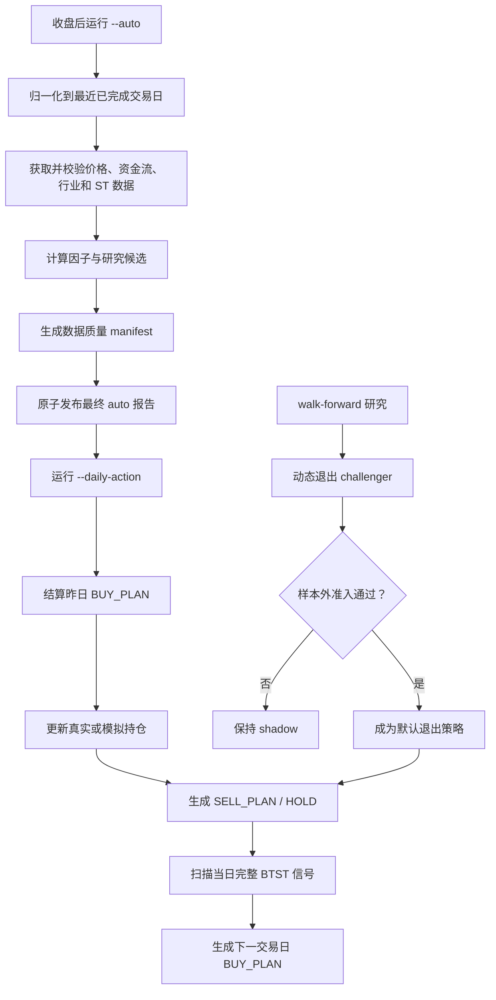

# `--auto` 与 `--daily-action` 对抗性审计及 T+10 动态退出设计

> 日期：2026-07-12
>
> 状态：设计已确认，等待书面复核后进入实施计划
>
> 目标读者：本项目的策略开发者、回测维护者和每日操作者

## 1. 核心判断

系统当前最需要修复的不是某个因子权重，而是信号、计划、成交、持仓和退出被压在同一条流程里。`--daily-action` 在信号日就把次日计划买入记成已成交；回测又混用了信号日收盘价、次日开盘价和固定 T+10 收盘价。继续在这套口径上调阈值，容易把记账偏差当成策略收益。

本轮改造先建立可执行的交易生命周期，再研究 T+10 内的动态退出。任何策略优化都必须通过无未来数据、扣除交易成本的时间顺序验证；验证不足时进入 shadow（影子）模式，不改变默认交易动作。

## 2. 阅读目标

读完本文后，维护者应能回答以下问题：

- `--auto` 和 `--daily-action` 各自负责什么，在哪里交接数据；
- 为什么 `BUY_PLAN` 不能直接写成 `BUY`；
- 一笔交易如何从信号日走到实际成交和退出；
- 动态退出如何避免事后最高价和其他未来数据；
- 哪些统计结果允许改变默认策略，哪些只能作为研究线索；
- 新旧 journal 如何共存，历史回测产物如何保持可审计。

## 3. 系统地图



三条主线必须分开：

| 主线 | 输入 | 输出 | 是否允许改变持仓 |
| --- | --- | --- | --- |
| 数据与研究候选 | 当日市场数据、历史报告 | `auto_screening_YYYYMMDD.json` | 否 |
| 交易生命周期 | 已发布缓存、计划和持仓 | BUY / HOLD / SELL 操作清单 | 是 |
| 策略研究 | 历史 OHLCV、journal、成本模型 | challenger 评估报告 | 只有准入通过后 |

## 4. 已确认的问题

### 4.1 交易生命周期与记账

1. `generate_daily_action()` 在信号日生成下一交易日计划，却立即调用 `record_buy()`。次日一字涨停买不到时，journal 仍存在虚构持仓。
2. `daily_action.py` 用信号日收盘价构造 `entry_price`、止损价和持仓展示；`paper_tracker.py` 的收益计算又优先使用次日开盘价。一个字段承载了两种价格语义。
3. EXIT 记录把 `date` 写回买入信号日，以便复用旧的自然键，但丢失了真实退出日期，无法还原资金曲线和持仓天数。
4. 到期判断采用交易日的日历日近似。它能避免部分提前到期，却不能正确处理春节、国庆等长假。
5. `--daily-action` 没有覆盖整个“读取 journal → 去重 → 写 journal → 写 state”的进程级事务锁。两个进程并发时仍可能同时通过幂等检查。

### 4.2 风险与组合口径

1. BTST 单票上限已被提高到正常 15%、regime 放大后 18%，与项目约定的正常 10%、硬上限 12% 不一致。
2. `update_pnl()` 直接执行 `nav += portfolio_return`。当仓位百分比表示成交时的组合净值比例时，组合收益应作用于当时 NAV；现有算法把收益当成初始资本的绝对百分点。
3. 旧 journal 没有成交日、退出日和真实名义金额，无法无歧义地重建严格复利 NAV。因此历史 `paper_trading_backtest/portfolio_state.json` 必须作为 legacy artifact（旧口径产物）保留，不能静默覆盖。

### 4.3 数据完整性

1. BTST 资金流历史不足时仍可命中，只标记 `degraded=True`。这与完整版 setup 的先验分布不是同一策略。
2. 全局缓存日期取所有股票中的最大值。虽然 BTST detector 会查找精确信号日，但数据质量结论仍缺少逐 ticker、逐字段的可交易声明。
3. `compute_auto_screening_results()` 文档声明无 IO 副作用，函数内部却提前保存报告。后续缓存刷新失败时，磁盘上可能留下未附带最终质量状态的报告。
4. 历史统计和部分复合维度没有统一的 `as_of=trade_date` 边界。历史日期重跑可能读取未来 tracking 记录或未来报告。
5. 现有流程先按 `score_b` 截取约 `top_n * 3`，再计算 investability。被预截断的股票没有机会进入最终排序。

### 4.4 统计证据与策略语义

1. `data/paper_trading_backtest/journal.jsonl` 是当前 setup 成交研究的第一真值，共 403 条记录，其中 211 条 BUY、192 条 EXIT。它不能与运行时 `data/paper_trading/` 混用。
2. `data/price_cache/` 只有约六个月深度。基于本地缓存无法复现 Phase 0 报告中跨 2020—2026 的样本量。
3. `known_distributions.py` 含硬编码常量，且当前仓位计算已经直接触顶，所谓 Kelly 计算不再决定仓位。展示“half-Kelly”会让操作者误以为仓位来自持续更新的概率估计。
4. `--auto` 当前模型版本尚无足够成熟的真实前向 T+10 样本。旧模型或批量历史记录不能直接证明当前排序有效。

## 5. 目标与非目标

### 5.1 目标

- 最大化买入后 10 个持仓交易日内的样本外平均单笔净收益；
- 在可执行价格、A 股 T+1、涨跌停、停牌、滑点和费用约束下计算收益；
- 让每天的输出同时覆盖买入计划、已有持仓、卖出计划和禁止交易原因；
- 保证所有默认行为都有可复现的测试或统计证据；
- 保留历史数据，新增口径必须显式版本化。

### 5.2 非目标

- 不承诺未来收益或固定胜率；
- 不使用盘中 tick 数据拟合无法由本地数据验证的复杂模型；
- 不在六个月样本上引入机器学习退出模型；
- 不重写 `--auto` 的四策略因子体系；
- 不把 OversoldBounce 重新启用，除非取得新的独立证据；
- 不修改用户工作区中与本设计无关的现有改动。

## 6. 交易生命周期 v2

### 6.1 状态

每笔计划使用独立 `trade_id`，状态机如下：

```text
BUY_PLAN
  ├─ BUY_FILLED ── HOLD ── SELL_PLAN ── CLOSED
  └─ BUY_SKIPPED
```

状态含义：

- `BUY_PLAN`：信号日收盘后产生，计划在下一交易日执行；
- `BUY_FILLED`：下一交易日取得行情后，按执行模型确认模拟成交；
- `BUY_SKIPPED`：涨停不可买、停牌、数据缺失或计划过期；
- `HOLD`：已经成交且尚未触发退出；
- `SELL_PLAN`：收盘确认退出条件，计划下一交易日卖出，或已预提交第 10 日退出；
- `CLOSED`：记录真实或模拟退出价格、日期、费用和净收益。

### 6.2 日期字段

新 journal 记录必须区分：

| 字段 | 含义 |
| --- | --- |
| `signal_date` | 收盘后产生 setup 的交易日 |
| `planned_entry_date` | 信号后的下一开市日 |
| `entry_date` | 实际或模拟买入成交日 |
| `exit_trigger_date` | 退出条件首次成立的交易日 |
| `exit_date` | 实际或模拟卖出成交日 |

持仓第 1 日是 `entry_date`。A 股 T+1 约束下，第 1 日不能卖出；第 10 个持仓交易日是默认最晚退出日。交易日计算必须复用交易所日历，不再用 `N + 2 * floor(N / 5)` 近似。

### 6.3 价格字段

- `signal_close`：只用于解释信号；
- `planned_entry_reference`：信号日展示参考价；
- `entry_price`：确认成交后的开盘价加买入滑点和费用；
- `exit_price`：实际可执行卖出价扣除滑点；
- `gross_return` 与 `net_return`：分别记录成本前、成本后收益。

没有确认成交前，仓位不得进入 `open_exposure`，也不得计算浮盈和止损线。

### 6.4 一次周五信号的流转案例

假设 2026-07-10 周五收盘后命中 BTST：

1. `--daily-action` 写入 `BUY_PLAN`，`signal_date=20260710`，交易日历解析 `planned_entry_date=20260713`。
2. 周末重复运行只返回同一计划，不增加敞口。
3. 周一收盘更新数据后，系统检查周一 OHLC。若一字涨停且无法成交，写 `BUY_SKIPPED`；否则按周一开盘价和成本模型写 `BUY_FILLED`。
4. 周一是持仓第 1 日，不能卖出。周二起可执行退出。
5. 每个收盘后运行计算退出状态；若周四收盘跌破移动退出线，生成周五开盘 `SELL_PLAN`。
6. 周五行情确认后写 `CLOSED`，保存退出日和净收益。若始终未触发退出，则在第 10 个持仓交易日执行预提交的强制退出。

## 7. T+10 内动态退出

### 7.1 两阶段策略

动态退出只保留两个待验证参数：利润保护启动阈值 `activation_return` 和 ATR 倍数 `atr_multiple`。

`UNARMED` 阶段允许 BTST 正常波动。浮盈没有达到 `activation_return` 前，不执行普通移动止盈。现有 2026 样本显示多种止损会降低收益，因此灾难性盘中止损默认关闭，只作为独立 challenger 研究。

当收盘净浮盈首次达到 `activation_return`，状态切换为 `ARMED`。随后每天用当日及之前的数据更新退出线：

```text
candidate_exit = highest_close_since_entry - atr_multiple * ATR_today
exit_line_today = max(exit_line_yesterday, candidate_exit)
```

退出线只能上移。收盘价跌破退出线后，产生下一交易日开盘卖出计划。该规则不读取当天之后的数据，也不使用事后最高价决定卖点。

### 7.2 第 10 日退出

第 10 个持仓交易日的退出在成交时就预先计算。系统输出可执行的定时退出条件，回测按第 10 日可成交价格结算。若一字跌停无法卖出，持仓顺延到第一个可卖时点，并记录 `forced_exit_delayed_by_limit_down=true`。不能为了保持“T+10”表面整齐而假设跌停板上必然成交。

### 7.3 成交模型

- 买入日为信号后的下一开市日；
- 买入当天禁止卖出；
- 收盘触发的普通退出在下一交易日开盘执行；
- 跳空越过退出线时按真实开盘价计算，不能按退出线乐观成交；
- 盘中止损若进入 challenger，只能使用前一日已经确定的止损线；
- 涨停不可买、跌停不可卖、停牌和缺失 OHLC 均显式建模；
- 佣金、卖出税费和滑点使用版本化配置。实施时从项目配置或权威来源确认数值，不把易变费率散落在策略代码中。

### 7.4 评价指标

第一指标是平均单笔净收益。固定 T+3、T+5、T+7、T+8、T+10 和简单固定止盈均为基线。

辅助指标包括：

- 胜率、中位数收益和配对收益差；
- 最差 10% 交易的平均收益；
- 最大组合回撤；
- 交易保留率和平均持仓天数；
- 利润捕获率：`实际退出收益 / 窗口内最大可实现收益`。

利润捕获率使用未来窗口最高价，只能用于事后诊断，不能进入当天决策或参数特征。

## 8. 研究与准入

### 8.1 数据来源优先级

1. 用 `data/paper_trading_backtest/journal.jsonl` 确定真实 setup 命中和交易身份；
2. 用 `data/price_cache/*.csv` 重建能够覆盖完整持仓路径的 OHLCV；
3. 缺少完整路径的交易不伪造，单独报告覆盖率；
4. Phase 0 报告和 `known_distributions.py` 只作为历史参考，不作为本轮默认参数的独立依据。

### 8.2 Walk-forward

样本严格按 `signal_date` 排序。每轮只用过去窗口选择参数，在随后未参与选择的时间段评估，再向前滚动。参数网格保持粗粒度，避免在小样本上搜索大量近似组合。

候选策略要成为默认行为，必须同时满足：

- 相对固定 T+10 的样本外平均单笔净收益为正增益；
- 配对 bootstrap 的收益差支持正向结论；
- 结果不由一两笔极端交易主导；
- 最差 10% 交易和最大回撤没有显著恶化；
- 不同时间折、主要板块和 regime 下方向基本一致；
- 数据覆盖率和有效样本量达到报告中预先声明的最低要求。

只要关键区间跨 0、折间方向不稳或样本不足，策略就保持 shadow。系统可以输出它“本来会怎么卖”，但真实默认仍使用通过验证的基线。

### 8.3 Benchmark 能证明什么

这组 benchmark 测的是：在同一批可重建交易上，不同退出规则能否提高扣费后的可实现收益。它主要反映退出策略和成交模型，不证明 BTST 在未来市场仍有相同的入场 alpha。

六个月样本无法证明跨牛熊周期稳定，也不能证明某个参数是全局最优。即使 challenger 通过本轮准入，仍需继续收集真实前向结果，并按模型版本监控衰减。

## 9. `--auto` 数据与排序治理

### 9.1 原子发布

`compute_auto_screening_results()` 恢复为无磁盘副作用的计算函数。`run_auto_screening()` 负责完整编排：

1. 归一化交易日；
2. 获取和评分；
3. 刷新 `--daily-action` 需要的缓存；
4. 生成数据质量 manifest；
5. 更新追踪信息；
6. 原子保存一次最终报告。

计算或核心缓存刷新异常时，不覆盖上一份有效报告。允许发布“完整但降级”的报告，但必须带 `status=degraded`、失败明细和非零退出码；`--daily-action` 据此逐项禁止新交易，而不是把降级当成功。

### 9.2 逐 ticker 完整性

可进入 BTST `BUY_PLAN` 的股票必须具备：

- 信号日精确匹配的有限 OHLCV；
- 信号日当日资金流；
- setup 规定的足量历史资金流；
- 信号日行业指数数据；
- 可用的 ST 状态；
- 正确板块涨停阈值。

`--auto` 在取得当日大涨股票后优先补齐这些股票的资金流历史。仍不完整的股票可以展示为 `INCOMPLETE` 研究候选，但不能进入买入计划，也不使用完整版 setup 的收益分布计算仓位。

### 9.3 严格 as-of

所有历史特征接口增加 `as_of`：

- 只读取日期严格早于 `trade_date` 的报告；
- 只使用在 `trade_date` 前已经成熟的收益标签；
- 统计按 `model_version` 隔离；
- 历史重跑不得调用“最新报告”隐式选择未来文件。

测试会通过修改未来报告和未来 K 线验证：过去日期的结果必须保持不变。

### 9.4 排序准入

完整候选池都应进入 investability 计算，不再先按 `score_b` 截取 Top 30。由于当前模型版本的成熟前向样本不足，新的全池排序先作为 challenger 保存，不直接声称提高收益。

`profit_aware` 和 `--auto` / BTST 双信号均遵守同一准入规则。双信号不再显示会诱导加仓的星标，只记录 shadow 标签。只有在同模型版本、严格 as-of 的 walk-forward 中证明增量收益后，才允许影响最终排序或仓位。

## 10. 仓位与组合状态

- BTST 正常单票上限恢复为 10%；
- crisis / risk_off 放大后单票硬上限为 12%；
- 组合总敞口上限保持 60%；
- 未成交 `BUY_PLAN` 不占敞口；
- 被暂停或数据残缺的 setup 仓位为 0；
- 在新的退出分布稳定前，不用硬编码先验包装成动态 Kelly。

短期实现保留透明的固定上限和可验证的 drawdown 调整。若未来恢复 Kelly，输入分布必须与入场过滤、动态退出、成本模型和 regime 完全同口径，并按模型版本定期刷新。

组合状态 v2 按成交时 NAV 计算仓位贡献和复利 NAV。旧的 `data/paper_trading_backtest/portfolio_state.json` 不迁移覆盖；报告中明确标注 legacy 口径。新 journal 从 v2 起保存足够字段，以便从事件流完整重建现金、持仓、NAV 和回撤。

## 11. 文件边界

实施计划应遵循以下职责拆分，具体文件名可在计划阶段依据现有模式微调：

| 组件 | 职责 |
| --- | --- |
| `daily_action.py` | 编排每日动作和渲染，不直接实现成交或退出公式 |
| `trade_lifecycle.py` | 计划、成交、持仓和退出状态机 |
| `execution_model.py` | 涨跌停、停牌、跳空、滑点和费用 |
| `exit_policy.py` | 两阶段 ATR 移动退出的纯函数 |
| `paper_tracker.py` | v1 兼容读取、v2 journal 和组合状态持久化 |
| `exit_strategy_research.py` | walk-forward、基线比较和准入报告 |
| `main.py` | `--auto` 编排和最终原子发布 |
| `expected_return.py` 等历史特征模块 | 显式 `as_of` 和模型版本隔离 |

纯策略函数不读环境变量、不访问文件；编排层负责注入配置和数据。这样同一退出规则可以被实时输出、paper tracker 和回测共用，避免三套实现逐渐漂移。

## 12. 测试与验收

### 12.1 单元测试

- 周五、周末、法定节假日和长假后的下一交易日；
- `BUY_PLAN → BUY_FILLED / BUY_SKIPPED → HOLD → SELL_PLAN → CLOSED`；
- 买入当天不可卖出；
- ATR 只读取当日及之前数据；
- 退出线只能上移；
- 跳空越过退出线、涨停买不到、跌停卖不出和停牌；
- 单票 10% / 12%、组合 60% 上限；
- 重复运行和并发运行幂等；
- v1 journal 只读兼容，v2 journal 可完整重建状态。

### 12.2 集成测试

- `--auto` 缓存部分失败时只发布带降级状态的最终报告，并返回非零；
- `--daily-action` 仍可管理已有持仓，但禁止依赖缺失数据的新买入；
- 历史 `trade_date` 运行不读取未来报告和未来 tracking 数据；
- 修改未来 K 线不改变过去的退出计划；
- 周五信号在下周一结算，不把周末计入持仓天数。

### 12.3 统计验收

- 输出每条基线和 challenger 的样本数、覆盖率、平均值、中位数、尾部和配对差；
- 参数选择与评估时间段完全分离；
- 报告所有失败折，不只展示总样本最优结果；
- 未通过准入时，默认行为保持基线，测试验证 shadow 不影响真实动作。

### 12.4 回归命令

```bash
uv run pytest tests/offensive/ -v
uv run pytest tests/test_main_auto_cache_refresh.py -v
uv run pytest tests/offensive/test_daily_action_cache_refresh.py -v
```

实施完成后还需运行新增的生命周期、退出研究、as-of 和并发测试，再按改动范围执行扩大回归。任何“完成”“通过”结论都以当次命令输出为准。

## 13. 每日输出契约

`--daily-action` 的输出按执行优先级排列：

1. 明日卖出计划及原因；
2. 盘中灾难止损条件（若已通过准入并启用）；
3. 已有持仓的 HOLD、浮盈、退出线和剩余持仓交易日；
4. 明日买入计划；
5. 因涨停不可买、数据残缺、仓位上限或 setup 暂停而禁止交易的候选；
6. 当日确认的模拟成交和组合敞口。

输出必须区分“参考价”“计划价”和“确认成交价”，并标明 paper fill 是模拟成交，不冒充用户券商账户的真实成交。

## 14. 实施顺序与停止条件

实施按以下顺序推进：

1. 先修日期、价格语义、交易状态机和并发持久化；
2. 再修 `--auto` 原子发布、逐 ticker 数据门控和严格 as-of；
3. 然后实现共用的动态退出纯函数与 shadow 输出；
4. 最后运行 walk-forward，只有通过准入才切换默认退出策略；
5. 排序和 Kelly 的进一步优化留到当前模型积累足够成熟前向样本之后。

出现以下任一情况时停止策略升级，但继续交付确定性 bug 修复：

- 可重建 BTST 样本不足；
- 动态退出相对固定 T+10 的配对差没有可靠正增益；
- 增益由少数极端交易驱动；
- 尾部损失或最大回撤明显恶化；
- 数据口径无法与实时执行保持一致。

这套顺序先修复可执行性和审计性，再让收益优化接受证据门控。即使动态退出最终没有转正，系统仍会得到正确的交易日、成交状态、数据门控和组合记账，不会把研究失败变成生产风险。
