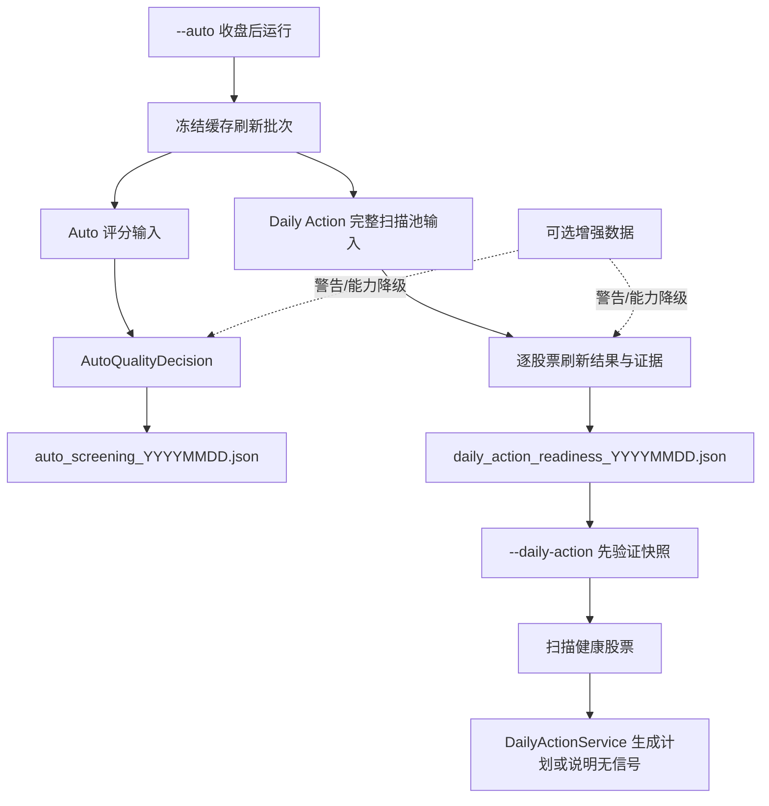

# Auto 评分质量与 Daily Action 就绪度分离设计

日期：2026-07-14

状态：已获方案确认，待书面规格复核

目标读者：选股系统维护者、策略开发者、测试维护者和每日操作者

## 阅读结果

维护者读完本文后，应能明确区分 Auto 评分质量、Daily Action 扫描就绪度和可选增强状态，判断一个缺失应阻断整个批次、单只股票还是仅产生警告，并能按同一套日期、指纹和发布规则实现与验收两个命令。

## 1. 核心判断

`--auto` 当前显示 `degraded`，并不是 300 只评分候选的数据不可用。2026-07-13 的运行中，300 只候选均为 `trade_ready=true`，必需评分证据覆盖完整；真正触发降级的是完整缓存刷新池中的两只停牌股票没有当日价格，以及若干可选增强特征覆盖为零。

随后，`--daily-action` 又要求读取 Auto 的健康清单。Auto 没有发布新 canonical，磁盘上的旧报告也没有当前 schema 的 manifest，于是 Daily Action 返回 `healthy_manifest_missing`。这条链路还存在更深的边界错误：Auto 只评分 300 只股票，Daily Action 实际扫描 652 只股票，拿前者的清单校验后者会稳定阻断 Auto 候选池之外的有效 setup。

本设计不放宽安全门控，而是把混在一起的三个事实拆开：

1. Auto 评分所消费的必需证据是否可验证；
2. Daily Action 完整扫描池中每只股票是否具备 setup 所需数据；
3. 可选增强数据是否可用。

前两项分别发布自己的 canonical manifest；第三项只产生警告和能力降级，不再冒充核心数据失败。

## 2. 目标与非目标

### 2.1 目标

- Auto 只因其实际消费的必需评分证据失真而降级；
- 正常停牌、市场不支持等可解释状态只阻断对应股票，不阻断健康批次；
- Daily Action 使用完整、精确日期的扫描池就绪清单，不再依赖 Auto Top 300；
- 缺失、过期、来源失败和“合法空结果”拥有不同语义；
- 扫描只能消费经过验证的同一份数据快照，避免检查后数据被替换；
- 新开仓数据不足时 fail closed，已有持仓管理和退出仍继续；
- 两个命令向操作者明确报告结论、影响和恢复步骤；
- 保留 attempt artifact，不篡改历史 degraded 产物。

### 2.2 非目标

- 不修改 BTST、OversoldBounce、Kelly、组合上限或动态退出参数；
- 不恢复 OversoldBounce；
- 不把可选特征移入核心评分，也不重新训练预测模型；
- 不接入券商、不解决真实盘口排队成交；
- 不重写整个 Auto pipeline 或缓存格式；
- 不用“忽略所有缺失”或手工改报告的方式制造健康状态。

## 3. 设计不变量

实现必须同时满足以下不变量：

1. **域隔离**：Auto canonical 只证明 Auto；Daily Action readiness canonical 只证明 Daily Action。
2. **证据优先**：健康结论来自实际消费的数据行、日期和指纹，不来自供应商调用是否看似成功。
3. **逐票隔离**：一只股票停牌、历史不足或不受支持，不得污染其他股票。
4. **批次守恒**：价格和资金流的互斥结果数之和必须等于扫描池股票总数。
5. **精确日期**：信号日 manifest 只能证明该信号日及其之前的数据；周末与节假日不得用自然日猜测。
6. **检查即消费**：扫描器消费的字节或规范化 frame 必须与 manifest 验证的是同一快照。
7. **发布原子性**：只有完整验证通过的 canonical 才能一次性替换旧版本；失败运行只写 attempt。
8. **交易安全**：就绪证据缺失只禁止新计划，不得停止已有持仓估值、退出与台账维护。
9. **可解释降级**：可选能力缺失显示警告并关闭对应增强，不得静默，也不得伪装成核心失败。

## 4. 系统边界



`--auto` 仍是收盘后刷新与发布的统一入口，但会产生两个相互独立的结果：Auto 评分报告和 Daily Action 就绪清单。一个域失败不自动推导另一个域失败。

### 4.1 2026-07-13 运行如何流过新边界

这次问题对应的目标流转是：统一日期解析器确定信号日为 2026-07-13；刷新器冻结一次日线批次和停牌证据，再得到 652 只扫描池。价格结果分为 650 只正常和 2 只停牌，资金流结果分为 642 只正常、3 只停牌和 7 只不支持，分类总数各自守恒。

Auto 随后只审查 300 只评分候选实际消费的必需证据。必需组件完整时发布 Auto canonical；四项可选增强为零只显示警告。Daily Action 则独立发布覆盖 652 只的 readiness canonical，把停牌、不支持或证据异常落实到具体 ticker 和 setup capability。

用户再运行 `--daily-action` 时，程序先维护已有持仓，再加载 2026-07-13 readiness，验证并冻结 PIT snapshot，然后只扫描 `scannable=true` 的 setup。残缺命中可以展示，但 `plan_eligible=false`，不会生成 BUY_PLAN。最终若没有完整合格信号，输出“系统健康但无可交易信号”；若 readiness 无法验证，输出“数据护栏阻断新计划”。

## 5. Auto 评分质量

### 5.1 单一特征注册表

建立集中式 `FeaturePolicy` 注册表，删除 `_quality_is_healthy()` 中对所有数据族一视同仁的遍历判断。注册项至少包含 `name`、`consumer_component`、`required`、`eligible_scope`、`freshness_rule`、`empty_semantics`、`completeness_rule` 和 `fallback_behavior`。首版分类如下：

```text
required scoring evidence:
  - price_history
  - financial_metrics
  - event_inputs

optional scoring evidence:
  - industry_pe_medians
  - dragon_tiger_bonus
  - intraday_short_trade_metrics
  - daily_fund_flow_metrics
```

权威质量来源是 `data_quality.scoring_features`。`optional_features` 若为兼容旧报告而保留，只能是显示投影，不能第二次参与门控。新增或删除特征时必须先登记策略，禁止通过默认值暗中改变安全等级。

必需数据族的首版时间规则固定为：

| 数据族 | 观察时点 | 内容时间限制 | 合法空结果 |
|---|---|---|---|
| `price_history` | 最新消费行必须等于 `trade_date` | 所有行 `date <= trade_date` | 不合法 |
| `financial_metrics` | 该日构建的 as-of 快照必须等于 `trade_date` | 财报披露/可得日期不得晚于 `trade_date` | 不合法 |
| `event_inputs` | 查询观察快照必须等于 `trade_date` | 事件发布时间不得晚于 `trade_date` | 权威查询成功且结果为空时，按中性事件可用 |

必需数据若实际回退到旧观察快照则阻断；可选数据回退可以继续，但必须 warning 并关闭或降级对应增强。当次 provider 刷新失败但当前、完整、可验证的消费快照已经存在时，只记 warning。

### 5.2 结构化质量结论

用结构化结论替代单个布尔值：

```text
QualityDecision
  healthy: bool
  blockers: tuple[QualityIssue, ...]
  warnings: tuple[QualityIssue, ...]
```

`_quality_is_healthy()` 可暂时保留为兼容包装，但只能返回 `QualityDecision.healthy`。发布器和控制台必须使用完整结论，不能再次自行推导。

必需证据出现以下任一情况时阻断 Auto canonical：

- 数据族缺失或 schema 无法验证；
- 实际消费的快照不存在、指纹不匹配或含未来数据；
- 已观测股票数、可用股票数或所需行数不足；
- 允许 stale fallback 后实际消费了过期数据；
- 计数不守恒，无法证明哪些候选被完整评分。

以下情况只产生警告：

- 可选数据缺失、过期或供应商失败；
- 可选增强被关闭并使用明确的中性值；
- 必需数据已经由本地可验证快照完整满足，但当次网络刷新失败。

### 5.3 真实证据语义

每个数据族至少记录：

```text
attempted_count
requested_count
eligible_count
observed_count
usable_count
nonempty_count
stale_count
refresh_failed_count
consumption_failed_count
usable_rows_min
full_factor_target_rows
partial_capabilities
as_of_max
requested_tickers_fingerprint
observed_tickers_fingerprint
usable_tickers_fingerprint
input_fingerprint
observation_status: success | partial | failed | unavailable
```

其中：

- `observed` 表示权威 producer 已成功获得对该股票、该日期的确定回答；超时、异常、非穷尽查询或 schema 错误不能标为 observed；
- `usable` 表示回答满足该消费方的字段和时间要求；
- `nonempty` 只描述内容是否有记录，不能替代 `observed`；
- 合法的“当日无龙虎榜/无事件”应为 `observed=true, nonempty=false`；
- `stale` 必须反映实际 fallback，不能硬编码为 `false`；
- `coverage` 可用于显示，但门控使用整数计数和守恒关系，避免浮点舍入与分母歧义。

门控按数据族契约解释这些字段，不能用一条通用的 `nonempty > 0` 规则：价格历史以满足字段、时间点和消费组件所需行数为 usable；财务指标缺失时不可用；事件输入在 `observation_status=success` 且结果合法为空时可用，并按中性事件处理；龙虎榜完整日榜成功获取但没有目标 ticker 时同样是可用的空观察。三个 ticker 集合指纹用来证明计数对应的是正确股票集合，而不是数量相同的另一批股票。

`refresh_failed_count` 只描述当次 provider 刷新尝试，已有当前且完整的本地消费快照时只产生 warning；`consumption_failed_count` 才描述无法形成可验证消费证据的 ticker。`observation_status` 的守恒语义固定为：`success` 表示 `observed_count == requested_count` 且 `consumption_failed_count == 0`；`partial` 表示来源可用但只有部分 requested ticker 得到权威回答；`failed` 表示已经尝试但没有得到任何可验证回答；`unavailable` 表示来源、schema 或调用能力整体不可用，无法形成权威尝试。必需数据族的 `partial/failed/unavailable` 均阻断，optional 数据族则 warning 并关闭相应增强。

价格历史中的“最低可执行行数”和“完整因子目标行数”必须分开命名。健康判断落到实际评分组件：每个被评分 ticker 的每个 required score component 都必须拥有存在、有限且 PIT 合法的输入与输出；历史不足时只能关闭注册表中明确标为 optional 的组件。系统不能把“有一行非空”报告为完整，也不能未经组件依赖审计就把 200 行设成全局硬门槛。

## 6. 缓存刷新结果模型

### 6.1 一次运行只冻结一次外部证据

一次 `--auto` 运行只能获取并复用一份日线批次和一份停牌证据：

```text
SuspensionEvidence
  trade_date
  status: available | unavailable
  tickers
  source_fingerprint
```

接口返回空列表表示“权威来源确认今日无停牌”；异常、超时或 schema 错误必须返回 `unavailable`，禁止用空集合表示未知。

如果目标日期 OHLC 已存在，该股票已被数据证明当日交易，不依赖停牌接口。若 OHLC 缺失且停牌证据不可用，则结果是 `missing_unexplained`，不能猜成停牌。

### 6.2 每只股票一个互斥结果

```text
TickerRefreshOutcome
  ticker
  price_status:
    current | suspended | missing_unexplained |
    failed | not_attempted
  price_history_rows
  fund_flow_status:
    current | suspended | unsupported |
    missing_unexplained | failed | not_attempted
  fund_flow_history_rows
  evidence_fingerprints
  block_reasons
  warnings
```

所有汇总计数由逐票结果派生，不再边循环边修改多个可能重叠的计数器。必须满足：

```text
sum(price_status categories) == universe_total
sum(fund_flow_status categories) == universe_total
```

`suspended` 和 `unsupported` 是可解释状态。`current` 只证明目标日记录存在，历史是否够用由独立行数描述；不能用一个固定的“历史不足”状态替所有 setup 做决定。`missing_unexplained`、`failed` 和 `not_attempted` 会关闭相关数据能力，但是否阻断股票、跳过某个条件或标为 degraded，必须遵循对应 setup 的版本化数据契约。

首版契约保持现有策略语义，不借工程修复暗改 setup：BTST 要求目标日价格和目标日资金流；资金流历史不足与行业数据缺失仍按现有逻辑标为 degraded，价格回看不足则 miss。OversoldBounce 继续默认禁用。未来若要收紧降级策略，必须作为独立的策略变更重新回测和审批。

只有以下批次级问题阻断整个 Daily Action readiness canonical：

- 日线批次日期、schema 或内容整体无效；
- 扫描池身份无法确定；
- 逐票结果不守恒或存在重复 ticker；
- 写 manifest 前缓存快照发生变化；
- 关键来源整体不可用，且无法通过本地证据隔离到具体股票。

`max_tickers` 或其他限额导致未检查的股票必须显式记为 `not_attempted`，不能从分母中消失。即使当前价格批次不设限额，价格状态仍保留 `not_attempted` 以维持统一、封闭的结果模型。

### 6.3 扫描池身份

扫描池按唯一顺序冻结：先获取并冻结一份日线批次和一份停牌证据；再从该日线批次识别涨停注入股票；然后合并已有合法 `price_cache` 股票、调用方明确目标和涨停注入股票；完成代码规范化、去重、排序并生成 `universe_fingerprint` 后，才开始逐票缓存写入和 readiness 构建。从最终 universe 冻结起，刷新、逐票结果、manifest 和后续扫描都使用这个不可变集合；运行中新增或删除缓存文件不能改变本批次范围。

## 7. Daily Action 独立就绪清单

### 7.1 文件与模型

新增 canonical：

```text
data/reports/daily_action_readiness_YYYYMMDD.json
```

最小模型：

```text
DailyActionReadinessManifest
  schema_version: 1
  domain: daily_action
  run_id
  trade_date
  created_at
  status: healthy
  universe_kind: resolved_refresh_universe
  universe_tickers
  universe_fingerprint
  input_fingerprint
  ticker_readiness
  warnings
```

这里的 `healthy` 只表示 manifest 身份、批次证据和结构完整，不表示 652 只股票全部可交易；即使全部股票都没有可交易 setup，非空且结构完整的 manifest 仍可 healthy，但操作员必须看到 `scannable` 和 `plan_eligible` 数量。每只股票按 setup 记录能力；跨 setup 聚合值只能用于显示，不能用于交易准入：

```text
ticker_readiness[ticker]
  evidence_status
  capabilities[setup_name]
    enabled
    scannable
    plan_eligible
    degraded
    block_reasons
    warnings
    consumed_fingerprint
```

### 7.2 Setup 数据契约

setup 依赖由版本化 `SetupDataContract` 注册，readiness、scanner 和 service 共用，不得分别硬编码。

BTST 首版保持当前行为：

- 目标日价格存在，且至少含目标日前 5 个交易日，才具备价格能力；
- 目标日资金流缺失或数据源不支持时不具备 BTST 能力；
- 资金流历史 0—4 日时跳过均值条件并标 degraded，5—19 日使用短窗口并标 degraded，20 日及以上完整执行；
- 目标日行业涨幅缺失时跳过行业条件并标 degraded；
- 已确认停牌时禁止新 BTST 信号；
- 这些降级语义只是在本次工程修复中保持兼容，不代表策略质量已被重新验证。

`scannable` 表示 setup 可以运行并生成诊断结果，`plan_eligible` 才是新交易授权。资金流历史不足 20 日或行业证据缺失时可以 `scannable=true`，但 setup 结果为 degraded 后必须 `plan_eligible=false`；`DailyActionService` 只接受 `plan_eligible=true`。本次修复不得把原本只展示的残缺命中升级成 BUY_PLAN。

OversoldBounce 默认 `enabled=false`，manifest 记录禁用状态而不授权交易。只有通过现有环境开关显式启用时，才按它自己的版本化契约计算 readiness；本设计不恢复或修改该 setup。

Auto report 继续保留 Auto 候选池 manifest，用于复验 Auto Top 300 的评分来源。Daily Action 不允许回退读取它，也不允许在运行时根据当前缓存“自签名”一份临时健康清单。

### 7.3 发布协议

两个 canonical 分别采用同目录临时文件、flush、fsync 和 `os.replace()` 原子发布。运行摘要记录两个域各自的状态：

```text
auto: healthy | degraded | fatal
daily_action_readiness: healthy | degraded | fatal
```

运行摘要只用于诊断，不是第三个准入门控。任一域发布失败时保留该域上一个 canonical，并保存 `daily_action_readiness_attempt_YYYYMMDD_RUNID.json` 或对应 Auto attempt。读取方只接受目标交易日完全匹配的本域 canonical，不把前一交易日文件当作当前日证据，也不要求两个域同时健康。

2026-07-13 的既有 degraded attempt 保持不变；修复上线后通过重新运行 `--auto` 生成新 run 和新 canonical。

## 8. Daily Action 数据流

### 8.1 统一信号日

两个命令共用唯一的 `resolve_signal_session(now_cn, calendar, cutoff_policy)`。首版 cutoff policy 使用 Asia/Shanghai 17:00，并带版本号：开市日 17:00 前返回上一开市日，17:00 及之后返回当前开市日，周末或节假日返回最近开市日。`--end-date` 只能覆盖为权威日历中存在的开市日。Auto 和 Daily Action 不得分别从未验证的 price cache 猜测日期。

信号日与计划入场日是两个概念：manifest 绑定信号日；入场日由 `next_session(signal_date)` 得到。

### 8.2 强制控制流

Daily Action 固定按以下顺序运行：

1. 打开 ledger 并读取已有持仓；
2. 解析信号日和可用市场证据；解析失败也不得丢弃已有持仓视图；
3. 能安全确定日期和价格时推进生命周期，否则生成明确的 deferred 结果；
4. 加载该信号日的 Daily Action readiness canonical；
5. readiness 健康时才进入新候选扫描，否则只禁止新入场；
6. 汇总持仓管理和新入场结果后统一渲染。

缺少新入场 readiness 时，生命周期状态机仍必须运行。有精确市场数据时正常估值和退出；缺少执行价格或交易日历时显式 deferred/fail closed，绝不伪造成交，也不得因为 loader 失败而提前 return。

新候选扫描把当前“先扫描、后加载 manifest”的顺序改为：

1. 加载该日 Daily Action readiness canonical；
2. 使用 no-follow、普通文件和大小上限规则读取，验证 schema、日期、宇宙和指纹；
3. loader 对同一次读取的字节做 PIT 截断和规范化，返回只读的 `VerifiedDailyActionSnapshot`；
4. scanner 只消费该 snapshot，先排除逐票阻断项，再对健康股票执行 setup 扫描与排名；
5. candidate 携带 `snapshot_id` 和 `setup_consumed_fingerprint`；
6. `DailyActionService` 复验候选与同一 snapshot 的对应关系后生成计划。

缓存读取必须严格 point-in-time：只允许 `date <= signal_date`。即使 CSV 后续追加未来行，历史重跑也只截取当时可见数据；若历史区间被篡改，指纹验证失败并阻断新计划。

`VerifiedDailyActionSnapshot` 至少包含 manifest 身份、冻结的股票集合、价格、资金流、行业映射与行业当日涨跌、ST/上市状态、regime 证据、setup 契约和涨跌停规则版本，以及这些规范化输入的消费指纹。验证完成后 scanner 和 service 都不得重新打开缓存或走隐式 fallback。当前约 652 只、每只约百行的数据量允许使用进程内只读 frame；本阶段不引入复制目录或新缓存数据库。

指纹使用带版本号的 PIT 投影，而不是整个 CSV 原始字节：一次 no-follow 读取后，截取 `date <= signal_date`，选择契约列，日期规范为 `YYYY-MM-DD`，ticker 规范为六位代码，数值转为确定性十进制字符串，缺失可选值使用 `null`，required 字段的 NaN/Inf 拒绝，最后按 ticker/date 排序并用稳定 JSON 序列化后计算 SHA-256。未来行追加不会改变历史投影指纹，历史行修改必然改变指纹。

运行时单票价格或资金流指纹不匹配只阻断该票；行业共享证据不匹配阻断引用该行业的股票；manifest 身份、宇宙、公共交易日或规范化策略损坏时阻断全部新计划。

不能先让坏候选参与 Top N 排名再过滤，否则高排名坏候选会挤掉本可交易的低排名候选。

### 8.3 共享证据与策略版本

manifest 明确绑定：

```text
policy_versions:
  readiness_policy
  normalization
  board_rule
  setup_requirements
  signal_session_cutoff

shared_evidence:
  regime_row + fingerprint
  industry_mapping + fingerprint
  security_status_snapshot + fingerprint

per_ticker_evidence:
  price PIT fingerprint
  fund-flow PIT fingerprint
  bound industry evidence fingerprint
```

regime 若缺少 repository-owned authorization evidence，仍按现有安全策略把单票上限降为 10%，不得仅凭标签恢复 12% 放大；本设计不改变该授权政策。

### 8.4 周五信号

周五收盘生成的 manifest 的 `trade_date` 仍是周五。计划入场日由权威交易日历计算为下一开市日，通常是周一；周六、周日不生成伪交易日，也不要求周末 manifest。

### 8.5 缺少 readiness 时

- 禁止生成新的 BUY_PLAN；
- 输出明确的中文阻断原因与恢复步骤；
- 继续处理已经存在的持仓、模拟或确认成交、退出与估值；
- 不把“数据被阻断”显示为“今日正常无信号”。

## 9. 操作员输出

沿用已确认的《Daily Action 操作员摘要设计》，并扩展 `--auto` 的结果展示。

`--auto` 结束时分别显示：

```text
Auto 评分：✅ 已发布 20260713 健康报告（300 只候选）
Daily Action 就绪度：✅ 已发布 20260713 就绪清单（652 只）
  价格：正常 650 · 停牌 2 · 异常 0
  资金流：正常 642 · 停牌 3 · 不支持 7 · 异常 0
可选增强：⚠ 4 项不可用，已使用安全降级
```

数字必须由本次 artifact 动态派生，示例不作为硬编码预期。如某一域失败，应紧邻显示具体 blocker、影响和下一步，不能只在滚动日志中埋一条 `display-only` warning。manifest 结构健康但某 setup 的 `scannable=0` 时，显示“数据清单健康，但无可扫描股票”；`scannable>0` 而 `plan_eligible=0` 时，显示“存在仅供诊断的残缺 setup，无可交易候选”。两者都不得混同为“扫描正常但无选股信号”。

`--daily-action` 的默认输出显示中文结论、原因、影响和建议；空栏目显示 `无`。`--verbose` 才显示原始代码、逐票证据和指纹。机器 JSON、SQLite 账本和 setup 交易语义保持不变。

## 10. 兼容与迁移

- 保留现有 Auto manifest schema 的读取支持，只供 Auto 报告审计，不供 Daily Action 新计划；
- Daily Action readiness 不存在时 fail closed，不把旧 Auto manifest 自动升级为新域；
- 旧测试和下游若调用 `_quality_is_healthy()`，通过兼容包装逐步迁移；
- 现有扁平 `CacheRefreshStats` 可作为派生显示结构暂留，但其字段不得继续充当权威门控；
- 不改历史 paper-trading journal、backtest 数据或 canonical artifact；
- 新 schema 带版本号，未知版本拒绝读取。

## 11. 安全边界

- manifest 读取拒绝 symlink、FIFO、目录和超限文件；
- 所有 ticker 规范化为唯一六位代码，拒绝重复项和路径注入；
- 指纹覆盖排序后的宇宙、信号日、实际消费行和关键配置版本；
- 外部 API 异常不得伪装成权威空集合；
- 不通过浮点 coverage、日志字符串或文件 mtime 单独证明健康；
- 写入失败、计数不守恒、日期不匹配和快照变化均 fail closed；
- 失败重跑必须幂等，不能重复创建计划或账本事件。

## 12. 验证矩阵

### 12.1 Auto 质量

1. 必需证据完整、可选特征全缺：Auto healthy，并列出可选警告；
2. 必需证据缺失、过期、未来穿越或指纹不匹配：Auto degraded；
3. 网络刷新失败但本地消费快照完整且当前：Auto healthy + warning；
4. 合法空事件与来源未观测产生不同结论；
5. stale fallback 被真实记录，不能硬编码为 fresh；
6. 行数达到执行下限但未达完整因子目标时，只关闭注册为 optional 的相应能力；
7. 计数相同但 ticker 集合指纹不同必须失败；
8. 兼容字段 `optional_features` 缺失或冲突只告警，不改变权威 gate。

### 12.2 缓存与停牌

1. 复现 2026-07-13：652 只中价格正常 650、停牌 2、异常 0，Daily readiness healthy；
2. 资金流正常 642、停牌 3、北交所不支持 7、异常 0；
3. 停牌接口权威空、接口 unavailable、已知停牌分别可区分；
4. 所有价格与资金流状态满足总数守恒；
5. 未尝试、历史行数不足、无法解释缺失和请求失败保留 ticker 身份；历史行数按 setup 契约解释；
6. 北交所资金流不支持、浅资金流和停牌分别产生正确的 BTST capability。

### 12.3 宇宙与扫描

1. Auto 300 与 Daily Action 652 可以同时健康；
2. 构造 Auto 300 之外的合格 BTST 股票，Daily Action 能生成计划；
3. 单票阻断只排除该票，不阻断同批健康候选；
4. 全局批次无效时禁止所有新计划；
5. 过滤在排名前完成，坏候选不能占用 Top N 名额；
6. 全部股票无交易资格时 manifest 仍可结构健康，但分别输出 `scannable` 与 `plan_eligible` 数量；
7. Auto optional degraded、Daily readiness healthy 通过真实发布路径验证，不只测试 helper。

### 12.4 时间点与发布

1. CSV 追加未来行不影响历史日扫描；
2. 已证明历史行被修改时指纹失败；
3. manifest 验证后缓存替换触发 TOCTOU 防护；
4. canonical 原子发布失败时保留旧文件并写 attempt；
5. symlink、FIFO、超限文件、重复 ticker 和未知 schema 被拒绝；
6. 周五信号的计划入场日是下一开市日；
7. 同一信号日重复运行不会重复写计划或账本事件；
8. 单域发布成功、另一域失败或运行摘要中断时，已发布域仍可独立读取；
9. 开市日前后 cutoff、周末和 `--end-date` 使用同一信号日解析规则。

### 12.5 操作员体验

1. 区分“健康无信号”“有计划”“数据阻断”；
2. Auto 分别显示两个发布域，不用一条模糊 degraded 概括；
3. 非 verbose 输出不泄漏重复内部码，verbose 保留完整审计信息；
4. readiness 缺失时已有持仓管理仍出现在输出中。

## 13. 完成标准

只有同时满足以下条件，才可宣称问题已修复：

- 2026-07-13 场景不再因两只正常停牌股票或可选特征缺失而阻止健康域发布；
- Auto 与 Daily Action 各自拥有独立、精确日期、可复验的 canonical；
- Daily Action 能覆盖完整扫描池，并允许 Auto 300 之外的健康候选进入 setup；
- 任一无法解释的数据缺口仍能精确阻断对应股票或整个无效批次；
- 全部新增回归、现有 offensive、Auto 缓存刷新和核心测试通过；
- 实际运行两个命令时，操作者能直接读懂结果和下一步；
- 不修改策略参数，不声称本次工程修复本身提高历史胜率或收益。

## 14. 实施顺序

实施计划应按依赖关系拆为五段：

1. 建立质量结论与真实证据语义；
2. 重构逐票缓存结果和停牌三态；
3. 发布独立 Daily Action readiness canonical；
4. 改为先验证快照再扫描，并保持持仓管理独立；
5. 完成中文操作员摘要、全量回归和真实命令验证。

每段先写失败测试，再做最小实现；每段完成后分别进行规格一致性审查和代码质量审查。前一段未通过，不进入后一段。
