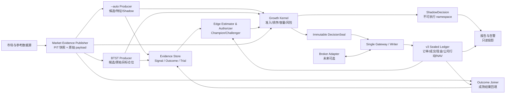

# Evidence-Gated Growth Kernel：`--auto` / `--daily-action` 长期架构设计

> - 状态：**已批准（Accepted），尚未实现（Target Architecture）**
> - 批准日期：2026-07-19
> - 适用范围：A 股次日开盘入场、固定 T+10 开盘退出的研究、模拟与未来实盘链路
> - 权威性：本文件是该架构的唯一完整规范；与旧设计冲突时，本文件优先
> - 实现状态的事实来源：代码、版本化策略快照、迁移记录和可重验台账，而不是本文的“目标态”描述

## 1. 阅读目标

读完本文，开发者或审阅 Agent 应能回答以下问题：

1. 为什么 `--auto` 与 `--daily-action` 必须保留为两个独立信号生产者，而不能把分数直接相加。
2. 什么证据只能说明“数据可用”，什么证据才可能说明“策略有 edge”，什么记录才是资金真相。
3. T0、T+1、T+10、停牌、涨跌停、最低佣金、公司行动和外部资金流应怎样进入同一可审计经济口径。
4. 研究重建、日线代理、人工确认与 broker 确认为什么必须分池。
5. 为什么胜率、平均单票收益或 IC 不能直接授权仓位，以及如何用完整组合路径检验长期增长。
6. 新策略如何从 shadow 进入 2% canary，何时必须 no-trade，回撤达到 15% 后怎样安全恢复。
7. 当前手工/paper 工作流与未来 broker-live 之间还缺哪些不可省略的权限和状态机组件。

## 2. 核心判断

系统的第一性原理目标不是“每天选出看起来最强的十只股票”，也不是最大化一次回测的胜率，而是：

> 在只使用决策时已知信息、真实可执行、扣除全部成本、保留现金与状态约束的前提下，最大化组合单位净值的长期对数增长，同时让未知事实默认减少风险而不是制造虚假成交。

因此目标架构采用：

> **两个独立信号生产者 + 一层薄决策内核 + 一个封存台账/执行网关**

- `--auto` 与 BTST 各自产生候选和证据，永不直接互相改分。
- readiness 只决定数据是否可消费，不决定策略是否赚钱。
- edge gate 只决定某个固定行为版本有没有资格申请资金。
- 决策内核是风险、容量、排序和仓位约束唯一执行点。
- sealed ledger/gateway 是计划、订单、成交、现金和公司行动的唯一权威写入点。
- 未知、冲突、过期或不可重验时允许“不交易”；退出和对账永远优先于新仓。

## 3. 全局架构图



图中箭头是单向权威边界。报告、缓存、Agent 和生产者都不能反向改写台账；fingerprint 能证明内容一致，不能授予发行权限。

## 4. 范围与非目标

### 4.1 本设计覆盖

- 两个日常命令之间的数据和证据衔接。
- BTST、OversoldBounce 与 `--auto` 的初始授权状态。
- T+1 开盘入场、T+10 开盘退出的固定经济合约。
- 研究重建、日线代理、人工确认、经纪商确认四种执行模式。
- 组合增长、回撤、tail risk、容量和模型晋级方法。
- PIT、证据世代、sealed ledger、公司行动、幂等与故障恢复。
- 从 v2 到 v3 的无双写迁移。
- 未来 broker-live 所需但当前不存在的安全边界。

### 4.2 本设计不承诺

- 不承诺未来十天必然盈利，也不承诺 15% 是最大亏损。
- 不把历史修正后的 BTST 表现视作可直接授权的执行匹配证据。
- 不在本文指定具体类名、表结构或文件布局；这些属于后续实现计划。
- 不在文档落地阶段创建会被运行时误读的“机器可读生产策略”。该产物必须在实现阶段与代码、schema 和契约测试一起交付。
- 不把当前手工/paper 工作流描述成真实 broker-live。

## 5. 不可违反的系统不变量

以下规则优先于便利性、吞吐量和“多抓几个机会”的诉求：

1. **候选不等于授权**：producer 只能提交候选，不能创建权威仓位、成交或现金流。
2. **数据健康不等于盈利**：readiness 通过不能绕过 edge gate。
3. **一个风险只缩放一次**：producer 输出 raw target；全部组合风险缩放只在 Growth Kernel 发生。
4. **未知不造假**：无法证明成交就保持 `UNKNOWN`/pending/cash，不得用事后价格补成交。
5. **退出不被 kill switch 阻断**：任何新仓熔断、数据退化或策略停用都不能阻止真实退出、公司行动和对账。
6. **经济事实只记一次**：一个成交、费用、分红或公司行动只对应一个 canonical event；确认信息只更正/核对，不重复入账。
7. **历史不删除**：更正通过补偿事件和 revision 完成，不能删除旧成交或重写已发布的资金历史。
8. **行为变化不借旧证据**：任何会改变候选、顺序、数量、成本或成交语义的变更，都开启新的行为指纹与前向证据世代。
9. **单一权威写入者**：同一 portfolio/authority epoch 只能有一个 writer；v2 与 v3 不双写。
10. **现金与头寸守恒**：头寸只能因真实成交或法律生效的公司行动改变；估值与报告绝不改变持仓。
11. **时间只向前**：生产生命周期和 session watermark 单调；早于 watermark 的 `as_of` 请求必须零写失败。
12. **可执行性先于统计显著**：即使统计看起来有 edge，只要执行、容量或事实完整性不满足，也不能授权。

## 6. 三层事实与六类证据契约

### 6.1 三层事实

| 层 | 回答的问题 | 能否直接授权新仓 |
|---|---|---|
| Market Evidence / PIT Snapshot | 决策时可用的数据是否完整、来源是否明确、时间是否合规 | 否 |
| Edge Evidence / Outcome / Estimator | 某个固定行为版本在固定执行口径下是否存在保守正 edge | 只能向内核提供资格，不能直接下单 |
| Capital Truth / Sealed Ledger | 实际计划、成交、费用、公司行动、现金、持仓和 NAV 是什么 | 只有通过决策内核与 gateway 才能改变 |

readiness 属于第一层。它通过时只表示“数据可以被策略消费”，不能推出策略盈利、仓位应增加或计划已经成交。

### 6.2 六类证据契约

1. `SnapshotEvidence`：市场、证券、行业、日历、停复牌、价格限制和数据源状态。
2. `SignalEvidence`：全候选漏斗及每一阶段状态，不只保存最终入选者。
3. `OutcomeEvidence`：固定执行模式下成熟的前向结果、缺失原因和完成时间。
4. `EdgeAuthorization`：独立 Authorizer 对固定经济假设和行为版本签发的限时、限档资格。
5. `ExplorationAuthorization`：治理层为首次 broker 2% 证据采集签发的限时、限风险探索权限；它不声明 edge。
6. `PlanEvidence` / `DecisionSeal`：Growth Kernel 对当时策略、风险、容量、数量、价格边界和有效资本授权的不可变封存。

基础信封至少包含：

```text
evidence_id
subject_scope              # GLOBAL or STRATEGY_LINEAGE
subject_producer
family_id                  # typed NONE only when subject_scope=GLOBAL
strategy_semver
behavior_fingerprint
policy_epoch
execution_version
cost_version
effective_at
observed_at
available_at
mode
source_authority
payload_content_hash
schema_major
```

`SignalEvidence` 另有 typed `stage = candidate | data_eligible | selected`。`SnapshotEvidence`、`SignalEvidence`、`OutcomeEvidence` 的 schema **禁止**出现 `execution_authorized`；producer 自报的授权字段没有任何效力。

`EdgeAuthorization` 只能由独立 Authorizer capability 签发，且额外绑定：

```text
economic_lineage_id
research_program_id
baseline_portfolio_policy_fingerprint
target_portfolio_policy_fingerprint
evidence_as_of
evidence_set_merkle_root
issued_at
expires_at
max_capital_tier
issuer_id
issuer_capability
trial_id
trial_manifest_hash
statistical_analysis_plan_hash
assessment_result_hash
attempt_ledger_checkpoint_hash
alpha_sample_consumption_id
authorization_payload_hash
```

`EdgeAuthorization` 总是授权从 baseline 到 target 的**完整组合政策**，即使试验只改变一个 lineage；多个各 5% 的 lineage 不能在未评估组合交互时叠加。签发时须在同一事务消费唯一 `alpha_sample_consumption_id`，把 Attempt Ledger checkpoint、统计计划、评估结果、全局 alpha/e-value 预算和样本集合封存；同一评估不能重复签发。

`ExplorationAuthorization` 只能由独立治理 capability 签发，强制 `mode=BROKER_CONFIRMED`、单次 `max_capital_tier=2%`，并绑定期限、组合总风险预算、压力场景损失预算和收集证据的 trial。所有并发 exploration 共享 portfolio/research-program 级 gross 与 stress-loss cap，不得每个 lineage 各开 2%。它是 one-shot、不可续期：到固定 assessment/expiry 后自动停止新仓并按原定退出规则 drain；未决风险未归零/完成法律终局前不得重发。其成交只进入预注册 exploration trial，在评估通过前不能混入既有 champion 授权池。后续再试必须是新 trial，重新消耗全局 multiplicity/exploration budget，不能写成“首次探索”续命；它不能被改写成 edge，也不能授权 5%。

`DecisionSeal` 必须引用并由 gateway 重验一个未过期、版本/模式/lineage 完全相符的 `CapitalAuthorization`（`EdgeAuthorization` 或受限的 `ExplorationAuthorization`）。信封里的 `issuer_capability` 只是审计声明，不是权限证明；gateway 必须用只读 trusted registry 校验 `issuer_id + key_id/service principal + signature/MAC/mTLS identity + capability scope/version`。producer/CLI 不得持有 Authorizer 或 governance 的凭据。hash 只能证明内容一致，不能替代发行权限。未知 schema major、缺失必填字段、空指纹、过期授权或来源越权均 fail closed。

`EdgeAuthorization` 绑定完整 evidence-set Merkle root 和各依赖 revision。任一成员发生 fee/company-action/fill bust、correction 或 revision，dependency tracker 必须在同一事务中标记 `EDGE_REVALIDATION_REQUIRED`、递增 `capital_authorization_version` 并吊销全部未消费 entry permit；gateway 立即停止该授权的未来新风险但继续退出。每个 entry permit 绑定 `capital_authorization_id + authorization_version + evidence_set_merkle_root`。Authorizer 只能按原冻结 TrialManifest/SAP 重算并签 correction/replacement；不得改写当时决策，也不得在重算时更换门槛。旧授权永久保留作审计，但不能继续生成或提交 entry permit。

## 7. 固定经济合约

### 7.1 交易日定义

- T0：产生信号的官方交易所 session，收盘后形成决策。
- T+1：T0 后第一个官方交易所 session，目标在开盘成交。
- T+10：`session_index(T0) + 10` 的官方交易所 session，目标在开盘退出。
- 入场日是持有第 1 个 session；T+10 不是“入场后再等十个自然日”。
- 个股停牌仍计入交易所 session；交易所全市场取消的 session 不计入。
- T+10 无法执行时进入 `EXIT_PENDING`，在后续第一个实际可执行开盘成交，或由法律上生效的公司行动终结。

### 7.2 决策与开盘拍卖

`DecisionSeal` 只可依赖 T0 及以前可用的证据。交易所 cutoff 之前还要给 permit、outbox、网络与 broker 接收留出版本化安全余量，必须满足：

```text
T0_close_finalized_at
  < DecisionSeal.created_at <= DecisionSeal.deadline
  < ExecutionPermit.deadline
  < gateway_send_deadline
  < broker_auction_submission_cutoff
```

是否赶上开盘以 broker 接收时间为准，不能用本地 seal/outbox 时间代替。T0 收盘未最终确认、T0 数据迟到或错过任一内部 deadline 都不得创建/继续可执行 seal。有效 seal 封存：

- 固定整数股数量和整手规则版本；
- 订单类型、限价/保护价和有效期；
- 官方次日价格边界与最坏成交假设；
- 最坏费用与现金预留；
- 组合、策略、snapshot、risk epoch 和 authority epoch；
- 幂等 key 和完整 payload hash。

T+1 的 `ExecutionPermit` 可依据最新但仍在提交前可用的风险/数据证据**缩减或取消**，不能增加封存数量。已经进入拍卖的订单，不能观察开盘价后再声称“当时本应拒绝”；这会造成前视。

多只股票的订单不是原子篮子：每只可部分成交、拒绝或未成交。剩余现金不得在同日看到结果后追价或重分配。入场窗口错过后计划到期；T+2 买入属于另一策略和新证据世代。

订单数量还必须受 PIT 可见的 ADV participation cap 约束。ADV lookback、最大参与率和缺失处理属于版本化 PolicySnapshot；ADV 不可用时不创建新订单。现金、风险或容量三个上限中取最小值，不能用未来实际成交额证明 T0 的订单“本来有容量”。

### 7.3 T+10 退出

- 入场时只固化 `exit_session_ordinal` 和退出策略，不提前固化假定全部入场成功的退出数量。
- T+10 cutoff 前，gateway 依据权威台账的 `tradable_quantity - live_exit_leaves` 生成退出 OrderIntent；部分入场、送转待上市、此前部分退出与 live order 都必须计入。
- broker-live 模式下，T+10 订单也必须在开盘拍卖截止前准备，不能收盘后回填开盘成交。
- 涨跌停封单、停牌、撤单未确认或经纪商状态模糊时，保留头寸和 `EXIT_PENDING`；不得用 stale close 强制消失。
- risk halt 永不取消退出意图。

### 7.4 精确净收益

对只有一次净买入、一次净卖出且没有中间公司行动的简单 round-trip，诊断净收益可写为：

```text
R_net = CF_sell_net / abs(CF_buy_net) - 1
```

一般 economic lot 可能包含部分成交、多个退出、分红、换股或退市清算，必须按 `economic_lot_id` / `position_lineage_id` 汇总该 lot 的全部净现金流和终局资产处置，不得把上述简式套在复杂路径上。每个成交、费用或公司行动仍各有唯一 `economic_event_id`；跨多个 lot 的公司行动保存显式 allocation。FIFO、平均成本或其他归因方法必须版本化，且只影响诊断，不影响组合 NAV。单票/lot 收益始终只是诊断；权威目标使用组合单位 NAV 日路径。

现金流必须使用：

- 实际成交数量与每笔成交价；
- 生效日对应的 100 股整手或其他交易规则；
- 买卖双向佣金及每单最低佣金；
- 滑点、卖出印花税、过户费和其他适用费用；
- 分红、送转、拆并股、换股、退市清算等公司行动。

不得用“价格收益减固定 60bps”代替权威现金流。金额在权威台账使用整数分或 `Decimal`；SQLite `REAL` 不得作为资金真相。

## 8. 四种执行模式

| 模式 | 用途 | 成交含义 | 可否称为真实 OOS/实盘 |
|---|---|---|---|
| `RESEARCH_RECONSTRUCTION` | 历史数据修复、机制研究、先验 | 事后可获得数据重建的假设成交 | 否；永不授权 |
| `DAILY_BAR_PROXY` | 标准化 paper/shadow 策略比较 | 严格代理规则下的模拟成交 | 可作前向代理证据，不可称实际 fill |
| `MANUAL_CONFIRMED` | 人工录入并附来源的真实执行 | 操作者确认的成交、费用与更正 | 可作独立真实 OOS；不能称 broker-live |
| `BROKER_CONFIRMED` | gateway 接收的经纪商生命周期事件 | broker execution、费用与 revision | 只有权限和对账链完整时才可称 broker-live |

四种模式的 return、win rate、NAV、样本数、报告标题和存储 namespace 必须永久分开。

人工确认必须记录操作者、来源、观察时间和附件/对账状态，只能写 `MANUAL_CONFIRMED` namespace。它与 broker 对账成功后可以建立关联，但不能复制、搬运或再次入账同一经济事件；manual issuer 写 broker ledger 必须零写拒绝。

日线 OHLC 不能证明集合竞价队列位置。若开盘处在有利方向的一字涨跌停，日线数据不能证明订单成交，应记 `UNKNOWN`/no proxy fill；代理组合保留现金。运行命令晚了也不能回填成当日 broker fill：模拟必须逐 session 重放，真实执行则记 `MISSED` 或 `AMBIGUOUS`。

## 9. 信号生产者与初始权限

### 9.1 BTST

- 是目标态初期唯一允许申请交易授权的 producer。
- 当前历史修正结果只证明“值得重建精确证据”，不证明已满足 T+1 open、T+10 open、真实成本和完整组合路径的授权标准。
- 在执行匹配证据不足时，BTST 只能 shadow/no-trade；通过后从 2% canary 开始。
- `trigger_strength`、streak、regime 和 composite 只记录为 feature，初期不得改变准入、排序或仓位。
- 现有 `+0.04` streak 加成和 regime 加仓在目标态关闭。

一个 feature 若要同时承担 admission、ranking、sizing 中两个或更多角色，必须把每个增量作用分别预注册并在组合分歧日验证；不得用同一批相关样本重复证明后让一次噪声被放大多次。

### 9.2 OversoldBounce

- 默认且目标态初期保持 disabled。
- 恢复必须注册为独立 challenger，使用新行为指纹和创建后的前向证据。
- 旧 Phase 0 或被除权幻影污染的收益不得用于授权。

### 9.3 `--auto`

- 保持独立 producer，不与 BTST 合并 composite 或“投票”。
- `--auto` **CLI 只是编排器**：它可以依次调用 Market Publisher、Outcome Finalizer 和 Auto Producer，但三者使用独立 namespace、issuer capability 与写 ACL。
- CLI/Auto Producer 进程不得持有 Publisher、Finalizer 或 Authorizer 的写凭据，只能经窄 IPC/API 发起调度；各组件使用独立 OS/service principal，存储层强制 ACL。仅拆成同进程 Python 类不算权限隔离。
- Auto Producer 只能读取封存 Snapshot、写 Auto shadow `SignalEvidence`；不能发布 Snapshot、修改 Outcome 或签发任何 `CapitalAuthorization`。
- 初期外部效果：发布/刷新市场证据、回填成熟 outcome、输出 Auto 候选 shadow 报告；这些提交彼此独立。
- 所有旧 `BUY` 字段必须顶层显式标记 `execution_authority=none`，避免人或 Agent 把推荐误读为订单。
- Auto 若未来申请资金，必须成为独立 `family_id` 的 challenger，证明在**实际发生策略分歧的交易日**能提升配对组合增长且不恶化尾部风险。
- Auto shadow 的 winner、模型版本或缓存不得改变 BTST 的授权 fingerprint。

## 10. 薄决策内核（Growth Kernel）

内核只做六件事，保持确定、可回放、无隐藏网络副作用：

1. 验证 PolicySnapshot、PIT snapshot、producer namespace、capital authorization 和执行模式。
2. 收集 producer 的 raw target，不接受其已做的组合风险加成。
3. 应用唯一的准入、排序、容量、行业/单票/总仓位约束。
4. 应用一次且仅一次的 drawdown multiplier。
5. 按最坏价格和费用生成整数股数量与现金预留。
6. 原子发布不可变 `DecisionSeal`，或输出结构化 no-trade/block reason。

`PolicySnapshot` 在一次运行开始时冻结；运行中唯一允许动态覆盖的是更保守的 kill/reconciliation halt。任何放宽风险的配置都只能在下一 authority/risk epoch 生效。

### 10.1 DecisionSeal 幂等语义

逻辑幂等键：

```text
(portfolio_id, signal_session, authority_epoch)
```

物理 seal ID 另含单调 `seal_revision`；同一逻辑键任何时刻最多一个 active revision。

- 同 key、同 payload：幂等重跑，返回既有 seal。
- 同 key、不同 payload：冲突并告警，零写；不得暗中覆盖。
- cutoff 前、没有 live order 且**从未签发 `ExecutionPermit` 或 fencing token** 时，只有显式 supersede 命令可创建新的 immutable `seal_revision`。同一 logical key 只能有一个 `active_seal_id`；在一个事务内把旧 seal 标为 `SUPERSEDED`、释放旧 reserve、建立新 reserve 并切换 active。任一步失败则全部回滚，旧 seal 保持有效。每次 entry 最终提交仍须在权威 gateway 内原子校验 `active_seal_id + seal_revision + permit_nonce + current_fencing_epoch + capital_authorization_id/version + evidence_set_merkle_root`，并确认授权为 `ACTIVE`、未要求 revalidation；旧许可迟到重放必须零下单。
- cutoff 后或订单已提交后，只能取消/缩减或生成更正事件，不能改写历史计划。

报告中的 planned BUY 集合必须与 ledger 中有效 seal 的集合完全相等。跨日计划、pending order、退出和阻断原因全部从台账投影，不能只看当天扫描结果。

## 11. 回撤、风险和资金恢复

### 11.1 回撤缩放

令回撤幅度为 `d >= 0`，新风险乘数为：

```text
m(d) = 1                         , d < 10%
       (15% - d) / 5%            , 10% <= d < 15%
       0                         , d >= 15%
```

- 乘数同时作用于单票 raw target 与组合 gross target，且只在内核应用一次。
- 若现有风险已超过缩放后的目标，只停止新增，不伪造提前退出。
- `d >= 15%` 时锁存 `RISK_HALTED`；退出、撤单、公司行动和对账继续。
- 这表示“停止增加风险”，不是最大亏损保证。A 股停牌、跳空或封板可使实际回撤继续扩大。

### 11.2 恢复规则

恢复不能清零历史或直接回到原仓位。必须：

1. 完成人工/策略复核，解决所有 ambiguous order 与 reconciliation halt。
2. 只有受权限控制的 `RiskEpochStarted` 才能发布新的 Risk Epoch 和 Authority Epoch，记录理由、批准者、PolicySnapshot、生效时间与审计后的起始 NAV。
3. 保留生命周期单位净值、全局高水位、历史回撤与全部事件。
4. `lifetime_dd` 永久用于绩效与披露；`active_epoch_dd` 从 `RiskEpochStarted` 的审计 NAV 建立运营基线，并用于新 epoch 的 10%/15% 交易权限。建立运营基线是显式治理例外，不是普通 reset。
5. 从 2% 恢复 canary 重新开始：此时同时设置 portfolio-wide 2% gross cap 和每个 lineage 不高于 2% 的子上限；所有继承的 open/pending/live/reserved/`UNATTRIBUTED_RISK` 都计入组合上限，超过 2% 时不新增。只有新的、非复用未来证据才可升到 5% 或更高。

风险 reset 只改变未来权限，不改变任何经济历史。

### 11.3 其他 fail-closed 条件

以下状态停止新风险：

- 估值/NAV 未知或 stale；
- 交易日历、价格限制或公司行动证据缺失；
- execution/cost/behavior/policy 版本不匹配；
- 经纪商累计成交回退、订单状态模糊或现金/头寸对不上；
- edge estimate 过期、`EDGE_REVALIDATION_REQUIRED`、保守下界未达 MEE 或策略证据不足；
- schema major 未知、source authority 越权或封存 payload 不可读取。

## 12. 单位净值与经济状态

### 12.1 自融资单位净值

外部入金/出金通过份额变化处理，不计为投资收益。计价必须取**不含本次 flow** 的同一时点组合价值：

```text
unit_price_before_flow = V_pre_excluding_this_flow / units_pre
delta_units = external_cash_flow / unit_price_before_flow
units_after = units_before + delta_units
```

同一事务先冻结 `V_pre` 与发行/赎回价，再更新 cash 和 units。无法取得可靠同一时点 NAV 时：

- 入金记受限现金资产与等额 `subscription_payable`，净权益为零；可靠定价后同一事务发行 units、解除 payable 并把现金转为可用。
- 出金请求在可靠定价前只记 off-ledger/memo reserve，不确认 `redemption_payable`、不注销 units、也不改变 NAV/HWM/drawdown；取消 memo 同样没有收益影响。可靠定价后同一事务按 flow 前 NAV 注销 units 并确认等额 `redemption_payable`/cash reserve，实际付款时再冲销 payable。若法律要求提前确认负债，必须同时记录明确 contra-equity/pending-redeemed-units，并把两者从绩效 NAV 排除。

若发生未授权的先行出款，则进入 reconciliation halt。suspense/memo-reserved 资产不可用于交易。

权威风控使用当时可见的 as-observed NAV；研究层可在迟到费用或公司行动确认后生成 restated performance。两条序列都保留，restatement 不能改写当时的风险决策。

### 12.2 session checkpoint

每个交易 session 采用单调 checkpoint：

```text
CORPORATE_ACTIONS_APPLIED
  -> PREOPEN_RISK_LOCKED
  -> ORDER_INTENTS_DURABLE
  -> OPEN_RECONCILED
  -> CLOSE_VALUED
  -> SESSION_FINALIZED
```

checkpoint key 至少包含 `(session, phase, stream_version)`。崩溃重启从已提交 checkpoint 幂等继续；早于 watermark 的生产请求零写失败。

迟到费用或公司行动可以具有早于 watermark 的 `effective_at`，但必须以当前 `recorded_at` 和递增 `stream_version` 追加 `LATE_CORRECTION`/补偿事件。每个 `ExecutionPermit` 绑定 `capital_version` 与 `risk_snapshot_id`；late correction 原子递增 capital version，使所有旧 permit 失效并按最新资本真相重算风险。已提交订单的真实成交不得追溯否认，但若修正后越过阈值，立即锁存 halt。更正不重开旧 checkpoint、不改旧 `DecisionSeal`，也不改当时的 as-observed risk snapshot。

估值事件只能更新 mark/NAV，不能改变 position state、cash 或 shares。头寸只因成交或合法公司行动改变。

### 12.3 公司行动

必须显式区分：

- `DividendReceivable`：除权日确认应收；付款日转现金。
- `ShareReceivable` 与 tradable quantity：送转股份可已归属但尚不可卖。
- split/merge：调整数量与成本基础，不产生凭空 P&L。
- `CORPORATE_CASH_SETTLED`：现金收购、退市结算等法律终局。
- `SECURITY_CONVERTED`：换股、吸收合并等证券转换。
- `LEGAL_WRITE_OFF`：有法律证据的终止确认。

每个事实有稳定 `economic_event_id` 和 source-authority matrix。供应商事件先入 provisional 时，经纪商对账只能把它确认为 confirmed 或生成差额更正，不能再次增加现金/股份。

`price_cache` 是不复权价。任何 total-return 证据都必须由 `pct_change` 链或可审计的公司行动现金流支持，不能简单用跨除权日的 raw close 比值。

## 13. 统计目标与证据门

### 13.1 唯一主要目标

主要目标是组合单位净值相对现金基准的日均对数增长：

```text
G_portfolio = (1 / D) * Σ_t [
    log(UnitNAV_t / UnitNAV_(t-1)) - log(Benchmark_t / Benchmark_(t-1))
]
```

现金基准必须是 activation 时冻结、实际可投资、扣除适用税费后且满足 PIT 的版本化基准；未知时只允许在 shadow/诊断中临时用 0 并披露，**不得签发正式 `EdgeAuthorization`**。保存原始、未 winsorize 的日对数收益。胜率、赔率、平均单票收益、Sharpe、IC、命中率只作诊断。

授权与晋级必须基于包含以下事实的完整组合日路径：

- 重叠持仓与现金占用；
- 整数股和未成交/部分成交；
- 延迟退出、停牌和涨跌停；
- 全部费用、公司行动和外部资金流；
- 单票、行业、gross、容量和 drawdown 约束；
- 当时真实的 PolicySnapshot 与可用数据。

### 13.2 Champion / Challenger 预注册

`family_id` 只是产品组织键，不能由策略改名来重置检验。治理层为经济上等价的 feature、权重及 admission/ranking/sizing 变体签发不可伪造的 `economic_lineage_id`；跨 family、epoch 或 fingerprint 仍属于同一 lineage。每个 lineage 同时最多一个 champion 和一个 challenger，并维护 append-only Attempt Ledger；failed、abandoned、expired 也消耗 multiplicity budget。

lineage 也不是全局检验的逃生舱。所有共享 OOS 时间、资本或选择决策的不同 lineage 归入同一 `research_program_id`，共同消耗 portfolio/research-program 级 alpha/e-value 与 exploration budget。无论是并行还是连续试验，都不能先各自按 5% 检验再挑赢家；目标组合政策的 fingerprint 变化本身就是一次 portfolio-level challenger。

试验在产生官方样本前封存 `TrialManifest` 与 `StatisticalAnalysisPlan`：

```text
family_id
economic_lineage_id
research_program_id
trial_id
baseline_portfolio_policy_fingerprint
target_portfolio_policy_fingerprint
attempt_ledger_checkpoint_before_trial
attempt_budget_reservation_id
statistical_governance_policy_version
champion_behavior_fingerprint
challenger_behavior_fingerprint
primary_metric
minimum_economic_effect
weight_selection_rule
trial_manifest_sealed_at
enrollment_start / enrollment_end
followup_finality_date
fixed_assessment_date
execution_version
cost_version
execution_mode
benchmark_definition
capacity_policy
tail_risk_policy
estimator
one_sided_confidence_level
bootstrap_method / repetitions / seed / block_rule
ess_definition
missing_censoring_itt_rule
fold_boundaries / purge_embargo
promotion_boolean_expression
multiplicity_policy
broker_experiment_design          # BROKER_CONFIRMED 时必填
```

上述 program、baseline/target、Attempt budget 和 governance version 必须在 trial-before-signal 时绑定，不能等 assessment 才补。`StageManifest` 同样必须引用 `TrialManifest`/SAP hash、program/lineage、baseline/target policy、execution/cost/governance version、独立 sample reservation 与 alpha/sample consumption slot；缺一项不得启用或升档。

样本使用由 append-only `EvidenceConsumptionLedger` 原子约束。精确同 key 重跑幂等；中央 reuse matrix 区分 `PRIOR | RESEARCH | MONITORING | PRIMARY_PROMOTION`。同一 `research_program_id` 下，`PRIMARY_PROMOTION` 的 `evidence_id`/expected-session evaluation unit 只能绑定一个 `stage_id`，数据库唯一约束禁止换 `consumption_id`、lineage 或 role 重新包装；同一 trial 的 baseline/target 配对只算一次共享 evaluation unit。其他角色可按规则只读复用，但不能在解盲后升级成官方 promotion 样本。

中央只读 `StatisticalGovernancePolicy` 给出不可放宽的 ESS 算法与下限、absolute/incremental MEE floor、adverse regime 定义库、stress library、tail absolute ceiling、non-inferiority margin 和 stage/program loss-budget ceiling。试验可以更保守，不能自行把 adverse 定义变轻、把 MEE/ESS 降低或把 tail/loss ceiling 放宽；其版本进入 Trial、Stage 与 Authorization hash。

官方 OOS 资格取决于**信号产生时点**而不是 outcome 成熟时点，必须满足：

```text
TrialManifest.sealed_at < signal_computed_at <= PolicyDecision.created_at <= decision_cutoff
```

这里的 `PolicyDecision` 是模式匹配的 `ShadowDecision` 或可执行 `DecisionSeal`；两者类型和 issuer 永不互换。

enrollment、follow-up/finality 和 assessment 日期都在看到结果前冻结，不得因赢家先成熟或输家 pending 而延长/截短。旧数据只能作先验或研究。

评估采用 intention-to-treat：独立官方交易日日历先生成 enrollment 的 expected-session spine；每个 session 必须写 `RUN | NO_SIGNAL | BLOCKED | NO_RUN | DATA_UNKNOWN` 之一，记录缺失自动归为 `NO_RUN`。全部候选、计划、未成交、blocked、no-trade、ambiguous、`EXIT_PENDING` 和现金日都进入同一组合路径与分母；整日 pipeline 未运行不能从日志中消失。到固定 assessment 仍未决的头寸按可审计 mark 和预注册保守压力披露；NAV/订单事实未知或 finality 要求未满足时，结论只能是“不晋级”，不能删除样本。

同一 lineage 的并行和连续尝试统一使用预注册 alpha-spending/e-value 或 familywise correction；换 family、epoch、fingerprint 不能清零。完成一次冻结评估后，下一阶段只能使用新的未来数据，禁止每日窥视后选择最好日期停止。

### 13.3 连续 walk-forward

- 使用 prequential/chronological replay：任何更新只能消费此前已成熟数据。官方 outer 默认采用 `FROZEN_POLICY`，在 activation 时冻结 estimator/model 参数、策略和 state-transition rule 到 assessment；**不冻结真实状态**。cash、订单、持仓、NAV、HWM、drawdown、capacity 与 pending state 仍逐 session 演进，更保守的 kill/reconciliation halt 始终可以覆盖；训练过程的参数更新不能渗入 outer。
- 若试验预注册为 `PREDICTABLE_ADAPTIVE`，每日更新规则、control-state transition 和 evidence cutoff 必须全部封存并逐日记账；其主要推断使用适用于 predictable adaptive sequence 的 self-normalized/martingale/e-process 方法，不能把已实现收益 delta 简单重采样后称为有效 LCB。
- 现金、持仓、退出 pending、费用、NAV、高水位和 risk state 跨 fold 连续，不能每折重置。
- champion 与 challenger 的 counterfactual ledger 必须从同一完整起点 hash 开始，覆盖资本、cash、units、共同遗留持仓、live orders、reserves、receivables/payables、待确认费用/公司行动、外部资金流、市场 payload、risk state、watermark 与 stream version。调参结束后执行预注册 drain/embargo，期间状态继续真实演进但不计 outer 指标；之后才启动固定评估。
- `BROKER_CONFIRMED` 不能让同一真实订单同时成为两条 counterfactual ledger 的 broker fill。要获得配对 broker 证据，必须在 `BrokerExperimentDesign` 中预注册真实资本的随机/集群分配单元、比例、seed、分层、干扰与容量处理，并让两条政策分别产生真实订单；未实际分配的一支只能记相应 proxy mode，不能冒充 broker 样本。
- purge/embargo 至少覆盖 label horizon 与预注册 finality cap；真实 `EXIT_PENDING` 可无上限，因此若到 follow-up/finality 日仍无法终结，试验不得晋级，不能用事后观察到的最终日期回改 embargo。
- 权重、阈值和模型选择只在 inner train 完成；outer future 只评估一次固定策略。
- 禁止在同一 outer window 上扫描 11 个权重后选择最大 LCB。

### 13.4 不确定性与尾部

生产 champion 初期使用透明、稳健、可复算的估计器：对连续组合路径的每日 excess log growth（或 champion/challenger 的成对市场日差）取原始样本均值，以预注册方法计算单侧 95% 下界；不 winsorize、不删除不利尾部。hierarchical Student-t Bayesian 只作 shadow challenger，不能成为“第二票”绕过原 gate。

block bootstrap 只可作用于两条**完整连续回放后**得到的 `FROZEN_POLICY` 成对市场日 log-return delta。StatisticalAnalysisPlan 必须冻结 stationary/moving/circular 方法、repetitions、seed 和置信水平；`10/20/40` 是最低敏感性网格而非上限，train-only dependence diagnostic 若要求更长 block 必须采用，并与最差 chronological fold、HAC 或 self-normalized 结果交叉约束，取最保守结论。`PREDICTABLE_ADAPTIVE` 的 bootstrap 只能在每个情景完整重放控制状态后作诊断，不得替代其预注册主推断。状态型风险不能靠拼块估计：

- MDD、CDaR、回撤超过 15% 后的 overshoot；
- risk halt 的触发频率与恢复时长；
- 延迟退出和现金枯竭。

这些指标只能从连续时间回放获得，或让每个重采样情景从头完整重放订单、现金、持仓、NAV 与风险状态。不得把独立 NAV 片段拼起来声称概率性 MDD 安全。

### 13.5 初始最低证据门

以下是**必要而非充分**的初始门槛：

- 至少 150 个成熟 outcome；
- 至少 60 个独立决策日，且决策日/分歧日有效样本量 `ESS >= 60`；
- 至少 80 个不同 ticker；
- 至少 12 个月前向覆盖；
- 至少经历一个预注册 adverse market window；定义必须包含指数、阈值、持续期、确认延迟和最小覆盖天数，未经历则保持 shadow；
- 对日期、行业和 ticker 集中度设预注册上限；80 个 ticker 只表示覆盖度，不等于 80 个独立样本；
- ranking/factor challenger 的样本单位是“策略实际产生不同组合的 decision day”，不是候选行数。

即使达到这些数字，也不会机械晋级。完整授权还要求：

1. 当前成本和 2× slippage 下，保守 excess growth 下界均不低于预注册 `minimum_economic_effect`；只大于 0 不足以授权。
2. 各预注册 chronological fold 和最近健康窗口满足冻结的布尔门；负 fold 只能按预注册的外生数据故障规则判 invalid，不能事后解释豁免。
3. disagreement day 只作样本门与归因标签；优劣始终按整个锁定窗口的双账本日收益差判断，并要求 `LCB(G_target - G_baseline) >= incremental_MEE`。target 绝对赚钱但保守增量差于 baseline 也不得晋级。
4. MDD、CDaR、overshoot、流动性与容量满足预注册的绝对上限、relative non-inferiority margin、场景集合和置信上界。
5. 最优权重在预注册网格、邻域判据与 ADV capacity stress 下稳定，而非尖锐单点。

### 13.6 canary

`2% -> 5% -> 最多 10%` 的资本预算唯一键是治理层签发的 `economic_lineage_id`；family 只作标签，不能分割预算。同一 lineage 跨所有 family、epoch、fingerprint 和 cohort 共用一份**组合级总风险预算占 as-observed NAV 的比例**，不是单票或单日额度。预算包括 open/`EXIT_PENDING` 的 marked gross、entry live/`CANCEL_REQUESTED` 未成交 leaves 的最坏名义金额和新 reserve，同一已成交风险不得重复计数；单票、单日、行业和全组合 gross 上限另行取更小值。无法可靠归属 lineage 的迁移风险进入 `UNATTRIBUTED_RISK`，计入全组合 gross 并阻断任何新增风险。

各 lineage 上限之外还有 portfolio/research-program 总上限；所有并发 `ExplorationAuthorization` 合计最多占 2% portfolio gross，并共享一个预注册 stress-loss budget。Edge tier 也只有在 `target_portfolio_policy_fingerprint` 整体通过后才能叠加，不能把多个单 lineage 授权机械求和。

2% 是瞬时 gross cap，**不是累计损失上限**。每个 Stage/Trial/Research Program 还必须有中央 ceiling 约束的不可放宽 loss budget，gateway 持续计算：

```text
stage_loss_consumed = realized_market_losses_ex_fees
                    + cumulative_fees_and_taxes
                    + max(0, -marked_unrealized_pnl)
                    + incremental_pending_stress_beyond_mark
```

各项必须互斥，费用不在 realized market loss 中重复计算，pending stress 只计当前 mark 之外的增量逆风。已实现盈利不补回 loss budget。触及预算立即永久锁存 `STAGE_LOSS_HALTED`：停止该 stage/program 的一切新仓，仅按原定退出规则 drain；不能靠 cohort、family、lineage、epoch 或新的 ExplorationAuthorization 清零。重新探索必须先完成固定 assessment、解决全部 outstanding risk，再由全局治理签发新的 program budget 并计入 Attempt Ledger/multiplicity 消耗。该 latch 独立于组合 15% `RISK_HALTED`，先触发者优先收紧。

loss budget 是停止授权的门，不是最大实际亏损保证；跳空、停牌或封板仍可能让最终损失越过预算。

每一级必须在启动前封存独立 `StageManifest`，规定 enrollment、follow-up、assessment、最大损失预算、执行模式和晋级布尔式。升档证据必须来自本级启动后、未在前级使用过的未来样本，并至少重新满足 §13.5 的 outcome、ESS、ticker、12 个月、adverse window、成本/容量和尾部门；一笔新结果不能升档。不达标、未决或未知时维持原档/no-trade。

`CapitalAuthorization.mode` 必须与 `ExecutionPermit.mode` 完全相等：research 永不授权，proxy 只能授权 proxy，manual 只能授权 manual。首次 broker 2% 必须引用 `ExplorationAuthorization`，不能声称 proxy 已证明 live edge；升至 5% 及以上必须使用该 lineage 新增且不复用的 `BROKER_CONFIRMED` 证据签发 `EdgeAuthorization`。

## 14. PIT 与可重验证据

### 14.1 双时态字段

每个外部事实至少记录：

- `effective_at`：经济事实何时生效；
- `observed_at`：系统何时观察到；
- `available_at`：在策略运行中最早何时可合法使用；
- `mode`：research/proxy/manual/broker 的证据域。

派生特征的 `available_at = max(all dependency.available_at)`。决策依赖必须满足 `available_at <= decision_cutoff`；outcome 与授权必须满足完整时序：

```text
realized_at <= finalized_at
max(finalized_at, OutcomeEvidence.observed_at)
  <= OutcomeEvidence.available_at
  <= estimator_as_of
  <= EdgeAuthorization.issued_at
  <= DecisionSeal.created_at
```

Authorizer 必须对 `estimator_as_of` 时真实可用的 evidence-set hash 重算，禁止把后来观察/确认的 outcome 回填进较早 `evidence_as_of`。

### 14.2 payload 与缓存

- 保存实际消费的内容寻址 payload/blob、解析器版本和 source metadata；只存 hash 不足以重验。
- fingerprint 验证内容一致，issuer/gateway 权限由独立签发边界保证。
- 缓存只是性能层。cache hit 必须重新校验 dependency、schema、behavior、source status、time cutoff 与 payload hash。
- “数据源成功但合法空集合”和“请求失败/未知”必须是不同 typed state；今日权威空不能被昨日 stale 非空静默覆盖。
- 历史重建必须标 `RESEARCH_RECONSTRUCTION`，永不进入 live/OOS authorization pool。

### 14.3 分离故障域

以下工作分别提交，不能因为一个失败而伪造另一个成功：

1. snapshot publication；
2. mature outcome backfill；
3. Auto shadow screening/report；
4. decision/ledger lifecycle；
5. reporting projection。

报告状态至少区分：`shadow`、`blocked`、`planned`、`simulated_fill`、`manual_fill`、`broker_fill`、`pending_exit`、`risk_halted`、`conflict`。存在 pending/block/conflict/halt 时禁止只输出“系统健康，今日无信号”。

## 15. 台账、订单与未来 broker-live

### 15.1 v3 sealed ledger

v3 是独立账本；v2 只有在 §17 原子交接完成后才只读。核心状态至少包括：

```text
Position:  OPEN -> EXIT_PENDING -> CLOSED | LEGAL_TERMINAL
Authority: ACTIVE -> DRAINING -> BROKER_RECONCILED -> HANDOFF_COMPLETE
```

Plan 聚合状态只允许：

| 当前状态 | 允许的下一状态 |
|---|---|
| `SEALED` | `PERMITTED`、`SUPERSEDED`、`CANCELLED`、`EXPIRED` |
| `PERMITTED` | `ORDER_DURABLE`、`CANCELLED`、`EXPIRED`；不得 supersede |
| `ORDER_DURABLE` | `PARTIALLY_EXECUTED`、`EXECUTED`、`CANCEL_PENDING` |
| `PARTIALLY_EXECUTED` | `EXECUTED`、`CANCEL_PENDING` |
| `CANCEL_PENDING` | 新的 `CANCEL_PENDING` partial-fill revision、`EXECUTED`、`CANCELLED` |
| `SUPERSEDED` / `CANCELLED` / `EXPIRED` / `EXECUTED` | terminal |

只有从未签发 permit 的 `SEALED` 才能按 §10.1 原子 supersede；一旦 intent durable，只能取消/缩减，不能换 seal。

订单只允许以下核心转移：

| 当前状态 | 允许的下一状态 |
|---|---|
| `CREATED` | `SUBMITTED`、本地 `REJECTED` |
| `SUBMITTED` | `PARTIALLY_FILLED`、`FILLED`、`REJECTED`、`CANCEL_REQUESTED` |
| `PARTIALLY_FILLED` | 新的 `PARTIALLY_FILLED` revision、`FILLED`、`CANCEL_REQUESTED` |
| `CANCEL_REQUESTED` | `PARTIALLY_FILLED`、`FILLED`、`CANCELLED` |
| `FILLED` / `REJECTED` / `CANCELLED` | terminal；后续 bust/correction 走 execution revision，不倒退订单历史 |

`CANCEL_REQUESTED` 仍视为 live，继续预留现金/数量，直到经纪商 terminal ACK；撤单请求后晚到 fill 必须正常入账。terminal 后出现未关联 fill、未知状态或非法转移时，停止新风险并进入 reconciliation。

### 15.2 broker-live 的必要前提

当前系统没有这些条件，因此仍是 manual/paper。未来只有满足以下条件才能标 `BROKER_CONFIRMED`：

- 独立 gateway/service 持有 broker credential、ledger 写权限和签发权限；CLI/Agent 只调用窄 API。
- `DecisionSeal -> 短时效 ExecutionPermit -> final fencing token` 的完整授权链。
- 单调 `authority_epoch` 和一个 authoritative writer。
- transactional outbox、唯一 `client_order_id` 与 `broker_execution_id`。
- push/poll 的累计成交以 `new_cum - last_cum` 归一化，不能重复记账。
- writer handoff 必须经过 `DRAINING -> BROKER_RECONCILED -> HANDOFF_COMPLETE`，完成前新 writer 不得提交订单。
- 经纪商 fill bust/correction 使用 `(execution_id, revision)`：`BUSTED` 追加等额补偿，`CORRECTED` 等于 bust 旧值再应用新值，不删除历史。
- 未解释的累计成交回退立即触发 `RECONCILIATION_HALT`。
- 费用和公司行动可 provisional -> confirmed，但同一经济事实不重复入账。

仅有 hash、数据库锁或“脚本通常只跑一次”均不足以声明 broker-live 安全。

## 16. 端到端任务流示例

### 16.1 T0 收盘后

1. `--auto` CLI 编排独立 Market Publisher 发布 T0 Market Evidence；每个来源记录成功、合法空、失败或 stale 状态。
2. CLI 编排独立 Outcome Finalizer 回填已成熟 outcome；回填失败只影响 estimator freshness，不篡改市场快照。
3. Auto Producer 读取封存 Snapshot 并写 shadow `SignalEvidence`；报告投影显式展示 `execution_authority=none`，证据信封本身不允许 producer 自报授权。
4. `--daily-action` 从已验证 snapshot 产生 BTST raw candidates，同时记录全部过滤阶段。
5. Growth Kernel 冻结 PolicySnapshot，重验独立 `CapitalAuthorization`、NAV、回撤、容量、价格边界和现金。
6. 若任一关键事实未知，写结构化 block/no-trade；否则原子发布 DecisionSeal。
7. 默认报告从 ledger 投影 plan/pending/risk status，而不是把候选直接写成 BUY。

### 16.2 T+1 开盘

1. gateway 在截止前重新检查只会降低风险的条件，签发短时效 ExecutionPermit。
2. proxy 模式按固定规则模拟；broker 模式提交唯一 client order。
3. 每个部分成交独立入账，剩余订单保持 live；未成交现金不追价。
4. 开盘后 reconcile 实际/代理状态并推进 `OPEN_RECONCILED`。

### 16.3 T+10 及以后

1. 预先安排的退出意图在 T+10 开盘执行。
2. 无法执行则持仓进入/保持 `EXIT_PENDING`，风险 halt 不得阻断它。
3. 实际成交或法律终局事件关闭头寸；费用和公司行动进入同一现金流。
4. outcome finalizer 只在所有经济事实达到所需 finality 后发布成熟结果。
5. estimator 在未来某个 cutoff 前只消费已经成熟的 outcome。

## 17. 迁移路线

### 阶段 0：正确性冻结

- 先禁止 v2 和新架构增加风险；真实退出、公司行动和对账继续，必要时临时 no-trade。
- 盘点 v2 当前 plans/orders/positions/cash/receivables/reserves/HWM/epoch，不能永久假设“现在零成交”。
- 固化 current behavior fingerprint、执行/成本版本和 source authority。

### 阶段 1：v3 准备与资本真相原子交接

- 建立独立 v3 ledger、事件 schema、Decimal/整数分货币口径和公司行动模型。
- 按以下持久化状态机交接，任何一步都可崩溃恢复：

```text
DISCOVERED
  -> V2_NEW_RISK_FROZEN
  -> ORDERS_DRAINED_OR_ADOPTED
  -> CAPITAL_RECONCILED
  -> V3_IMPORT_PREPARED
  -> CONSERVATION_VERIFIED
  -> V2_CAPITAL_WRITE_FENCED_AND_AUTHORITY_FLIPPED
  -> V3_INBOX_REPLAYED
  -> V2_READ_ONLY
```

- `V3_IMPORT_PREPARED` 和 `CONSERVATION_VERIFIED` 必须绑定精确 `v2_source_stream_version` 与全状态 hash。最终 flip 使用 CAS；只有 v2 stream version 未变化才能成功，否则回到 reconcile/import。
- write fence 与 active-writer 切换是同一个原子权限操作：操作前 v2 是唯一资本 writer，操作后只有 v3 可写；随后收到的 broker/公司行动事件先持久化到共享 durable inbox，由 v3 幂等重放。不存在“已 fence 但无人可记退出”的窗口。
- flip 前 v3 import 不可执行；`V3_INBOX_REPLAYED` 与最终核对完成后 v2 才标只读。全程禁止双写。
- live order 要么等到 broker terminal 后 drain，要么按稳定 broker/client order ID 原子 adopt；不能复制后重新下单。
- flip 前后逐项验证现金、shares、tradable/receivable、reserve、open/`EXIT_PENDING`、live order、单位份额、lifetime/active HWM 和累计费用守恒。任何不等阻断 flip。
- 实现 checkpoint、幂等、冲突、乱序、迟到和故障注入测试；必须在 `CONSERVATION_VERIFIED` 与 CAS flip 之间注入退出 fill、分红、费用和崩溃，验证版本变化会阻断或由共享 inbox 无损接管。

### 阶段 2：shadow Growth Kernel

- producer 只提交候选，内核生成独立 `ShadowDecision`，其 schema/namespace/issuer capability 都不能被 gateway 接受为 `DecisionSeal`。
- 对比 legacy 与新内核的候选、计划、现金、风险和结果；差异必须有结构化原因。
- 同日重复运行、崩溃恢复、源失败与 stale 必须得到确定结果。

### 阶段 3：BTST 2% canary

- 用精确 T+1/T+10、成本、公司行动和完整组合路径重建证据。
- 通过授权门后启用 2%；如需保留 legacy 风险上限，只能把冻结的 legacy ceiling 作为 v3 只读约束并取 `min(legacy_ceiling, new)`，不允许 legacy writer 与 v3 writer 并存。
- 5% 和最多 10% 严格按 §13.6 的独立 StageManifest、非复用样本和完整最低门依次评估，不自动升档。

### 阶段 4：其他 producer

- Auto 或 OversoldBounce 分别注册 challenger，独立收集分歧日证据。
- 不因 BTST 已授权而共享 edge、仓位或 fingerprint。

### 阶段 5：可选 broker gateway

- 只有权限隔离、outbox、fencing、累计成交对账、bust/correction 和 handoff 全部通过故障测试后，才开启 `BROKER_CONFIRMED`。
- rollback 只能在同一 gateway 内切换到更保守 PolicySnapshot；不得复活旧 writer。

建议的未来运行模式开关为 `off | shadow | btst_canary | authoritative`，并配独立 producer allowlist。具体名称由实现计划确定，但语义不可弱化。

## 18. 验证与验收矩阵

| 领域 | 必须证明的性质 | 代表性测试 |
|---|---|---|
| PIT | cutoff 后数据不能改变当时决策，但更正收紧未来权限 | outcome 时序、evidence Merkle revision→edge revalidation、迟到数据、合法空、stale、过去 effective/current correction |
| 幂等 | 同输入重跑不新增经济事件 | seal 重跑、outbox 重放、push+poll 重复回报 |
| 冲突 | 同 key 异 payload 零写告警 | 多进程并发、原子 supersede 中断、旧 permit/epoch 重放、issuer 伪造 |
| 时间 | 生命周期不倒退 | `as_of < watermark`、乱序 session、跨年日历 |
| 执行 | 不用未来价格造 fill | T0 收盘前/T+1 cutoff 后、开盘一字板、停牌、部分成交、错过窗口、cancel 后晚到 fill、T+10 可卖数量 |
| 费用 | 现金流精确守恒 | 最低佣金、碎单、双向费、税率生效日、2× slippage |
| 公司行动 | 一个事实只记一次 | 分红应收/到账、送股待上市、拆并股、换股、退市 |
| 风险 | 缩放一次、stage loss/15% 锁存、退出不断 | stage 累计损失不被盈利/换 ID 补回、9.99/10/14.99/15%、HWM、新 epoch、旧 pending、global exploration cap |
| NAV | 外部流不伪造收益 | flow 前计价、pending withdrawal/取消均不改 NAV/HWM/DD、subscription suspense、出金付款、late restatement |
| 统计 | outer future 未参与选择且不能删失/多试验套利 | program/budget trial-before-signal、expected-session `NO_RUN`、全局 alpha/e-value、central MEE/ESS/tail、ITT、全状态同起点 |
| 实验 | 执行模式与推断方法匹配 | frozen vs adaptive inference、broker 真实随机分配、同一 fill 不进双账本、StageManifest hash/sample slot |
| 尾部 | stateful risk 不由拼块伪造 | 连续 MDD/CDaR/overshoot、完整情景重放 |
| 权限 | 只有 Authorizer/gateway 可分别签 edge/改资本真相 | trusted registry、Auto 直写、producer 自报、manual/broker 隔离、shadow、permit 后 evidence revision 必须零 entry |
| 迁移 | authority flip 前后资本守恒 | source-version CAS、verify/flip 间注入 fill/dividend/crash、shared inbox、live order adopt、reserve/HWM 等值 |
| 报告 | 展示与 ledger 一致 | planned set 只含 executable seal、shadow 不入计划、pending/halt/conflict 可见、Auto 无授权 |

迁移验收还必须做 kill/restart、事务中断、磁盘写失败、网络抖动、经纪商回报乱序、费用迟到和公司行动更正的故障注入。只跑 happy-path 单测不能上线。

## 19. 实现与审阅 Agent 的变更清单

任何涉及信号、执行、成本、台账、风控或报告语义的 PR，在编码前回答：

1. 这是当前行为修复、目标架构实现，还是纯 shadow 研究？
2. 会不会改变 candidate、admission、rank、size、fill、cost 或 exit？若会，新的 semver/fingerprint/epoch 在哪里？
3. 依赖的 `available_at` 是否早于 cutoff？历史重建是否被隔离？
4. producer 是否绕过内核做了第二次风险缩放或直接写 ledger？
5. 未知/冲突时是否 fail closed for new risk，同时保留退出？
6. 金额是否使用精确现金流，最低佣金和公司行动是否守恒？
7. 报告中的 planned/fill 是否能与 ledger 一一对应？
8. 测试是否使用隔离目录，并覆盖重跑、崩溃、乱序、迟到和非法状态转移？
9. 是否同步更新本文、机器可读 PolicySnapshot（实现后）、迁移说明和契约测试？

若无法明确回答，变更不得获得交易授权；可以先作为 shadow 实验提交。

## 20. 当前证据如何解释

截至本文批准时：

- 修正后的历史结果显示 BTST 比 OversoldBounce 更值得继续研究，但仍是 T0 close、零成本等不完全匹配口径，不能直接证明目标 T+1/T+10 合约的 edge。
- OversoldBounce 的当前真实回测均值约为负、胜率不足，且历史 Phase 0 不可本地复现，因此保持关闭。
- `--auto` 顶部排序曾出现反向和校准池饥饿；因子链也发生过复权、增长方向、ADX、动量和阈值修正。旧 tracking/IC 只能作研究线索，不能授权。
- regime 的 crisis 表现看似较强，但样本小且执行口径不匹配；目标态禁用 regime sizing，等待独立前向证据。
- 当前 v2 修复提高了安全性，但不是本文件描述的 v3 sealed architecture。

这些判断决定“先做什么”，不构成未来收益承诺。

## 21. 已否决的捷径

- 把 Auto composite 与 BTST strength 相加：会混淆两个证据世代，并产生无法归因的仓位。
- readiness 通过即放仓：把数据完整性误当策略盈利。
- 同一历史窗口遍历权重并挑最佳：outer 泄漏和多重选择偏差。
- 用单票平均收益/胜率替代组合增长：忽略重叠、现金、容量和延迟退出。
- 用日线 high/low 判定集合竞价成交：无法证明排队和成交顺序。
- 用 stale price 强制平仓：制造不存在的现金和消失的头寸。
- 通过清零高水位解除熔断：抹掉经济历史并鼓励风险重置套利。
- v2/v3 双写后“最后对账”：竞态下无法保证哪一个是真相。
- 仅保存 hash：hash 不能重建内容，也不能证明签发权限。
- 把 15% 熔断描述成止损保证：现有 A 股头寸可能在无法交易时继续亏损。

## 22. 采用顺序与决策指引

最小正确顺序是：

1. 先实现精确资本真相和时间/权限边界。
2. 再实现零交易 shadow 内核和可重放证据。
3. 再用执行匹配的完整组合路径评估 BTST。
4. 通过后从 2% canary 开始；证据不足就保持 no-trade。
5. Auto、OversoldBounce、regime 或任何新因子逐个注册 challenger，不并行分享旧授权。
6. 最后才考虑 broker-live；它是独立安全工程，不是把 paper flag 改名。

当“抓住机会”与“事实可证明”冲突时，选择后者。长期增长来自避免破产、避免伪 edge 和保存可信反馈，不来自每天强制产生 BUY。

## 23. 残余风险

即使完全实现本文，仍无法消除：

- 市场结构和监管规则变化导致 edge 衰减；
- 极端停牌、连续封板、流动性消失和经纪商故障造成超过风控阈值的损失；
- 数据供应商共同错误或尚未建模的公司行动；
- 有限前向样本对 adverse regime 覆盖不足；
- 模型与人工在看到 shadow 结果后的治理偏差；
- 代码实现偏离规范、运维权限配置错误或外部 broker API 语义变化。

所以“无新增 P0”只表示当前设计没有已知的致命逻辑缺口，不表示策略会盈利，也不表示实现天然正确。每次行为变化都必须重新走证据世代、故障测试与 canary。

## 24. 规范维护

- 本文变更必须说明：改变了哪条不变量、是否影响行为指纹、如何迁移、如何验证。
- 纯文字澄清不得暗中放宽交易权限；放宽权限必须是显式 policy/authority epoch 变更。
- 旧研究报告保留为历史证据，但冲突处必须链接到本文并标注执行口径。
- 实现完成后，`AGENTS.md` 的“尚未全部实现”状态只能依据验收矩阵逐项更新，不能一次性宣称完成。
