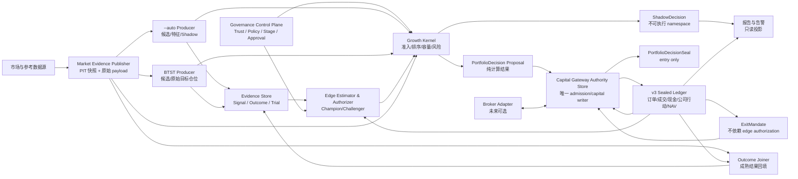

# Evidence-Gated Growth Kernel：`--auto` / `--daily-action` 长期架构设计

> - 状态：**Revision 2 已批准；部分实现（Plan 01 Revision 1 contracts/policy/trust only），无资本权限**
> - 初次批准日期：2026-07-19
> - Revision 2 批准日期：2026-07-26
> - 适用范围：A 股次日开盘入场、固定 T+10 开盘退出的研究、模拟与未来实盘链路
> - 权威性：本文件是该架构的唯一完整规范；与旧设计冲突时，本文件优先
> - 当前实现边界：只有 Plan 01 Revision 1 的 strict/frozen 领域契约、默认 `off` 的 PolicySnapshot、只读 trust verifier 与基础 ports；Plan 01 Revision 2 增量及其后的资本、证据、Authorizer、kernel、gateway、迁移和 broker 路径均未实现
> - 实现状态的事实来源：代码、版本化策略快照、迁移记录和可重验台账，而不是本文的目标态描述

## 1. 阅读目标

读完本文，开发者或审阅 Agent 应能回答以下问题：

1. 为什么 `--auto` 与 `--daily-action` 必须保留为两个独立信号生产者，而不能把分数直接相加。
2. 什么证据只能说明“数据可用”，什么证据才可能说明“策略有 edge”，什么记录才是资金真相。
3. T0、T+1、T+10、停牌、涨跌停、最低佣金、公司行动和外部资金流应怎样进入同一可审计经济口径。
4. 研究重建、日线代理、人工确认与 broker 确认为什么必须分池。
5. 为什么胜率、平均单票收益或 IC 不能直接授权仓位，以及如何用完整组合路径检验长期增长。
6. 新策略如何从 shadow 进入 2% canary，何时必须 no-trade，回撤达到 15% 后怎样安全恢复。
7. 当前手工/paper 工作流与未来 broker-live 之间还缺哪些不可省略的权限和状态机组件。

## 2. 核心判断

系统的第一性原理目标不是“每天选出看起来最强的十只股票”，也不是最大化一次回测的胜率，而是：

> 在只使用决策时已知信息、真实可执行、扣除全部成本、保留现金与状态约束的前提下，最大化组合单位净值的长期对数增长，同时让未知事实默认减少风险而不是制造虚假成交。

因此目标架构采用：

> **两个独立信号生产者 + 一个治理控制面 + 一层薄决策内核 + 一个权威资本/准入网关**

- `--auto` 与 BTST 各自产生候选和证据，永不直接互相改分。
- readiness 只决定数据是否可消费，不决定策略是否赚钱。
- edge gate 只决定某个固定行为版本有没有资格申请资金。
- 治理控制面签发并单调激活 trust、policy、stage、authorization 与迁移批准；候选配置文件本身没有权限。
- 决策内核是风险、容量、排序和仓位约束唯一执行点。
- Capital Gateway Authority Store 是 active policy、entry admission、seal/reserve、stage/risk latch、outbox send claim 和资本事实的唯一线性化域。
- broker adapter 只翻译协议并发送已获得 send claim 的命令；它不能成为第二个资本 writer。
- 未知、冲突、过期或不可重验时允许“不交易”；退出和对账永远优先于新仓。

## 3. 全局架构图


```mermaid
flowchart LR
    M["市场与参考数据源"] --> S["Market Evidence Publisher<br/>PIT 快照 + 原始 payload"]
    S --> A["--auto Producer<br/>候选/特征/Shadow"]
    S --> B["BTST Producer<br/>候选/原始目标仓位"]
    S --> O["Outcome Joiner<br/>成熟结果回填"]
    A --> E["Evidence Store<br/>Signal / Outcome / Trial"]
    B --> E
    O --> E
    E --> G["Edge Estimator & Authorizer<br/>Champion/Challenger"]
    C["Governance Control Plane<br/>Trust / Policy / Stage / Approval"] --> G
    C --> K
    A --> K["Growth Kernel<br/>准入/排序/容量/风险"]
    B --> K
    G --> K
    S --> K
    K --> Q["ShadowDecision<br/>不可执行 namespace"]
    K --> P["PortfolioDecision Proposal<br/>纯计算结果"]
    P --> W["Capital Gateway Authority Store<br/>唯一 admission/capital writer"]
    W --> D["PortfolioDecisionSeal<br/>entry only"]
    L["v3 Sealed Ledger<br/>订单/成交/现金/公司行动/NAV"] --> W
    W --> L
    L --> X["ExitMandate<br/>不依赖 edge authorization"]
    X --> W
    Y["Broker Adapter<br/>未来可选"] <--> W
    L --> O
    L --> G
    Q --> R
    L --> R["报告与告警<br/>只读投影"]
```

图中箭头是权威边界。报告、缓存、Agent 和生产者都不能反向改写台账；fingerprint 能证明内容一致，不能授予发行权限。Evidence、Authorizer 与 Capital Gateway 可以使用独立存储，但所有可能增加风险的最终 admission、reserve 与 send claim 必须在同一个 Capital Gateway Authority Store 中串行化。

### 3.1 控制面、资本面与线性化边界

系统把五件容易混淆的事分开：

| 边界 | 负责什么 | 不负责什么 |
|---|---|---|
| Evidence / Authorizer | 保存证据、评估 edge、签发或撤销授权 | 不写资本、不创建 broker order |
| Governance Control Plane | 签发 trust/policy/stage/recovery/migration/broker enablement manifest | 不替策略制造 edge，不直接改变持仓 |
| Growth Kernel | 用冻结输入计算确定的组合 entry 决策 | 不持有数据库、时钟、网络或签名私钥 |
| Capital Gateway Authority Store | 串行化 entry admission、active seal、reserve、risk/stage latch、outbox claim 与资本事实 | 不自行放宽授权或修改证据 |
| Exit lane | 从权威持仓派生并持续推进退出义务 | 不新增 exposure，不依赖 edge authorization |

新仓从“尚可撤销”进入“可能已送达券商”的唯一线性化状态为：

```text
SEALED
  -> PERMITTED
  -> OUTBOX_DURABLE
  -> SEND_CLAIMED
  -> SUBMISSION_AMBIGUOUS | BROKER_ACK
```

`SEND_CLAIMED` 必须在 Capital Gateway Authority Store 的同一事务中重新验证并消费：active policy/authority/risk epoch、active authorization state/version/root、capital/risk/stage-loss version、permit nonce、`permit_expires_at`、`gateway_send_deadline`、fencing epoch、active seal 和 reserve。未进入 `SEND_CLAIMED` 的 entry outbox 可以被 correction、revocation、halt 或 deadline 原子 tombstone；一旦进入该状态，就按已在途风险处理，只能使用同一 `client_order_id`。仅在 broker capability test 已证明该 ID 在账户/交易日作用域内幂等时，才可在两个发送时限都未到前同 ID 重试；否则只能查询、取消或对账，绝不能换 ID 重发。

Evidence Store 与 Authorizer 分库时，不得声称跨库“同一事务”。会使现有授权失效的 correction 采用 fail-closed 两阶段可见性：先准备不可变 correction payload，再让独立 dependency tracker 向 Capital Gateway 提交已签、单调的 `EntryFenceRaised` 并取得持久化 ACK，最后才把 correction 标为可用于授权的 active revision。若在 fence 后、revision activation 前崩溃，系统只会多阻断新仓，不会漏放风险。资本 late correction、fill bust、fee revision 和 stage-loss latch 直接在 Capital Gateway 资本事务中递增版本并 tombstone 未 claim 的 entry。

## 4. 范围与非目标

### 4.1 本设计覆盖

- 两个日常命令之间的数据和证据衔接。
- BTST、OversoldBounce 与 `--auto` 的初始授权状态。
- T+1 开盘入场、T+10 开盘退出的固定经济合约。
- 研究重建、日线代理、人工确认、经纪商确认四种执行模式。
- 组合增长、回撤、tail risk、容量和模型晋级方法。
- PIT、证据世代、sealed ledger、公司行动、幂等与故障恢复。
- 从 v2 到 v3 的无双写迁移。
- 未来 broker-live 所需但当前不存在的安全边界。

### 4.2 本设计不承诺

- 不承诺未来十天必然盈利，也不承诺 15% 是最大亏损。
- 不把历史修正后的 BTST 表现视作可直接授权的执行匹配证据。
- 不在本文指定具体类名、表结构或文件布局；这些属于后续实现计划。
- 不在文档落地阶段创建会被运行时误读的“机器可读生产策略”。该产物必须在实现阶段与代码、schema 和契约测试一起交付。
- 不把当前手工/paper 工作流描述成真实 broker-live。

## 5. 不可违反的系统不变量

以下规则优先于便利性、吞吐量和“多抓几个机会”的诉求：

1. **候选不等于授权**：producer 只能提交候选，不能创建权威仓位、成交或现金流。
2. **数据健康不等于盈利**：readiness 通过不能绕过 edge gate。
3. **一个风险只缩放一次**：producer 输出 raw target；全部组合风险缩放只在 Growth Kernel 发生。
4. **未知不造假**：无法证明成交就保持 `UNKNOWN`/pending/cash，不得用事后价格补成交。
5. **退出不被 kill switch 阻断**：任何新仓熔断、数据退化或策略停用都不能阻止真实退出、公司行动和对账。
6. **经济事实只记一次**：一个成交、费用、分红或公司行动只对应一个 canonical event；确认信息只更正/核对，不重复入账。
7. **历史不删除**：更正通过补偿事件和 revision 完成，不能删除旧成交或重写已发布的资金历史。
8. **行为变化不借旧证据**：任何会改变候选、顺序、数量、成本或成交语义的变更，都开启新的行为指纹与前向证据世代。
9. **单一权威写入者**：同一 portfolio/authority epoch 只能有一个 writer；v2 与 v3 不双写。
10. **现金与头寸守恒**：头寸只能因真实成交或法律生效的公司行动改变；估值与报告绝不改变持仓。
11. **时间只向前**：生产生命周期和 session watermark 单调；早于 watermark 的 `as_of` 请求必须零写失败。
12. **可执行性先于统计显著**：即使统计看起来有 edge，只要执行、容量或事实完整性不满足，也不能授权。
13. **配置不是权限**：本地 policy、registry、allowlist 或环境变量只是候选输入；只有治理根签名并经 authority store 单调激活的版本才可影响新风险。
14. **新仓与退出分道**：entry 必须消费有效 `CapitalAuthorizationEnvelope`；exit 只由权威持仓义务派生，不能因 edge、readiness、stage loss 或新仓 kill switch 失效。
15. **最终提交只有一个顺序**：authorization revision、capital/risk/stage 版本、permit consumption 与 broker send claim 必须在同一 entry-admission 线性化域排序。
16. **历史终态不等于经济不可更正**：订单生命周期可以 terminal，但 bust/correction 必须通过新 execution revision 重新投影现金、股份和退出义务。
17. **真实账户先守恒，统计证据再分池**：同一 broker account 的全部真实经济事实进入一个账户资本真相；研究、proxy、manual、broker 的绩效与 promotion 样本仍按 execution provenance 严格分开。

## 6. 三层事实、业务证据与控制面契约

### 6.1 三层事实

| 层 | 回答的问题 | 能否直接授权新仓 |
|---|---|---|
| Market Evidence / PIT Snapshot | 决策时可用的数据是否完整、来源是否明确、时间是否合规 | 否 |
| Edge Evidence / Outcome / Estimator | 某个固定行为版本在固定执行口径下是否存在保守正 edge | 只能向内核提供资格，不能直接下单 |
| Capital Truth / Sealed Ledger | 实际计划、成交、费用、公司行动、现金、持仓和 NAV 是什么 | 只有通过决策内核与 gateway 才能改变 |

readiness 属于第一层。它通过时只表示“数据可以被策略消费”，不能推出策略盈利、仓位应增加或计划已经成交。

### 6.2 六类业务证据契约

1. `SnapshotEvidence`：市场、证券、行业、日历、停复牌、价格限制和数据源状态。
2. `SignalEvidence`：全候选漏斗及每一阶段状态，不只保存最终入选者。
3. `OutcomeEvidence`：固定执行模式下成熟的前向结果、缺失原因和完成时间。
4. `EdgeAssessmentEvidence`：独立评估器对固定经济假设和行为版本生成的可重验证据；它本身不授权资金。
5. `PlanEvidence`：producer 的原始目标、候选漏斗和决策依赖；它不能自报执行权限。
6. `PortfolioDecisionSeal` / `ShadowDecision`：前者由 Capital Gateway 对 Growth Kernel 完整组合 entry 计算结果、资本版本和 reserve 原子封存；后者是内核生成的不可执行对照。

基础信封至少包含：

```text
evidence_id
subject_scope              # GLOBAL or STRATEGY_LINEAGE
subject_producer
family_id                  # typed NONE only when subject_scope=GLOBAL
strategy_semver
behavior_fingerprint
policy_epoch
execution_version
cost_version
effective_at
observed_at
provider_published_at
available_at
mode
source_authority
payload_content_hash
schema_major
```

`SignalEvidence` 另有 typed `stage = candidate | data_eligible | selected`。`SnapshotEvidence`、`SignalEvidence`、`OutcomeEvidence` 的 schema **禁止**出现 `execution_authorized`；producer 自报的授权字段没有任何效力。Evidence Store 还会追加自身控制的 `ingested_at`、`commit_sequence` 与 active revision，见 §14。

### 6.3 控制面契约

以下对象不是 producer evidence，必须由独立 issuer capability 签发，并在对应 authority store 中单调激活：

- `TrustBundle`：root-signed trusted issuer registry，绑定单调 registry epoch、前驱 hash、签发/到期时间和撤销状态。
- `PolicyActivation`：绑定完整 PolicySnapshot hash、portfolio、前驱 policy hash、policy/authority/risk epoch 和生效区间。
- `RiskEpochStarted`：15% 熔断后由治理批准的运营恢复起点，绑定审计资本快照、继承风险和新 epoch；不重置经济历史。
- `TrialManifest` / `StatisticalAnalysisPlan` / `StageManifest`：冻结试验、样本、统计门、stage 风险和 loss budget。
- `CapitalAuthorizationEnvelope`：`EDGE | EXPLORATION | RECOVERY` 三种 typed 授权的完整组合政策封装。
- `AuthorizationStatus` / `EntryFenceRaised`：Authorizer 的当前状态及使未来 entry 失效的单调控制事件。
- `ExitMandate`：由资本 writer 从现有持仓义务派生的减风险命令，不声明 edge。
- `MigrationApprovalManifest` / `BrokerEnablementManifest` / `DisasterRecoveryManifest`：短时、一次性、双人批准的资本 writer、broker 权限或灾备接管变更；灾备 manifest 另绑定 portfolio/account、备份 root、durable cursor、目标 writer、recovery/fencing epoch 和 reconcile-before-entry 条件。

本地 JSON、环境变量、CLI 参数或未激活的签名文件都只是候选输入。它们不能直接改变 active policy、registry、stage、authorization、risk epoch、writer 或 broker enablement。

`EDGE` envelope 只能由独立 Authorizer 签发；`EXPLORATION`/`RECOVERY` envelope 只能由 Governance Control Plane 的对应 capability 签发，并引用其使用的既有 EDGE grant/assessment。三类信封都必须经过 Capital Gateway Authority Store 的单调 `AuthorizationStatus` CAS 激活，并至少绑定：

```text
authorization_kind          # EDGE | EXPLORATION | RECOVERY
authorization_id
authorization_version
mode
portfolio_id
broker_account_id           # 真实资本模式必填
broker_account_fingerprint  # BROKER_CONFIRMED 时必填
base_currency
policy_activation_hash
trust_bundle_hash
registry_epoch
policy_epoch
authority_epoch
risk_epoch
research_program_ids[]
baseline_portfolio_policy_fingerprint
target_portfolio_policy_fingerprint
lineage_grants[]            # 结构见下；每项独立绑定 lineage/stage/tier/evidence/loss-budget
evidence_as_of
evidence_set_merkle_root
issued_at
expires_at
activation_capital_snapshot_id
activation_capital_snapshot_hash
portfolio_gross_cap
exploration_aggregate_gross_cap
program_loss_budget_bindings[]
issuer_id
issuer_capability
portfolio_assessment_result_hash
global_attempt_ledger_checkpoint_hash
global_multiplicity_budget_consumption_id

program_loss_budget_bindings[]:
  research_program_id / budget_id / budget_cents / consumed_cents / version

lineage_grants[]:
  grant_id / grant_kind        # EDGE | EXPLORATION；RECOVERY 是 envelope 级限制，不制造新 grant
  grant_certificate_hash / issuer
  subject_producer / family_id / economic_lineage_id / research_program_id
  behavior_fingerprint / execution_version / cost_version
  capital_tier / lineage_gross_cap
  trial_id / trial_manifest_hash / statistical_analysis_plan_hash
  stage_id / stage_manifest_hash / stage_sample_reservation_id
  stage_loss_budget_id / stage_loss_budget_cents / stage_loss_version
  assessment_result_hash / grant_evidence_set_merkle_root
  attempt_ledger_checkpoint_hash
  alpha_or_evalue_budget_consumption_id / alpha_sample_consumption_id
```

`CapitalAuthorizationEnvelope` 总是授权从 baseline 到 target 的**完整组合政策**。一个 envelope 可以含多个 `lineage_grants`，但它们必须在同一个 target portfolio policy 中共同评估；多个各 5% 的 lineage envelope 不能机械叠加。签发 `EDGE` 时，Authorizer 必须在同一事务消费唯一 sample、attempt 和 alpha/e-value budget slot并封存 Trial/SAP/Stage、评估结果和证据集合；签发 `EXPLORATION`/`RECOVERY` 时，Governance Control Plane 必须在同一治理事务消费对应 exploration/recovery/attempt budget，并引用不可变、可重验的既有 EDGE grant certificates。同一评估或治理预算不能重复签发。

每个 `portfolio_id` 任一时刻最多一个 active entry envelope，且其 mode、authority/risk/policy epoch 必须等于 Capital Gateway 当前 active portfolio state；research/proxy 使用不同 portfolio，不能靠切 mode 在同一真实资本上叠加额度。旧 epoch 的记录只能是历史状态。replacement 必须在 Gateway 中用版本 CAS 原子撤销旧版本、安装新版本并重验全部未 claim entry。`lineage_grants` 分别标明 `EDGE | EXPLORATION` 来源；envelope 顶层 `authorization_kind` 是本次 activation reason：风险熔断恢复只能是 `RECOVERY`，加入任一尚未证明的 grant 必须是 `EXPLORATION`，其余全部已证明政策才可为 `EDGE`。含 exploration 的完整组合仍必须把 baseline EDGE grants、全组合 target policy 和 aggregate cap 一并封存，不能只授权增量后与旧额度相加。

有行为变化的 target policy 上线时，签名的 `PolicyActivation` 候选与引用它的 `CapitalAuthorizationEnvelope` 必须先完成准备，再由 Capital Gateway 在一次 CAS 中同时设为 active；任一签名、前驱、epoch、账户、模式或 target fingerprint 不匹配则两者都不激活。纯收紧 policy 可以单独提高 epoch 并 fence entry，但不能借“收紧”标签加入任何新候选、数量、时间窗口或额度；若 schema 无法机械证明所有允许行为都是旧集合的子集，就必须按行为变化走完整证据与联合 activation。

`EDGE` 只有在固定 target portfolio policy 通过 §13 的完整门后才能签发。`EXPLORATION` 只能由独立治理 capability 签发，强制 `mode=BROKER_CONFIRMED`，并绑定期限、固定整数分 stress-loss budget 和收集证据的 trial。所有并发 exploration grants 必须出现在同一个 portfolio envelope 中，共享 `exploration_aggregate_gross_cap <= 2%` 与 loss cap，不得每个 lineage 各开 2%；既有 EDGE 风险仍进入完整 target policy 和 `portfolio_gross_cap`，不能与探索额度机械相加。首次 broker 启动若没有既有 live EDGE grant，则整个 portfolio gross 同样最多 2%。探索是 one-shot、不可续期：到固定 assessment/expiry 后停止相应新仓并按原定退出规则 drain；未决探索风险未归零/完成法律终局前不得重发。其成交只进入预注册 exploration trial，在评估通过前不能混入既有 champion 授权池。

`RECOVERY` 只用于 15% 风险熔断后的新 Risk/Authority Epoch。它可以引用上一个已证明的 target policy，但只允许 portfolio-wide 2% 且继承风险、未决订单和既有 stage/program loss consumption 全部计入；它不声称新的 edge，也不能替代下一次 5% 晋级所需的新证据。

`PortfolioDecisionSeal` 必须引用并由 gateway 重验一个未过期、portfolio/account/mode/policy/lineage/stage 完全匹配的 `CapitalAuthorizationEnvelope`。信封里的 `issuer_capability` 只是审计声明，不是权限证明；gateway 必须用当前已激活的 `TrustBundle` 校验 `issuer_id + key_id/service principal + signature/MAC/mTLS identity + capability scope/version`。producer/CLI 不得持有 Authorizer 或 governance 的凭据。hash 只能证明内容一致，不能替代发行权限。

TrustBundle 自身必须由仓库和服务配置之外的治理根签名，带单调 `registry_epoch`、前驱 hash、`issued_at`、`expires_at` 和 root key ID；Capital Gateway 持久化 last-seen epoch，拒绝回滚。envelope 中的 `trust_bundle_hash/registry_epoch` 是签发时 provenance 与最低可信 epoch，不把授权永久钉死在旧 registry；seal/send claim 必须使用 `current_registry_epoch >= issuance_registry_epoch` 的当前 active TrustBundle 重新验证 issuer/key/capability 未撤销，并记录当次 registry hash。生产验证时间来自 gateway-owned trusted clock；调用方传入的时间只允许用于 research replay。新仓验证还要求 registry freshness 合格。

Authorization 绑定完整 evidence-set Merkle root 和依赖 revisions。任一成员发生 fee/company-action/fill bust、correction 或 revision，必须先按 §3.1 安装 `EntryFenceRaised`，再激活 correction；不能用跨 SQLite “同一事务”掩盖传播窗口。每个 entry permit 和 send claim 绑定 `capital_authorization_id + authorization_version + evidence_set_merkle_root + registry_epoch + active_policy_hash`。原 issuer 只能按原冻结 TrialManifest/SAP 或 governance manifest 重算并签 correction/replacement；不得改写当时决策，也不得更换门槛。旧授权永久保留作审计，但不能继续生成或提交 entry。

所有内容 hash 都必须定义 versioned domain separation、canonical preimage 和 Merkle leaf 排序。禁止在 payload 内放置含自身的 `authorization_payload_hash`；外层 SignedEnvelope 的 payload hash 已足够，若保留 body hash，必须明确排除 hash/signature 字段。

## 7. 固定经济合约

### 7.1 交易日定义

- T0：产生信号的官方交易所 session，收盘后形成决策。
- T+1：T0 后第一个官方交易所 session，目标在开盘成交。
- T+10：`session_index(T0) + 10` 的官方交易所 session，目标在开盘退出。
- 入场日是持有第 1 个 session；T+10 不是“入场后再等十个自然日”。
- 个股停牌仍计入交易所 session；交易所全市场取消的 session 不计入。
- T+10 无法执行时进入 `EXIT_PENDING`，在后续第一个实际可执行开盘成交，或由法律上生效的公司行动终结。

### 7.2 决策与开盘拍卖

`PortfolioDecisionSeal` 只可依赖 T0 及以前可用的证据。交易所 cutoff 之前还要给 permit、outbox、网络与 broker 接收留出版本化安全余量，必须满足：

```text
T0_close_finalized_at
  < PortfolioDecisionSeal.created_at <= seal_creation_deadline
  < permit_issue_deadline
  < ExecutionPermit.expires_at
  <= gateway_send_deadline
  < broker_auction_submission_cutoff
```

`seal_creation_deadline` 与 `permit_issue_deadline` 分别是最晚封存/签发时点，不是 permit 的有效期。`ExecutionPermit.issued_at` 必须晚于所引用 seal 的创建且不晚于 `permit_issue_deadline`；`SEND_CLAIMED_at` 必须不晚于 `min(ExecutionPermit.expires_at, gateway_send_deadline)`。所有安全余量和相等边界由 execution policy 版本化，禁止把同一个模糊 `deadline` 字段同时当签发截止和失效时间。

是否赶上开盘以 broker 接收时间为准，不能用本地 seal/outbox 时间代替。生产时间来自 gateway-owned `TrustedClock`：同时记录 UTC wall clock、单调进程时钟、clock health 和版本化交易所 cutoff snapshot；时钟回拨、skew 超限或 health 未知时停止 entry。调用方传入的时间只能用于 replay，不能为生产决策回填“尚未过期”。

T0 收盘未最终确认、T0 数据迟到或错过任一内部 deadline 都不得创建/继续可执行 seal。有效 seal 封存：

- 固定整数股数量和整手规则版本；
- 订单类型、限价/保护价和有效期；
- 官方次日价格边界与最坏成交假设；
- 最坏费用与现金预留；
- portfolio/account、每条 order line 的 producer/lineage/stage/authorization、snapshot、active policy、registry、risk epoch 和 authority epoch；
- 幂等 key 和完整 payload hash。

T+1 的 `ExecutionPermit` 可依据最新但仍在提交前可用的风险/数据证据**缩减或取消**，不能增加封存数量。允许沿用原行为世代的 shrink/cancel predicate 必须在 PolicySnapshot 中冻结，只能基于执行不可用、价格边界、capacity、cash、capital/risk/stage halt、reconciliation 或事实完整性等机械条件。使用盘前新闻、quote 或其他证券选择性信息保留赢家、取消输家，属于新的 pre-open alpha overlay，必须使用新 behavior/execution version、Trial/SAP 和 ITT 计数。

每个 seal 同时最多一个 active、single-use permit nonce；permit line 数量必须逐项 `<=` seal line，缩减/取消、reserve 释放和 outbox 建立在同一 Gateway 事务提交。释放的现金保持现金，不得在观察盘前状态后重分配给其他证券或扩大任何行。permit 未被 `SEND_CLAIMED` 消费即到期时，outbox tombstone、reserve 释放和状态推进也必须同事务完成。

已经进入拍卖的订单，不能观察开盘价后再声称“当时本应拒绝”；这会造成前视。broker adapter 必须证明 `opening_auction` TIF 的真实语义，或使用可审计的 auction-only 提交/取消协议。entry order 不得留到连续竞价；若券商仍在窗口后成交，该 fill 必须进入真实资本账，但标为 execution-contract breach、触发新仓 halt，并且不能计入目标合约的有效 edge 样本。

多只股票的订单不是原子篮子：每只可部分成交、拒绝或未成交。剩余现金不得在同日看到结果后追价或重分配。入场窗口错过后计划到期；T+2 买入属于另一策略和新证据世代。

订单数量还必须受 PIT 可见的 ADV participation cap 约束。ADV lookback、最大参与率和缺失处理属于版本化 PolicySnapshot；ADV 不可用时不创建新订单。现金、风险或容量三个上限中取最小值，不能用未来实际成交额证明 T0 的订单“本来有容量”。

### 7.3 T+10 退出

- 入场时只固化 `exit_session_ordinal` 和退出策略，不提前固化假定全部入场成功的退出数量。
- 基准合约不含盘中止损、止盈或择时提前退出；启用任何此类规则都会改变 execution/behavior fingerprint、组合路径和 outcome 口径，必须注册新 challenger，不能作为“风控覆盖”悄悄加入既有授权。组合/stage halt 只停止新增风险，不自动改写已持仓的预注册退出策略。
- 退出不复用 entry `CapitalAuthorizationEnvelope`。Capital Gateway 根据权威 position/economic lot 生成不可伪造的 `ExitMandate`，至少绑定 portfolio/account、position/lot、mode/provenance、固定退出策略、due session、`tradable_quantity - live_exit_leaves`、capital/fencing version、稳定 client ID 和 payload hash。
- T+10 cutoff 前，gateway 依据 `ExitMandate` 生成退出 OrderIntent；部分入场、送转待上市、此前部分退出与 live order 都必须计入。
- broker-live 模式下，T+10 订单也必须在开盘拍卖截止前准备，不能收盘后回填开盘成交。
- 退出订单同样必须是经 capability test 证明的 auction-only 语义；若券商在连续竞价才成交，真实成交仍减少资本风险并照实入账，但标记 execution-contract breach，不能作为目标 T+10-open 合约的合格 outcome，也不得通过反向交易恢复原头寸。
- 涨跌停封单、停牌、撤单未确认或经纪商状态模糊时，保留头寸和 `EXIT_PENDING`；不得用 stale close 强制消失。
- edge/research/data/Authorizer 不可用、authorization 过期或 revalidation、risk/stage loss halt 都不能取消退出义务。若可卖数量本身未知，gateway 不得冒险超卖，但必须保留并优先推进 `EXIT_PENDING`、reconciliation 和下一次可执行开盘。
- broker-live 必须有 gateway-owned、官方日历驱动、持久化且受 fencing 约束的 lifecycle scheduler；CLI 仅用于观察或幂等补触发。entry 流量不能耗尽 exits/cancels/reconciliation 的独立 rate-limit 预算。
- exit 同样使用 durable outbox、稳定 client ID、writer fencing 和 broker 对账；其 send claim 只重验当前 economic lot、可卖数量、live exit leaves、capital version、deadline 与 writer fence，不消费 entry permit，也不检查 edge/stage/risk admission。无法证明数量时保持 `EXIT_PENDING`，不能为求“持续退出”而冒险超卖。

### 7.4 精确净收益

对只有一次净买入、一次净卖出且没有中间公司行动的简单 round-trip，诊断净收益可写为：

```text
R_net = CF_sell_net / abs(CF_buy_net) - 1
```

一般 economic lot 可能包含部分成交、多个退出、分红、换股或退市清算，必须按 `economic_lot_id` / `position_lineage_id` 汇总该 lot 的全部净现金流和终局资产处置，不得把上述简式套在复杂路径上。每个成交、费用或公司行动仍各有唯一 `economic_event_id`；跨多个 lot 的公司行动保存显式 allocation。FIFO、平均成本或其他归因方法必须版本化，且只影响诊断，不影响组合 NAV。单票/lot 收益始终只是诊断；权威目标使用组合单位 NAV 日路径。

现金流必须使用：

- 实际成交数量与每笔成交价；
- 生效日对应的 100 股整手或其他交易规则；
- 买卖双向佣金及每单最低佣金；
- 滑点、卖出印花税、过户费和其他适用费用；
- 分红、送转、拆并股、换股、退市清算等公司行动。

不得用“价格收益减固定 60bps”代替权威现金流。金额在权威台账持久化为整数最小货币单位，`Decimal` 只作边界计算并按版本化规则舍入；SQLite `REAL` 不得作为资金真相。

## 8. 四种执行模式

| 模式 | 用途 | 成交含义 | 可否称为真实 OOS/实盘 |
|---|---|---|---|
| `RESEARCH_RECONSTRUCTION` | 历史数据修复、机制研究、先验 | 事后可获得数据重建的假设成交 | 否；永不授权 |
| `DAILY_BAR_PROXY` | 标准化 paper/shadow 策略比较 | 严格代理规则下的模拟成交 | 可作前向代理证据，不可称实际 fill |
| `MANUAL_CONFIRMED` | 人工录入并附来源的真实执行 | 操作者确认的成交、费用与更正 | 可作独立真实 OOS；不能称 broker-live |
| `BROKER_CONFIRMED` | gateway 接收的经纪商生命周期事件 | broker execution、费用与 revision | 只有权限和对账链完整时才可称 broker-live |

四种模式的研究 return、win rate、mode-pure NAV、样本数、报告标题和 promotion namespace 必须永久分开。

真实 broker account 另有一条不可分裂的 `AccountCapitalTruth`：为现金、头寸、退出和风险守恒，它必须接收账户内全部真实经济事实，并为每个事实保存 execution provenance。它不是第五种绩效模式，也不能把 manual 事件洗成 broker evidence。含 manual emergency trade、未知来源或混合 provenance 的 lot/区间不得进入纯 `BROKER_CONFIRMED` promotion 样本，除非后续 broker source 对同一 canonical event 完成确认；确认只提升 provenance/finality 或生成差额 correction，不重复资本。

纯 research/proxy 使用独立模拟 portfolio。人工确认必须记录操作者、来源、观察时间和内容寻址附件/对账状态；只有 attachment hash 而无法读取原文时，不得继续用于新授权。`MANUAL_CONFIRMED` 只有在成交前已存在 mode-matched `PortfolioDecisionSeal`、固定执行窗口和 ITT enrollment 时，才可进入官方 manual OOS；临时主观买入、事后挑选上传或越过 seal 的交易仍进入 `AccountCapitalTruth`，但标为 `OUT_OF_PROTOCOL`，不进入 promotion 样本并触发相应新仓 halt。它与 broker 对账成功后可以建立关联，但不能复制、搬运或再次入账同一经济事件；manual issuer 直接宣称 broker provenance 必须零写拒绝。

日线 OHLC 不能证明集合竞价队列位置。若开盘处在有利方向的一字涨跌停，日线数据不能证明订单成交，应记 `UNKNOWN`/no proxy fill；代理组合保留现金。运行命令晚了也不能回填成当日 broker fill：模拟必须逐 session 重放，真实执行则记 `MISSED` 或 `AMBIGUOUS`。

## 9. 信号生产者与初始权限

### 9.1 BTST

- 是目标态初期唯一允许申请交易授权的 producer。
- 当前历史修正结果只证明“值得重建精确证据”，不证明已满足 T+1 open、T+10 open、真实成本和完整组合路径的授权标准。
- 在执行匹配证据不足时，BTST 只能 shadow/no-trade；通过后从 2% canary 开始。
- `trigger_strength`、streak、regime 和 composite 只记录为 feature，初期不得改变准入、排序或仓位。
- 现有 `+0.04` streak 加成和 regime 加仓在目标态关闭。

一个 feature 若要同时承担 admission、ranking、sizing 中两个或更多角色，必须把每个增量作用分别预注册并在组合分歧日验证；不得用同一批相关样本重复证明后让一次噪声被放大多次。

### 9.2 OversoldBounce

- 默认且目标态初期保持 disabled。
- 恢复必须注册为独立 challenger，使用新行为指纹和创建后的前向证据。
- 旧 Phase 0 或被除权幻影污染的收益不得用于授权。

### 9.3 `--auto`

- 保持独立 producer，不与 BTST 合并 composite 或“投票”。
- `--auto` **CLI 只是编排器**：它可以依次调用 Market Publisher、Outcome Finalizer 和 Auto Producer，但三者使用独立 namespace、issuer capability 与写 ACL。
- CLI/Auto Producer 进程不得持有 Publisher、Finalizer 或 Authorizer 的写凭据，只能经窄 IPC/API 发起调度；各组件使用独立 OS/service principal，存储层强制 ACL。仅拆成同进程 Python 类不算权限隔离。
- Auto Producer 只能读取封存 Snapshot、写 Auto shadow `SignalEvidence`；不能发布 Snapshot、修改 Outcome 或签发任何 `CapitalAuthorizationEnvelope`。
- 初期外部效果：发布/刷新市场证据、回填成熟 outcome、输出 Auto 候选 shadow 报告；这些提交彼此独立。
- 所有旧 `BUY` 字段必须顶层显式标记 `execution_authority=none`，避免人或 Agent 把推荐误读为订单。
- Auto 若未来申请资金，必须成为独立 `family_id` 的 challenger，证明在**实际发生策略分歧的交易日**能提升配对组合增长且不恶化尾部风险。
- Auto shadow 的 winner、模型版本或缓存不得改变 BTST 的授权 fingerprint。

## 10. 薄决策内核（Growth Kernel）

内核只做六件事，保持确定、可回放、无隐藏网络副作用：

1. 验证 active `PolicyActivation`/`TrustBundle`、PIT snapshot、producer namespace、完整 `CapitalAuthorizationEnvelope` 和执行模式。
2. 收集多个 producer 的 `PlanEvidence` raw target，不接受 producer 已做的组合风险加成。
3. 对完整组合一次性应用唯一的准入、排序、容量、行业/单票/lineage/program/总仓位约束。
4. 应用一次且仅一次的 drawdown multiplier。
5. 按最坏价格和费用生成整数股数量与现金预留。
6. 通过 Capital Gateway 的单一命令原子预留资本并发布不可变 `PortfolioDecisionSeal`，或输出结构化 no-trade/block reason。

一次运行冻结的是当前 active `PolicyActivation` 及其 `PolicySnapshot` hash。运行中唯一允许动态覆盖的是更保守的 revocation、entry fence、kill/reconciliation halt；任何放宽风险的配置都只能由 Governance Control Plane 激活新的单调 policy/authority/risk epoch。环境变量、CLI 参数、仓库文件和 producer 输出都不是权限来源。

### 10.1 CapitalRiskSnapshot

内核只能消费 Capital Gateway Authority Store 在单一资本版本上生成的完整 `CapitalRiskSnapshot`，不能由调用方拼接现金、持仓和订单摘要。快照至少封存：

- `portfolio_id`、`broker_account_id`、base currency、`capital_version`、`risk_snapshot_id`、`as_of`、freshness 与 completeness；
- available/restricted/unsettled cash、receivable/payable、subscription/redemption suspense 和所有 reserve；
- open/`EXIT_PENDING` position 的 marked gross、tradable/receivable quantity，以及 live/`CANCEL_REQUESTED` order leaves 的最坏名义金额；
- pending stress、公司行动待处理风险、`UNATTRIBUTED_RISK`，并按 portfolio/research program/lineage/stage 分解而不重复计数；
- units、as-observed NAV、lifetime/active-epoch HWM 与 drawdown、risk/stage/reconciliation latch；
- active policy/authority/risk/registry epoch、authorization version、stage-loss version 和 writer fencing epoch。

任何必填分量为 `UNKNOWN`、stale、币种不可换算或加总不守恒时，只能输出 no-trade。Capital Gateway 必须在同一数据库事务中 CAS 校验该快照版本、计算并写入所有 reserve、更新 stage/risk 状态、发布整个组合 seal；应用层不得通过取得原始数据库 session 分步完成这些动作。

### 10.2 PortfolioDecisionSeal 幂等语义

逻辑幂等键：

```text
(portfolio_id, signal_session, decision_cycle_id)
```

`decision_cycle_id` 由 policy 预先固定；本系统的标准值对应“每日一次、次日开盘 entry”，不能由 producer/重跑随机生成。`authority_epoch`、policy 和 authorization 进入 payload 而**不进入经济幂等键**，否则换 epoch 可在同一 session 复制订单。物理 seal ID 另含单调 `seal_revision`；同一逻辑键跨所有 epoch 任何时刻最多一个 active revision。

- 同 key、同 payload：幂等重跑，返回既有 seal。
- 同 key、不同 payload：冲突并告警，零写；不得暗中覆盖。
- cutoff 前、没有 live order 且**从未签发 `ExecutionPermit` 或 fencing token** 时，只有显式 supersede 命令可创建新的 immutable `seal_revision`。同一 logical key 只能有一个 `active_seal_id`；在一个事务内把旧 seal 标为 `SUPERSEDED`、释放旧 reserve、建立新 reserve 并切换 active。任一步失败则全部回滚，旧 seal 保持有效。每次 entry 最终提交仍须在权威 gateway 内原子校验 `active_seal_id + seal_revision + permit_nonce + current_fencing_epoch + capital_authorization_id/version + evidence_set_merkle_root`，并确认授权为 `ACTIVE`、未要求 revalidation；旧许可迟到重放必须零下单。
- cutoff 后或订单已提交后，只能取消/缩减或生成更正事件，不能改写历史计划。

一个 `PortfolioDecisionSeal` 可含多个 order line；每条 line 都必须绑定 producer、economic lineage、research program、stage、authorization grant、execution mode 和各自的 `PlanEvidence`，seal 同时绑定聚合后的 `CapitalRiskSnapshot` 与 reserve。最终 entry 发送必须经过 §3.1 的 `SEND_CLAIMED` 线性化点；seal、permit 或 durable outbox 单独存在均不代表已获发送权。

`PortfolioDecisionSeal` 只封存新仓决策。退出由 `ExitMandate` 驱动，不占用、继承或重用 entry authorization；报告不得把退出失败伪装成 seal 失效或无信号。

报告中的 planned BUY 集合必须与 ledger 中有效 seal 的集合完全相等。跨日计划、pending order、退出和阻断原因全部从台账投影，不能只看当天扫描结果。

## 11. 回撤、风险和资金恢复

### 11.1 回撤缩放

令回撤幅度为 `d >= 0`，新风险乘数为：

```text
m(d) = 1                         , d < 10%
       (15% - d) / 5%            , 10% <= d < 15%
       0                         , d >= 15%
```

- 内核从未缩放的单票 raw target 与未缩放的组合 gross ceiling 分别计算一次 `× m(d)`，再取约束交集；不得把已缩放的单票结果再次乘入已缩放的组合目标，或让 producer/gateway 重复应用。
- 若现有风险已超过缩放后的目标，只停止新增，不伪造提前退出。
- `d >= 15%` 时锁存 `RISK_HALTED`；退出、撤单、公司行动和对账继续。
- 这表示“停止增加风险”，不是最大亏损保证。A 股停牌、跳空或封板可使实际回撤继续扩大。

### 11.2 恢复规则

恢复不能清零历史或直接回到原仓位。必须：

1. 完成人工/策略复核，解决所有 ambiguous order 与 reconciliation halt。
2. 只有 Governance Control Plane 才能签发 `RiskEpochStarted`、新的 `PolicyActivation` 和 `RECOVERY` 类型 `CapitalAuthorizationEnvelope`；三者须由单调前驱、治理批准者、完整 PolicySnapshot、审计后的起始资本快照和 CAS authority flip 共同绑定。
3. 保留生命周期单位净值、全局高水位、历史回撤与全部事件。
4. `lifetime_dd` 永久用于绩效与披露；`active_epoch_dd` 从 `RiskEpochStarted` 的审计 NAV 建立运营基线，并用于新 epoch 的 10%/15% 交易权限。建立运营基线是显式治理例外，不是普通 reset。
5. 从 2% 恢复 canary 重新开始：此时同时设置 portfolio-wide 2% gross cap 和每个 lineage 不高于 2% 的子上限；所有继承的 open/pending/live/reserved/`UNATTRIBUTED_RISK` 都计入组合上限，超过 2% 时不新增。只有新的、非复用未来证据才可升到 5% 或更高。

风险 reset 只改变未来权限，不改变任何经济历史。

`authority_epoch`、`risk_epoch` 是运营 fencing 维度，不应仅因编号变化进入策略 `behavior_fingerprint`；否则恢复授权会与相同行为无意义失配。若恢复同时改变准入、排序、仓位、成本、执行、退出或风险函数，则必须激活新的 policy/behavior fingerprint 和证据世代。旧 policy activation 永不可复活，rollback 只能发布语义更保守、epoch 更高的新 activation。

### 11.3 其他 fail-closed 条件

以下状态停止新风险：

- 估值/NAV 未知或 stale；
- 交易日历、价格限制或公司行动证据缺失；
- execution/cost/behavior/policy 版本不匹配；
- 经纪商累计成交回退、订单状态模糊或现金/头寸对不上；
- edge estimate 过期、`EDGE_REVALIDATION_REQUIRED`、保守下界未达 MEE 或策略证据不足；
- schema major 未知、source authority 越权或封存 payload 不可读取；
- active TrustBundle/PolicyActivation 缺失、过期、回滚、前驱断裂或签名/作用域不匹配；
- gateway trusted clock 不健康、交易所 cutoff 快照不可证明或 monotonic/wall clock 漂移超出 policy 上限。

## 12. 单位净值与经济状态

### 12.1 自融资单位净值

外部入金/出金通过份额变化处理，不计为投资收益。计价必须取**不含本次 flow** 的同一时点组合价值：

```text
unit_price_before_flow = V_pre_excluding_this_flow / units_pre
delta_units = external_cash_flow / unit_price_before_flow
units_after = units_before + delta_units
```

同一事务先冻结 `V_pre` 与发行/赎回价，再更新 cash 和 units。无法取得可靠同一时点 NAV 时：

- 入金记受限现金资产与等额 `subscription_payable`，净权益为零；可靠定价后同一事务发行 units、解除 payable 并把现金转为可用。
- 出金请求在可靠定价前只记 off-ledger/memo reserve，不确认 `redemption_payable`、不注销 units、也不改变 NAV/HWM/drawdown；取消 memo 同样没有收益影响。可靠定价后，部分赎回可在同一事务按 flow 前 NAV 注销对应 units 并确认等额 `redemption_payable`/cash reserve，实际付款时再冲销 payable。若请求会赎回全部份额，则先冻结最终 unit price、把全部 units 原子转为 `pending_redeemed_units` 并进入只结算的 `TERMINATING`，待付款及全部义务清零后才烧毁为零；期间不得把空分母重新用于 NAV 或新仓。若法律要求更早确认负债，必须同时记录明确 contra-equity/pending-redeemed-units，并把两者从绩效 NAV 排除。

若发生未授权的先行出款，则进入 reconciliation halt。suspense/memo-reserved 资产不可用于交易。

首次认购是唯一 genesis 例外：仅当 `units=0`、不存在经济历史且 Governance Control Plane 已冻结 base currency、整数 unit quanta 和 genesis unit price 时，才可按该价格原子发行首批 units。genesis 后经确认因投资损失导致净权益/NAV `<= 0` 时，组合进入不可自动恢复的 `INSOLVENT`；官方生命周期 log growth 记为 `-∞`，停止一切新仓和晋级，只允许退出、清算、对账以及另建法律上独立的新 portfolio，禁止通过重置 units/HWM 抹掉失败。

经授权的全额赎回只有在资产、负债、reserve、live/ambiguous order 和经济义务全部归零后，才能令 `units=0` 并进入不可复活的 `TERMINATED`，这不是 insolvency。若 `units <= 0` 但仍有非零经济事实，或单位价格仅因估值/数据未知而不可定义，则进入 `RECONCILIATION_HALT`/`NAV_UNKNOWN`；查明前禁止新风险，不能提前记 `-∞`，也不能用新的 genesis 价格继续同一 portfolio。

权威风控使用当时可见的 as-observed NAV；授权和成熟绩效使用在评估 cutoff 前已经 final 的、逐事实只计一次的 restated economic path。两条序列都保留：restatement 不改写旧决策、seal 或当时 risk snapshot，但会递增资本/证据版本、重验未发送 entry，并可撤销未来授权。报告必须并列标明 `as_observed` 与 `restated_final`，不得择优引用。

base currency 在 portfolio genesis 后不可静默改变。现金、费用、税、预算和 NAV 使用整数最小货币单位；证券价格使用版本化整数 price ticks/micros，unit 使用固定整数 quanta；换汇、份额发行、公司行动和费用分摊均规定舍入方向与 residual account。`Decimal` 只可作为边界计算表示，持久化经济真相不得依赖二进制浮点或隐含亚分精度。

### 12.2 session checkpoint

每个交易 session 采用单调 checkpoint：

```text
CORPORATE_ACTIONS_APPLIED
  -> PREOPEN_RISK_LOCKED
  -> ORDER_INTENTS_DURABLE
  -> OPEN_RECONCILED
  -> CLOSE_VALUED
  -> SESSION_FINALIZED
```

checkpoint key 至少包含 `(session, phase, stream_version)`。崩溃重启从已提交 checkpoint 幂等继续；早于 watermark 的生产请求零写失败。

迟到费用或公司行动可以具有早于 watermark 的 `effective_at`，但必须以当前 `recorded_at` 和递增 `stream_version` 追加 `LATE_CORRECTION`/补偿事件。每个 `ExecutionPermit` 绑定 `capital_version` 与 `risk_snapshot_id`；late correction 原子递增 capital version，使所有旧 permit 失效并按最新资本真相重算风险。已提交订单的真实成交不得追溯否认，但若修正后越过阈值，立即锁存 halt。更正不重开旧 checkpoint、不改旧 `PortfolioDecisionSeal`，也不改当时的 as-observed risk snapshot。

每个会改变 fill、fee、tax、mark、reserve、pending stress 或公司行动风险的资本事务，必须在同一事务更新 `CapitalRiskSnapshot` 和 stage-loss consumption/latch；不能先记成交、稍后异步计算是否超预算。`SESSION_FINALIZED` 只表示该 session 已完成当时可知事实的 checkpoint，不阻止依法追加 late correction。

估值事件只能更新 mark/NAV，不能改变 position state、cash 或 shares。头寸只因成交或合法公司行动改变。

### 12.3 公司行动

必须显式区分：

- `DividendReceivable`：除权日确认应收；付款日转现金。
- `ShareReceivable` 与 tradable quantity：送转股份可已归属但尚不可卖。
- split/merge：调整数量与成本基础，不产生凭空 P&L。
- `CORPORATE_CASH_SETTLED`：现金收购、退市结算等法律终局。
- `SECURITY_CONVERTED`：换股、吸收合并等证券转换。
- `LEGAL_WRITE_OFF`：有法律证据的终止确认。

每个事实有稳定 `economic_event_id` 和 source-authority matrix。供应商事件先入 provisional 时，经纪商对账只能把它确认为 confirmed 或生成差额更正，不能再次增加现金/股份。

股份比例、零碎股、现金替代和税费必须用精确有理数或固定点 entitlement 计算，明确每个 lot 的分摊、向下取整规则、residual/cash-in-lieu 归属和 `shares_became_tradable_at`；不得先按组合四舍五入再随意分配到 lot。`SECURITY_CONVERTED` 后的 successor security 继承原 economic lot、entry provenance、lineage、成本基础和到期退出义务；只有经确认的 `CORPORATE_CASH_SETTLED` 或 `LEGAL_WRITE_OFF` 才能让该义务终止。证券代码消失、行情缺失或供应商标记退市都不能直接删除仓位。

`price_cache` 是不复权价。任何 total-return 证据都必须由 `pct_change` 链或可审计的公司行动现金流支持，不能简单用跨除权日的 raw close 比值。

## 13. 统计目标与证据门

### 13.1 唯一主要目标

主要目标是组合单位净值相对现金基准的日均对数增长：

```text
G_portfolio = (1 / D) * Σ_t [
    log(UnitNAV_t / UnitNAV_(t-1)) - log(Benchmark_t / Benchmark_(t-1))
]
```

正式授权使用在 assessment cutoff 前已 final 的 `restated_final` 单位净值路径；当时的 `as_observed` 路径永久保留用于决策审计和偏差诊断，不能择优混接。若净权益归零或 log return 不可定义，生命周期增长按 `-∞` 处理，不能删除该路径或用新 epoch 重启统计。

现金基准必须是 activation 时冻结、实际可投资、扣除适用税费后且满足 PIT 的版本化基准；未知时只允许在 shadow/诊断中临时用 0 并披露，**不得签发 `EDGE` 类型 `CapitalAuthorizationEnvelope`**。保存原始、未 winsorize 的日对数收益。胜率、赔率、平均单票收益、Sharpe、IC、命中率只作诊断。

授权与晋级必须基于包含以下事实的完整组合日路径：

- 重叠持仓与现金占用；
- 整数股和未成交/部分成交；
- 延迟退出、停牌和涨跌停；
- 全部费用、公司行动和外部资金流；
- 单票、行业、gross、容量和 drawdown 约束；
- 当时真实的 PolicySnapshot 与可用数据。

### 13.2 Champion / Challenger 预注册

`family_id` 只是产品组织键，不能由策略改名来重置检验。治理层为经济上等价的 feature、权重及 admission/ranking/sizing 变体签发不可伪造的 `economic_lineage_id`；跨 family、epoch 或 fingerprint 仍属于同一 lineage。每个 lineage 同时最多一个 champion 和一个 challenger，并维护 append-only Attempt Ledger；failed、abandoned、expired 也消耗 multiplicity budget。

lineage 也不是全局检验的逃生舱。所有共享 OOS 时间、资本或选择决策的不同 lineage 归入同一 `research_program_id`，共同消耗 portfolio/research-program 级 alpha/e-value 与 exploration budget。无论是并行还是连续试验，都不能先各自按 5% 检验再挑赢家；目标组合政策的 fingerprint 变化本身就是一次 portfolio-level challenger。

试验在产生官方样本前封存 `TrialManifest` 与 `StatisticalAnalysisPlan`：

```text
family_id
economic_lineage_id
research_program_id
trial_id
baseline_portfolio_policy_fingerprint
target_portfolio_policy_fingerprint
trust_bundle_hash / registry_epoch
baseline_policy_activation_hash
target_policy_snapshot_registration_hash
attempt_ledger_checkpoint_before_trial
attempt_budget_reservation_id
statistical_governance_policy_version
champion_behavior_fingerprint
challenger_behavior_fingerprint
primary_metric
minimum_economic_effect
weight_selection_rule
trial_manifest_sealed_at
enrollment_start / enrollment_end
followup_finality_date
fixed_assessment_date
execution_version
cost_version
execution_mode
benchmark_definition
capacity_policy
tail_risk_policy
estimator
one_sided_confidence_level
bootstrap_method / repetitions / seed / block_rule
ess_definition
missing_censoring_itt_rule
fold_boundaries / purge_embargo
promotion_boolean_expression
multiplicity_policy
broker_experiment_design          # BROKER_CONFIRMED 时必填
canonical_outcome_counting_rule
stage_loss_measurement_basis
```

上述 program、active baseline PolicyActivation、尚不可执行的 target PolicySnapshot registration、trust、Attempt budget 和 governance version 必须在 trial-before-signal 时绑定，不能等 assessment 才补。target registration 只冻结 shadow/counterfactual 语义，不授予资本权限；只有后续通过全部门槛并另行激活 authorization/policy 后才可执行。Attempt reservation 与 TrialManifest/SAP seal 必须由 Governance Control Plane 在同一事务完成；崩溃后只能同时存在或同时不存在，禁止先观察信号再补登记。`StageManifest` 同样必须引用 `TrialManifest`/SAP hash、program/lineage、baseline/target policy、execution/cost/governance version、独立 sample reservation 与 alpha/sample consumption slot；缺一项不得启用或升档。

样本使用由 append-only `EvidenceConsumptionLedger` 原子约束。精确同 key 重跑幂等；中央 reuse matrix 区分 `PRIOR | RESEARCH | MONITORING | PRIMARY_PROMOTION`。同一 `research_program_id` 的 `PRIMARY_PROMOTION` 至少有两个独立数据库唯一键：

```text
(research_program_id, evidence_id, role=PRIMARY_PROMOTION)
(research_program_id, governance_minted_evaluation_unit_id, role=PRIMARY_PROMOTION)
```

第一个禁止换 evaluation unit 重包同一证据，第二个禁止换 evidence/consumption/stage/lineage 重包同一 expected-session 或配对组合评价单元；baseline/target 配对只算一次共享 unit。其他角色可按规则只读复用，但不能在解盲后升级成官方 promotion 样本。跨 program 的相关尝试仍进入全局 `MultiplicityBudgetLedger`，按治理预注册的 familywise/alpha-spending/e-value 规则共同扣减；创建新 program 不能重置全局试验债务。

中央只读 `StatisticalGovernancePolicy` 给出不可放宽的 ESS 算法与下限、absolute/incremental MEE floor、adverse regime 定义库、stress library、tail absolute ceiling、non-inferiority margin 和 stage/program loss-budget ceiling。试验可以更保守，不能自行把 adverse 定义变轻、把 MEE/ESS 降低或把 tail/loss ceiling 放宽；其版本进入 Trial、Stage 与 Authorization hash。

官方 OOS 资格取决于**信号产生时点**而不是 outcome 成熟时点，必须满足：

```text
TrialManifest.sealed_at < signal_computed_at <= PolicyDecision.created_at <= decision_cutoff
```

此外，`SignalEvidence.ingested_at` 与 Evidence Store `commit_sequence` 必须落在 manifest seal 之后且不晚于 decision cutoff；仅把旧 payload 在 manifest 后重新导入不产生新 OOS 资格，origin payload hash/revision 会把它识别为既有证据。这里的 `PolicyDecision` 是模式匹配的 `ShadowDecision` 或可执行 `PortfolioDecisionSeal`；两者类型和 issuer 永不互换。

enrollment、follow-up/finality 和 assessment 日期都在看到结果前冻结，不得因赢家先成熟或输家 pending 而延长/截短。旧数据只能作先验或研究。

评估采用 intention-to-treat：独立官方交易日日历先生成不可变 enrollment expected-session spine；每个 session 必须写 `RUN | NO_SIGNAL | BLOCKED | NO_RUN | DATA_UNKNOWN` 之一，记录缺失自动归为 `NO_RUN`。交易所事后依法取消交易日时，不删除 spine 行，而是追加 source-authorized `SESSION_CANCELLED` revision/tombstone，并保留原期待状态。全部候选、计划、未成交、blocked、no-trade、ambiguous、`EXIT_PENDING` 和现金日都进入同一组合路径与分母；整日 pipeline 未运行不能从日志中消失。到固定 assessment 仍未决的头寸按可审计 mark 和预注册保守压力披露；NAV/订单事实未知或 finality 要求未满足时，结论只能是“不晋级”，不能删除样本。

“成熟 outcome 数”按预注册的 plan-line/economic-contract counting key 计数，而不是 fill 行数或 Outcome revision 数。同一证券合约行的部分成交、多个退出、迟到费用、bust/correction 和 restatement 只能更新同一 outcome 的 active-final revision，不能增加数量；未成交/blocked 合约行仍按 ITT 保留其最终状态，但不能伪装成有持仓收益。只有合约行达到预注册 finality 且 evidence revision 在 assessment cutoff 前 committed，才计一个成熟 outcome。

统计独立性使用另一把 governance-minted evaluation-unit key，默认是一整个 expected decision session 的 baseline/target 配对组合路径；同日十只股票不会变成十个独立 decision-day 样本。也因此 §13.5 的“150 个成熟 outcome”和“60 个独立决策日/ESS”是两个同时满足的覆盖门，不能互相替代。

同一 lineage 的并行和连续尝试统一使用预注册 alpha-spending/e-value 或 familywise correction；换 family、epoch、fingerprint 不能清零。完成一次冻结评估后，下一阶段只能使用新的未来数据，禁止每日窥视后选择最好日期停止。

### 13.3 连续 walk-forward

- 使用 prequential/chronological replay：任何更新只能消费此前已成熟数据。官方 outer 默认采用 `FROZEN_POLICY`，在 activation 时冻结 estimator/model 参数、策略和 state-transition rule 到 assessment；**不冻结真实状态**。cash、订单、持仓、NAV、HWM、drawdown、capacity 与 pending state 仍逐 session 演进，更保守的 kill/reconciliation halt 始终可以覆盖；训练过程的参数更新不能渗入 outer。
- 若试验预注册为 `PREDICTABLE_ADAPTIVE`，每日更新规则、control-state transition 和 evidence cutoff 必须全部封存并逐日记账；其主要推断使用适用于 predictable adaptive sequence 的 self-normalized/martingale/e-process 方法，不能把已实现收益 delta 简单重采样后称为有效 LCB。
- 现金、持仓、退出 pending、费用、NAV、高水位和 risk state 跨 fold 连续，不能每折重置。
- champion 与 challenger 的 counterfactual ledger 必须从同一完整起点 hash 开始，覆盖资本、cash、units、共同遗留持仓、live orders、reserves、receivables/payables、待确认费用/公司行动、外部资金流、市场 payload、risk state、watermark 与 stream version。调参结束后执行预注册 drain/embargo，期间状态继续真实演进但不计 outer 指标；之后才启动固定评估。
- `BROKER_CONFIRMED` 不能让同一真实订单同时成为两条 counterfactual ledger 的 broker fill。要获得配对 broker 证据，必须在 `BrokerExperimentDesign` 中预注册真实资本的随机/集群分配单元、比例、seed、分层、干扰与容量处理，并让两条政策分别产生真实订单；未实际分配的一支只能记相应 proxy mode，不能冒充 broker 样本。
- purge/embargo 至少覆盖 label horizon 与预注册 finality cap；真实 `EXIT_PENDING` 可无上限，因此若到 follow-up/finality 日仍无法终结，试验不得晋级，不能用事后观察到的最终日期回改 embargo。
- 权重、阈值和模型选择只在 inner train 完成；outer future 只评估一次固定策略。
- 禁止在同一 outer window 上扫描 11 个权重后选择最大 LCB。

### 13.4 不确定性与尾部

生产 champion 初期使用透明、稳健、可复算的估计器：对连续组合路径的每日 excess log growth（或 champion/challenger 的成对市场日差）取原始样本均值，以预注册方法计算单侧 95% 下界；不 winsorize、不删除不利尾部。hierarchical Student-t Bayesian 只作 shadow challenger，不能成为“第二票”绕过原 gate。

block bootstrap 只可作用于两条**完整连续回放后**得到的 `FROZEN_POLICY` 成对市场日 log-return delta。StatisticalAnalysisPlan 必须冻结 stationary/moving/circular 方法、repetitions、seed 和置信水平；`10/20/40` 是最低敏感性网格而非上限，train-only dependence diagnostic 若要求更长 block 必须采用，并与最差 chronological fold、HAC 或 self-normalized 结果交叉约束，取最保守结论。`PREDICTABLE_ADAPTIVE` 的 bootstrap 只能在每个情景完整重放控制状态后作诊断，不得替代其预注册主推断。状态型风险不能靠拼块估计：

- MDD、CDaR、回撤超过 15% 后的 overshoot；
- risk halt 的触发频率与恢复时长；
- 延迟退出和现金枯竭。

这些指标只能从连续时间回放获得，或让每个重采样情景从头完整重放订单、现金、持仓、NAV 与风险状态。不得把独立 NAV 片段拼起来声称概率性 MDD 安全。

### 13.5 初始最低证据门

以下是**必要而非充分**的初始门槛：

- 至少 150 个按预注册 plan-line/economic-contract key 去重且达到 finality 的成熟 outcome；
- 至少 60 个独立决策日，且决策日/分歧日有效样本量 `ESS >= 60`；
- 至少 80 个不同 ticker；
- 至少 12 个月前向覆盖；
- 至少经历一个预注册 adverse market window；定义必须包含指数、阈值、持续期、确认延迟和最小覆盖天数，未经历则保持 shadow；
- 对日期、行业和 ticker 集中度设预注册上限；80 个 ticker 只表示覆盖度，不等于 80 个独立样本；
- ranking/factor challenger 的样本单位是“策略实际产生不同组合的 decision day”，不是候选行数。

即使达到这些数字，也不会机械晋级。完整授权还要求：

1. 当前成本和 2× slippage 下，保守 excess growth 下界均不低于预注册 `minimum_economic_effect`；只大于 0 不足以授权。
2. 各预注册 chronological fold 和最近健康窗口满足冻结的布尔门；负 fold 只能按预注册的外生数据故障规则判 invalid，不能事后解释豁免。
3. disagreement day 只作样本门与归因标签；优劣始终按整个锁定窗口的双账本日收益差判断，并要求 `LCB(G_target - G_baseline) >= incremental_MEE`。target 绝对赚钱但保守增量差于 baseline 也不得晋级。
4. MDD、CDaR、overshoot、流动性与容量满足预注册的绝对上限、relative non-inferiority margin、场景集合和置信上界。
5. 最优权重在预注册网格、邻域判据与 ADV capacity stress 下稳定，而非尖锐单点。

### 13.6 canary

`2% -> 5% -> 最多 10%` 的资本预算唯一键是治理层签发的 `economic_lineage_id`；family 只作标签，不能分割预算。同一 lineage 跨所有 family、epoch、fingerprint 和 cohort 共用一份**组合级总风险预算占 as-observed NAV 的比例**，不是单票或单日额度。预算包括 open/`EXIT_PENDING` 的 marked gross、entry live/`CANCEL_REQUESTED` 未成交 leaves 的最坏名义金额和新 reserve，同一已成交风险不得重复计数；单票、单日、行业和全组合 gross 上限另行取更小值。无法可靠归属 lineage 的迁移风险进入 `UNATTRIBUTED_RISK`，计入全组合 gross 并阻断任何新增风险。

各 lineage 上限之外还有 portfolio/research-program 总上限；所有并发 `EXPLORATION` grant 合计最多占 2% portfolio gross，并共享一个预注册 stress-loss budget。Edge tier 也只有在 `target_portfolio_policy_fingerprint` 整体通过后才能启用，不能把多个单 lineage 授权机械求和。

2% 是瞬时 gross cap，**不是累计损失上限**。每个 Stage/Trial/Research Program 还必须有中央 ceiling 约束的不可放宽 loss budget。budget 在 stage activation 时以 base currency 整数最小单位冻结，基于当时审计 NAV 和中央 ceiling 计算；后续入金、盈利、重新估值、换 family/lineage/epoch 或授权续期都不能扩大，同一层级多个 stage 还受 program/global 较小上限约束。gateway 在每个资本事务计算：

```text
instantaneous_stage_loss_charge_cents
  = realized_market_losses_ex_fees_cents
  + cumulative_fees_and_taxes_cents
  + max(0, -marked_unrealized_pnl_cents)
  + incremental_pending_stress_beyond_mark_cents

stage_loss_consumed_cents_t
  = max(stage_loss_consumed_cents_(t-1),
        instantaneous_stage_loss_charge_cents_t)
```

各项必须互斥，费用不在 realized market loss 中重复计算，pending stress 只计当前 mark 之外的增量逆风；按 economic lot/stage 归属，无法归属的风险同时进入 `UNATTRIBUTED_RISK` 和最保守的 program/global charge。`max(previous, charge)` 保证任何已实现盈利、未实现反弹、费用返还或 restatement 都不会补回已消费 budget；纠错若表明此前 charge 更大，只能向上修正。该值、budget 余额和 latch 必须与 fill/fee/mark/reserve 在同一 Capital Gateway 事务提交。

触及预算立即永久锁存 `STAGE_LOSS_HALTED`：停止该 stage/program 的一切新仓，仅按原定退出规则 drain；不能靠 cohort、family、lineage、epoch 或新的 `EXPLORATION` authorization 清零。重新探索必须先完成固定 assessment、解决全部 outstanding risk，再由全局治理签发新的 program budget 并计入 Attempt Ledger/multiplicity 消耗。该 latch 独立于组合 15% `RISK_HALTED`，先触发者优先收紧。

loss budget 是停止授权的门，不是最大实际亏损保证；跳空、停牌或封板仍可能让最终损失越过预算。

每一级必须在启动前封存独立 `StageManifest`，规定 enrollment、follow-up、assessment、最大损失预算、执行模式和晋级布尔式。升档证据必须来自本级启动后、未在前级使用过的未来样本，并至少重新满足 §13.5 的 outcome、ESS、ticker、12 个月、adverse window、成本/容量和尾部门；一笔新结果不能升档。不达标、未决或未知时维持原档/no-trade。

`CapitalAuthorizationEnvelope.mode` 必须与 `PortfolioDecisionSeal`、`ExecutionPermit` 和 order provenance 完全相等：research 永不授权，proxy 只能授权 proxy，manual 只能授权 manual。首次 broker 2% 必须使用 `EXPLORATION` envelope，不能声称 proxy 已证明 live edge；升至 5% 及以上必须使用该 lineage 新增且不复用的 `BROKER_CONFIRMED` 证据签发 `EDGE` envelope。多个 envelope 或 lineage grant 的组合上限始终取完整目标政策、portfolio/program/global cap 和资本快照约束的最小值，不做额度相加。

## 14. PIT 与可重验证据

### 14.1 双时态字段

每个外部事实至少记录：

- `effective_at`：经济事实何时生效；
- `observed_at`：系统何时观察到；
- `provider_published_at`：上游何时正式发布，类型为 timestamp / `NOT_APPLICABLE` / `UNKNOWN`；只有 source-authority policy 预先声明没有独立发布时间时才可用 `NOT_APPLICABLE`，unknown 不能拿 observed 代填且阻断新风险；
- `ingested_at` 与单调 `commit_sequence`：Evidence Store 何时完成不可变提交；
- `available_at`：在策略运行中最早何时可合法使用，等于 source release、observed、ingested、embargo 和全部 dependency availability 的最大值；
- `revision`、`supersedes`、`active_revision`：更正链与当前有效投影；
- `mode`：research/proxy/manual/broker 的证据域。

派生特征另记录 typed `signal_computed_at`；经济结果分别记录 `realized_at` 与达到政策所需 finality 的 `finalized_at`，不能用单个通用 timestamp 互相代替。决策依赖必须满足 `available_at <= decision_cutoff`；outcome 与授权必须满足完整时序：

```text
realized_at <= finalized_at
max(finalized_at, OutcomeEvidence.observed_at)
  <= OutcomeEvidence.available_at
  <= estimator_as_of
  <= EdgeAssessmentEvidence.ingested_at
  <= EdgeAssessmentEvidence.available_at
  <= CapitalAuthorizationEnvelope.issued_at
  <= PortfolioDecisionSeal.created_at
```

Authorizer 必须对 `estimator_as_of` 时真实 active、可读取、可用且 mode-compatible 的 evidence-set Merkle root 重算，禁止把后来观察/确认的 outcome 回填进较早 `evidence_as_of`。更正只能追加 revision；旧 revision 仍可审计但不再作为 active fact，任何受影响的未发送 entry 必须先按 §6.3 安装 entry fence 再激活更正。

`observed_at`、`ingested_at` 和 `commit_sequence` 由 Evidence Store/gateway 的 trusted clock 与提交事务赋值；producer/调用方提供的同名值只能作为不可信 source metadata。若时钟健康未知、提交顺序不可证明或 payload 先使用后入库，该事实没有 production PIT 资格。

### 14.2 payload 与缓存

- 保存实际消费的内容寻址 payload/blob、解析器版本和 source metadata；只存 hash 不足以重验。
- 所有 hash/Merkle leaf 必须使用版本化 domain tag、规范编码和明确字段顺序；父对象引用子 payload hash，禁止把待计算的最终 hash 自身放进 preimage。
- fingerprint 验证内容一致，issuer/gateway 权限由独立签发边界保证。
- 缓存只是性能层。cache hit 必须重新校验 dependency、schema、behavior、source status、time cutoff 与 payload hash。
- “数据源成功但合法空集合”和“请求失败/未知”必须是不同 typed state；今日权威空不能被昨日 stale 非空静默覆盖。
- 历史重建必须标 `RESEARCH_RECONSTRUCTION`，永不进入 live/OOS authorization pool。

### 14.3 分离故障域

以下工作分别提交，不能因为一个失败而伪造另一个成功：

1. snapshot publication；
2. mature outcome backfill；
3. Auto shadow screening/report；
4. decision/ledger lifecycle；
5. reporting projection。

报告状态至少区分：`shadow`、`blocked`、`planned`、`simulated_fill`、`manual_fill`、`broker_fill`、`submission_ambiguous`、`pending_exit`、`risk_halted`、`stage_loss_halted`、`reopened_by_correction`、`insolvent`、`conflict`。存在 pending/block/conflict/halt 时禁止只输出“系统健康，今日无信号”。

## 15. 台账、订单与未来 broker-live

### 15.1 v3 sealed ledger

v3 是独立账本；v2 只有在 §17 原子交接完成后才只读。核心状态至少包括：

```text
Position:  OPEN -> EXIT_PENDING -> CLOSED | LEGAL_TERMINAL
Authority: ACTIVE -> DRAINING -> BROKER_RECONCILED -> HANDOFF_COMPLETE
```

上式是正常投影；broker/company-action correction 可追加 `REOPENED_BY_CORRECTION`，使 `CLOSED | LEGAL_TERMINAL` 回到 `OPEN | EXIT_PENDING | RECONCILIATION_PENDING`。旧 terminal 事件仍保留，当前风险投影必须以 active execution/economic revision 为准。

Plan 聚合状态只允许：

| 当前状态 | 允许的下一状态 |
|---|---|
| `SEALED` | `PERMITTED`、`SUPERSEDED`、`CANCELLED`、`EXPIRED` |
| `PERMITTED` | `OUTBOX_DURABLE`、`CANCELLED`、`EXPIRED`；不得 supersede |
| `OUTBOX_DURABLE` | `SEND_CLAIMED`、`CANCELLED`、`EXPIRED` |
| `SEND_CLAIMED` | `SUBMISSION_AMBIGUOUS`、`BROKER_ACK`、`RECONCILED_NOT_ACCEPTED`；不得本地 tombstone 或换 ID 重发 |
| `SUBMISSION_AMBIGUOUS` | `BROKER_ACK`、`RECONCILED_NOT_ACCEPTED`；期间全局或账户级停止新 entry |
| `BROKER_ACK` | `PARTIALLY_EXECUTED`、`EXECUTED`、`CANCEL_PENDING`、`REJECTED`、`EXPIRED` |
| `PARTIALLY_EXECUTED` | 新的 `PARTIALLY_EXECUTED` revision、`EXECUTED`、`CANCEL_PENDING`、`EXPIRED` |
| `CANCEL_PENDING` | 新的 `CANCEL_PENDING` partial-fill revision、`EXECUTED`、`CANCELLED`、`EXPIRED` |
| `SUPERSEDED` / `CANCELLED` / `EXPIRED` / `REJECTED` / `RECONCILED_NOT_ACCEPTED` / `EXECUTED` | 历史 terminal；经济投影仍可被 broker correction 重开 |

只有从未签发 permit 的 `SEALED` 才能按 §10.2 原子 supersede；一旦 intent durable，只能取消/缩减，不能换 seal。`SEND_CLAIMED` 是最终 entry 提交的唯一线性化点；broker 调用超时即进入 `SUBMISSION_AMBIGUOUS`，只能用同一 `client_order_id` 查询和对账。

订单只允许以下核心转移：

| 当前状态 | 允许的下一状态 |
|---|---|
| `CREATED` | `SUBMITTED`、本地 `REJECTED` |
| `SUBMITTED` | `PARTIALLY_FILLED`、`FILLED`、`REJECTED`、`CANCEL_REQUESTED`、`EXPIRED` |
| `PARTIALLY_FILLED` | 新的 `PARTIALLY_FILLED` revision、`FILLED`、`CANCEL_REQUESTED`、`EXPIRED` |
| `CANCEL_REQUESTED` | `PARTIALLY_FILLED`、`FILLED`、`CANCELLED`、`EXPIRED` |
| `FILLED` / `REJECTED` / `CANCELLED` / `EXPIRED` | 订单历史 terminal；后续 bust/correction 走 execution revision，不删除或倒退历史 |

撤单本身是带稳定 `cancel_client_id`、目标 broker order、fencing epoch 和 outbox 状态的 durable command，不是内存布尔值。`CANCEL_REQUESTED` 仍视为 live，继续预留现金/数量，直到经纪商 terminal ACK；撤单请求后晚到 fill 必须正常入账。terminal 后出现未关联 fill、未知状态或非法转移时，停止新风险并进入 reconciliation。

订单“历史 terminal”与“当前经济投影”分离。经纪商后续 `BUSTED`/`CORRECTED` 可使 effective filled quantity 下降、现金/仓位反转，并生成 `REOPENED_BY_CORRECTION` 或 `RECONCILIATION_PENDING` 的经济状态；若原位置已记 closed，而 correction 重新产生正持仓，必须恢复原 economic lot 和 `ExitMandate` 义务，不能因历史订单/position 曾 terminal 而遗失风险。若 active revisions 导出负股份、卖出大于合法持仓或其他 long-only 不可能状态，不得 clamp 为零或伪造买入抵消；必须保留经纪商事实和结算义务、锁存 reconciliation halt，并由 source-authorized correction/法律结算解决。

### 15.2 broker-live 的必要前提

当前系统没有这些条件，因此仍是 manual/paper。未来只有满足以下条件才能标 `BROKER_CONFIRMED`：

- 独立 gateway/service 持有 broker credential、ledger 写权限和签发权限；CLI/Agent 只调用窄 API。
- `PortfolioDecisionSeal -> 短时效 ExecutionPermit -> OUTBOX_DURABLE -> SEND_CLAIMED` 的完整授权链。
- 单调 `authority_epoch` 和一个 authoritative writer。
- transactional outbox、唯一 `client_order_id` 与 `broker_execution_id`。
- push/poll 的累计成交以 `new_cum - last_cum` 归一化，不能重复记账。
- writer handoff 必须经过 `DRAINING -> BROKER_RECONCILED -> HANDOFF_COMPLETE`，完成前新 writer 不得提交订单。
- 经纪商 fill bust/correction 使用 `(execution_id, revision)`：`BUSTED` 追加等额补偿，`CORRECTED` 等于 bust 旧值再应用新值，不删除历史。
- 未解释的累计成交回退立即触发 `RECONCILIATION_HALT`。
- 费用和公司行动可 provisional -> confirmed，但同一经济事实不重复入账。
- broker account/环境/币种指纹必须与 portfolio 的 `broker_account_id` 精确绑定；认证原始回报保存内容寻址 envelope、source sequence、broker `as_of`、接收时间和解析版本。
- order/fill/position/cash 查询必须证明 pagination 完整、cursor 连续和所需历史 retention；截断、cursor 回退或“只返回最近 N 条”一律是 unknown，不得推断无订单/无成交。
- 在实盘前用 capability test 证明 client ID 幂等作用域、重复提交行为、集合竞价 order type/TIF、auction cutoff、部分成交/撤单/过期和 late fill 语义；无法证明的语义不能写进执行合约。
- gateway-owned durable scheduler 持续驱动 due exit、cancel、query 和 reconcile，使用独立于 entry 的连接/限流预算；CLI 断线或不再每日运行不得让退出消失。
- trusted clock、credential rotation、writer lease 与网络 egress 都受 fencing。旧 writer 的 credential/session 必须撤销并失去 broker 网络路径；若 broker 无法撤销旧 session，则持有它的进程属于可信计算基，handoff 前必须终止并由外部网络策略验证。
- 灾备接管必须使用 root/governance-signed `DisasterRecoveryManifest`，提升 recovery/fencing epoch，恢复 outbox/inbox/cursors 后先 query/reconcile 全部 ambiguous/live order 和资本守恒；完成前只允许退出与收紧动作，禁止 entry。

仅有 hash、数据库锁或“脚本通常只跑一次”均不足以声明 broker-live 安全。

## 16. 端到端任务流示例

### 16.1 T0 收盘后

1. `--auto` CLI 编排独立 Market Publisher 发布 T0 Market Evidence；每个来源记录成功、合法空、失败或 stale 状态。
2. CLI 编排独立 Outcome Finalizer 回填已成熟 outcome；回填失败只影响 estimator freshness，不篡改市场快照。
3. Auto Producer 读取封存 Snapshot 并写 shadow `SignalEvidence`；报告投影显式展示 `execution_authority=none`，证据信封本身不允许 producer 自报授权。
4. `--daily-action` 从已验证 snapshot 产生 BTST raw candidates，同时记录全部过滤阶段。
5. Growth Kernel 冻结 active `PolicyActivation`，重验 `TrustBundle`、完整 `CapitalAuthorizationEnvelope`、`CapitalRiskSnapshot`、回撤、容量、价格边界和现金。
6. 若任一关键事实未知，写结构化 block/no-trade；否则由 Capital Gateway 在同一事务建立 reserve 并发布 `PortfolioDecisionSeal`。
7. 默认报告从 ledger 投影 plan/pending/risk status，而不是把候选直接写成 BUY。

### 16.2 T+1 开盘

1. gateway 在截止前只按冻结的机械 predicate 缩减/取消，并签发短时效 ExecutionPermit。
2. proxy 模式按固定规则模拟；broker 模式先持久化 outbox，再在 `SEND_CLAIMED` 原子重验全部权限/资本/fence 后提交唯一 client order；经能力测试证明幂等时只可同 ID 重试，超时进入 `SUBMISSION_AMBIGUOUS`。
3. 每个部分成交独立入账，剩余订单保持 live；未成交现金不追价。
4. 开盘后 reconcile 实际/代理状态并推进 `OPEN_RECONCILED`。

### 16.3 T+10 及以后

1. gateway-owned scheduler 根据权威 economic lot 生成/推进 `ExitMandate`，在 T+10 开盘执行；不依赖 entry authorization 或 CLI 再次扫描。
2. 无法执行则持仓进入/保持 `EXIT_PENDING`，风险 halt 不得阻断它。
3. 实际成交或法律终局事件关闭头寸；费用和公司行动进入同一现金流。
4. outcome finalizer 只在所有经济事实达到所需 finality 后发布成熟结果。
5. estimator 在未来某个 cutoff 前只消费已经成熟的 outcome。

## 17. 迁移路线

### 阶段 0：正确性冻结

- 先禁止 v2 和新架构增加风险；真实退出、公司行动和对账继续，必要时临时 no-trade。
- 盘点 v2 当前 plans/orders/positions/cash/receivables/reserves/HWM/epoch，不能永久假设“现在零成交”。
- 固化 current behavior fingerprint、执行/成本版本和 source authority。
- Governance Control Plane 预先签发不可变 `MigrationApprovalManifest`，绑定 source/target portfolio/account、v2/v3 schema 与 writer identity、迁移程序 hash、允许窗口、资本守恒公式、live-order drain/adopt 规则、credential/session fencing、rollback/DR 条件和批准者；缺失或过期时不得 flip。
- 所有 legacy 写路径必须先收敛到一个持 lease 的兼容代理或由 OS/DB ACL 强制失去写能力；测试必须覆盖旧进程、旧文件描述符、旧 credential/session 和缓存连接在 fence 后仍尝试写/下单，不能只依赖新代码自觉只读。
- 在冻结前启用单一 durable external-event inbox；broker/公司行动 ingress 只负责按 canonical event/revision 持久化，不直接选择 v2/v3 writer。v2 在 flip 前、v3 在 flip 后分别按 handoff cursor 幂等投影，确保切换瞬间没有回报落入“无人记录”窗口。

### 阶段 1：v3 准备与资本真相原子交接

- 建立独立 v3 ledger、事件 schema、整数最小货币单位/固定点口径和公司行动模型。
- 按以下持久化状态机交接，任何一步都可崩溃恢复：

```text
DISCOVERED
  -> V2_NEW_RISK_FROZEN
  -> ORDERS_DRAINED_OR_ADOPTED
  -> CAPITAL_RECONCILED
  -> V3_IMPORT_PREPARED
  -> CONSERVATION_VERIFIED
  -> V2_CAPITAL_WRITE_FENCED_AND_AUTHORITY_FLIPPED
  -> V3_INBOX_REPLAYED
  -> V2_READ_ONLY
```

- `V3_IMPORT_PREPARED` 和 `CONSERVATION_VERIFIED` 必须绑定精确 `v2_source_stream_version` 与全状态 hash。最终 flip 使用 CAS；只有 v2 stream version 未变化才能成功，否则回到 reconcile/import。
- `ORDERS_DRAINED_OR_ADOPTED` 先于可执行 import：每个 live/ambiguous/cancel-pending order 必须在 signed adoption manifest 中绑定稳定 client/broker ID、cum fill、leaves、reserve、last source sequence 与责任 writer；不能在 import 后再临时决定复制或重下。
- write fence 与 active-writer 切换是同一个原子权限操作：操作前 v2 是唯一资本 writer，操作后只有 v3 可写。flip 绑定 `handoff_inbox_cursor`：所有不大于 cursor 的事件必须已投影进 v2 source state，所有大于 cursor 的事件只由 v3 重放；cursor 与 source stream/version 任一变化都使 CAS 失败。不存在“已 fence 但无人可记退出”的窗口。
- flip 前 v3 import 不可执行；`V3_INBOX_REPLAYED` 与最终核对完成后 v2 才标只读。全程禁止双写。
- live order 要么等到 broker terminal 后 drain，要么按稳定 broker/client order ID 原子 adopt；不能复制后重新下单。
- flip 前后逐项验证现金、shares、tradable/receivable、reserve、open/`EXIT_PENDING`、live/ambiguous order、单位份额、lifetime/active HWM、stage loss consumption/latch 和累计费用守恒。验证同时计算 source projection、target projection 与逐项 reconciliation proof，不接受只比较一个总 NAV；任何不等或 unknown 阻断 flip。
- CAS flip 的 preimage 必须包含 `MigrationApprovalManifest`、adoption manifest、source/target state root、source stream/capital version、target import version、active writer/fencing epoch 和 shared inbox cursor。flip 后撤销旧 writer credential/session 与 broker/network egress；无法证明撤销时保持 no-entry。
- 实现 checkpoint、幂等、冲突、乱序、迟到和故障注入测试；必须在 `CONSERVATION_VERIFIED` 与 CAS flip 之间注入退出 fill、分红、费用和崩溃，验证版本变化会阻断或由共享 inbox 无损接管。
- 灾备恢复不得从离线备份直接开始 entry：先验证 signed `DisasterRecoveryManifest` 与备份 root，提升 recovery/fencing epoch，重放 durable inbox/outbox 到 broker cursor，查询所有 live/ambiguous order，并重新完成资本守恒和 authority CAS。

### 阶段 2：shadow Growth Kernel

- producer 只提交候选，内核生成独立 `ShadowDecision`，其 schema/namespace/issuer capability 都不能被 gateway 接受为 `PortfolioDecisionSeal`。
- 对比 legacy 与新内核的候选、计划、现金、风险和结果；差异必须有结构化原因。
- 同日重复运行、崩溃恢复、源失败与 stale 必须得到确定结果。

### 阶段 3：BTST execution-matched 证据与 mode-specific 2% canary

- 用精确 T+1/T+10、成本、公司行动和完整组合路径重建证据。
- 先在 `DAILY_BAR_PROXY`（或有完整来源的 `MANUAL_CONFIRMED`）完成该 mode 的授权门；该 mode 的 2% cap 只约束相应模拟/人工 portfolio，不能称 broker canary，也不能转移到 broker namespace。
- 如需保留 legacy 风险上限，只能把冻结的 legacy ceiling 作为 v3 只读约束并取 `min(legacy_ceiling, new)`，不允许 legacy writer 与 v3 writer 并存。
- 该 mode 的 5% 和最多 10% 严格按 §13.6 的独立 StageManifest、非复用同 mode 样本和完整最低门依次评估，不自动升档。

### 阶段 4：其他 producer

- Auto 或 OversoldBounce 分别注册 challenger，独立收集分歧日证据。
- 不因 BTST 已授权而共享 edge、仓位或 fingerprint。

### 阶段 5：可选 broker gateway

- 只有权限隔离、trusted clock、durable lifecycle scheduler、outbox/`SEND_CLAIMED`、fencing、分页完整性、累计成交对账、bust/correction、credential revocation、handoff 与 DR 全部通过故障测试后，Governance Control Plane 才可签发 `BrokerEnablementManifest` 并开启 `BROKER_CONFIRMED`。
- 首次真实 broker 风险必须另开 `BROKER_CONFIRMED` Trial/Stage，以 `EXPLORATION` envelope 在 portfolio aggregate 2% 和固定 stage-loss budget 内启动；proxy/manual 授权只能作为先验，不能冒充 live edge。broker 5% 与最多 10% 只使用各级启动后新增、不复用的 broker evidence。
- rollback 只能由更高 epoch 的 `PolicyActivation`/entry fence 切换到更保守 PolicySnapshot；不得复活旧 policy、旧 credential/session 或旧 writer。

建议的未来运行模式开关为 `off | shadow | btst_canary | authoritative`，并配独立 producer allowlist。具体名称由实现计划确定，但语义不可弱化。

## 18. 验证与验收矩阵

| 领域 | 必须证明的性质 | 代表性测试 |
|---|---|---|
| PIT | cutoff 后数据不能改变当时决策，但更正收紧未来权限 | outcome 时序、evidence Merkle revision→edge revalidation、迟到数据、合法空、stale、过去 effective/current correction |
| 幂等 | 同输入重跑不新增经济事件 | seal 重跑、outbox 重放、push+poll 重复回报 |
| 冲突 | 同 key 异 payload 零写告警 | 多进程并发、原子 supersede 中断、旧 permit/epoch 重放、issuer 伪造 |
| 时间 | 生命周期不倒退 | `as_of < watermark`、乱序 session、跨年日历 |
| 执行 | 不用未来价格造 fill | T0 收盘前/T+1 cutoff 后、开盘一字板、停牌、部分成交、错过窗口、cancel 后晚到 fill、T+10 可卖数量 |
| 费用 | 现金流精确守恒 | 最低佣金、碎单、双向费、税率生效日、2× slippage |
| 公司行动 | 一个事实只记一次 | 分红应收/到账、送股待上市、拆并股、换股、退市 |
| 风险 | 缩放一次、stage loss/15% 锁存、退出不断 | stage 累计损失不被盈利/换 ID 补回、9.99/10/14.99/15%、HWM、新 epoch、旧 pending、global exploration cap |
| NAV | 外部流不伪造收益 | flow 前计价、pending withdrawal/取消均不改 NAV/HWM/DD、subscription suspense、出金付款、late restatement |
| 统计 | outer future 未参与选择且不能删失/多试验套利 | program/budget trial-before-signal、expected-session `NO_RUN`、全局 alpha/e-value、central MEE/ESS/tail、ITT、全状态同起点 |
| 实验 | 执行模式与推断方法匹配 | frozen vs adaptive inference、broker 真实随机分配、同一 fill 不进双账本、StageManifest hash/sample slot |
| 尾部 | stateful risk 不由拼块伪造 | 连续 MDD/CDaR/overshoot、完整情景重放 |
| 权限 | 只有 Authorizer/gateway 可分别签 edge/改资本真相 | trusted registry、Auto 直写、producer 自报、manual/broker 隔离、shadow、permit 后 evidence revision 必须零 entry |
| 迁移 | authority flip 前后资本守恒 | source-version CAS、verify/flip 间注入 fill/dividend/crash、shared inbox、live order adopt、reserve/HWM 等值 |
| 报告 | 展示与 ledger 一致 | planned set 只含 executable seal、shadow 不入计划、pending/halt/conflict 可见、Auto 无授权 |
| 控制面 | 配置不能伪装权限且 epoch 不回滚 | TrustBundle 前驱/过期/撤销、PolicyActivation CAS、旧 policy 重放、跨库 correction 先 fence 后激活 |
| 提交线性化 | 每个 entry 只有一个最终发送权 | OUTBOX_DURABLE→SEND_CLAIMED 竞争、deadline/fence/authorization/capital revision 并发、超时同 ID reconcile |
| 退出 | entry/edge 故障不阻断真实退出 | Authorizer/数据源/CLI 全停、stage/risk halt、未知可卖数量、独立限流、scheduler 重启 |
| 资本快照 | 完整组合风险一次加总且 unknown fail closed | cash/reserve/live leaves/open/EXIT_PENDING/UNATTRIBUTED、多 lineage/program、币种与版本撕裂 |
| 纠错 | 历史 terminal 不掩盖重新出现的经济风险 | fill bust 后 closed position 重开、ExitMandate 恢复、费用/公司行动 correction、active revision |
| 样本治理 | 同一事实/评价单元不能换 ID 复用 | 双 unique key、partial fill/outcome revision、跨 program multiplicity、attempt+trial 原子 seal |
| Broker/DR | 外部协议和灾备不能制造双单/失联退出 | pagination 截断、cursor 回退、auction TIF capability、旧 session、备份恢复、credential/network fence |

迁移验收还必须做 kill/restart、事务中断、磁盘写失败、网络抖动、经纪商回报乱序、费用迟到和公司行动更正的故障注入。只跑 happy-path 单测不能上线。

## 19. 实现与审阅 Agent 的变更清单

任何涉及信号、执行、成本、台账、风控或报告语义的 PR，在编码前回答：

1. 这是当前行为修复、目标架构实现，还是纯 shadow 研究？
2. 会不会改变 candidate、admission、rank、size、fill、cost 或 exit？若会，新的 semver/fingerprint/epoch 在哪里？
3. 依赖的 `available_at` 是否早于 cutoff？历史重建是否被隔离？
4. producer 是否绕过内核做了第二次风险缩放或直接写 ledger？
5. 未知/冲突时是否 fail closed for new risk，同时保留退出？
6. 金额是否使用精确现金流，最低佣金和公司行动是否守恒？
7. 报告中的 planned/fill 是否能与 ledger 一一对应？
8. 测试是否使用隔离目录，并覆盖重跑、崩溃、乱序、迟到和非法状态转移？
9. 变更是否需要新的 TrustBundle/PolicyActivation、Trial/SAP/Stage、CapitalAuthorizationEnvelope、MigrationApprovalManifest、BrokerEnablementManifest 或 DisasterRecoveryManifest？谁有权签发？
10. 是否在 `SEND_CLAIMED` 的同一事务重验 active seal/permit/fence/authorization/capital/risk/stage loss，而非依赖早先检查？
11. entry 故障、stage/risk halt、数据未知或 CLI 停止时，`ExitMandate` 与 scheduler 是否仍可继续？
12. 样本是否同时受 evidence ID 与 governance evaluation-unit 唯一约束？correction/partial fill 是否错误增加样本？
13. stage loss 是否用冻结的整数预算和 `max(previous, current_charge)` 同事务锁存，避免盈利/反弹/换 ID 回补？
14. broker 协议是否证明账户绑定、分页完整、幂等作用域、auction TIF、旧 credential/session fencing 和 DR reconcile？
15. 是否同步更新本文、机器可读 PolicySnapshot/contract snapshot（实现后）、迁移说明和契约/故障注入测试？

若无法明确回答，变更不得获得交易授权；可以先作为 shadow 实验提交。

## 20. 当前证据如何解释

截至本文批准时：

- 修正后的历史结果显示 BTST 比 OversoldBounce 更值得继续研究，但仍是 T0 close、零成本等不完全匹配口径，不能直接证明目标 T+1/T+10 合约的 edge。
- OversoldBounce 的当前真实回测均值约为负、胜率不足，且历史 Phase 0 不可本地复现，因此保持关闭。
- `--auto` 顶部排序曾出现反向和校准池饥饿；因子链也发生过复权、增长方向、ADX、动量和阈值修正。旧 tracking/IC 只能作研究线索，不能授权。
- regime 的 crisis 表现看似较强，但样本小且执行口径不匹配；目标态禁用 regime sizing，等待独立前向证据。
- 当前 v2 修复提高了安全性，但不是本文件描述的 v3 sealed architecture。

这些判断决定“先做什么”，不构成未来收益承诺。

## 21. 已否决的捷径

- 把 Auto composite 与 BTST strength 相加：会混淆两个证据世代，并产生无法归因的仓位。
- readiness 通过即放仓：把数据完整性误当策略盈利。
- 同一历史窗口遍历权重并挑最佳：outer 泄漏和多重选择偏差。
- 用单票平均收益/胜率替代组合增长：忽略重叠、现金、容量和延迟退出。
- 用日线 high/low 判定集合竞价成交：无法证明排队和成交顺序。
- 用 stale price 强制平仓：制造不存在的现金和消失的头寸。
- 通过清零高水位解除熔断：抹掉经济历史并鼓励风险重置套利。
- v2/v3 双写后“最后对账”：竞态下无法保证哪一个是真相。
- 仅保存 hash：hash 不能重建内容，也不能证明签发权限。
- 把 15% 熔断描述成止损保证：现有 A 股头寸可能在无法交易时继续亏损。

## 22. 采用顺序与决策指引

最小正确顺序是：

1. 先实现精确资本真相和时间/权限边界。
2. 再实现零交易 shadow 内核和可重放证据。
3. 再用执行匹配的完整组合路径评估 BTST。
4. 通过后从 2% canary 开始；证据不足就保持 no-trade。
5. Auto、OversoldBounce、regime 或任何新因子逐个注册 challenger，不并行分享旧授权。
6. 最后才考虑 broker-live；它是独立安全工程，不是把 paper flag 改名。

当“抓住机会”与“事实可证明”冲突时，选择后者。长期增长来自避免破产、避免伪 edge 和保存可信反馈，不来自每天强制产生 BUY。

## 23. 残余风险

即使完全实现本文，仍无法消除：

- 市场结构和监管规则变化导致 edge 衰减；
- 极端停牌、连续封板、流动性消失和经纪商故障造成超过风控阈值的损失；
- 数据供应商共同错误或尚未建模的公司行动；
- 有限前向样本对 adverse regime 覆盖不足；
- 模型与人工在看到 shadow 结果后的治理偏差；
- 代码实现偏离规范、运维权限配置错误或外部 broker API 语义变化。

所以“无新增 P0”只表示当前设计没有已知的致命逻辑缺口，不表示策略会盈利，也不表示实现天然正确。每次行为变化都必须重新走证据世代、故障测试与 canary。

## 24. 规范维护

- 本文变更必须说明：改变了哪条不变量、是否影响行为指纹、如何迁移、如何验证。
- 纯文字澄清不得暗中放宽交易权限；放宽权限必须是显式 policy/authority epoch 变更。
- 旧研究报告保留为历史证据，但冲突处必须链接到本文并标注执行口径。
- 实现完成后，`AGENTS.md` 的“尚未全部实现”状态只能依据验收矩阵逐项更新，不能一次性宣称完成。

### 修订记录

- Revision 1（2026-07-19）：批准 evidence-gated growth kernel 的长期目标、不变量和初始迁移路线。
- Revision 2（2026-07-26，已批准；修订完成于 2026-07-23）：经对抗性复审，补齐 Governance Control Plane、Trust/Policy activation、组合级 `CapitalAuthorizationEnvelope`、CapitalRiskSnapshot、`SEND_CLAIMED` 线性化、独立 ExitMandate、双键样本消费、不可回补 stage loss、PIT revision、broker correction/reopen、迁移/credential fencing 与灾备契约；不表示这些能力已经实现。
