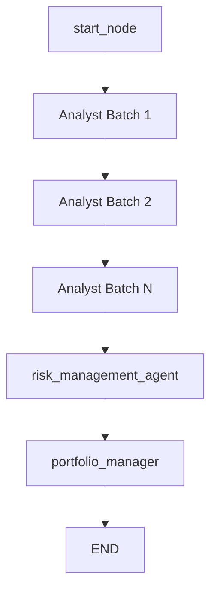
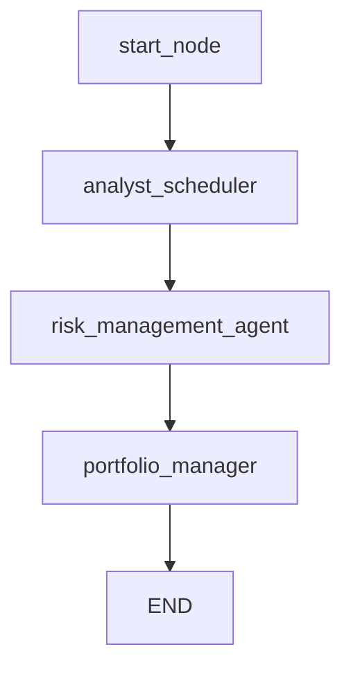
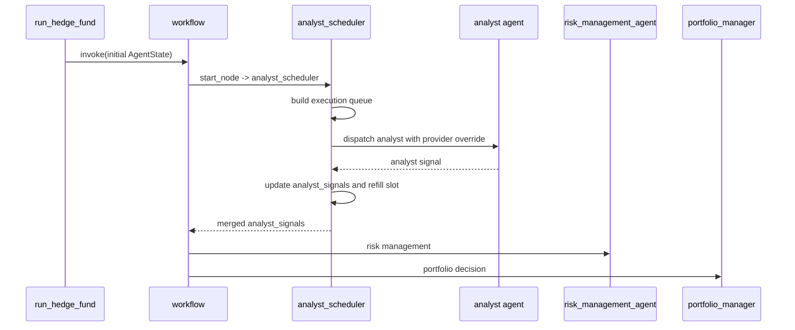

# 默认 Workflow Rolling Scheduler 设计文档

**文档日期**：2026 年 3 月 12 日  
**文档状态**：设计完成，试验已回退  
**目标读者**：维护默认 CLI / backtester 执行路径的开发者、性能优化审阅者  
**适用范围**：默认工作流 [src/main.py](src/main.py)，不包含 Web 自定义图 [app/backend/services/graph.py](app/backend/services/graph.py)

**2026-03-12 实装结果**：

1. 已完成一版 default rolling scheduler 试验实现，并在 CLI / backtester 路径做过 feature flag 验证，Web 自定义图路径未改动。
2. 在 `MiniMax=5`、`Volcengine=4`、`Zhipu=1`、`LLM_PRIMARY_PROVIDER=MiniMax`、`LLM_PARALLEL_PROVIDER_ALLOWLIST=MiniMax,Volcengine`、`ARK_FALLBACK_MODEL=doubao-seed-2.0-code` 的同口径 5 日验证下，rolling scheduler 实测 wall-clock 为 `878.67` 秒，优于 batch 基线 `933.64` 秒。
3. 但在同口径 20 日验证下，rolling scheduler 实测 wall-clock 为 `2969.15` 秒，劣于 20 日 baseline `2521.76` 秒，也劣于 20 日 allowlist 候选 `2736.26` 秒。
4. 20 日结果本身没有出现 `No ticker rows`、空仓或收益异常变平，收益侧与 baseline 一致为 `Total Return 0.33% / Max DD 0.48%`，因此本轮失败更像调度形态放大了长尾与 refill 开销，而不是状态边界污染。
5. 按回滚要求，rolling scheduler 代码已从默认 workflow 中撤回，仓库代码恢复到稳定 batch/barrier 状态；本文件保留为后续设计与失败记录。

---

## 1. 背景与目标

当前默认 workflow 的 analyst 执行路径，仍然采用 [src/main.py](src/main.py#L113) 到 [src/main.py](src/main.py#L155) 中的批次式全连接 barrier 结构：

1. 先按 `ANALYST_CONCURRENCY_LIMIT` 切出 analyst 批次。
2. `start_node` 只连接第一批 analyst。
3. 后一批每个 analyst 都依赖前一批全部 analyst。
4. 最后一批完成后才进入 `risk_management_agent`。

前面的 provider 调优已经证明，这种结构会放大慢尾问题：

1. 哪怕总并发槽位足够，只要一批里有慢节点，下一批就整体等待。
2. Zhipu 之所以拖累 5 日 wall-clock，本质上就是以慢尾身份参与了 analyst barrier。

我们已经做过一轮“lane-chain”静态拓扑实验，并完成真实 benchmark。结论是否定的：

1. 代码正确，回归测试通过。
2. 但真实 5 日 wall-clock 从 `933.64` 秒退化到 `1047.14` 秒。
3. Volcengine 平均时延从 `18.79` 秒上升到 `32.89` 秒。

这个结果说明：

1. 问题不只是 barrier 本身。
2. 更深层的问题是“静态图拓扑”和“provider 槽位分配”之间的耦合方式。

因此，本设计文档提出一个新的方向：**默认 workflow 引入 rolling scheduler 节点，把动态并发调度从静态图边里拿出来。**

本设计的目标是：

1. 保持默认 workflow 的业务语义不变。
2. 不放大 provider 压力，不突破现有并发上限。
3. 消除中间批次 barrier。
4. 避免 lane-chain 那种“长期绑定 provider/lane”导致的负载劣化。

---

## 2. 范围与非目标

### 2.1 本次设计覆盖范围

只覆盖默认 CLI / backtester 路径：

1. [src/main.py](src/main.py)
2. [src/backtesting/engine.py](src/backtesting/engine.py)
3. [src/utils/llm.py](src/utils/llm.py)
4. [src/utils/analysts.py](src/utils/analysts.py)

### 2.2 明确不在本次范围内的内容

下面这些内容不在本轮设计范围内：

1. Web 自定义图执行路径 [app/backend/services/graph.py](app/backend/services/graph.py)
2. `DailyPipeline` 的 fast / precise 去重逻辑
3. 各 analyst 自身的业务 prompt 和输出格式
4. `risk_management_agent` 与 `portfolio_manager` 的业务决策语义
5. 引入外部任务队列、消息队列、actor 框架

也就是说，这是一份**默认 workflow 调度层设计**，不是全项目运行时重构设计。

---

## 3. 当前数据流与问题点

### 3.1 当前默认 workflow 数据流

当前默认路径可简化为：

实际运行时的数据流是：

1. `run_hedge_fund()` 在 [src/main.py](src/main.py#L50) 构造初始 `AgentState`。
2. `build_parallel_provider_execution_plan()` 在 [src/utils/llm.py](src/utils/llm.py#L229) 为 analyst 名单生成 `agent_llm_overrides`。
3. workflow 中各 analyst 节点各自执行，并把结果写回 `state["data"]["analyst_signals"]`。
4. `risk_management_agent` 读取完整 analyst_signals 后执行。
5. `portfolio_manager` 读取风险管理结果并生成最终决策。

### 3.2 当前状态模型

[src/graph/state.py](src/graph/state.py) 中 `AgentState` 的关键结构是：

1. `messages`
2. `data`
3. `metadata`

其中本设计最关注的是：

1. `data.analyst_signals`
2. `metadata.agent_llm_overrides`
3. `metadata.model_name`
4. `metadata.model_provider`

### 3.3 当前结构的核心问题

当前结构最大的问题不是“analyst 太多”，而是“调度方式太静态”：

1. analyst 批次是预先切好的。
2. provider override 也是按波次预先分配的。
3. 一旦运行开始，图结构不会根据谁先完成而动态补位。

因此会出现两个损失：

1. 中间 barrier 等待损失。
2. provider 负载时序与 analyst 实际耗时不匹配导致的额外损失。

---

## 4. 新方案总览

### 4.1 核心思路

把默认 workflow 从“多 analyst 节点显式并行”改成“单个 scheduler 节点内部调度 analyst”。

新的默认 workflow 形态如下：

这里的 `analyst_scheduler` 不是一个新业务智能体，而是一个**运行时调度器节点**。它在内部负责：

1. 选择下一个要跑的 analyst。
2. 选择该 analyst 使用哪个 provider override。
3. 维护 provider 并发配额。
4. 在单个 analyst 完成后立即补位，而不是等待整批完成。

### 4.2 为什么是单节点 scheduler，而不是继续改图边

因为我们已经验证过，仅靠静态图边改造无法保证正收益。

静态图边的问题是：

1. batch 结构会造成全批等待。
2. lane 结构会造成长期绑定。

rolling scheduler 则允许：

1. 不再有中间批次 barrier。
2. 不再固定某个 provider 永久跑某条 lane。
3. 完成一个 analyst 就立即补发下一个 analyst。

---

## 5. 新方案的数据流设计

### 5.1 顶层数据流

新方案的默认数据流如下：

### 5.2 scheduler 内部的数据流

`analyst_scheduler` 内部建议分为四个阶段：

1. 初始化阶段
2. 任务发放阶段
3. 结果合并阶段
4. 收尾阶段

#### 初始化阶段

读取以下输入：

1. `selected_analysts`
2. `metadata.model_name`
3. `metadata.model_provider`
4. `metadata.agent_llm_overrides`
5. 当前 provider 并发上限配置

并构造：

1. 待执行 analyst 队列
2. provider 活跃槽位计数
3. `analyst_signals` 累积对象

#### 任务发放阶段

滚动地选择下一个可运行 analyst：

1. 先看哪个 provider 当前有空槽。
2. 再从待执行 analyst 中选择最合适的下一个。
3. 为该 analyst 绑定当次 provider override。

#### 结果合并阶段

单个 analyst 完成后：

1. 释放该 provider 槽位。
2. 把返回结果写入 `data.analyst_signals`。
3. 若仍有待执行 analyst，则立即补发。

#### 收尾阶段

全部 analyst 完成后：

1. 返回更新后的 `AgentState`
2. 保证 `risk_management_agent` 看到的 `analyst_signals` 与当前默认流程语义一致

---

## 6. 状态边界设计

### 6.1 允许 scheduler 读写的状态

`analyst_scheduler` 只应该读写下面几类状态：

#### 只读输入

1. `data.tickers`
2. `data.portfolio`
3. `data.start_date`
4. `data.end_date`
5. `metadata.model_name`
6. `metadata.model_provider`
7. `metadata.agent_llm_overrides`
8. `metadata.show_reasoning`

#### 可写输出

1. `data.analyst_signals`
2. 可选的 `metadata.scheduler_metrics`

### 6.2 不允许 scheduler 改动的状态

为了控制风险，scheduler 不应直接改下面这些内容：

1. `messages`
2. `risk_management_agent` 的输出字段
3. `portfolio_manager` 的输出字段
4. `data.portfolio` 本身

也就是说，scheduler 的职责只是：

1. 调度 analyst
2. 收集 analyst 结果

而不是提前介入风险决策或投资组合决策。

### 6.3 推荐新增的元数据埋点

为了后续调试和 benchmark，对 scheduler 建议新增下面这些埋点：

1. `scheduler_metrics.dispatched_count`
2. `scheduler_metrics.completed_count`
3. `scheduler_metrics.provider_dispatch_counts`
4. `scheduler_metrics.provider_active_peak`
5. `scheduler_metrics.queue_wait_ms`
6. `scheduler_metrics.total_scheduler_ms`

这些埋点应当只做观测，不参与业务逻辑判断。

---

## 7. Provider 调度设计

### 7.1 设计原则

新的 scheduler 不应直接绕过现有 provider 配置体系，而应复用 [src/utils/llm.py](src/utils/llm.py#L229) 已有的规则：

1. `LLM_PRIMARY_PROVIDER`
2. `LLM_PARALLEL_PROVIDER_ALLOWLIST`
3. `MINIMAX_PROVIDER_CONCURRENCY_LIMIT`
4. `VOLCENGINE_PROVIDER_CONCURRENCY_LIMIT`
5. `ZHIPU_PROVIDER_CONCURRENCY_LIMIT`

### 7.2 为什么不能直接复用当前“按波次一次性分配”的 override 输出

当前 `build_parallel_provider_execution_plan()` 的输出模式，本质上是：

1. 先生成一波 provider slot 顺序。
2. 再按 analyst 列表位置一次性分配。

这种模式适用于静态 batch，不适合 rolling scheduler。因为 rolling scheduler 需要的是：

1. 当前有哪些 provider 槽位空闲。
2. 下一次该给谁补位。

因此新方案建议在 [src/utils/llm.py](src/utils/llm.py) 中新增一层更底层的可复用能力，例如：

1. 获取当前可用 provider 配额
2. 获取 provider slot 序列生成器
3. 为单个 analyst 按需生成 override 配置

而不是继续把“整波 analyst -> 整波 override”作为唯一接口。

### 7.3 推荐的 provider 调度语义

推荐使用下面的调度语义：

1. provider 槽位按各自上限独立计数。
2. 主 provider 优先补位，但不允许饿死次级 provider。
3. allowlist 之外的 provider 不参与默认 analyst 主波次。
4. Zhipu 继续只承担 coding_plan 或显式慢路径角色。

---

## 8. Analyst 选择策略

### 8.1 最小版本

第一版不要引入复杂预测器，只做简单、稳定的 analyst 排序策略。

建议顺序：

1. 先按 [src/utils/analysts.py](src/utils/analysts.py) 现有顺序取 analyst
2. 可以额外增加一个轻量级 `cost_tier` 元数据，例如 `heavy / medium / light`
3. scheduler 在相同 provider 条件下优先发放更重的 analyst，降低长尾堆积到末尾的概率

### 8.2 为什么不先做复杂自适应策略

因为当前最大的收益点是调度结构，不是 analyst 成本预测精度。

如果一开始就引入复杂评分器，会把问题混在一起：

1. 到底是调度结构有效
2. 还是排序启发式有效

所以第一版应尽量保持可解释。

---

## 9. 测试口径

### 9.1 单元测试

单元测试至少应覆盖下面四类：

1. provider 配额是否被严格遵守
2. analyst 全部完成后 `analyst_signals` 是否齐全
3. allowlist 是否仍然生效
4. 单个 analyst 失败或 fallback 时，scheduler 是否能继续推进

### 9.2 结构测试

结构测试重点不是图边数量，而是 workflow 入口和出口语义：

1. `start_node -> analyst_scheduler`
2. `analyst_scheduler -> risk_management_agent`
3. `risk_management_agent -> portfolio_manager`

默认 workflow 应不再出现 analyst 批次之间的大量显式边。

### 9.3 回归测试

回归测试至少应复用当前已跑通的这几类：

1. [tests/execution/test_phase4_execution.py](tests/execution/test_phase4_execution.py)
2. [tests/backtesting/test_pipeline_mode.py](tests/backtesting/test_pipeline_mode.py)
3. [tests/test_analyst_concurrency.py](tests/test_analyst_concurrency.py)
4. [tests/test_llm_utils.py](tests/test_llm_utils.py)
5. [tests/test_llm_models.py](tests/test_llm_models.py)

同时建议新增：

1. `tests/test_default_workflow_scheduler.py`

用于专门验证默认 scheduler 的运行语义。

### 9.4 性能验证口径

性能验证应固定在当前最优 provider 配置上做对比：

1. `MINIMAX_PROVIDER_CONCURRENCY_LIMIT=5`
2. `VOLCENGINE_PROVIDER_CONCURRENCY_LIMIT=4`
3. `ZHIPU_PROVIDER_CONCURRENCY_LIMIT=1`
4. `LLM_PRIMARY_PROVIDER=MiniMax`
5. `LLM_PARALLEL_PROVIDER_ALLOWLIST=MiniMax,Volcengine`
6. `ARK_FALLBACK_MODEL=doubao-seed-2.0-code`

第一轮 benchmark 目标不是极致优化，而是满足下面两个条件：

1. 5 日 wall-clock 必须优于 `933.64` 秒
2. 不能出现 provider 限流反弹或错误大幅增加

如果这两个条件同时不满足，则不应继续扩大实现范围。

---

## 10. 回滚策略

### 10.1 回滚原则

本设计必须从一开始就把回滚做成默认能力，而不是事后补救。

### 10.2 推荐回滚方式

实现时建议保留一个显式开关，例如：

1. `DEFAULT_WORKFLOW_SCHEDULER_MODE=batch`
2. `DEFAULT_WORKFLOW_SCHEDULER_MODE=rolling`

默认值应先保持 `batch`，等 rolling 版本 benchmark 通过后再切换默认值。

### 10.3 为什么必须有开关

因为我们已经有一次失败实验经验：

1. lane-chain 在测试层完全正常。
2. 但真实 benchmark 明显退化。

这说明默认 workflow 的结构优化必须始终支持快速回退，不能再走“先改主路径，再测出来不行再手工回滚”的路线。

### 10.4 回滚触发条件

满足任一条件，应立即切回 `batch`：

1. 5 日 wall-clock 不优于 `933.64` 秒
2. 任一主要 provider 平均时延显著恶化
3. `rate_limit_errors` 明显回升
4. `analyst_signals` 完整性出现问题
5. 风险管理或组合管理输出与基线出现异常偏差

---

## 11. 实施顺序建议

建议按下面顺序推进：

1. 先在 [src/utils/llm.py](src/utils/llm.py) 提炼 provider 配额与单次 override 分配的底层接口。
2. 在 [src/main.py](src/main.py) 新增 `analyst_scheduler` 节点实现，但通过 feature flag 隐藏在默认路径后面。
3. 新增 scheduler 专项单测。
4. 跑聚焦回归测试。
5. 跑 3 日 benchmark。
6. 3 日结果正向后，再跑 5 日 benchmark。
7. 只有在优于 `933.64` 秒时，才讨论是否切换默认值。

---

## 12. 一句话结论

这份新方案的核心，不是继续改静态图边，而是把默认 workflow 的 analyst 调度从“静态 batch / lane 拓扑”升级成“provider-aware 的 rolling scheduler 节点”。

它的目标是：

1. 去掉中间 barrier
2. 避免 provider 长期绑定
3. 保持业务语义和并发上限不变
4. 用 feature flag 和明确 benchmark 门槛控制风险

如果后续要继续做结构优化，这会是比 lane-chain 更值得尝试的下一步。
