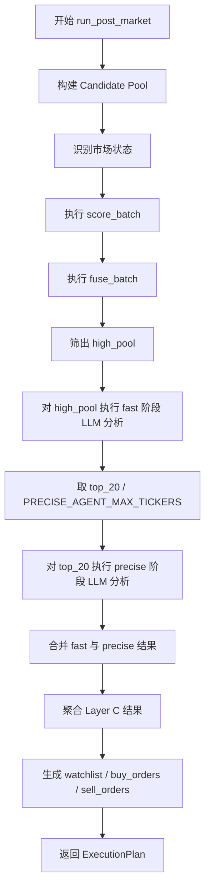
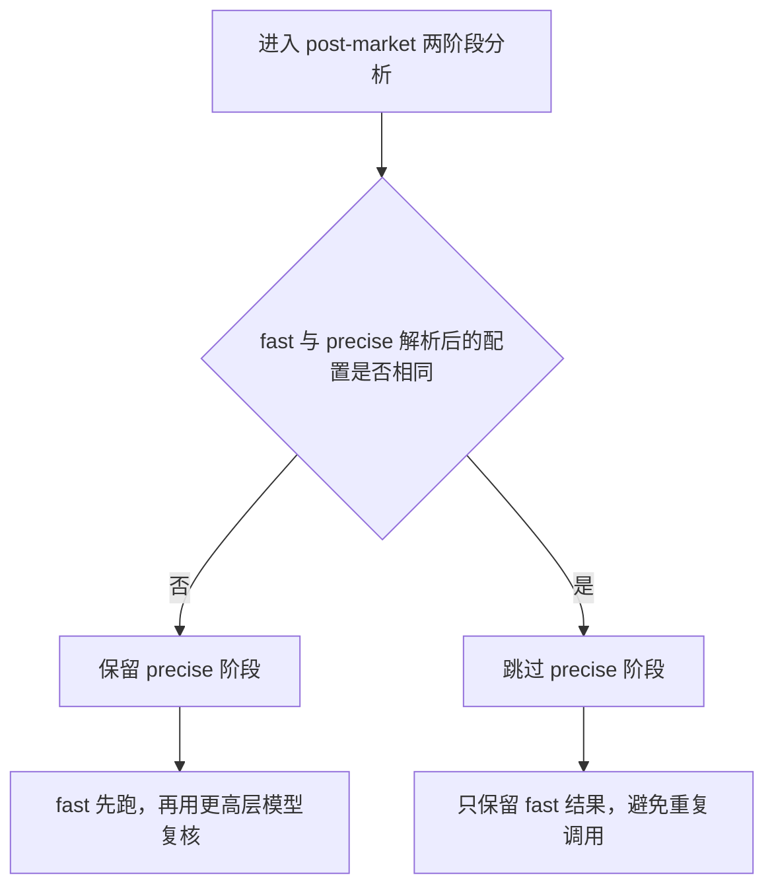
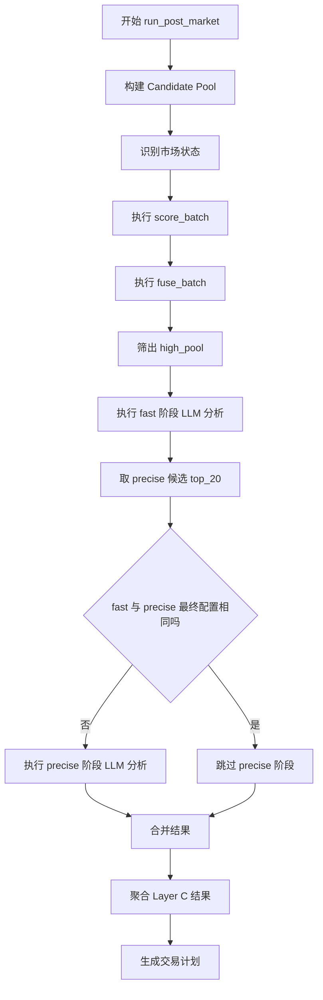

# Pipeline Fast / Precise 两阶段执行与去重优化说明

**文档日期**：2026 年 3 月 11 日  
**文档用途**：面向团队审阅本轮 pipeline 执行优化的背景、旧逻辑、新逻辑、执行流程、边界条件、风险控制与验证方式。  
**适用范围**：`src/execution/daily_pipeline.py` 的 post-market 执行流程，特别是 fast / precise 两阶段 LLM 调用路径。  

---

## 1. 执行摘要

本轮优化解决的不是“provider 分流失效”，而是 **pipeline 在非 OpenAI 场景下，会把同一批股票、同一批分析师、同一套模型配置重复执行两次** 的问题。

旧逻辑中，pipeline 固定分为两个阶段：

1. `fast` 阶段，先分析高分股票池。
2. `precise` 阶段，再对更小范围的高优先级股票复核一遍。

这个设计本身没有问题，前提是两阶段真正使用的是 **不同能力层级的模型**。在 OpenAI 路径下，这个前提成立：

1. `fast` 使用 `gpt-4.1-mini`。
2. `precise` 使用 `gpt-4.1`。

但在当前 Zhipu / MiniMax 路径下，这个前提通常不成立：

1. `fast` 最终解析到的仍然是基础配置。
2. `precise` 最终解析到的还是同一个基础配置。

于是，两阶段在很多运行里退化成：

1. 同一个 provider。
2. 同一个 model。
3. 对几乎同一批 ticker 再调用一遍同一批 analyst。

这会直接带来两类问题：

1. 时间成本被重复消耗。
2. 第二轮没有真正引入“更强模型复核”的增量信息。

本轮优化的核心原则是：

> 只有当 fast 和 precise **实际解析后的 provider + model 不同** 时，precise 阶段才值得保留；如果它们完全相同，就跳过重复 precise 调用。

---

## 2. 为什么会出现这个问题

### 2.1 Pipeline 的原始设计意图

Pipeline 的 post-market 路径不是一次性把所有股票都送进最重的 LLM 分析，而是采用分层筛选：

1. 先做候选池构建。
2. 再做策略打分和信号融合。
3. 只把高分股票送入 fast 分析。
4. 再把其中更高优先级的一小部分送入 precise 分析。
5. 最后聚合成 Layer C 结果和买卖计划。

这个思路本质上是“先粗筛，再精筛”。

### 2.2 问题不在两阶段设计，而在两阶段是否真的不同

如果 `fast` 和 `precise` 对应的是两套不同能力、不同成本的模型，那么“复跑一次”是合理的。

但如果二者最终解析后，落到的是同一个 provider 和同一个 model，那么“第二阶段”在语义上仍然叫 `precise`，在技术上却已经失去了层级差异。

也就是说：

1. 流程名仍然是两阶段。
2. 实际执行却变成了同一阶段跑两遍。

这就是冗余的根源。

---

## 3. 旧逻辑的完整执行流程

下面这张图展示的是优化前的 post-market 逻辑。注意，这张图描述的是 **流程结构**，不是模型配置是否发生变化。



这里真正昂贵的部分不是前面的候选池构建，而是：

1. `fast_agent`
2. `precise_agent`

从真实 timing 看，这两段是当前主要耗时来源。

---

## 4. 模型解析逻辑到底是什么

### 4.1 代码入口

模型解析的关键函数在 [src/execution/daily_pipeline.py](src/execution/daily_pipeline.py#L53)。

它的职责不是直接调用 LLM，而是根据：

1. 当前阶段是 `fast` 还是 `precise`
2. 当前基础模型是什么
3. 当前基础 provider 是什么

来决定这一阶段真正应该使用什么模型配置。

### 4.2 当前解析规则

当前规则可以压缩成下面这张表：

| 基础 provider | 基础 model | fast 解析结果 | precise 解析结果 |
|------|------|------|------|
| OpenAI | gpt-4.1 / gpt-4.1-mini | gpt-4.1-mini | gpt-4.1 |
| Zhipu | glm-4.7 | glm-4.7 | glm-4.7 |
| MiniMax | MiniMax-M2.5 | MiniMax-M2.5 | MiniMax-M2.5 |
| 其他 provider | 任意当前基础模型 | 原样返回 | 原样返回 |

也就是说，真正保留“层级切换”的，目前只有 OpenAI 路径。

### 4.3 为什么之前要这样设计

因为 OpenAI 路径原本就带有明确的“快模型 / 强模型”区分：

1. `gpt-4.1-mini` 更适合第一轮快筛。
2. `gpt-4.1` 更适合第二轮精筛。

而 Zhipu / MiniMax 当前在 pipeline 里并没有等价实现出这种“双模型层级映射”，所以只能退回基础模型本身。

---

## 5. 为什么非 OpenAI 场景会形成重复调用

### 5.1 用一个最直接的例子说明

假设当前运行参数是：

```text
base_model_provider = Zhipu
base_model_name = glm-4.7
```

那么模型解析结果是：

```text
fast    -> Zhipu / glm-4.7
precise -> Zhipu / glm-4.7
```

再结合 pipeline 的业务流程：

1. `high_pool` 中的股票先跑一轮 fast。
2. `top_20` 中的股票再跑一轮 precise。

如果 `top_20` 本来就是 `high_pool` 的前几只，而 `fast` 和 `precise` 又使用了完全相同的配置，那么技术上发生的事情就是：

1. 第一轮：`glm-4.7` 分析这些 ticker。
2. 第二轮：`glm-4.7` 再分析一次这些 ticker。

除了时间多花一轮，并没有引入新的模型层级。

### 5.2 旧路径与新路径的分叉图



这张图里最重要的是判断依据：

1. 不是看 provider 名字是不是 OpenAI。
2. 也不是看阶段名字是不是 `precise`。
3. 而是看 **fast 和 precise 最终解析后的真实执行配置是否相同**。

---

## 6. 这次优化具体做了什么

### 6.1 新增的判断函数

新增判断逻辑在 [src/execution/daily_pipeline.py](src/execution/daily_pipeline.py#L64)。

它做的事情很简单：

1. 分别解析 `fast` 的最终模型配置。
2. 分别解析 `precise` 的最终模型配置。
3. 如果两边的 `model_name` 和 `provider_name` 完全一致，就认为 precise 阶段是重复执行。

可以把它写成伪代码：

```python
fast_model, fast_provider = resolve("fast")
precise_model, precise_provider = resolve("precise")

skip_precise = (
    fast_model == precise_model
    and fast_provider == precise_provider
)
```

### 6.2 在哪里真正跳过

真正跳过 precise 的位置在 [src/execution/daily_pipeline.py](src/execution/daily_pipeline.py#L135)。

原来的逻辑是：

```python
if top_20:
    precise_results = self.agent_runner(..., "precise")
```

现在变成：

```python
if top_20 and not self._skip_precise_stage:
    precise_results = self.agent_runner(..., "precise")
```

这意味着：

1. 如果 `precise` 真有独立价值，就照常运行。
2. 如果 `precise` 只是同配置重跑，就直接跳过。

### 6.3 新逻辑的完整流程图



---

## 7. 为什么这个优化是安全的

### 7.1 它没有改变筛选规则

这次优化没有改下面这些东西：

1. `candidate_pool` 的构建方式。
2. `score_batch` 的打分逻辑。
3. `fuse_batch` 的融合逻辑。
4. `high_pool` 和 `top_20` 的筛选规模。
5. `Layer C` 的聚合方式。

改动的只是：

1. 在 `precise` 阶段真正执行之前，先判断这轮复核是不是“同模型再跑一次”。

### 7.2 它没有影响 OpenAI 原始双层设计

OpenAI 场景下，`fast` 和 `precise` 仍然会解析为不同模型：

1. `fast = gpt-4.1-mini`
2. `precise = gpt-4.1`

因此 OpenAI 的“两阶段粗筛 + 精筛”语义是完整保留的。

### 7.3 它不会误杀真正不同的 provider / model 组合

只有当下面两个条件同时成立时才跳过：

1. provider 相同
2. model 相同

只要任意一个不同，就保留 precise。

因此它不是“非 OpenAI 一律跳过”，而是“同配置重复调用才跳过”。

---

## 8. 用三个场景对比理解

### 8.1 场景一：OpenAI

```text
base_model_provider = OpenAI
base_model_name = gpt-4.1
```

解析结果：

```text
fast    -> OpenAI / gpt-4.1-mini
precise -> OpenAI / gpt-4.1
```

结论：

1. 配置不同。
2. precise 有独立意义。
3. 保留两阶段。

### 8.2 场景二：Zhipu

```text
base_model_provider = Zhipu
base_model_name = glm-4.7
```

解析结果：

```text
fast    -> Zhipu / glm-4.7
precise -> Zhipu / glm-4.7
```

结论：

1. 配置完全相同。
2. precise 不再提供额外模型层级。
3. 跳过重复 precise。

### 8.3 场景三：MiniMax

```text
base_model_provider = MiniMax
base_model_name = MiniMax-M2.5
```

解析结果：

```text
fast    -> MiniMax / MiniMax-M2.5
precise -> MiniMax / MiniMax-M2.5
```

结论：

1. 同样属于同配置。
2. 同样适合跳过重复 precise。

---

## 9. 这次优化与之前 provider 修复的关系

这里很容易混淆两件事，但它们实际上是两类不同的问题。

### 9.1 上一轮修复解决的是“路由正确性”

上一轮修复主要解决：

1. pipeline 不应该在显式指定 Zhipu 时，内部又偷偷切回 OpenAI 默认模型。
2. 非 OpenAI provider 应该在 pipeline 里保持显式传入的基础模型配置。

这个修复保证了 **请求路由是对的**。

### 9.2 这次优化解决的是“正确但冗余”

在上一轮修复之后，请求已经路由正确了，但也正因为“正确保留了同一个基础 provider / model”，两阶段执行就暴露出了新的冗余：

1. fast 正确地调用了 Zhipu / MiniMax。
2. precise 也正确地调用了同一个 Zhipu / MiniMax。
3. 正确是正确了，但第二次没有增量价值。

所以这次优化是在“路由正确”的前提下，进一步消掉“同配置重复调用”。

---

## 10. 回归测试是怎么保证的

本轮新增和相关的验证主要在 [tests/execution/test_phase4_execution.py](tests/execution/test_phase4_execution.py)。

### 10.1 已验证的关键行为

1. [tests/execution/test_phase4_execution.py](tests/execution/test_phase4_execution.py#L189) 证明：非 OpenAI provider 的默认 pipeline runner 会保留显式 provider / model，不会偷偷切回 OpenAI。
2. [tests/execution/test_phase4_execution.py](tests/execution/test_phase4_execution.py#L208) 证明：OpenAI 场景仍然保持 `fast -> gpt-4.1-mini`、`precise -> gpt-4.1`。
3. [tests/execution/test_phase4_execution.py](tests/execution/test_phase4_execution.py#L227) 证明：非 OpenAI 且 fast / precise 解析相同时，会跳过重复 precise。
4. [tests/execution/test_phase4_execution.py](tests/execution/test_phase4_execution.py#L262) 证明：OpenAI 场景下 precise 仍然保留，不会被误跳过。

### 10.2 为什么这组测试足够关键

因为它同时覆盖了两个维度：

1. 路由正确性有没有被破坏。
2. 优化是否只作用于真正的重复调用场景。

也就是说，这不是单纯的“加速测试”，而是“加速 + 兼容性”双重回归。

---

## 11. 这次优化预期会省掉什么时间

从现有 timing 结构看，当前主要耗时在：

1. `fast_agent`
2. `precise_agent`

在非 OpenAI 场景下，如果 `precise` 本来就是对同一模型的重复调用，那么这次优化理论上最直接省掉的是：

1. 第二轮 analyst LLM 调用时间。
2. 第二轮 provider 并发槽位占用。
3. 第二轮可能触发的重试、回退和解析开销。

需要注意的是，它并不会减少：

1. Candidate Pool 构建时间。
2. 市场状态识别时间。
3. Layer B 打分和融合时间。
4. Layer C 聚合时间。

所以，这一刀优化针对的是 **重复的 LLM 成本**，不是所有阶段都一起加速。

---

## 12. 这个优化的边界与限制

### 12.1 它默认“同配置重复运行不会显著提高质量”

这是这次优化的隐含假设。如果后续团队明确希望：

1. 即便是同一个模型，也要通过“再问一遍”获得更稳定结果；
2. 或者通过不同提示词模板让第二轮同模型复核产生新信息；

那么当前这版优化就需要重新评估。

### 12.2 当前判断粒度还是“provider + model”级别

目前判断是否重复，主要看：

1. provider
2. model

如果未来 `fast` 和 `precise` 虽然用的是同一个模型，但提示词、上下文、分析目标明显不同，那么只看 provider + model 可能还不够细。

那时可以把判定条件继续扩展为：

1. provider
2. model
3. prompt profile
4. reasoning depth
5. output schema

也就是说，这次优化是一个合理的当前版本，但不是永远的终局版本。

---

## 13. 后续建议

### 13.1 短期建议

最直接的下一步，是在当前 tuned lane cap 配置下重跑一次 5 日 MVP，量化：

1. 墙钟时间减少了多少。
2. `precise_agent` 时间是否明显下降或归零。
3. provider metrics 是否继续保持 0 限流。

### 13.2 中期建议

如果这次收益明显，建议补一层埋点，明确记录：

1. 每日是否跳过 precise。
2. 因为“同配置”被跳过了多少 ticker。
3. 节省了多少累计时间。

### 13.3 长期建议

如果未来希望恢复“真正的两阶段能力差异”，建议为非 OpenAI provider 也建立明确的层级映射，例如：

1. fast 使用更快或更便宜的模型。
2. precise 使用更强或更稳的模型。

只有这样，`fast / precise` 才会重新从“流程上的两阶段”变成“能力上的两阶段”。

---

## 14. 一句话总结

这次优化的本质不是删除 precise 阶段，而是把 pipeline 从“按阶段名机械执行两段”，改成“按真实模型差异决定第二段是否有必要执行”。

如果 `fast` 和 `precise` 最终就是同一个 provider、同一个 model，那么继续跑第二轮只是重复消耗时间；如果它们真的不同，那么两阶段依旧完整保留。

---

## 15. 结合本次 5 日样本的定量 timing 例子

上面的解释是逻辑层面的。为了避免文档停留在“看起来合理”，这里直接把本轮真实 5 日样本里的 timing 摊开。

### 15.1 对比对象说明

这里使用两组已经完成的真实样本：

1. **修复后但未进一步去重的 registry MVP 运行**。
2. **MiniMax 优先 lane cap 调优后的 tuned MVP 运行**。

这两组样本都还处于“旧的 fast + precise 都执行”的结构，因此正好能说明：

1. `fast_agent` 和 `precise_agent` 的确是主耗时。
2. `precise_agent` 在非 OpenAI 场景下占用了一大块时间。
3. 所以“跳过同配置 precise”不是枝节优化，而是直接打在主瓶颈上。

### 15.2 5 日样本的阶段耗时总表

| 样本 | fast_agent 合计 | precise_agent 合计 | post_market 合计 | precise 占 post_market 比例 |
|------|----------------:|-------------------:|-----------------:|----------------------------:|
| registry MVP | 2707.309 秒 | 3117.563 秒 | 5899.978 秒 | 52.84% |
| tuned MVP | 1367.110 秒 | 1484.493 秒 | 2902.490 秒 | 51.15% |

这张表说明了两个事实：

1. 无论是 registry 版还是 tuned 版，`precise_agent` 都不是边缘成本，而是约一半的 post-market 时间。
2. 只要这部分在非 OpenAI 场景下属于“同配置重复调用”，那它就是最值得优先砍掉的时间块。

### 15.3 tuned 样本的逐日观察

下面用 tuned 样本举例，因为它已经是当前更接近真实生产候选的配置。

| 交易日 | Layer B 数量 | fast_agent | precise_agent | total_post_market |
|------|-------------:|-----------:|--------------:|------------------:|
| 2026-02-02 | 3 | 517.617 秒 | 407.348 秒 | 945.477 秒 |
| 2026-02-03 | 4 | 473.090 秒 | 583.673 秒 | 1064.082 秒 |
| 2026-02-04 | 1 | 161.802 秒 | 129.224 秒 | 300.352 秒 |
| 2026-02-05 | 1 | 140.838 秒 | 155.015 秒 | 302.642 秒 |
| 2026-02-06 | 1 | 73.763 秒 | 209.233 秒 | 289.937 秒 |

从这些数字里可以直接读出：

1. 当前慢的不是 candidate pool，也不是 score_batch。
2. 真正慢的是两段 LLM 调用。
3. 即便在只分析 1 只 ticker 的日子里，`precise_agent` 依然经常占到 100 秒到 200 秒量级。

这就意味着，哪怕只是跳过“同配置的第二轮”，也可能直接省掉单日数分钟到十几分钟。

### 15.4 registry 样本说明了什么

registry 样本在未做 MiniMax 优先调度时更慢，但它同样展示了相同结构：

| 交易日 | fast_agent | precise_agent | total_post_market |
|------|-----------:|--------------:|------------------:|
| 2026-02-02 | 745.427 秒 | 714.323 秒 | 1482.496 秒 |
| 2026-02-03 | 975.334 秒 | 1648.630 秒 | 2639.516 秒 |
| 2026-02-04 | 269.796 秒 | 317.871 秒 | 598.192 秒 |
| 2026-02-05 | 444.817 秒 | 211.720 秒 | 674.294 秒 |
| 2026-02-06 | 271.935 秒 | 225.019 秒 | 505.480 秒 |

它说明在 provider 层没有进一步压限流和分流时：

1. `precise_agent` 的体量依然巨大。
2. fast 与 precise 的累计成本接近对半。
3. 因此“先做 provider 调优，再做重复 precise 去重”是合理顺序。

### 15.5 为什么这组数字支持本次优化

把上面的结论压缩成一句话就是：

> 真实样本里，`precise_agent` 长期占据 post-market 约一半时间；而在非 OpenAI 同配置场景下，这一半时间中的相当一部分并不是“更高能力复核”，而是“同模型重复执行”。

因此，这次优化虽然代码改动很小，但它打中的不是边角料，而是主时间块。

---

## 16. 面向审阅者的摘要版结论

如果后续是非作者审阅，只想快速判断“这次优化值不值得保留”，可以直接看下面这页。

### 16.1 审阅者需要先确认的前提

这次优化成立，依赖下面这个事实：

1. 当前非 OpenAI pipeline 路径里，`fast` 和 `precise` 往往会解析成同一个 provider + model。

只要这个事实成立，去重就是合理的。

### 16.2 三个关键判断

#### 判断一：它有没有改变策略逻辑

没有。

它没有改：

1. 候选池构建。
2. Layer B 打分。
3. 信号融合。
4. Watchlist 生成。
5. 买卖计划生成。

它只改了：

1. `precise` 在真正执行之前，先判断自己是不是“同配置重复调用”。

#### 判断二：它会不会破坏 OpenAI 原来的两层设计

不会。

因为 OpenAI 路径下：

1. `fast = gpt-4.1-mini`
2. `precise = gpt-4.1`

它们并不相同，所以 precise 仍然保留。

#### 判断三：它值不值得做

值得。

原因不是“代码优雅”，而是：

1. 当前 `precise_agent` 占 post-market 约一半时间。
2. 在非 OpenAI 同配置场景下，这部分时间存在明显重复。
3. 这是当前最直接、最保守、最容易验证收益的一刀。

### 16.3 审阅建议清单

如果要做严格代码审阅，建议重点确认下面五项：

1. 判断重复的依据是否足够保守。当前答案是：只在 provider 和 model 都相同的情况下才跳过。
2. OpenAI 双层路径是否完全保留。当前答案是：保留，且已有测试覆盖。
3. 非 OpenAI 显式 provider / model 是否仍然正确透传。当前答案是：保留，且已有测试覆盖。
4. 跳过 precise 后，Layer C 聚合是否仍能工作。当前答案是：可以，因为 fast 结果仍然完整进入聚合。
5. 是否需要追加运行时埋点。当前答案是：建议追加，但不是本次优化生效的前置条件。

### 16.4 审阅者版结论

如果审阅者接受下面这个工程判断：

> “同一个 provider、同一个 model、同一轮候选范围下的第二次调用，不应被视为真正的精筛复核。”

那么这次优化就是应该保留的。

它的本质是把 pipeline 从“固定跑两层”修正为“只有在真实存在第二层模型差异时才跑第二层”。这比原来的实现更符合流程意图，也更符合当前真实的 provider 配置。

---

## 17. 建议的下一步验证

为了把这份文档里的判断从“强推断”升级为“定量确认”，建议下一步做一轮非常明确的复验：

1. 保持当前 tuned lane cap 配置不变。
2. 使用本次已经改好的代码重跑 5 日 MVP。
3. 对比新的 `fast_agent`、`precise_agent`、`total_post_market` 和墙钟时间。

预期观察点是：

1. 非 OpenAI 场景下，`precise_agent` 应显著下降，理想情况下接近 0。
2. 总墙钟时间应继续下降。
3. provider metrics 应继续保持低限流或 0 限流。

如果这轮复验结果成立，这份文档里的核心结论就不再只是“设计正确”，而会升级为“设计正确且收益已被真实样本再次确认”。

---

## 18. 2026-03-11 实际复验结果

本节记录按 `13.1` 和 `13.2` 建议实际执行后的结果。此次复验使用的是：

1. 当前 tuned lane cap 配置。
2. 已加入 precise 去重逻辑的最新代码。
3. 已加入每日 skip 埋点的 timing 记录。

对应产物如下：

1. [data/reports/ab_dual_provider_validation_20260311_5d_tuned_dedup.mvp.walltime.txt](data/reports/ab_dual_provider_validation_20260311_5d_tuned_dedup.mvp.walltime.txt)
2. [data/reports/ab_dual_provider_validation_20260311_5d_tuned_dedup.mvp.timings.jsonl](data/reports/ab_dual_provider_validation_20260311_5d_tuned_dedup.mvp.timings.jsonl)
3. [logs/llm_metrics_ab_dual_provider_validation_20260311_5d_tuned_dedup.summary.json](logs/llm_metrics_ab_dual_provider_validation_20260311_5d_tuned_dedup.summary.json)

### 18.1 墙钟时间减少了多少

与上一轮 tuned 运行相比：

| 样本 | 墙钟时间 |
|------|---------:|
| tuned 旧版 | 2911.79 秒 |
| tuned + dedup | 1691.04 秒 |

本次去重后，墙钟时间继续下降：

1. 绝对减少 1220.75 秒。
2. 相对下降约 41.9%。
3. 等价于在上一轮 tuned 基础上再获得约 1.72 倍速度提升。

这说明“跳过同配置 precise”不是小修小补，而是继续显著压缩了真实总运行时间。

### 18.2 `precise_agent` 是否明显下降或归零

答案是：**已经归零**。

本次 5 日 dedup 样本的逐日 timing 如下：

| 交易日 | fast_agent | precise_agent | estimated_skipped_precise | precise_stage_skipped |
|------|-----------:|--------------:|--------------------------:|----------------------|
| 2026-02-02 | 302.272 秒 | 0.000 秒 | 302.272 秒 | true |
| 2026-02-03 | 494.086 秒 | 0.000 秒 | 494.086 秒 | true |
| 2026-02-04 | 204.557 秒 | 0.000 秒 | 204.557 秒 | true |
| 2026-02-05 | 182.212 秒 | 0.000 秒 | 182.212 秒 | true |
| 2026-02-06 | 309.513 秒 | 0.000 秒 | 309.513 秒 | true |

汇总后：

1. `precise_agent` 合计从上一轮 tuned 的 1484.493 秒降到 0 秒。
2. 新增埋点估算的 `estimated_skipped_precise` 合计约 1492.640 秒。
3. 这个估算值与上一轮真实的 `precise_agent` 总量非常接近，说明新增埋点口径是可信的。

### 18.3 provider metrics 是否继续保持 0 限流

答案是：**保持了 0 限流**。

本次 metrics summary 显示：

1. 总调用 132 次，成功 129 次，错误 3 次。
2. `rate_limit_errors = 0`。
3. MiniMax 105 次调用，Zhipu 27 次调用。
4. provider 分流仍然有效，且没有回到之前的限流问题。

与上一轮 tuned 相比：

1. 总 attempts 从 262 次降到 132 次。
2. 调用量几乎减半。
3. 这与“第二轮 precise 被整体跳过”的预期完全一致。

### 18.4 中期建议的埋点是否已经到位

答案是：**已经到位，并且本次复验已经产出了可直接使用的数据**。

当前每日 timing 中已经新增：

1. `precise_stage_skipped`：当天是否跳过 precise。
2. `skipped_precise_ticker_count`：当天因同配置被跳过的 ticker 数。
3. `estimated_skipped_precise`：按 fast 阶段时间比例估算的节省秒数。

本次 5 日样本的埋点汇总如下：

| 指标 | 数值 |
|------|-----:|
| 跳过 precise 的交易日数 | 5 / 5 |
| 跳过的 precise ticker 总数 | 10 |
| 估算节省的 precise 时间 | 1492.640 秒 |

逐日看，跳过 ticker 数分别为：

1. 2026-02-02：3 只
2. 2026-02-03：4 只
3. 2026-02-04：1 只
4. 2026-02-05：1 只
5. 2026-02-06：1 只

### 18.5 这轮复验最终证明了什么

现在这份文档可以把结论从“设计上合理”升级为“已被真实 5 日样本验证”：

1. 非 OpenAI 同配置场景下，precise 的确是重复调用。
2. 跳过这部分调用后，`precise_agent` 时间已经归零。
3. 墙钟时间继续下降约 41.9%。
4. provider metrics 继续保持 0 限流。
5. 调用总量近乎减半，且策略输出结果口径保持正常。

因此，这次优化应视为一次已经完成验证的有效提速，而不再只是待确认的候选方案。

---

## 19. 2026-03-11 晚间补充实验：Doubao 并发扩容与 Zhipu 慢尾剥离

在 `18` 节完成后，又继续做了 provider 侧的并行实验，目的不是再验证 dedup 本身，而是回答另一个更实际的问题：

1. 在 precise 已经去重的前提下，Volcengine Doubao 是否值得加入 analyst 并行波次。
2. 如果加入，应该保留 Zhipu 在 analyst 并行波次里继续参与，还是只让它保留 coding_plan 职责。
3. Doubao 的 lane 从 `3` 提高到 `4` 是否还有增益。

### 19.1 新结论先说

截至 2026-03-11，当天已验证的最优 5 日配置为：

1. `MINIMAX_PROVIDER_CONCURRENCY_LIMIT=5`
2. `VOLCENGINE_PROVIDER_CONCURRENCY_LIMIT=4`
3. `ZHIPU_PROVIDER_CONCURRENCY_LIMIT=1`
4. `LLM_PARALLEL_PROVIDER_ALLOWLIST=MiniMax,Volcengine`
5. `ARK_FALLBACK_MODEL=doubao-seed-2.0-code`

这组配置的含义是：

1. analyst 并行波次只允许 MiniMax 和 Volcengine 参加。
2. Zhipu 不再参与 analyst 并行波次，避免成为批次 barrier 的慢尾。
3. Zhipu 仍保留 coding_plan 路径，不被完全移除。

### 19.2 为什么要排除 Zhipu，而不是简单堆更多 provider

本轮实验前后最大的认知变化不是“找到了更快的第三家 provider”，而是确认了当前工作流的真实瓶颈来自批次 barrier。

当前 analyst 执行不是完全流式推进，而是按批次推进：

1. 一个批次中的 analyst 要基本完成。
2. 后续批次才会继续推进。

这意味着，决定单批 wall-clock 的不是平均速度，而是最慢那一条 lane。

在 `MiniMax=5, Doubao=3, Zhipu=1` 的三 provider 配置里，Zhipu 虽然只有一条 lane，但它是明显更慢的那条尾部路径，结果就是：

1. 理论 lane 数增加了。
2. 真实 wall-clock 却没有按比例下降。
3. 慢尾 Zhipu 反而把后续批次卡住。

因此，后续优化的关键动作不是“再加 provider”，而是“把慢尾从 analyst 并行波次里剥离出去”。

### 19.3 四组结果的真实对比

下面是当前这轮优化链路里最重要的四组 5 日实测结果：

| 配置 | 说明 | 5 日 wall-clock |
|------|------|----------------:|
| MiniMax=5 + Zhipu=1 | tuned + dedup 双 provider 基线 | 1691.04 秒 |
| MiniMax=5 + Doubao=3 + Zhipu=1 | 三 provider 全参与 analyst 波次 | 1757.75 秒 |
| MiniMax=5 + Doubao=3，排除 Zhipu | allowlist 生效后的首个有效版本 | 950.02 秒 |
| MiniMax=5 + Doubao=4，排除 Zhipu | 当前最佳实测配置 | 933.64 秒 |

从这张表可以直接读出三个结论：

1. Doubao 本身不是问题，真正的问题是 Zhipu 慢尾参与 analyst 波次。
2. 一旦排除 Zhipu，wall-clock 立即从 1691.04 秒降到 950.02 秒量级。
3. 在此基础上把 Doubao lane 从 `3` 提到 `4`，仍能继续下降到 933.64 秒，但收益已经进入边际收敛区。

### 19.4 真 5+4 与伪 5+4 必须区分

当天其实跑过两次“看起来像 5+4”的实验，但只有后一轮能算真结果。

第一轮名义上导出了 `VOLCENGINE_PROVIDER_CONCURRENCY_LIMIT=4`，但由于 [src/main.py](src/main.py#L40) 使用了 `load_dotenv(override=True)`，`.env` 中原来的 `VOLCENGINE_PROVIDER_CONCURRENCY_LIMIT=3` 把 shell 导出的值覆盖回去了。

结果就是：

1. 运行前以为自己在测 `5 + 4`。
2. 实际 slot 序列还是 `5 + 3`。
3. 那次得到的更低 wall-clock 不能作为真 `5 + 4` 结论引用。

后来把 `.env` 中的 `VOLCENGINE_PROVIDER_CONCURRENCY_LIMIT` 同步改到 `4` 后，重新跑出的结果才是本节使用的真 `5 + 4` 数据。

这个细节非常关键，因为它说明后续所有并发实验都必须先确认“dotenv 最终解析后的有效值”，不能只看终端里 export 了什么。

### 19.5 真 5+4 的运行结果

真 `MiniMax=5 + Doubao=4，排除 Zhipu analyst 波次` 的最终产物如下：

1. [data/reports/ab_dual_provider_validation_20260311_5d_tuned_dedup_mx5_doubao4_allowlist_true.mvp.walltime.txt](data/reports/ab_dual_provider_validation_20260311_5d_tuned_dedup_mx5_doubao4_allowlist_true.mvp.walltime.txt)
2. [data/reports/ab_dual_provider_validation_20260311_5d_tuned_dedup_mx5_doubao4_allowlist_true.mvp.timings.jsonl](data/reports/ab_dual_provider_validation_20260311_5d_tuned_dedup_mx5_doubao4_allowlist_true.mvp.timings.jsonl)
3. [logs/llm_metrics_ab_dual_provider_validation_20260311_5d_tuned_dedup_mx5_doubao4_allowlist_true.summary.json](logs/llm_metrics_ab_dual_provider_validation_20260311_5d_tuned_dedup_mx5_doubao4_allowlist_true.summary.json)

核心结果如下：

1. 5 日 wall-clock = `933.64` 秒。
2. 相对 1691.04 秒双 provider dedup 基线，再下降 `757.40` 秒，约 `44.79%`。
3. 相对 950.02 秒的 `5+3 allowlist` 版本，再下降 `16.38` 秒，约 `1.72%`。
4. `rate_limit_errors = 0`。
5. 逐日 timing 中 `precise_stage_skipped = true`，`precise_agent = 0.0` 仍然保持成立。

provider 侧 summary 也支持同一个结论：

1. Volcengine `50` 次调用，平均约 `18.79` 秒/次。
2. MiniMax `72` 次调用，平均约 `23.09` 秒/次。
3. Zhipu 只剩 `7` 次调用，平均约 `43.36` 秒/次，全部是 coding_plan 相关慢路径。

这说明当前最稳妥的做法不是让 Zhipu 继续抢 analyst 波次，而是把它保留在需要它的少量专用路径上。

### 19.6 当前推荐配置

如果目标是当前代码结构下的最优实用速度，而不是继续做大规模架构改造，那么可以把推荐配置暂时定为：

1. `MINIMAX_PROVIDER_CONCURRENCY_LIMIT=5`
2. `VOLCENGINE_PROVIDER_CONCURRENCY_LIMIT=4`
3. `ZHIPU_PROVIDER_CONCURRENCY_LIMIT=1`
4. `LLM_PRIMARY_PROVIDER=MiniMax`
5. `LLM_PARALLEL_PROVIDER_ALLOWLIST=MiniMax,Volcengine`
6. `ARK_FALLBACK_MODEL=doubao-seed-2.0-code`

同时要明确这不是“最终架构最优解”，而是“在现有 batch/barrier 工作流下的当前最优参数解”。

### 19.7 下一步优化应该往哪里走

到这一步以后，再继续增加 Doubao lane 或继续堆 provider，预期收益都不会太大了。

真正更高价值的下一步，应该转向：

1. 减少 analyst 批次之间的 barrier。
2. 让慢路径和快路径进一步解耦。
3. 研究能否让 coding_plan 与 analyst 主波次彻底分离调度。

也就是说，当前参数优化已经基本把“provider 并发层面”的低垂果实摘得差不多了，后续再要显著提速，重点就应该从“调 lane 数”切到“改执行结构”。
