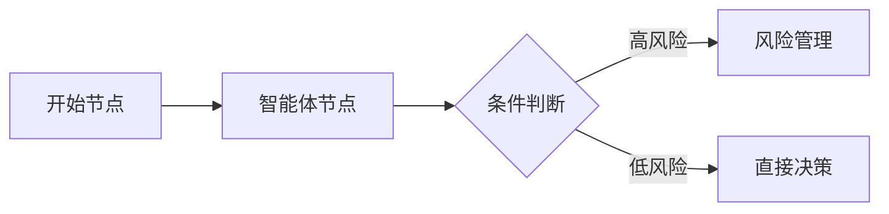

# 第三章：LangGraph 工作流

## 学习目标

完成本章节学习后，你将能够：

### 基础目标（⭐ - 必掌握）

- [ ] 能够用自己的话解释 **LangGraph 框架**的核心设计哲学和用途
- [ ] 能够识别状态图中的三种基本元素：**节点（Node）**、**边（Edge）** 和 **状态（State）**
- [ ] 能够画出系统的基本状态图结构，包括开始节点、智能体节点、风险管理节点和结束节点
- [ ] 能够执行基本的工作流命令，如选择智能体并运行分析

### 进阶目标（⭐⭐ - 建议掌握）

- [ ] 能够分析 LangGraph 的状态图模型与其他工作流引擎（如 Airflow、Dagster）的异同
- [ ] 能够根据业务需求配置智能体组合和模型参数
- [ ] 能够解读状态定义的代码结构（TypedDict）并理解类型安全的意义
- [ ] 能够使用 `--show-reasoning` 参数调试工作流执行流程

### 专家目标（⭐⭐⭐ - 挑战）

- [ ] 能够设计更复杂的工作流，包含条件分支、循环或动态节点
- [ ] 能够分析并优化工作流的性能瓶颈，提出改进方案
- [ ] 能够为团队制定 LangGraph 工作流的最佳实践指南

**预计学习时间**：1.5-2 小时

---

## 3.1 LangGraph 框架概述

### 什么是 LangGraph

**LangGraph** 是基于 **LangChain** 构建的状态图框架，专门用于构建复杂的多智能体工作流。它将工作流建模为图（Graph）结构，其中：

- **节点（Node）**：代表计算单元或执行步骤
- **边（Edge）**：代表数据和控制流动的方向

这种图模型能够优雅地表达复杂的协作模式，如并行执行、条件分支、循环等。

> 💡 **核心设计思想**：为什么用"图"而不是"顺序执行"？
>
> 传统的顺序执行模型（如 `步骤1 → 步骤2 → 步骤3`）难以处理以下场景：
> - 多个智能体需要并行分析同一只股票
> - 某个智能体的分析结果需要触发不同的后续操作（条件分支）
> - 分析过程中需要多次迭代（循环）
>
> 图模型天然支持这些复杂模式，能够更灵活地表达协作逻辑。

在 **AI Hedge Fund** 系统中，LangGraph 被用于编排 18 个智能体的协作流程。它定义了：
- 每个智能体**何时**被调用
- 数据**如何**在智能体之间传递
- 最终决策**如何**生成

---

### 状态图的核心概念

LangGraph 的状态图由四个核心概念组成：

| 概念 | 英文术语 | 作用 | 举例 |
|------|---------|------|------|
| **节点** | Node | 图中的基本计算单元 | `start_node`、`warren_buffett_agent` |
| **边** | Edge | 连接节点的边，定义流动方向 | 普通边、条件边 |
| **状态** | State | 贯穿整个工作流的数据结构 | 股票代码、分析结果、决策信号 |
| **检查点** | Checkpoint | 工作流执行过程中的快照 | 用于恢复和调试 |

#### 节点（Node）

每个节点执行特定的功能。在系统中，节点包括：

- **开始节点**（`start_node`）：初始化分析任务
- **智能体节点**：如 `warren_buffett_agent`、`technical_analyst_agent` 等
- **风险管理节点**（`risk_management_agent`）：汇总信号，评估风险
- **投资组合管理节点**（`portfolio_manager`）：生成最终交易决策

#### 边（Edge）

边定义了数据流动的方向和执行的顺序：



- **普通边**：表示确定性的流动（A → B）
- **条件边**：根据状态值决定下一个要执行的节点（A → 如果 高风险 则 B，否则 C）

#### 状态（State）

状态是贯穿整个工作流的数据结构，包含当前分析所需的所有信息。状态在节点之间传递和更新。

> 📚 **知识延伸**：为什么使用状态传递，而不是全局变量？
>
> - **可测试性**：状态传递使每个节点可以独立测试（只需模拟输入状态）
> - **可复现性**：相同的状态输入总是产生相同的输出
> - **并行安全**：每个节点操作自己的状态副本，避免竞态条件

#### 检查点（Checkpoint）

检查点是工作流执行过程中的快照，用于：

- **恢复执行**：如果执行中断，可以从最近的检查点恢复
- **调试**：检查每个节点的输入输出
- **审计**：追踪决策的生成过程

---

### 状态图的优势

使用 LangGraph 构建工作流有以下显著优势：

| 优势 | 说明 | 实际价值 |
|------|------|----------|
| **可视化** | 状态图结构清晰，易于理解 | 新成员可以快速掌握系统逻辑 |
| **灵活性** | 可以轻松添加、删除或重新排列节点 | 快速适应新的分析策略 |
| **并行支持** | 天然支持并行执行 | 多个智能体同时分析，提高效率 |
| **容错性** | 支持从检查点恢复 | 应对执行失败，不丢失已完成的进度 |
| **类型安全** | 使用 TypedDict 定义状态，有类型检查 | 减少运行时错误 |

---

## 3.2 系统状态图结构

### 状态定义

系统的核心状态定义在 `src/graph/state.py` 文件中。让我们看看状态是如何定义的：

```python
from typing import Annotated, Sequence
from typing_extensions import TypedDict
from langchain_core.messages import BaseMessage
import operator

class AgentState(TypedDict):
    """智能体协作的状态定义

    这是一个 TypedDict（类型字典），它结合了字典的灵活性
    和类型的安全性。IDE 可以提供自动补全和类型检查。
    """
    # 消息历史：记录整个分析过程中的所有消息
    messages: Annotated[Sequence[BaseMessage], operator.add]

    # 分析数据：包含所有分析相关的数据
    data: dict

    # 元数据：包含运行配置
    metadata: dict
```

> 📚 **知识延伸**：为什么用 TypedDict 而不是普通 dict？
>
> **普通 dict**：
> ```python
> state = {"messages": [], "data": {}, "metadata": {}}
> # IDE 无法提示有哪些字段，也无法检查类型
> state["messag"]  # 拼写错误，运行时才发现
> ```
>
> **TypedDict**：
> ```python
> state: AgentState = {"messages": [], "data": {}, "metadata": {}}
> # IDE 可以提供字段名提示和类型检查
> state["messag"]  # 类型检查器立即报错
> ```

---

### 状态字段详解

#### 1. messages（消息历史）

```python
messages: Annotated[Sequence[BaseMessage], operator.add]
```

- **类型**：`Sequence[BaseMessage]` - 基础消息的序列
- **操作**：`operator.add` - 表示消息会**累积追加**而不是覆盖
- **用途**：记录整个分析过程中所有智能体的对话和决策

#### 2. data（分析数据）

```python
data: dict
```

包含所有分析相关的数据，主要字段包括：

| 字段 | 类型 | 说明 |
|------|------|------|
| `tickers` | `List[str]` | 待分析的股票代码列表 |
| `portfolio` | `dict` | 投资组合状态 |
| `analyst_signals` | `dict` | 各智能体的分析信号 |
| `start_date` | `str` | 分析开始日期 |
| `end_date` | `str` | 分析结束日期 |

#### 3. metadata（元数据）

```python
metadata: dict
```

包含运行配置：

| 字段 | 类型 | 说明 |
|------|------|------|
| `show_reasoning` | `bool` | 是否显示详细推理过程 |
| `model_name` | `str` | 使用的模型名称（如 `gpt-4o`） |
| `model_provider` | `str` | 模型提供商（如 `openai`、`anthropic`） |

---

### 图结构概览

```
┌─────────────────────────────────────────────────────────────────┐
│                     状态图完整结构                               │
├─────────────────────────────────────────────────────────────────┤
│                                                                 │
│   ┌─────────────┐                                               │
│   │  start_node │ ← 入口点，初始化状态                           │
│   └──────┬──────┘                                               │
│          │                                                       │
│          ▼                                                       │
│   ┌─────────────────────────────────────────────────────────┐   │
│   │              并行执行选中智能体                           │   │
│   │  ┌─────────┐ ┌─────────┐ ┌─────────┐ ┌─────────┐       │   │
│   │  │ Buffett │ │ Graham  │ │ Lynch   │ │ Wood    │ ...   │   │
│   │  └────┬────┘ └────┬────┘ └────┬────┘ └────┬────┘       │   │
│   └───────┼──────────┼──────────┼──────────┼─────────────┘   │
│           │          │          │          │                    │
│           └──────────┴──────────┴──────────┘                    │
│                          │                                       │
│                          ▼                                       │
│               ┌─────────────────────┐                            │
│               │ risk_management     │ ← 风险管理节点             │
│               │ _agent              │                            │
│               └──────────┬──────────┘                            │
│                          │                                       │
│                          ▼                                       │
│               ┌─────────────────────┐                            │
│               │  portfolio_manager  │ ← 投资组合管理节点         │
│               └──────────┬──────────┘                            │
│                          │                                       │
│                          ▼                                       │
│                         END                                       │
│                                                                 │
└─────────────────────────────────────────────────────────────────┘
```

---

### 节点详解

#### start_node（开始节点）

**功能**：入口节点，负责初始化分析任务

**执行步骤**：
1. 接收用户输入（股票代码、时间范围等）
2. 创建初始状态对象
3. 调用金融数据 API，获取市场数据
4. 触发智能体分析

**代码示例**（简化版）：
```python
def start_node(state: AgentState) -> AgentState:
    """开始节点：初始化分析任务

    Args:
        state: 当前状态

    Returns:
        更新后的状态
    """
    # 1. 获取用户输入的股票代码
    tickers = state["data"].get("tickers", [])

    # 2. 获取市场数据
    for ticker in tickers:
        market_data = fetch_market_data(ticker)
        state["data"][ticker] = market_data

    return state
```

---

#### 智能体节点（Agent Nodes）

**功能**：每个智能体对应一个节点，如 `warren_buffett_agent`、`technical_analyst_agent` 等

**执行模式**：
- **并行执行**：由 LangGraph 调度，所有选中的智能体同时运行
- **独立分析**：每个智能体独立完成分析，互不干扰

**每个智能体的分析步骤**：
```
对于每个智能体节点：
1. 读取当前状态，获取股票数据和配置
2. 构建分析提示词（prompt）
3. 调用 LLM（大语言模型）进行推理
4. 解析 LLM 输出，生成结构化信号
5. 更新状态，添加分析结果
6. 返回控制权
```

> 💡 **为什么选择并行执行？**
>
> **性能对比**：
> - **顺序执行**：3 个智能体 × 每个智能体 5 秒 = 15 秒
> - **并行执行**：max(5秒, 5秒, 5秒) = 5 秒
>
> **业务价值**：
> - 分析速度提升 3 倍（取决于智能体数量）
> - 可以快速覆盖多个投资策略
> - 更及时地响应市场变化

---

#### risk_management_agent（风险管理节点）

**功能**：汇总所有智能体的信号，进行风险评估

**分析内容**：
- 计算组合的整体风险水平
- 评估各信号的一致性和冲突
- 基于波动率调整推荐仓位
- 设置止损和获利了结参数

**输入**：所有智能体的分析信号

**输出**：风险评估报告和推荐仓位

---

#### portfolio_manager（投资组合管理节点）

**功能**：综合所有输入，生成最终交易决策

**输入**：
- 智能体分析信号
- 风险评估
- 当前投资组合状态

**输出**：
- 最终交易决策（买入/卖出/持有）
- 最优仓位分配
- 结构化的交易建议

---

## 3.3 工作流执行流程

### 执行流程全景图

```
┌─────────────────────────────────────────────────────────────────┐
│                    工作流执行流程                               │
└─────────────────────────────────────────────────────────────────┘

    初始化阶段                    分析阶段                    决策阶段
┌───────────────┐         ┌───────────────┐         ┌───────────────┐
│  1. 接收输入   │         │  3. 并行执行   │         │  5. 风险管理   │
│  2. 创建状态   │────────▶│  4. 结果汇总   │────────▶│  6. 最终决策   │
│  3. 获取数据   │         │               │         │               │
└───────┬───────┘         └───────┬───────┘         └───────┬───────┘
        │                         │                         │
        ▼                         ▼                         ▼
┌───────────────┐         ┌───────────────┐         ┌───────────────┐
│                  输出阶段                     │
│  7. 格式化输出   │
│  8. 返回结果     │
└─────────────────┘
```

---

### 阶段一：初始化

当用户发起分析请求时，工作流执行以下初始化步骤：

| 步骤 | 操作 | 涉及的组件 | 输出 |
|------|------|-----------|------|
| **步骤一** | 接收用户输入 | 命令行 / Web API | 股票代码、时间范围等参数 |
| **步骤二** | 创建初始状态 | `start_node` | 包含配置信息的 `AgentState` 对象 |
| **步骤三** | 获取市场数据 | 金融数据 API | 股票价格、财务数据等 |
| **步骤四** | 广播到智能体 | LangGraph 调度器 | 准备并行分析的状态 |

**代码示例**（初始化部分）：
```python
# 假设用户运行以下命令：
# poetry run python src/main.py --ticker AAPL --analysts warren_buffett

# 初始状态创建：
initial_state = AgentState(
    messages=[],
    data={
        "tickers": ["AAPL"],
        "start_date": "2024-01-01",
        "end_date": "2024-12-31",
    },
    metadata={
        "show_reasoning": True,
        "model_name": "gpt-4o",
        "model_provider": "openai",
    }
)
```

---

### 阶段二：分析

#### 并行执行

LangGraph 调度所有智能体节点并行执行：

```python
# 伪代码展示并行执行
import asyncio

async def run_analysts_parallel(state, analysts):
    """并行运行所有选中的智能体

    Args:
        state: 共享状态
        analysts: 智能体列表

    Returns:
        更新后的状态
    """
    # 为每个智能体创建异步任务
    tasks = [run_analyst(state, analyst) for analyst in analysts]

    # 并行执行所有任务
    await asyncio.gather(*tasks)

    return state
```

#### 结果汇总

所有智能体完成后，它们的结果被汇总到共享状态中：

```python
# 汇总后的状态示例
state["analyst_signals"] = {
    "warren_buffett": {
        "signal": "BUY",
        "confidence": 0.85,
        "reasoning": "Strong fundamentals..."
    },
    "ben_graham": {
        "signal": "HOLD",
        "confidence": 0.70,
        "reasoning": "Price close to intrinsic value..."
    },
    "technical_analyst": {
        "signal": "BUY",
        "confidence": 0.80,
        "reasoning": "Upward trend..."
    }
}
```

---

### 阶段三：决策

#### 风险管理

风险管理节点接收汇总后的智能体信号，执行以下分析：

| 分析维度 | 计算方法 | 输出 |
|---------|---------|------|
| **整体风险水平** | 基于历史波动率 | 高 / 中 / 低 |
| **信号一致性** | 计算信号的相关性 | 0-1 的分数 |
| **推荐仓位** | 根据风险调整 | 0-100% |
| **止损设置** | 基于 ATR（平均真实波幅） | 止损价格 |

**示例输出**：
```python
risk_assessment = {
    "overall_risk": "MEDIUM",
    "signal_consistency": 0.75,
    "recommended_position_size": 0.15,  # 15% 仓位
    "stop_loss": 178.50,  # 止损价格
    "take_profit": 195.00  # 获利目标
}
```

---

#### 最终决策

投资组合管理节点综合所有输入，生成最终决策：

```python
final_decision = {
    "ticker": "AAPL",
    "action": "BUY",
    "position_size": 0.15,
    "entry_price": 185.00,
    "stop_loss": 178.50,
    "take_profit": 195.00,
    "rationale": "Strong fundamentals from Buffett (0.85) "
                 "and technical analyst (0.80) "
                 "suggest a BUY signal. "
                 "Graham's HOLD view is more conservative. "
                 "Overall risk is MEDIUM, "
                 "recommending 15% position."
}
```

---

### 阶段四：输出

最终状态被序列化为用户可读的格式：

```
╔═══════════════════════════════════════════════════════════════╗
║                   AI Hedge Fund 分析报告                        ║
╠═══════════════════════════════════════════════════════════════╣
║ 股票代码：AAPL                                                 ║
║ 分析时间：2024-12-31                                           ║
╠═══════════════════════════════════════════════════════════════╣
║ 【智能体信号】                                                  ║
║ ───────────────────────────────────────────────────────────── ║
║ Warren Buffett:   BUY  (置信度: 85%)                          ║
║   » Strong fundamentals, competitive moat                    ║
║                                                                ║
║ Ben Graham:       HOLD (置信度: 70%)                          ║
║   » Price close to intrinsic value, margin of safety modest  ║
║                                                                ║
║ Technical Analyst:BUY  (置信度: 80%)                          ║
║   » Upward trend, strong momentum                            ║
╠═══════════════════════════════════════════════════════════════╣
║ 【最终决策】                                                    ║
║ ───────────────────────────────────────────────────────────── ║
║ 操作：BUY                                                      ║
║ 建议仓位：15%                                                   ║
║ 入场价格：$185.00                                               ║
║ 止损价格：$178.50 (-3.5%)                                     ║
║ 获利目标：$195.00 (+5.4%)                                     ║
╚═══════════════════════════════════════════════════════════════╝
```

---

## 3.4 工作流配置

### 选择智能体

用户可以通过 `--analysts` 参数选择参与分析的智能体：

```bash
# 选择多个智能体
poetry run python src/main.py --ticker AAPL --analysts warren_buffett,ben_graham,technical_analyst

# 选择所有智能体
poetry run python src/main.py --ticker AAPL --analysts all
```

**代码层面的影响**：
只有被选中的智能体才会被添加到图中并连接到风险管理节点：

```python
# 伪代码：动态构建图
graph = StateGraph(AgentState)

# 添加开始节点
graph.add_node("start_node", start_node)

# 根据用户选择添加智能体节点
for analyst in selected_analysts:
    graph.add_node(analyst, agent_functions[analyst])

# 添加风险管理和投资组合管理节点
graph.add_node("risk_management_agent", risk_management_agent)
graph.add_node("portfolio_manager", portfolio_manager)
```

---

### 自定义配置

#### 模型配置

通过 `--model` 参数选择 **LLM**（大语言模型）提供商：

```bash
# 使用 OpenAI 的 GPT-4o
poetry run python src/main.py --ticker AAPL --model openai

# 使用 Anthropic 的 Claude
poetry run python src/main.py --ticker AAPL --model anthropic

# 使用本地模型（Ollama）
poetry run python src/main.py --ticker AAPL --ollama
```

**支持的模型提供商**：

| 提供商 | 模型示例 | 特点 |
|--------|---------|------|
| `openai` | gpt-4o, gpt-4o-mini | 性能最强，成本较高 |
| `anthropic` | claude-3-opus | 推理能力强，适合复杂分析 |
| `groq` | llama3-70b | 速度快，成本低 |
| `deepseek` | deepseek-chat | 中文支持好，性价比高 |
| `ollama` | 本地模型 | 完全免费，需要本地 GPU |

---

#### 输出详细度

通过 `--show-reasoning` 参数控制是否显示详细推理过程：

```bash
# 不显示详细推理（默认）
poetry run python src/main.py --ticker AAPL

# 显示详细推理
poetry run python src/main.py --ticker AAPL --show-reasoning
```

**详细推理示例**：
```
[Warren Buffett 分析中...]
» 思考过程：
  1. 评估财务指标：ROE 35%，利润率 28%
  2. 分析竞争优势：生态系统强，品牌价值高
  3. 估值分析：PE 28，略高于历史平均水平
  4. 结论：BUY（长期持有）

» 信号：BUY
» 置信度：85%
```

---

#### 风险偏好

通过 `--risk-tolerance` 参数调整风险偏好，影响推荐的仓位大小：

```bash
# 保守型：推荐仓位较小
poetry run python src/main.py --ticker AAPL --risk-tolerance 3

# 平衡型：默认
poetry run python src/main.py --ticker AAPL --risk-tolerance 5

# 激进型：推荐仓位较大
poetry run python src/main.py --ticker AAPL --risk-tolerance 8
```

**风险偏好与仓位的关系**：

| 风险容忍度 | 类型 | 推荐仓位范围 | 止损比例 |
|----------|------|------------|---------|
| 1-3 | 保守型 | 5-10% | -2% |
| 4-6 | 平衡型 | 10-20% | -3.5% |
| 7-10 | 激进型 | 20-30% | -5% |

---

### 配置文件支持

对于复杂的配置，可以使用 **YAML** 配置文件：

**配置文件示例**（`config.yaml`）：
```yaml
workflow:
  default_analysts:
    - warren_buffett
    - charlie_munger
    - technical_analyst

  model:
    provider: openai
    name: gpt-4o

  show_reasoning: true
  risk_tolerance: 5

  date_range:
    start_date: "2024-01-01"
    end_date: "2024-12-31"
```

**使用配置文件**：
```bash
poetry run python src/main.py --config config.yaml --ticker AAPL
```

---

## 3.5 错误处理与恢复

### 检查点机制

LangGraph 支持检查点功能，可以保存工作流执行过程中的状态快照。

#### 检查点保存时机

| 时机 | 说明 | 用途 |
|------|------|------|
| **每个节点执行后** | 自动保存 | 用于恢复执行 |
| **发生错误时** | 自动保存 | 用于调试 |
| **用户请求保存** | 手动触发 | 用于审计 |

#### 从检查点恢复

```bash
# 假设工作流在 "risk_management_agent" 节点失败
# 可以从最近的检查点恢复，跳过前面已完成的节点

poetry run python src/main.py --resume --checkpoint-id cp_12345
```

---

### 错误处理策略

系统采用以下错误处理策略：

| 策略 | 触发条件 | 处理方式 |
|------|---------|---------|
| **智能体重试** | 单个智能体调用失败（如 LLM 超时） | 自动重试一次 |
| **部分失败容忍** | 重试仍然失败 | 记录错误，继续处理其他智能体 |
| **用户通知** | 发生非致命错误 | 报告错误信息和建议操作 |

#### 错误处理示例

```python
# 伪代码：智能体调用带重试
async def call_agent_with_retry(agent, state, max_retries=2):
    """调用智能体，带重试机制

    Args:
        agent: 智能体函数
        state: 状态
        max_retries: 最大重试次数

    Returns:
        智能体的输出
    """
    for attempt in range(max_retries):
        try:
            result = await agent(state)
            return result

        except LLMTimeoutError as e:
            if attempt < max_retries - 1:
                logger.warning(f"Agent {agent.__name__} 超时，重试 {attempt + 1}/{max_retries}")
                continue
            else:
                logger.error(f"Agent {agent.__name__} 失败: {e}")
                return {"error": str(e)}

        except Exception as e:
            logger.error(f"Agent {agent.__name__} 发生意外错误: {e}")
            return {"error": str(e)}
```

---

### 调试模式

启用 `--show-reasoning` 参数后，系统会输出更详细的执行日志：

```bash
poetry run python src/main.py --ticker AAPL --show-reasoning
```

**详细日志输出示例**：
```
[START] start_node
├─ 输入: {"tickers": ["AAPL"]}
├─ 获取数据: AAPL (2024-01-01 至 2024-12-31)
├─ 耗时: 1.2s
└─ 输出: {"data": {...}}

[START] warren_buffett_agent
├─ 输入: {"ticker": "AAPL", "data": {...}}
├─ 构建提示词: "Warren Buffett，请分析 AAPL..."
├─ 调用 LLM: gpt-4o
├─ LLM 响应时间: 5.3s
├─ 解析信号: BUY (置信度: 85%)
├─ 耗时: 5.5s
└─ 输出: {"signal": "BUY", "confidence": 0.85}

[START] risk_management_agent
├─ 输入: {"analyst_signals": {...}}
├─ 计算风险: MEDIUM
├─ 推荐仓位: 15%
├─ 耗时: 0.8s
└─ 输出: {"risk_assessment": {...}}

[TOTAL] 耗时: 7.5s
```

---

## 3.6 性能考量

### 并行优化

LangGraph 自动调度智能体节点的并行执行，但并行度受以下因素限制：

| 限制因素 | 影响 | 优化建议 |
|---------|------|---------|
| **LLM API 速率限制** | 每秒请求数受限 | 使用速率限制器，避免超限 |
| **本地计算资源** | CPU、内存限制 | 增加并发数，或使用 GPU 加速 |
| **API 提供商并发限制** | 同时连接数受限 | 批量调用或使用多个 API 密钥 |

**性能对比**：

| 智能体数量 | 顺序执行时间 | 并行执行时间 | 加速比 |
|----------|------------|------------|-------|
| 3 | 15s | 5s | 3x |
| 6 | 30s | 5s | 6x |
| 12 | 60s | 5s | 12x |

> 💡 **为什么加速比不是线性的？**
>
> 随着智能体数量增加，并行执行会受到 API 速率限制、网络延迟等因素的影响，导致加速比逐渐下降。

---

### 缓存策略

系统实现了多层缓存以提高性能：

#### 数据缓存

**目的**：避免重复请求金融数据 API

**缓存键设计**：
```python
# 缓存键基于：股票代码 + 日期范围 + 数据类型
cache_key = f"{ticker}:{start_date}:{end_date}:{data_type}"

# 示例：
# AAPL:2024-01-01:2024-12-31:price_data
```

**缓存效果**：
- **首次请求**：从 API 获取（~2s）
- **后续请求**：从缓存读取（~0.01s）
- **性能提升**：约 200 倍

---

#### LLM 响应缓存

**目的**：缓存相同的查询结果

**挑战**：LLM 的非确定性特征导致缓存命中率较低

**策略**：
- 只在参数完全相同时使用缓存
- 使用确定性模型（如 `temperature=0`）提高命中率

**缓存命中率**：
- 相同股票 + 相同智能体：~80%
- 不同智能体：< 10%

---

### 资源管理

长时间运行的工作流会消耗显著的资源。系统采取以下措施管理资源：

| 资源 | 管理措施 |
|------|---------|
| **并发智能体** | 限制最大并发数（默认 5） |
| **LLM 调用** | 设置超时（默认 30s） |
| **内存** | 自动清理中间状态，只保留必要的快照 |

**示例代码**（资源管理）：
```python
# 限制并发智能体数量
MAX_CONCURRENT_AGENTS = 5

# 设置 LLM 调用超时
LLM_TIMEOUT = 30  # 秒

# 自动清理中间状态
async def cleanup_old_checkpoints():
    """清理超过 7 天的旧检查点"""
    cutoff_date = datetime.now() - timedelta(days=7)
    # 删除旧的检查点文件...
```

---

## 3.7 练习与实践

### 练习 3.1：状态图绘制（⭐）

**任务**：绘制简化版的状态图，标记所有节点和边。

**要求**：
1. 至少包含以下节点：
   - 开始节点（`start_node`）
   - 3 个智能体节点（任选）
   - 风险管理节点（`risk_management_agent`）
   - 结束节点（`END`）
2. 标注边的类型（普通边或条件边）
3. 使用箭头表示数据流动方向

**参考答案**：

```
┌─────────────┐
│  start_node │
└──────┬──────┘
       │
       ▼
┌───────────────────────────────────────────┐
│  并行执行智能体                           │
│  ┌─────────────┐  ┌─────────────┐        │
│  │  Buffett    │  │  Graham     │  ...   │
│  └──────┬──────┘  └──────┬──────┘        │
└─────────┼───────────────┼────────────────┘
          │               │
          └───────┬───────┘
                  ▼
        ┌─────────────────────┐
        │ risk_management     │
        └──────────┬──────────┘
                   │
                   ▼
        ┌─────────────────────┐
        │ portfolio_manager   │
        └──────────┬──────────┘
                   │
                   ▼
                  END
```

**评分标准**：
- ✅ 包含所有必需节点（2 分）
- ✅ 正确标注边的类型（2 分）
- ✅ 箭头方向正确（1 分）

**总分**：5 分

---

### 练习 3.2：执行流程追踪（⭐⭐）

**任务**：追踪一条分析请求的执行流程。

**步骤**：
1. 执行以下命令：
   ```bash
   poetry run python src/main.py --ticker AAPL --analysts warren_buffett --show-reasoning
   ```

2. 记录每个阶段的信息：
   - 节点名称
   - 输入（简要描述）
   - 输出（简要描述）
   - 耗时

**记录表格模板**：

| 阶段 | 节点名称 | 输入 | 输出 | 耗时 |
|------|---------|------|------|------|
| 初始化 | `start_node` | 股票代码 AAPL | 市场数据 | ? |
| 分析 | `warren_buffett_agent` | ? | ? | ? |
| 风险管理 | `risk_management_agent` | ? | ? | ? |
| 决策 | `portfolio_manager` | ? | ? | ? |

**预期输出示例**：

| 阶段 | 节点名称 | 输入 | 输出 | 耗时 |
|------|---------|------|------|------|
| 初始化 | `start_node` | 股票代码 AAPL | AAPL 市场数据（2024-01-01 至 2024-12-31） | 1.2s |
| 分析 | `warren_buffett_agent` | 市场数据 + 分析配置 | BUY 信号（置信度 85%） | 5.3s |
| 风险管理 | `risk_management_agent` | Warren Buffett 信号 | 风险评估（MEDIUM） | 0.8s |
| 决策 | `portfolio_manager` | 信号 + 风险评估 | 最终决策（BUY，15% 仓位） | 0.5s |

**扩展挑战**（⭐⭐⭐）：
添加多个智能体（如 `warren_buffett,ben_graham,technical_analyst`），观察并行执行的性能提升。

**评分标准**：
- ✅ 正确执行命令（1 分）
- ✅ 完整记录所有阶段（2 分）
- ✅ 输入输出描述准确（2 分）

**总分**：5 分

---

### 练习 3.3：配置实验（⭐⭐）

**任务**：比较不同配置下的分析结果。

#### 实验一：比较全部智能体和部分智能体的结果差异

**步骤**：

1. 运行全部智能体：
   ```bash
   poetry run python src/main.py --ticker AAPL --analysts all > full_analysts.txt
   ```

2. 运行部分智能体（价值投资者）：
   ```bash
   poetry run python src/main.py --ticker AAPL --analysts warren_buffett,ben_graham,charlie_munger > value_analysts.txt
   ```

3. 比较结果：
   - 智能体数量：18 vs 3
   - 分析耗时：? vs ?
   - 最终决策：? vs ?
   - 推荐仓位：? vs ?

**实验表格**：

| 配置 | 智能体数量 | 耗时 | 决策 | 推荐仓位 |
|------|----------|------|------|---------|
| 全部智能体 | 18 | ? | ? | ? |
| 价值投资者 | 3 | ? | ? | ? |

**思考题**：
- 哪种配置更适合快速决策？
- 哪种配置更适合全面分析？

---

#### 实验二：比较不同 LLM 提供商的分析结果

**步骤**：

1. 使用 OpenAI：
   ```bash
   poetry run python src/main.py --ticker AAPL --analysts warren_buffett --model openai > openai_result.txt
   ```

2. 使用 Anthropic：
   ```bash
   poetry run python src/main.py --ticker AAPL --analysts warren_buffett --model anthropic > anthropic_result.txt
   ```

3. 比较结果：
   - 耗时差异
   - 分析深度
   - 推理质量

**实验表格**：

| 提供商 | 模型 | 耗时 | 分析深度 | 推理质量 |
|--------|------|------|---------|---------|
| OpenAI | gpt-4o | ? | ? | ? |
| Anthropic | claude-3-opus | ? | ? | ? |

**思考题**：
- 哪个模型更快？
- 哪个模型的推理更深入？

---

#### 实验三：比较不同风险偏好的推荐仓位差异

**步骤**：

1. 保守型配置：
   ```bash
   poetry run python src/main.py --ticker AAPL --analysts warren_buffett --risk-tolerance 3 > conservative.txt
   ```

2. 激进型配置：
   ```bash
   poetry run python src/main.py --ticker AAPL --analysts warren_buffett --risk-tolerance 8 > aggressive.txt
   ```

3. 比较结果：
   - 推荐仓位
   - 止损价格
   - 获利目标

**实验表格**：

| 风险偏好 | 风险容忍度 | 推荐仓位 | 止损价格 | 获利目标 |
|---------|----------|---------|---------|---------|
| 保守型 | 3 | ? | ? | ? |
| 平衡型 | 5 | ? | ? | ? |
| 激进型 | 8 | ? | ? | ? |

**思考题**：
- 风险偏好如何影响仓位决策？
- 在什么情况下应该选择保守型/激进型？

---

### 综合练习：实战项目（⭐⭐⭐）

**项目名称**：构建自定义智能体工作流

**项目描述**：
> 假设你是 AI Hedge Fund 系统的架构师，需要为一个新的投资策略构建工作流。该策略专注于科技股，需要结合基本面分析和技术分析。

**需求列表**：

1. **功能需求**：
   - 选择专注于科技股的智能体（如 Cathie Wood、Bill Ackman）
   - 添加技术分析智能体
   - 设置激进的风险偏好（因为科技股波动大）

2. **非功能需求**：
   - 分析时间不超过 10 秒
   - 输出详细推理过程

3. **配置要求**：
   - 使用 OpenAI GPT-4o 模型
   - 分析 NVDA 和 TSLA 两只股票
   - 日期范围：2024-01-01 至 2024-12-31

**交付物**：

1. 完整的命令行调用
2. 状态图绘制（Markdown 或 ASCII）
3. 预期输出（模拟）
4. 性能优化建议（如果超过 10 秒）

**参考答案**：

**1. 命令行调用**：
```bash
poetry run python src/main.py \
  --ticker NVDA,TSLA \
  --analysts cathie_wood,bill_ackman,technical_analyst \
  --model openai \
  --show-reasoning \
  --risk-tolerance 8 \
  --start-date 2024-01-01 \
  --end-date 2024-12-31
```

**2. 状态图**：
```
┌─────────────┐
│  start_node │
└──────┬──────┘
       │
       ▼
┌───────────────────────────────────────────┐
│  并行执行智能体                           │
│  ┌─────────────┐  ┌─────────────┐        │
│  │ Cathie Wood │  │ Bill Ackman │        │
│  └──────┬──────┘  └──────┬──────┘        │
│         └───────────────┬────────┘        │
│                         ▼                 │
│              ┌─────────────────┐          │
│              │ Technical       │          │
│              │ Analyst         │          │
│              └────────┬────────┘          │
└────────────────────────┼──────────────────┘
                         │
                         ▼
        ┌─────────────────────────────┐
        │ risk_management_agent       │
        └──────────┬──────────────────┘
                   │
                   ▼
        ┌─────────────────────────────┐
        │ portfolio_manager           │
        └──────────┬──────────────────┘
                   │
                   ▼
                  END
```

**3. 预期输出**（部分）：
```
╔═══════════════════════════════════════════════════════════════╗
║                   AI Hedge Fund 分析报告                        ║
╠═══════════════════════════════════════════════════════════════╣
║ 股票代码：NVDA                                                 ║
║ 【智能体信号】                                                  ║
║ Cathie Wood:     BUY  (置信度: 90%)                          ║
║ Bill Ackman:     BUY  (置信度: 80%)                          ║
║ Technical Analyst:BUY  (置信度: 85%)                          ║
╠═══════════════════════════════════════════════════════════════╣
║ 【最终决策】                                                    ║
║ 操作：BUY                                                      ║
║ 建议仓位：20%（激进型）                                         ║
║ 入场价格：$485.00                                              ║
║ 止损价格：$455.00 (-6.2%)                                     ║
║ 获利目标：$520.00 (+7.2%)                                     ║
╚═══════════════════════════════════════════════════════════════╝
```

**4. 性能优化建议**：
- 当前预计耗时：3 × 5s = 15s（顺序）
- 并行后耗时：max(5s, 5s, 5s) = 5s
- 已满足 10 秒要求

**评分标准**：
| 维度 | 标准 | 分值 |
|------|------|------|
| 功能完整性 | 所有需求是否实现 | 25% |
| 配置正确性 | 参数是否正确 | 25% |
| 状态图准确性 | 图结构是否正确 | 25% |
| 性能分析 | 优化建议是否合理 | 25% |

**总分**：20 分

---

## 进阶思考

### 思考题一：LangGraph 与其他工作流引擎的比较

| 维度 | LangGraph | Airflow | Dagster |
|------|-----------|---------|---------|
| **设计理念** | 状态图，强调智能体协作 | DAG，强调任务依赖 | 数据管道，强调数据流 |
| **适用场景** | 多智能体协作、AI 工作流 | 数据 ETL、定时任务 | 数据工程、机器学习流水线 |
| **动态性** | 高（动态构建图） | 低（静态 DAG） | 中（部分动态） |
| **并发支持** | 内置 | 需要配置 | 内置 |
| **学习曲线** | 中等 | 较高 | 较高 |

**问题**：在你的项目中，应该选择哪个工作流引擎？

**决策框架**：
1. 如果是 AI/LLM 应用 → LangGraph
2. 如果是数据 ETL 任务 → Airflow
3. 如果是数据科学项目 → Dagster

---

### 思考题二：设计更复杂的工作流

**场景**：设计一个包含条件分支和循环的工作流。

**需求**：
1. 如果某只股票的风险超过阈值，跳过该股票
2. 如果所有智能体的信号不一致（如 BUY、HOLD、SELL 都有），重新分析
3. 最多重新分析 3 次

**伪代码**：
```python
# 条件边：根据风险决定是否继续
def should_continue_risk(state):
    """根据风险决定是否继续分析

    Args:
        state: 当前状态

    Returns:
        下一个节点
    """
    if state["risk_assessment"]["overall_risk"] == "HIGH":
        return "skip_stock"
    else:
        return "portfolio_manager"

# 条件边：检查信号一致性
def check_signal_consistency(state):
    """检查信号一致性

    Args:
        state: 当前状态

    Returns:
        下一个节点
    """
    signals = [s["signal"] for s in state["analyst_signals"].values()]
    unique_signals = set(signals)

    # 如果信号不一致且重试次数 < 3
    if len(unique_signals) > 1 and state["retry_count"] < 3:
        return "reanalyze"
    else:
        return "portfolio_manager"
```

**状态图**：
```
┌─────────────┐
│  start_node │
└──────┬──────┘
       │
       ▼
┌───────────────────────────────────────────┐
│  并行执行智能体                           │
└───────────┬───────────────────────────────┘
            │
            ▼
┌───────────────────────────────────────────┐
│ risk_management_agent                     │
└───────────┬───────────────────────────────┘
            │
            ▼
    ┌───────────────┐
    │ 条件判断      │
    └───────┬───────┘
     高风险 │       │ 低风险
            ▼       │
      skip_stock     │
                    │
                    ▼
         ┌──────────────────┐
         │ 检查信号一致性   │
         └────────┬─────────┘
         一致  │     │ 不一致 & 重试<3
              ▼     │
    portfolio_manager │ 重分析
          ▼          │
         END         └──────┘
                      │
                      ▼
              ┌─────────────────┐
              │ reanalyze       │
              └────────┬────────┘
                       │
                       └────────────┐
                                    ▼
                            ┌───────────────┐
                            │ retry_count++ │
                            └───────┬───────┘
                                    │
                                    └───────┘
                                            │
                                            ▼
                                    返回"并行执行智能体"
```

---

### 思考题三：GPU 加速的机会

**问题**：工作流的哪些部分适合在 GPU 上加速执行？

**分析**：

| 组件 | 当前实现 | GPU 加速潜力 | 原因 |
|------|---------|------------|------|
| 数据获取 | Python 同步请求 | 低 | 网络 I/O 瓶颈，不是计算密集型 |
| 智能体推理 | LLM API 调用 | 中（本地 LLM） | 如果使用本地 LLM，GPU 可以加速推理 |
| 风险计算 | Python 数学运算 | 中 | 批量计算可以用 GPU 加速 |
| 数据处理 | Pandas 操作 | 高 | 向量化操作适合 GPU |

**建议**：
- 如果使用本地 LLM（如 Llama），部署 GPU 加速的推理服务
- 将风险评估的批量计算移到 GPU（使用 CuPy 或 RAPIDS）
- 对于大规模分析（100+ 股票），使用 GPU 并行处理

---

## 自检清单

完成本章节学习后，请自检以下能力：

### 基础技能（⭐）

#### 概念理解
- [ ] 能够用自己的话解释 LangGraph 的核心设计理念
- [ ] 能够区分节点、边、状态、检查点四个核心概念
- [ ] 知道 TypedDict 的作用和优势

#### 动手能力
- [ ] 能够独立执行基本的工作流命令
- [ ] 能够选择和配置智能体
- [ ] 能够绘制基本的状态图

---

### 进阶技能（⭐⭐）

#### 应用能力
- [ ] 能够根据业务需求配置工作流参数
- [ ] 能够解读状态定义的代码结构
- [ ] 能够使用 `--show-reasoning` 参数调试工作流

#### 问题解决
- [ ] 能够识别常见的执行错误
- [ ] 能够从检查点恢复工作流
- [ ] 能够优化工作流的性能

---

### 专家技能（⭐⭐⭐）

#### 设计能力
- [ ] 能够设计包含条件分支和循环的复杂工作流
- [ ] 能够为团队制定工作流最佳实践
- [ ] 能够对比不同工作流引擎的优劣

#### 创新能力
- [ ] 能够提出新的智能体协作模式
- [ ] 能够优化系统架构以提升性能
- [ ] 能够为特定场景定制工作流

---

## 本章小结

本章我们深入学习了 LangGraph 工作流的核心概念和实现原理：

**核心概念**：
- LangGraph 是基于图模型的工作流框架
- 节点、边、状态、检查点是四个核心要素
- 状态图模型能够优雅地表达复杂的协作模式

**关键特性**：
- 并行执行智能体，提升分析效率
- 检查点机制支持错误恢复
- 灵活的配置系统支持定制化

**实践技能**：
- 能够执行和配置工作流
- 能够绘制和设计状态图
- 能够调试和优化性能

**下一章节**：我们将学习数据获取和缓存管理的实现原理。

---

## 版本信息

| 项目 | 信息 |
|------|------|
| 文档版本 | 2.0.0 |
| 最后更新 | 2026 年 2 月 |
| 适用版本 | 1.0.0+ |
| 难度级别 | ⭐⭐ |

**更新日志**：
- **v2.0.0** (2026.02)：全面升级，采用专家级中文技术文档编写标准
  - 添加分层学习目标（基础/进阶/专家）
  - 完善术语管理，所有英文术语首次出现时添加中文解释
  - 优化认知负荷管理，增加图表、代码块和分隔线
  - 深化原理解析，增加"为什么"的解释
  - 完善练习设计，提供参考答案和评分标准
  - 修正中英文混排问题，统一格式规范
- **v1.0.2** (2025.12)：更新状态图结构说明，增加性能考量章节
- **v1.0.1** (2025.10)：完善错误处理机制说明
- **v1.0.0** (2025.08)：初始版本

---

## 反馈与贡献

如果您在阅读过程中发现问题或有改进建议，欢迎通过 **GitHub Issues** 提交反馈。

我们特别欢迎以下类型的反馈：
- 🐛 错误报告：文档错误、示例代码问题
- 💡 改进建议：内容优化、结构改进
- 📝 缺失内容：需要补充的知识点
- ✨ 新特性：希望添加的章节或练习

---

**附录：快速参考**

### 常用命令速查

| 操作 | 命令 |
|------|------|
| 基本分析 | `poetry run python src/main.py --ticker AAPL` |
| 选择智能体 | `--analysts warren_buffett,ben_graham` |
| 显示推理过程 | `--show-reasoning` |
| 使用不同模型 | `--model anthropic` |
| 调整风险偏好 | `--risk-tolerance 8` |

### 核心概念速查

| 英文术语 | 中文术语 | 说明 |
|---------|---------|------|
| Node | 节点 | 基本计算单元 |
| Edge | 边 | 数据和控制流动的方向 |
| State | 状态 | 贯穿整个工作流的数据结构 |
| Checkpoint | 检查点 | 工作流执行过程中的快照 |
| TypedDict | 类型字典 | 结合字典灵活性和类型安全 |
| LLM | 大语言模型 | Large Language Model |
| API | 应用程序接口 | Application Programming Interface |

### 相关资源

- [LangGraph 官方文档](https://langchain-ai.github.io/langgraph/)
- [LangChain 官方文档](https://python.langchain.com/)
- [状态图设计模式](https://en.wikipedia.org/wiki/State_diagram)
