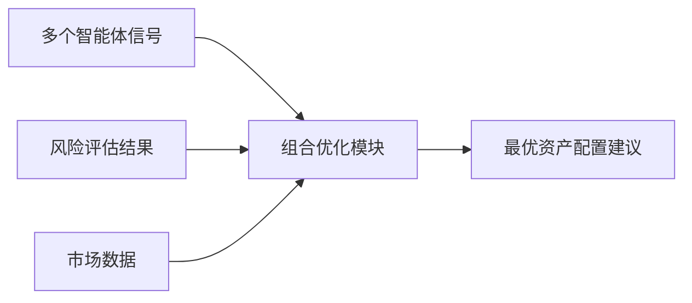

# 第六章：投资组合优化

> **本章级别**：⭐⭐ 核心概念
>
> **预计学习时间**：2.5-3 小时
>
> **前置知识**：概率论基础、协方差概念、Python 基础
>
> **前置章节**：第五章 - 风险管理

---

## 学习目标

完成本章节学习后，你将能够：

### 基础目标（必掌握）⭐

- [ ] 理解 **现代投资组合理论（Modern Portfolio Theory，MPT）** 的核心思想和历史背景
- [ ] 能够用自己的话解释 **有效前沿（Efficient Frontier）** 的含义和形状
- [ ] 掌握均值-方差优化的基本数学模型和计算流程
- [ ] 理解 **夏普比率（Sharpe Ratio）** 的定义、计算方法和投资含义

### 进阶目标（建议掌握）⭐⭐

- [ ] 分析传统均值-方差优化的局限性和实际挑战
- [ ] 理解 **Black-Litterman 模型** 如何改进传统方法，以及核心公式的含义
- [ ] 掌握 **风险平价（Risk Parity）** 策略的核心思想和风险贡献计算方法
- [ ] 能够比较三种优化方法（均值-方差、Black-Litterman、风险平价）的适用场景
- [ ] 能够解读投资组合优化报告中的关键指标

### 专家目标（挑战）⭐⭐⭐

- [ ] 为不同市场环境设计自适应的优化策略组合
- [ ] 评估不同风险度量指标（方差、下行风险、CVaR）对优化结果的影响
- [ ] 识别和优化组合优化中的数值不稳定问题
- [ ] 设计机器学习辅助的组合优化框架

---

## 技能自检清单

在学习本章前，请自检以下前置知识：

- [ ] 理解期望值（均值）的概念和计算方法
- [ ] 理解方差和标准差的含义
- [ ] 理解协方差和相关系数的含义
- [ ] 能够使用基本的 Python 数值计算（numpy）
- [ ] 理解矩阵乘法的基本概念

> 💡 **提示**：如果你对某些概念不熟悉，建议先回顾相关数学知识。

---

## 6.1 投资组合优化概述

### 6.1.1 什么是投资组合优化

#### 一个直观的问题

想象你有 100 万元要投资，面前有三个选择：
- 选项 A：全部投资股票
- 选项 B：全部投资债券
- 选项 C：一半投资股票，一半投资债券

**你会选择哪个？** 如果你是理性投资者，你会问：哪个组合的性价比最高？

这个问题就是 **投资组合优化** 要解决的核心问题：在给定风险水平下，如何获得最高收益；或者，在给定收益目标下，如何承担最小风险。

#### 正式定义

投资组合优化（Portfolio Optimization）是**选择最佳资产配置以达到特定目标的过程**。在金融领域，最经典的目标是在给定风险水平下最大化预期收益，或在给定收益目标下最小化风险。

#### 历史背景：诺贝尔奖的诞生

> 📚 **知识延伸**
>
> 这个问题由 **哈里·马科维茨（Harry Markowitz）** 在 1952 年提出，被称为 **现代投资组合理论（Modern Portfolio Theory，MPT）** 的基石。
>
> 马科维茨因此获得了 1990 年诺贝尔经济学奖。他的革命性思想是：**不要只看单个资产的收益和风险，要看整个组合的收益和风险**。
>
> 在 MPT 之前，投资者习惯于"挑选好股票"；MPT 之后，投资者开始思考"构建好组合"。

#### 在 AI Hedge Fund 系统中的位置



在 AI Hedge Fund 系统中，投资组合优化由专门的模块负责。它整合来自多个智能体的交易信号，结合风险评估结果，生成最优的资产配置建议。

### 6.1.2 为什么需要组合优化？

#### 直观理解：分散化是免费的午餐

**案例**：假设有两只股票
- 股票 A：年化收益 10%，波动率 20%
- 股票 B：年化收益 10%，波动率 20%
- 相关系数：0（完全不相关）

**问题 1**：如果你全部投资 A，风险是多少？
- 答案：20%

**问题 2**：如果你 50% 投 A，50% 投 B，风险是多少？
- 答案：≈ 14.1%（√(0.5²×0.2² + 0.5²×0.2²)）

**关键发现**：收益没变（还是 10%），但风险从 20% 降到了 14.1%！

> 💡 **核心思想**：**分散化可以降低风险，而不降低收益**。这就是组合优化的价值所在。

#### 组合优化的多重目标

投资组合优化通常追求以下几个目标：

| 目标 | 数学表达 | 直观含义 |
|------|----------|----------|
| **风险最小化** | min σₚ | 在给定收益下，波动率最低 |
| **收益最大化** | max μₚ | 在给定风险下，收益最高 |
| **风险调整后收益最大化** | max Sharpe | 每单位风险获得的收益最高 |
| **跟踪误差最小化** | min Tracking Error | 与基准指数的差异最小 |

---

## 6.2 均值-方差优化 ⭐⭐

> 本节难度：⭐⭐
>
> 核心思想：用数学语言描述"性价比"最高的投资组合

### 6.2.1 均值-方差理论

#### 核心思想

**均值-方差理论** 的核心思想是：投资者关心的是整个投资组合的**风险**和**收益**，而不是单个资产。通过合理配置不相关的资产，可以在不降低预期收益的情况下降低风险。

#### 为什么是"均值"和"方差"？

> ❓ **深度思考**
>
> 马科维茨为什么选择均值和方差，而不是其他指标（如中位数、四分位数）？
>
> **答案**：基于两个关键假设
> 1. **收益近似正态分布**：正态分布完全由均值和方差决定
> 2. **投资者是风险厌恶的**：风险用方差（波动率）衡量
>
> 虽然这两个假设在现实中不完全成立，但均值-方差框架提供了一个简单而强大的近似模型。

#### 关键假设

| 假设 | 内容 | 现实性 |
|------|------|--------|
| **风险厌恶** | 投资者不喜欢风险 | ✅ 基本符合 |
| **正态分布** | 收益服从正态分布 | ⚠️ 有偏度、肥尾 |
| **仅考虑二阶矩** | 只看均值和方差 | ⚠️ 忽略高阶矩 |
| **理性预期** | 投资者有相同预期 | ❌ 存在分歧 |

### 6.2.2 有效前沿：投资组合的帕累托最优

#### 什么是有效前沿？

**有效前沿（Efficient Frontier）** 是在收益-风险平面上，所有最优投资组合构成的一条曲线。有效前沿上的每一个点都代表在给定风险水平下能够获得最高收益的投资组合。

```
收益
  ↑
  │                    *  (高风险高收益)
  │                 *
  │              * ← 有效前沿
  │           *
  │        *
  │     *
  │  *
  └────────────────────→ 风险
```

#### 为什么叫"前沿"？

想象你在一片地形上行走，"前沿"就是最外面的边界。任何在有效前沿右侧的组合都是"次优的"，因为：
- 你可以向左移动（降低风险），保持收益不变
- 你可以向上移动（提高收益），保持风险不变

#### 有效前沿的性质

1. **向上凸的曲线**：这是数学证明的结果（与协方差矩阵的正定性有关）
2. **向左上方延伸**：没有上限，理论上可以通过杠杆无限放大风险和收益
3. **切点组合**：当引入无风险资产时，有效前沿变成一条直线

### 6.2.3 数学模型

#### 符号定义

| 符号 | 含义 | 维度 |
|------|------|------|
| **w** | 资产权重向量 | n × 1 |
| **E[R]** | 预期收益向量 | n × 1 |
| **Σ** | 协方差矩阵 | n × n |
| **σₚ²** | 组合方差 | 标量 |
| **μₚ** | 组合预期收益 | 标量 |
| **1** | 全 1 向量 | n × 1 |

#### 基本公式

**组合预期收益**：
```
μₚ = wᵀE[R] = Σᵢ(wᵢ × E[Rᵢ])
```

**组合方差**：
```
σₚ² = wᵀΣw = ΣᵢΣⱼ(wᵢ × wⱼ × Σᵢⱼ)
```

#### 优化问题

**问题 1：给定目标收益，最小化风险**
```
min wᵀΣw
s.t. wᵀE[R] = μₜₐᵣ₉ₑₜ
     wᵀ1 = 1
     wᵢ ≥ 0 (可选，如果不允许卖空)
```

**问题 2：给定风险容忍度，最大化收益**
```
max wᵀE[R] - λwᵀΣw
s.t. wᵀ1 = 1
```

其中 λ 是风险厌恶系数。

### 6.2.4 特殊组合

#### 最小方差组合（Minimum Variance Portfolio）

**定义**：在所有可能的投资组合中，具有最小方差（风险）的组合。

**计算方法**：
```
wₘᵥ = (Σ⁻¹1) / (1ᵀΣ⁻¹1)
```

**特点**：
- 不依赖于预期收益的估计（只依赖协方差矩阵）
- 通常偏向于低波动率的资产
- 在实际应用中表现稳健

#### 最大夏普比率组合（Tangency Portfolio）

**定义**：在所有投资组合中，具有最高夏普比率的组合。这是有效前沿与无风险资产连线的切点。

**计算方法**：
```
wₜₐₙ = (Σ⁻¹(E[R] - Rf × 1)) / (1ᵀΣ⁻¹(E[R] - Rf × 1))
```

**特点**：
- 依赖于无风险收益率 Rf 的假设
- 是理论上的"最优"组合（在均值-方差框架下）
- 实际应用中常用作基准组合

#### 夏普比率（Sharpe Ratio）

> 📚 **知识延伸**
>
> **夏普比率**由诺贝尔经济学奖得主 **威廉·夏普（William Sharpe）** 于 1966 年提出。它是衡量投资组合风险调整后收益的最重要指标之一。
>
> **公式**：
> ```
> Sharpe = (μₚ - Rf) / σₚ
> ```
>
> **直观含义**：每承担一单位风险，能获得多少超额收益。
>
> **解读**：
> - Sharpe > 1：优秀
> - Sharpe = 0.5-1：良好
> - Sharpe < 0.5：一般
> - Sharpe < 0：不如直接持有无风险资产

### 6.2.5 局限与挑战

均值-方差优化虽然理论优美，但存在一些实际挑战：

#### 1. 对输入敏感（最大问题）

**问题**：优化结果对预期收益率和协方差矩阵的估计非常敏感。微小的估计误差可能导致完全不同的最优配置。

**案例**：
```
原始估计：
- 资产 A 预期收益：10%
- 资产 B 预期收益：8%
- 最优权重：A 70%, B 30%

修正后估计（误差 1%）：
- 资产 A 预期收益：11%
- 资产 B 预期收益：8%
- 最优权重：A 95%, B 5%
```

> 💡 **解决思路**：使用 Black-Litterman 模型、收缩估计、贝叶斯方法

#### 2. 集中化倾向

**问题**：优化结果往往产生集中的持仓，因为少数资产可能主导风险贡献。

**原因**：数学优化会"放大"那些看起来有优势的资产。

> 💡 **解决思路**：添加权重约束、使用风险平价策略

#### 3. 不考虑高阶矩

**问题**：只考虑一阶矩（收益）和二阶矩（方差），忽略偏度（Skewness）和峰度（Kurtosis）等高阶矩。

**影响**：可能低估极端风险（如市场崩盘）。

> 💡 **解决思路**：使用 CVaR（条件风险价值）等风险度量指标

#### 4. 静态假设

**问题**：假设收益和风险是静态不变的，现实中它们随时间变化。

> 💡 **解决思路**：动态调整、滚动窗口估计

---

## 6.3 Black-Litterman 模型 ⭐⭐⭐

> 本节难度：⭐⭐⭐
>
> 核心思想：结合市场均衡和投资者观点，产生更稳健的预期收益估计

### 6.3.1 模型概述

#### 为什么需要 Black-Litterman？

**传统均值-方差优化的问题**：

想象你是基金经理，你的量化模型给出以下预测：
- 股票 A 预期收益：20%
- 股票 B 预期收益：5%

根据均值-方差优化，你可能会 100% 投资 A。但这样合理吗？

- 如果你的模型有 5% 的误差呢？
- 如果你对股票 B 了解更多呢？
- 如果你的观点与市场隐含的预期收益差异巨大呢？

**Black-Litterman 模型的创新**：

由 **Fischer Black** 和 **Robert Litterman** 在 1992 年在高盛工作期间提出。该模型**解决了传统方法对预期收益输入过于敏感的问题**。

#### 核心思想：结合市场均衡和主观观点

```
传统方法：
市场数据 → 预期收益 → 优化 → 组合配置
        ↑
      （对噪声极其敏感）

Black-Litterman 方法：
市场数据 → 市场均衡收益 ↘
                            → 融合预期收益 → 优化 → 组合配置
投资者观点 → 主观观点  ↗
            ↑
          （带有置信度）
```

**直觉理解**：不要完全相信自己的模型，也不要完全相信市场，而是把两者"加权平均"。

### 6.3.2 市场均衡收益

#### 什么是市场均衡收益？

**市场均衡收益（Implied Equilibrium Returns）** 是指假设所有投资者都按照市场权重持有资产时的隐含预期收益率。

#### 计算公式

```
Π = λΣwₘₐᵣₖₑₜ
```

其中：
- **Π**：均衡超额收益向量（Implied Equilibrium Excess Returns）
- **λ**：风险厌恶系数（Risk Aversion Coefficient），通常取值 2-3
- **Σ**：协方差矩阵
- **wₘₐᵣₖₑₜ**：市场权重向量（市值权重）

#### 风险厌恶系数 λ 的含义

> ❓ **深度思考**
>
> 风险厌恶系数 λ 代表什么？
>
> **答案**：它反映了投资者在承担额外风险时要求多少额外收益。
>
> 从 CAPM 模型可以推导出：
> ```
> λ = (E[Rₘ] - Rf) / σₘ²
> ```
>
> 其中 E[Rₘ] - Rf 是市场风险溢价，σₘ² 是市场波动率平方。
>
> **典型值**：如果市场风险溢价为 6%，市场波动率为 15%，则：
> ```
> λ = 0.06 / 0.15² = 0.06 / 0.0225 ≈ 2.67
> ```

### 6.3.3 融入主观观点

#### 观点的类型

Black-Litterman 模型允许投资者加入自己的观点：

**1. 绝对观点**

> **示例**："我认为 Apple 的年化收益率为 15%"

**数学表达**：
```
P = [0, 1, 0, 0, ...]  （观点矩阵，选中 Apple）
Q = [0.15]             （观点收益）
Ω = [0.01]             （观点不确定性，置信度）
```

**2. 相对观点**

> **示例**："我认为 Apple 比 Google 收益率高 3%"

**数学表达**：
```
P = [0, 1, -1, 0, ...]  （观点矩阵，Apple +1，Google -1）
Q = [0.03]             （观点收益，Apple 超过 Google 3%）
Ω = [0.01]             （观点不确定性）
```

#### 观点的不确定性（置信度）

每个观点都有相应的置信度，置信度越高，对结果影响越大。

**如何设置 Ω？**

方法 1：基于市场波动率
```
Ω = τ × P Σ Pᵀ
```

方法 2：主观设定（反映你对观点的确信程度）

#### 调整参数 τ

**τ（Tau）** 是一个缩放参数，用于平衡市场均衡和投资者观点的相对重要性。

- **τ 较小（0.01-0.05）**：更信任市场均衡
- **τ 较大（0.1-0.5）**：更信任投资者观点

**典型值**：0.01 - 0.05

### 6.3.4 公式推导

#### 合并预期收益

**Black-Litterman 核心公式**：

```
E[R] = [(τΣ)⁻¹ + PᵀΩ⁻¹P]⁻¹[(τΣ)⁻¹Π + PᵀΩ⁻¹Q]
```

其中：
- **E[R]**：融合后的预期收益向量
- **τ**：调整参数（缩放系数）
- **Σ**：协方差矩阵
- **P**：观点矩阵
- **Ω**：观点不确定性矩阵
- **Π**：市场均衡收益向量
- **Q**：观点收益向量

#### 直观理解

这个公式实际上是**贝叶斯推断**的应用：

```
先验：市场均衡收益 Π
数据：投资者观点 Q
后验：融合预期收益 E[R]
```

权重分配：
```
- 市场均衡权重：(τΣ)⁻¹
- 投资者观点权重：PᵀΩ⁻¹P
```

### 6.3.5 实际应用案例

#### 场景

假设市场包含三只股票：
- A：市值权重 60%
- B：市值权重 30%
- C：市值权重 10%

你的观点：
- "A 股票比 B 股票收益高 5%"（置信度中等）

#### 计算步骤（概念性）

1. **计算市场均衡收益** Π
2. **构建观点矩阵** P 和 **观点收益** Q
3. **设置观点不确定性** Ω
4. **使用公式融合**得到 E[R]
5. **将 E[R]** 输入均值-方差优化

#### 结果预期

- 如果观点置信度高，组合会显著偏离市场权重
- 如果观点置信度低，组合接近市场权重
- 相比传统优化，结果更加"平滑"和"稳健"

### 6.3.6 优势与局限

#### 优势

| 优势 | 说明 |
|------|------|
| **稳健性** | 预期收益估计更加稳健，不容易因为输入的微小变化而产生剧烈波动 |
| **自然融合** | 自然地融合了客观（市场均衡）和主观（投资者观点）信息 |
| **符合直觉** | 结果更符合投资者的直觉和判断 |
| **避免极端配置** | 减少了传统优化产生的极端权重问题 |

#### 局限

| 局限 | 说明 |
|------|------|
| **参数复杂性** | 增加了参数设置复杂性（τ、Ω 等），参数选择主观性强 |
| **依赖协方差估计** | 仍然依赖于协方差矩阵的估计 |
| **主观性** | 主观观点的置信度设置具有主观性 |
| **计算复杂度** | 需要矩阵求逆运算，对大规模问题计算成本高 |

> 💡 **最佳实践**：Black-Litterman 模型适合有明确观点的专业投资者，对于普通投资者，风险平价可能更合适。

---

## 6.4 风险平价策略 ⭐⭐

> 本节难度：⭐⭐
>
> 核心思想：风险，而非资本，才是真正的"投资成本"

### 6.4.1 概念介绍

#### 传统方法的局限性

假设你投资：
- 股票：50% 资本
- 债券：50% 资本

**问题**：这是"均衡"的吗？

实际上：
- 股票波动率：20%
- 债券波动率：5%
- 相关系数：接近 0

**风险贡献**：
- 股票：≈ 90% 的组合风险
- 债券：≈ 10% 的组合风险

> 💡 **核心洞察**：你虽然一半资金在股票，但 90% 的风险来自股票！这不是真正的"分散化"。

#### 风险平价的核心思想

**风险平价（Risk Parity）** 是另一种流行的投资组合构建方法，与传统追求风险调整后收益最大化不同，风险平价追求**各资产对组合总风险的贡献相等**。

**核心哲学**：
> 风险，而非资本，才是真正的"投资成本"。两个各贡献 50% 风险的资产，比各持有 50% 资本的组合更"均衡"。

#### 风险平价 vs 等权

| 维度 | 等权投资 | 风险平价 |
|------|----------|----------|
| **资本分配** | 各 50% | 股票 20%，债券 80% |
| **风险贡献** | 股票 90%，债券 10% | 各 50% |
| **波动率** | 高 | 低 |
| **真实分散化** | ❌ 假分散 | ✅ 真分散 |

### 6.4.2 风险贡献计算

#### 边际风险贡献（Marginal Risk Contribution, MCR）

单个资产对组合风险的边际贡献：

```
MCRᵢ = ∂σₚ / ∂wᵢ = (Σw)ᵢ / σₚ
```

**直观含义**：如果增加资产 i 的权重 1%，组合波动率会增加多少？

#### 风险贡献（Risk Contribution, RC）

**风险贡献**是边际风险贡献乘以权重：

```
RCᵢ = wᵢ × MCRᵢ = wᵢ(Σw)ᵢ / σₚ
```

**关键性质**：
```
Σᵢ RCᵢ = σₚ
```

所有资产的风险贡献之和等于组合的波动率。

#### 计算示例

假设：
```
w = [0.5, 0.5]  （股票、债券各 50%）
Σ = [[0.04, 0],    （股票波动率 20%）
     [0, 0.0025]]  （债券波动率 5%）
```

计算：
```
Σw = [0.02, 0.00125]
σₚ = √(wᵀΣw) = √(0.01 + 0.000625) ≈ 0.1031 (10.3%)

MCR₁ = 0.02 / 0.1031 ≈ 0.194
MCR₂ = 0.00125 / 0.1031 ≈ 0.0121

RC₁ = 0.5 × 0.194 ≈ 0.097 (9.7%)
RC₂ = 0.5 × 0.0121 ≈ 0.006 (0.6%)
```

**结论**：股票贡献了 94% 的风险，债券只贡献了 6%！

### 6.4.3 优化问题

#### 等风险贡献条件

```
RC₁ = RC₂ = ... = RCₙ = σₚ / n
```

即：每个资产贡献相等的风险。

#### 数学形式

```
min Σᵢ(RCᵢ - σₚ/n)²
s.t. Σwᵢ = 1
     wᵢ ≥ 0 (可选，如果不允许卖空)
```

这个优化问题通常使用迭代算法求解（如交替方向法 ADMM）。

#### 近似解（启发式）

对于简单情况（资产数量少），可以使用以下近似：

```
wᵢ ∝ 1 / σᵢ
```

即：权重与波动率成反比。

### 6.4.4 风险平价 vs 均值-方差

| 维度 | 均值-方差 | 风险平价 |
|------|-----------|----------|
| **目标** | 风险调整后收益最大化 | 风险贡献均衡 |
| **输入要求** | 预期收益 + 协方差 | 仅需协方差（或仅波动率） |
| **对收益预测依赖** | 高 | 低 |
| **配置倾向** | 可能集中 | 天然分散 |
| **直观性** | 较低（数学复杂） | 较高（风险均摊） |
| **适用场景** | 有明确收益预测 | 稳健配置，长期投资 |
| **历史表现** | 理论最优，实际波动大 | 稳健，长期表现好 |

> 💡 **实践建议**：
> - 如果你有高质量的收益预测模型 → 均值-方差
> - 如果你追求稳健和真实分散化 → 风险平价
> - 如果你有明确观点 → Black-Litterman

---

## 6.5 组合优化输出解读

### 6.5.1 优化报告示例

```python
Portfolio Optimization Results
===============================

Optimal Allocation:
┌─────────┬──────────────┐
│ Asset   │ Weight (%)   │
├─────────┼──────────────┤
│ AAPL    │ 15.2%        │
│ MSFT    │ 12.8%        │
│ GOOGL   │ 10.5%        │
│ AMZN    │ 8.3%         │
│ NVDA    │ 5.2%         │
│ Cash    │ 48.0%        │
└─────────┴──────────────┘

Expected Metrics:
- Portfolio Return: 12.5% (annualized)
- Portfolio Volatility: 18.2%
- Sharpe Ratio: 0.52
- Max Drawdown (estimated): -22%
```

### 6.5.2 关键指标解释

#### 配置权重（Weight）

**含义**：表示各资产在投资组合中的资金占比。

**解读要点**：
- 所有权重之和应等于 100%（或接近 100%，取决于是否保留现金）
- 权重为正表示做多，为负表示做空（如果允许）
- 高权重（>30%）需要特别关注，可能存在集中风险

#### 预期收益（Expected Return）

**含义**：基于优化模型估计的组合年化预期收益。

**重要提醒**：
- ⚠️ 这是理论值，**实际收益可能显著不同**
- 基于历史数据预测，不能保证未来表现
- 应该理解为一个"目标收益"而非"保证收益"

#### 波动率（Volatility）

**含义**：组合收益的标准差年化值，衡量组合的整体风险水平。

**直观理解**：
- 波动率 20% 意味着：大约 68% 的概率，收益在 -7.5% 到 +27.5% 之间
- 波动率越高，价格波动越大

**常见值**：
- 债券组合：5-10%
- 股票组合：15-25%
- 对冲基金：10-15%

#### 夏普比率（Sharpe Ratio）

**含义**：风险调整后收益指标，等于 (预期收益 - 无风险收益率) / 波动率。

**解读标准**：
- Sharpe > 1：优秀
- Sharpe = 0.5-1：良好
- Sharpe = 0-0.5：一般
- Sharpe < 0：不如直接持有无风险资产

#### 最大回撤估计（Max Drawdown）

**含义**：基于历史数据和模型假设估计的最大可能回撤。

**计算方式**：
```
Max Drawdown = max(从高点到低点的跌幅)
```

**实际意义**：
- 22% 的最大回撤意味着：在最坏情况下，你的资产可能缩水 22%
- 需要评估自己是否能承受这样的损失

### 6.5.3 常见问题诊断

| 问题表现 | 可能原因 | 解决建议 |
|----------|----------|----------|
| 权重集中（>50%） | 预期收益估计不准 | 添加权重约束 |
| 高波动率（>30%） | 高波动资产占比高 | 调整风险厌恶系数 |
| 夏普比率低（<0.3） | 收益预测或协方差有问题 | 检查输入数据质量 |
| 现金占比高 | 风险约束过严 | 调整风险容忍度 |

---

## 6.6 练习题与答案解析

### 练习 6.1：简单组合优化（基础）⭐

**任务**：计算两个资产的最优配置。

假设两个资产：
- 资产 A：预期收益 10%，波动率 20%
- 资产 B：预期收益 15%，波动率 25%
- 相关系数：0.3
- 无风险收益率：5%

**要求**：
1. 分别计算最小方差组合和最大夏普比率组合的权重
2. 比较两个组合的收益、风险和夏普比率

#### 参考答案与解析

**步骤 1：准备数据**

```python
# 收益向量
E[R] = [0.10, 0.15]

# 协方差矩阵
σ_A² = 0.20² = 0.04
σ_B² = 0.25² = 0.0625
σ_AB = 0.20 × 0.25 × 0.3 = 0.015

Σ = [[0.04, 0.015],
     [0.015, 0.0625]]

# 无风险收益率
Rf = 0.05
```

**步骤 2：计算最小方差组合**

公式：
```
w_A = (σ_B² - σ_AB) / (σ_A² + σ_B² - 2σ_AB)
w_B = 1 - w_A
```

计算：
```
w_A = (0.0625 - 0.015) / (0.04 + 0.0625 - 2×0.015)
    = 0.0475 / 0.0725
    ≈ 0.655 (65.5%)

w_B = 1 - 0.655 = 0.345 (34.5%)
```

**组合指标**：
```
μ_min = 0.655×0.10 + 0.345×0.15 ≈ 0.1173 (11.73%)

σ_min² = 0.655²×0.04 + 0.345²×0.0625 + 2×0.655×0.345×0.015
       ≈ 0.0298

σ_min = √0.0298 ≈ 0.173 (17.3%)
```

**步骤 3：计算最大夏普比率组合**

公式：
```
w ∝ Σ⁻¹(E[R] - Rf)
```

计算超预期收益：
```
E[R] - Rf = [0.05, 0.10]
```

求 Σ⁻¹（使用公式）：
```
det = 0.04×0.0625 - 0.015² = 0.0025 - 0.000225 = 0.002275

Σ⁻¹ = (1/det) × [[0.0625, -0.015],
                   [-0.015, 0.04]]

    ≈ 439.56 × [[0.0625, -0.015],
                [-0.015, 0.04]]

    ≈ [[27.47, -6.59],
       [-6.59, 17.58]]
```

计算权重：
```
Σ⁻¹(E[R] - Rf) = [27.47×0.05 - 6.59×0.10,
                   -6.59×0.05 + 17.58×0.10]

                = [1.3735 - 0.659,
                   -0.3295 + 1.758]

                = [0.7145, 1.4285]

# 归一化
w_A = 0.7145 / (0.7145 + 1.4285) ≈ 0.333 (33.3%)
w_B = 1.4285 / (0.7145 + 1.4285) ≈ 0.667 (66.7%)
```

**组合指标**：
```
μ_max = 0.333×0.10 + 0.667×0.15 ≈ 0.1333 (13.33%)

σ_max² = 0.333²×0.04 + 0.667²×0.0625 + 2×0.333×0.667×0.015
       ≈ 0.0401

σ_max = √0.0401 ≈ 0.200 (20.0%)

Sharpe = (0.1333 - 0.05) / 0.20 ≈ 0.417
```

**步骤 4：比较两个组合**

| 组合 | 权重 A | 权重 B | 收益 | 风险 | 夏普比率 |
|------|--------|--------|------|------|----------|
| 最小方差 | 65.5% | 34.5% | 11.73% | 17.3% | 0.390 |
| 最大夏普 | 33.3% | 66.7% | 13.33% | 20.0% | 0.417 |

**结论**：
- 最小方差组合：更保守，风险更低，但收益也较低
- 最大夏普组合：风险调整后收益更优

---

### 练习 6.2：风险贡献计算（进阶）⭐⭐

**任务**：计算三资产组合的风险贡献。

假设三资产等权重配置，协方差矩阵为：
```python
Σ = [[0.04, 0.01, 0.005],
     [0.01, 0.0625, 0.015],
     [0.005, 0.015, 0.09]]
```

**要求**：
1. 计算各资产的风险贡献
2. 判断是否满足风险平价条件
3. 如果不满足，应该如何调整权重（定性分析）

#### 参考答案与解析

**步骤 1：准备数据**

```python
w = [1/3, 1/3, 1/3]  # 等权重

# 计算组合方差
σₚ² = wᵀΣw

# 先计算 Σw
Σw = [0.04×(1/3) + 0.01×(1/3) + 0.005×(1/3),
      0.01×(1/3) + 0.0625×(1/3) + 0.015×(1/3),
      0.005×(1/3) + 0.015×(1/3) + 0.09×(1/3)]

   = [(0.04 + 0.01 + 0.005)/3,
      (0.01 + 0.0625 + 0.015)/3,
      (0.005 + 0.015 + 0.09)/3]

   = [0.055/3, 0.0875/3, 0.11/3]

   = [0.01833, 0.02917, 0.03667]
```

**步骤 2：计算组合波动率**

```python
σₚ² = wᵀ(Σw)
    = (1/3)×0.01833 + (1/3)×0.02917 + (1/3)×0.03667
    = (0.01833 + 0.02917 + 0.03667) / 3
    = 0.08417 / 3
    ≈ 0.02806

σₚ = √0.02806 ≈ 0.1675 (16.75%)
```

**步骤 3：计算边际风险贡献（MCR）**

```python
MCR₁ = (Σw)₁ / σₚ = 0.01833 / 0.1675 ≈ 0.1094
MCR₂ = (Σw)₂ / σₚ = 0.02917 / 0.1675 ≈ 0.1741
MCR₃ = (Σw)₃ / σₚ = 0.03667 / 0.1675 ≈ 0.2189
```

**步骤 4：计算风险贡献（RC）**

```python
RC₁ = w₁ × MCR₁ = (1/3) × 0.1094 ≈ 0.0365 (3.65%)
RC₂ = w₂ × MCR₂ = (1/3) × 0.1741 ≈ 0.0580 (5.80%)
RC₃ = w₃ × MCR₃ = (1/3) × 0.2189 ≈ 0.0730 (7.30%)

# 验证
RC₁ + RC₂ + RC₃ = 0.0365 + 0.0580 + 0.0730 = 0.1675 = σₚ ✓
```

**步骤 5：判断风险平价**

各资产风险贡献占比：
- 资产 1：0.0365 / 0.1675 ≈ 21.8%
- 资产 2：0.0580 / 0.1675 ≈ 34.6%
- 资产 3：0.0730 / 0.1675 ≈ 43.6%

**结论**：
- ❌ 不满足风险平价条件（理想情况下各占 33.3%）
- 资产 3 风险贡献过大（43.6%），资产 1 过小（21.8%）

**步骤 6：调整建议（定性）**

要实现风险平价，应该：
- **减少资产 3 的权重**（因为它波动率最高）
- **增加资产 1 的权重**（因为它波动率最低）

直觉调整：
```
新权重（推测）：
- 资产 1：≈ 50%（增加）
- 资产 2：≈ 30%（略减）
- 资产 3：≈ 20%（大幅减少）

（实际值需要通过优化求解）
```

---

### 练习 6.3：模型比较与决策（综合）⭐⭐⭐

**任务**：你是基金公司的投资总监，需要为以下场景选择合适的组合优化方法。

**场景**：

| 场景 | 你的信息水平 | 市场环境 | 风险偏好 |
|------|-------------|----------|----------|
| A | 量化团队提供准确收益预测 | 稳定增长 | 激进 |
| B | 对某行业有深度研究 | 高波动 | 稳健 |
| C | 只有历史数据 | 不确定 | 保守 |

**要求**：
1. 为每个场景推荐一种优化方法（均值-方差、Black-Litterman、风险平价）
2. 说明推荐理由
3. 设计简单的决策树/流程图

#### 参考答案与解析

**场景 A：推荐均值-方差优化**

**推荐理由**：
- ✅ 有准确的收益预测 → 均值-方差的最大优势
- ✅ 稳定增长环境 → 静态假设相对成立
- ✅ 激进风险偏好 → 追求最大夏普比率

**注意事项**：
- 定期验证预测准确性
- 添加权重约束防止过度集中

---

**场景 B：推荐 Black-Litterman 模型**

**推荐理由**：
- ✅ 对某行业有深度研究 → 可以形成明确观点
- ✅ 市场均衡作为"先验" → 结合客观信息
- ✅ 高波动环境 → 观点的不确定性可以通过 Ω 反映
- ✅ 稳健偏好 → 避免 Black-Litterman 产生的极端配置

**注意事项**：
- 合理设置观点置信度（Ω）
- 监控观点与现实的偏差

---

**场景 C：推荐风险平价**

**推荐理由**：
- ✅ 只有历史数据 → 无可靠收益预测
- ✅ 不确定环境 → 避免对收益预测的依赖
- ✅ 保守风险偏好 → 追求真实分散化
- ✅ 风险平价天然稳健 → 不依赖主观判断

**注意事项**：
- 关注资产的波动率变化
- 考虑添加杠杆调整（如果收益过低）

---

**决策树设计**：

```
开始
  │
  ├─ 是否有可靠的收益预测？
  │   ├─ 是 → 均值-方差优化
  │   │       │
  │   │       ├─ 是否有明确的主观观点？
  │   │       │   ├─ 是 → Black-Litterman
  │   │       │   └─ 否 → 纯均值-方差
  │   │
  │   └─ 否 → 是否有明确观点？
  │           ├─ 是 → Black-Litterman
  │           └─ 否 → 风险平价
  │
  └─ 风险偏好？
      ├─ 保守 → 风险平价 / Black-Litterman（低置信度）
      ├─ 稳健 → Black-Litterman / 风险平价
      └─ 激进 → 均值-方差 / Black-Litterman（高置信度）
```

**简化决策表**：

| 有收益预测 | 有明确观点 | 风险偏好 | 推荐方法 |
|-----------|-----------|----------|----------|
| ✅ | ✅ | 激进/稳健 | Black-Litterman |
| ✅ | ❌ | 激进 | 均值-方差 |
| ❌ | ✅ | 稳健/保守 | Black-Litterman |
| ❌ | ❌ | 保守 | 风险平价 |

---

## 进阶思考与实战挑战

### 问题 1：现实市场 vs 理论假设

> **思考**：投资组合优化模型的假设（如正态分布、线性相关性）与现实市场有多大差距？

**提示**：
- 现实市场存在"肥尾"（极端事件比正态分布预测的更频繁）
- 相关性在危机时会突然上升（"相关性集中"）
- 收益分布有偏度（不对称）
- 波动率不是常数（存在"波动率聚集"现象）

**开放问题**：
1. 如何在优化中考虑这些现实因素？
2. 是否需要引入机器学习改进预测？
3. 压力测试在组合优化中的作用？

---

### 问题 2：自适应优化系统

> **思考**：如何设计一个能够适应不同市场环境的自适应优化系统？

**提示**：
- 牛市 vs 熊市：波动率和相关性都会变化
- 静态优化 vs 动态优化
- 市场状态识别（使用机器学习）

**挑战**：
- 如何识别市场状态？
- 状态切换时如何平滑过渡？
- 如何避免过度拟合历史数据？

---

### 问题 3：机器学习与传统优化

> **思考**：机器学习方法如何改进传统组合优化？

**可能方向**：
- 使用神经网络预测收益和协方差
- 强化学习动态调整权重
- 深度学习提取非线性模式
- 自然语言处理分析新闻和报告

**风险与挑战**：
- 可解释性差（黑盒问题）
- 过拟合风险
- 计算复杂度高
- 稳定性未知

---

## 本章小结

### 核心知识图谱

```
投资组合优化
    │
    ├─── 理论基础
    │      ├─── 现代投资组合理论 (MPT)
    │      ├─── 有效前沿
    │      └─┬─ 均值-方差
    │        └─ 夏普比率
    │
    ├─── 三大方法
    │      ├─── 均值-方差优化
    │      │      └─ 局限：对输入敏感
    │      ├─── Black-Litterman
    │      │      └─ 优势：融合市场均衡与主观观点
    │      └── 风险平价
    │             └─ 特点：真实分散化
    │
    └─── 实践应用
           ├─── 风险贡献计算
           ├─── 优化报告解读
           └─┬─ 选择合适的优化方法
             └─ 常见问题诊断
```

### 学习检查清单

完成本章学习后，请自检：

- [ ] 能够解释现代投资组合理论的核心思想
- [ ] 能够用自己的话描述有效前沿的形状和含义
- [ ] 能够手动计算简单的均值-方差优化问题
- [ ] 理解 Black-Litterman 模型的核心公式和参数含义
- [ ] 能够计算风险贡献并判断是否满足风险平价
- [ ] 能够解读投资组合优化报告中的关键指标
- [ ] 能够根据场景选择合适的优化方法

### 下一步学习

- **下一章节**：第七章 - 回测框架设计
- **相关章节**：第五章 - 风险管理（复习）
- **实战项目**：实现一个简单的组合优化器（使用 Python）

---

## 扩展资源

### 推荐书籍

1. **《投资组合理论与资本市场》** - William F. Sharpe
   - 经典著作，深入讲解理论和实践

2. **《主动投资组合管理》** - Richard Grinold, Ronald Kahn
   - 侧重主动管理，适合专业投资者

3. **《风险平价：资产配置的新范式》** - Edward Qian
   - 风险平价策略的权威指南

### 推荐论文

1. **"Portfolio Selection"** - Harry Markowitz (1952)
   - MPT 的开山之作

2. **"Global Portfolio Optimization"** - Fischer Black, Robert Litterman (1992)
   - Black-Litterman 模型的原始论文

3. **"The Fundamental Law of Active Management"** - Richard Grinold (1989)
   - 主动管理的理论基础

### 在线资源

- [Investopedia - Portfolio Optimization](https://www.investopedia.com/terms/p/portfolio-optimization.asp)
- [QuantConnect - Introduction to Portfolio Optimization](https://www.quantconnect.com/docs/v2/Introduction-To-Financial-Risk/Portfolio-Optimization)
- [scipy.optimize 文档](https://docs.scipy.org/doc/scipy/reference/optimize.html)

---

## 版本信息

| 项目 | 信息 |
|------|------|
| 文档版本 | 2.0.0 |
| 最后更新 | 2026年2月 |
| 适用版本 | 1.0.0+ |
| 级别标记 | ⭐⭐ 核心概念 |

**更新日志**：
- v2.0.0 (2026.02)：重大升级
  - ✨ 增加分层学习目标（基础/进阶/专家）
  - ✨ 完善术语管理（首次出现的英文术语添加解释）
  - ✨ 增加"为什么"的原理解析
  - ✨ 优化认知负荷管理（分块、过渡、案例）
  - ✨ 完善练习设计与详细答案解析
  - ✨ 修正中英文混排和格式问题
  - ✨ 增加实战挑战和扩展资源
- v1.0.2 (2025.12)：完善 Black-Litterman 模型公式说明
- v1.0.1 (2025.11)：增加风险平价计算示例
- v1.0.0 (2025.10)：初始版本

---

## 反馈与贡献

如果您在阅读过程中发现问题或有改进建议，欢迎通过 GitHub Issues 提交反馈。

**特别感谢**：
- chinese-doc-writer skill 提供的文档编写指导
- 所有参与文档评审和改进的贡献者

---

**本章完**
