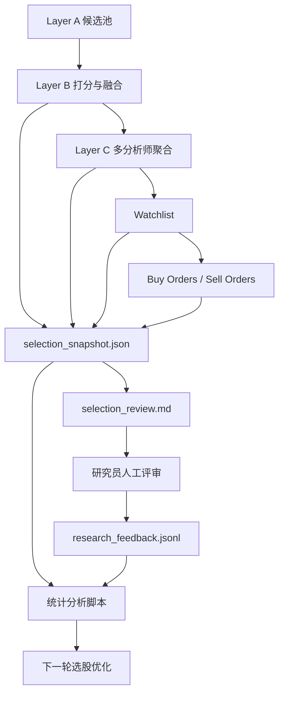

# 选股优先的系统优化架构设计

## 1. 文档目的

本文档定义当前量化系统下一阶段的核心优化方向：

1. 先把系统优化拆分为“选股优化”和“买卖执行优化”两个阶段。
2. 第一阶段优先优化选股质量，不同时修改买卖执行逻辑。
3. 为每个交易日的筛选结果增加结构化审查产物，支持研究员人工评审与后续机器统计分析。
4. 在保证低复杂度和高性价比的前提下，为后续持续迭代建立一个可解释、可归因、可回放、可冻结的工程基础。

本文档不仅回答要做什么，也回答为什么这样做，以及如何在当前系统架构中落地。

---

## 2. 问题背景

当前系统已经具备从候选池筛选、策略打分、信号融合、LLM 研判到交易计划生成的完整流水线能力。系统主链路并不是从零开始，而是已经有比较清晰的分层：

1. Layer A：候选池构建
2. Layer B：策略信号评分与融合
3. Layer C：多分析师信号聚合
4. 执行层：买入、卖出、仓位、队列与风控

现有实现上，这条链路已经在代码里形成了相对明确的模块边界：

1. 候选池构建：src/screening/candidate_pool.py
2. 策略打分：src/screening/strategy_scorer.py
3. 信号融合：src/screening/signal_fusion.py
4. 日度执行流水线：src/execution/daily_pipeline.py
5. Layer C 聚合：src/execution/layer_c_aggregator.py
6. 回测与纸面交易事件写出：src/backtesting/engine.py

但是从优化方法上看，系统当前仍存在一个典型问题：

同一轮优化中，选股逻辑和买卖逻辑会共同影响最终收益，导致结果难以归因。

例如：

1. 股票选得一般，但买点和仓位控制很好，最终赚到钱。
2. 股票选得很好，但卖点、仓位或风控设置不好，最终没有赚到钱。
3. 最终收益不佳时，很难判断问题到底出在股票选得不够好，还是出在交易执行不够好。

这会直接带来两个后果：

1. 优化方向容易跑偏。
2. 团队对系统能力的判断会被噪声污染。

因此，需要先解决“归因污染”问题，再谈高效优化。

---

## 3. 底层原理

### 3.1 量化系统的两类核心能力

一个完整的量化交易系统，至少包含两类不同性质的能力：

1. Alpha 生成能力
   这部分回答“买什么”。本质上是从全市场中找出更可能产生超额收益的标的。

2. 执行与组合管理能力
   这部分回答“怎么买、买多少、何时卖”。本质上是把已有观点转化为可执行、可控风险的交易结果。

这两类能力会共同决定最终收益，但它们不是同一个问题。

选股更偏向信息提取、特征判断、结构性筛选和信号质量。
执行更偏向时点控制、资金分配、风控约束、退出机制和收益兑现效率。

如果把两者混在一个优化闭环里，系统会失去明确的因果解释能力。

### 3.2 可归因原则

工业级系统优化的前提不是“单次结果变好”，而是“结果变好以后知道为什么”。

因此需要满足可归因原则：

1. 当观察到收益改善时，能够知道改善来自哪里。
2. 当观察到收益恶化时，能够定位恶化发生在哪一层。
3. 当需要做策略比较时，能够控制变量，只比较一个维度的变化。

这个原则要求我们在优化时尽量冻结下游模块，只修改当前要研究的上游模块。

### 3.3 模块隔离原则

成熟量化系统并不会直接用“最终收益率”作为所有模块的统一评估标准，而是分层定义局部目标。

原因很简单：

1. 上游模块不应该为下游模块的缺陷背锅。
2. 下游模块也不应该掩盖上游模块的低质量输出。
3. 每一层都应该有自己的局部质量指标。

对当前系统而言：

1. 选股层应该先为“候选是否优质”负责。
2. 执行层应该再为“如何把优质候选转化为收益”负责。

### 3.4 可审计原则

一个能持续迭代的系统，必须保留关键中间产物。

否则每次讨论都会退化为：

1. 当时系统为什么选了这只票，不清楚。
2. 为什么没选另一只票，不清楚。
3. 当时研究员为什么反对或支持，也没有标准记录。

所以系统必须保留可审计产物，支持：

1. 事后复盘
2. 跨版本比较
3. 人工评审
4. 自动统计分析

---

## 4. 为什么选择“先选股，后执行”的两阶段方案

### 4.1 这是更正确的优化顺序

如果基础股票池质量不高，那么后续执行层无论怎么调优，都只能在低质量输入上做局部修补。

相反，如果先把股票池质量提升到较高水平：

1. 后续买点、卖点、仓位优化的上限会更高。
2. 执行策略的效果会更稳定、更容易解释。
3. 风控和退出逻辑也更容易设计，因为输入质量更一致。

因此，先做选股优化，是更符合系统演进规律的路径。

### 4.2 这是更符合业界实践的方案

在较成熟的量化团队中，通常会明确区分：

1. alpha research
2. execution research
3. portfolio construction
4. risk management

虽然实际系统中这些模块会相互作用，但在研究和优化阶段，通常都会尽量分开验证。

你的建议与这一实践高度一致。

### 4.3 这是当前系统的低成本方案

这套方案的一个关键优点是：

它不是要求重写系统，而是利用现有结构，在最关键的位置补上“审查产物”和“反馈闭环”。

当前系统已经具备以下能力基础：

1. Layer A 候选池已存在
2. Layer B 策略打分已结构化
3. 每个策略信号已带 sub_factors
4. Layer B 与 Layer C 已有漏斗诊断
5. current_plan 已可写入 daily_events 进行回放

因此，这不是推翻式重构，而是一次成本较低、收益很高的架构增强。

---

## 5. 设计目标

本方案的目标不是一次性提升所有指标，而是建立一个更可控、更高效的优化闭环。

### 5.1 一级目标

1. 将选股优化与执行优化分离。
2. 在第一阶段只优化选股质量，不修改执行策略逻辑。
3. 让每个交易日的选股结果具有清晰的解释与审查材料。
4. 让研究员反馈可以结构化进入系统，而不是停留在口头意见层面。

### 5.2 二级目标

1. 让系统能识别误选与漏选。
2. 让系统能识别边界样本是否被错杀。
3. 为未来引入自动统计和半自动调参提供数据基础。

### 5.3 约束条件

本设计明确遵守以下约束：

1. 不做高复杂度重构。
2. 不在第一阶段引入新的复杂前端或工作流系统。
3. 不要求研究员改变工作方式过多。
4. 尽量复用现有 current_plan、daily_events、session_summary 等产物体系。
5. 第一阶段的实验必须冻结执行层版本、关键阈值、模型配置和 analyst roster，避免实验期间出现隐性漂移。

---

## 6. 当前系统架构映射

### 6.1 现有日度链路

当前日度后处理主链路可概括为：

1. build_candidate_pool
2. detect_market_state
3. score_batch
4. fuse_batch
5. high_pool 筛选
6. fast 或 precise LLM 分析
7. aggregate_layer_c_results
8. watchlist 生成
9. buy_orders 和 sell_orders 生成

这条主链路位于 src/execution/daily_pipeline.py 中。

### 6.2 现有已存在的重要可解释信息

当前系统并不是黑箱。事实上已经保留了大量很有价值的信息：

1. Layer A 候选池规模
2. Layer B score_b
3. 每个策略的 signals
4. 每个策略的 sub_factors
5. Layer C score_c
6. score_final
7. watchlist 是否入选
8. 过滤原因统计
9. agent_contribution_summary

这些信息目前主要以结构化对象形式存在于内存中，或被写入 risk_metrics.funnel_diagnostics 以及 current_plan。

### 6.3 当前缺失的能力

当前真正缺失的，不是筛选能力，而是“研究员友好的审查产物层”和“人工反馈标准化入口”。

也就是说，系统已经能算出结果，但还不能高效支持这三个动作：

1. 人快速看懂系统为什么选中某只股票
2. 人快速指出系统哪些地方选错了
3. 程序把这些反馈回收成后续优化数据

---

## 7. 目标架构概览

### 7.1 总体思想

目标架构不是替换现有流水线，而是在现有流水线旁边增加一条“选股审查与反馈闭环”。

第一阶段中，交易执行继续使用现有 current_plan，但我们额外产出专门服务于选股优化的中间层产物。

### 7.2 目标架构中的两条链路

系统将同时存在两条逻辑链路：

1. 生产执行链路
   继续生成 watchlist、buy_orders、sell_orders，用于回测和纸面交易。

2. 研究审查链路
   额外导出 selection_snapshot.json、selection_review.md，并接收 research_feedback.jsonl。

生产链路负责继续运行系统。
研究链路负责支持“选股优化”这一阶段性目标。

### 7.3 两阶段优化架构

#### 阶段一：选股优化阶段

冻结或尽量少动以下模块：

1. 买点逻辑
2. 卖点逻辑
3. 仓位逻辑
4. 日度交易上限逻辑
5. 风控止损与再入场逻辑

只允许主要修改以下模块：

1. src/screening/candidate_pool.py
2. src/screening/strategy_scorer.py
3. src/screening/signal_fusion.py
4. 必要时的小范围 Layer C 解释增强

#### 阶段二：交易执行优化阶段

在选股层达到基本稳定后，再优化：

1. 买入转化率
2. 价格时点与确认逻辑
3. 仓位分配
4. 卖出与退出机制
5. 风险约束与持仓生命周期管理

### 7.4 双轨数据流示意

这张图强调的是两条并行链路：

1. 上方是生产执行链路，继续服务回测、纸面交易和后续实盘准备。
2. 下方是研究审查链路，专门服务第一阶段的选股优化。
3. 两条链路共享同一份筛选事实，但承担的目标不同，因此要在产物和评估上明确分离。

---

## 8. 关键设计决策

## 8.1 决策一：第一阶段评审对象是“选股结果”，不是“最终交易结果”

### 决策一的内容

研究员评审对象应优先是最终筛选股票及边界样本，而不是最终买单或持仓结果。

### 决策一的设计原因

如果研究员直接评审最终买单，那么买卖点、仓位和交易约束又会重新把噪声混进来。

这样会破坏第一阶段的控制变量原则。

### 决策一的落地方式

在 selection_review.md 中，核心展示对象应当是：

1. Layer B 高分池
2. 最终 watchlist
3. 临界落选样本

而不是只展示 buy_orders。

如果文档中需要展示 buy_orders 或 buy_order_count，它们只能作为“下游执行观察项”出现，不能作为研究员评审选股质量的主对象。

## 8.2 决策二：同时保留机器可读快照和人工可读 Markdown

### 决策二的内容

每个交易日生成两类产物：

1. selection_snapshot.json
2. selection_review.md

### 决策二的设计原因

如果只有 Markdown，后续统计和自动分析会很困难。

如果只有 JSON，研究员阅读成本会很高。

因此必须双轨并存。

### 决策二的落地方式

1. JSON 作为源事实文件。
2. Markdown 作为研究评审界面。
3. Markdown 由 JSON 派生生成，而不是反过来。

这样可以避免两个产物内容漂移。

## 8.3 决策三：人工反馈必须结构化

### 决策三的内容

研究员反馈应落到 research_feedback.jsonl 之类的标准格式，而不是散落在聊天或文档里。

### 决策三的设计原因

没有结构化标签，后续就无法统计：

1. 哪些误选最常见
2. 哪些因子最容易误导模型
3. 哪些行业或风格最常被错判

### 决策三的落地方式

每条反馈至少包含：

1. trade_date
2. ticker
3. reviewer
4. verdict
5. overall_rating
6. tags
7. free_text_comment

## 8.4 决策四：边界样本必须显式输出

### 决策四的内容

除了入选样本，系统必须输出临界落选样本。

### 决策四的设计原因

很多优化价值并不在最强的入选样本上，而是在阈值边缘：

1. 有些股票被系统错杀
2. 有些股票只是因为阈值、权重或仲裁机制稍微偏移而落选
3. 这些边界样本最能帮助调优阈值和融合规则

### 决策四的落地方式

在 selection_review.md 中专门加入边界样本区。

建议至少包含：

1. Layer B 排名刚落出 high_pool 的样本
2. Layer C 中 score_final 接近 watchlist threshold 但未入选的样本

---

## 9. 目标产物设计

## 9.1 selection_snapshot.json

### 9.1.1 作用

这是第一阶段最重要的结构化事实产物，用于：

1. 审计
2. 统计
3. 回放
4. 后续自动分析

### 9.1.2 设计要求

必须满足：

1. 自包含
2. 可按交易日独立读取
3. 能从中还原当日筛选决策过程
4. 不依赖后续运行上下文才能理解

### 9.1.3 建议字段

顶层字段建议包括：

1. trade_date
2. artifact_version
3. pipeline_config_snapshot
4. counts
5. market_state
6. candidate_pool
7. layer_b_ranked
8. layer_c_ranked
9. watchlist_selected
10. boundary_samples
11. filter_diagnostics
12. source_refs

其中 pipeline_config_snapshot 不应只是一份宽泛配置摘要，而应至少包含：

1. code_version，例如 git commit SHA
2. experiment_id 或 run_id
3. model_provider 与 model_name
4. selected_analysts 或 analyst roster version
5. Layer A、Layer B、Layer C 关键阈值
6. 关键环境变量快照或其规范化映射
7. 数据可用性时间戳，例如 data_cutoff_timestamp 或 decision_timestamp

其中每只股票记录建议包含：

1. ticker
2. name
3. industry_sw
4. market_cap
5. avg_volume_20d
6. layer_a_flags
7. strategy_signals
8. sub_factors
9. score_b
10. decision
11. score_c
12. score_final
13. agent_contribution_summary
14. selected_to_high_pool
15. selected_to_watchlist
16. selected_to_buy_orders
17. filtered_reason
18. rank_in_layer_b
19. rank_in_watchlist

## 9.2 selection_review.md

### 9.2.1 作用

这是给研究员审阅的主文档。

目标不是展示全部原始数据，而是高密度展示最有决策价值的信息。

### 9.2.2 设计原则

1. 先总览，再细节
2. 先入选样本，再边界样本
3. 强调“为什么被选中”与“为什么没被选中”
4. 保持足够简洁，避免研究员在噪声里迷失

### 9.2.3 建议结构

#### A. 文档头部

1. trade_date
2. 生成时间
3. artifact_version
4. 当前关键阈值与权重摘要

#### B. 当日漏斗概览

1. Layer A 数量
2. Layer B 数量
3. Layer C 数量
4. watchlist 数量
5. buy_orders 数量

这里的 buy_orders 数量只用于说明下游执行承接情况，不用于评价选股是否优质。

#### C. 最终推荐样本

对每只入选股票展示：

1. ticker 和名称
2. 行业
3. score_b
4. score_final
5. 主要选中原因摘要
6. 关键正向因子
7. 关键负向因子
8. 研究关注点

#### D. 临界落选样本

建议列 5 到 10 只：

1. 为什么接近入选
2. 为什么最终落选
3. 是否值得人工重点复核

#### E. 当日过滤原因统计

1. Layer B 过滤原因分布
2. watchlist 过滤原因分布
3. buy_orders 过滤原因分布

#### F. 研究员评审提示

建议提示研究员优先回答：

1. 哪些票明显是好票
2. 哪些票明显不该入选
3. 哪些落选票应该入选
4. 哪类错误最频繁

## 9.3 research_feedback.jsonl

### 9.3.1 作用

这是人工知识回流系统的最小标准接口。

### 9.3.2 建议字段

每一条反馈建议包含：

1. trade_date
2. ticker
3. reviewer
4. verdict
5. overall_rating
6. tags
7. free_text_comment
8. created_at

如果希望后续统计更稳定，建议再增加以下字段：

1. label_version，用于标记当前标签体系版本
2. primary_tag，用于保证每条反馈至少有一个主标签
3. confidence，表示研究员对本次判断的把握度
4. review_status，例如 draft、final、adjudicated

### 9.3.3 verdict 建议枚举

1. good
2. neutral
3. bad

### 9.3.4 tags 建议枚举示例

1. quality_good
2. valuation_weak
3. trend_too_late
4. event_noise
5. cyclical_risk
6. thesis_unclear
7. low_liquidity
8. false_positive
9. false_negative

为了避免不同研究员对标签理解不一致，后续实施设计里还需要补一份标签词典，明确每个 tag 的定义、适用条件和互斥关系。

---

## 10. 核心数据流设计

## 10.1 第一阶段目标数据流

建议的数据流如下：

1. daily_pipeline.run_post_market 正常运行
2. 在候选池、Layer B、Layer C、watchlist 已形成后
3. 生成 selection_snapshot.json
4. 由 snapshot 派生生成 selection_review.md
5. 将 artifact 路径挂入 ExecutionPlan.risk_metrics
6. backtesting.engine 继续把 current_plan 写入 daily_events
7. 研究员基于 Markdown 做反馈
8. 反馈写入 research_feedback.jsonl
9. 后续分析脚本聚合 snapshot 与 feedback，形成统计报告

这里还需要补一个关键约束：

第一阶段的标签生成和评估必须遵守统一的可用性时点规则，避免未来信息泄漏。

## 10.2 为什么挂载在 run_post_market 而不是更后面

推荐挂载点是 src/execution/daily_pipeline.py 中的 run_post_market。

原因：

1. 这里是 Layer A、B、C 与 watchlist 的自然交汇点。
2. 此时信息完整，但尚未被后续交易执行进一步污染。
3. 这里生成的产物最能代表“选股阶段”的真实输出。

如果放到更后面，比如只在 paper_trading runtime 汇总阶段再导出，会丢失部分即时筛选语义，也更难保证按日稳定产出。

但需要注意一个实现层事实：

当前 run_post_market 本身并不天然持有 paper trading 的 output_dir 或 report_dir，因此文档中的挂载建议还需要补充目录归属机制，否则实现时会出现“逻辑应该在 pipeline 里，路径却只在 runtime 层知道”的接口断层。

## 10.3 建议挂载内容

推荐将以下内容一并挂入 ExecutionPlan.risk_metrics：

1. selection_artifacts.selection_snapshot_path
2. selection_artifacts.selection_review_path
3. selection_artifacts.artifact_version
4. selection_artifacts.trade_date

这样 current_plan 在进入 daily_events 后，就天然携带了这两个产物的路径信息。

在实现上建议二选一：

1. 给 DailyPipeline 注入 artifact_root
2. 给 DailyPipeline 注入 selection_artifact_writer 回调，由 runtime 或 backtest engine 提供最终路径

这两种方式里，第二种更利于把“策略逻辑”和“产物落盘位置”解耦。

---

## 11. 评估框架设计

## 11.1 第一阶段不能只看最终收益率

第一阶段的研究目标是选股质量，不是最终组合收益最大化。

因此不能直接以最终收益率作为唯一主指标。

原因是最终收益率仍然会被以下因素污染：

1. 买点
2. 仓位
3. 卖点
4. 资金上限
5. 风险限制

## 11.2 第一阶段主指标

建议采用以下主指标：

1. 人工评审通过率
   最终入选样本中，被研究员判定为 good 的比例。

2. precision@K
   每日 Top-K 股票中，被研究员判定为 good 的比例。

3. 边界错杀率
   边界样本中，研究员认为本应入选的比例。

4. 固定持有窗口前瞻表现
   对入选股票使用固定观察窗口，例如 5 日、10 日、20 日，不引入复杂卖点逻辑，只看截面收益分布和基准超额表现。

但这里必须明确标签计算口径，至少补充三条规则：

1. 决策时点之后才能开始计入 forward return，不能使用决策时点之前不可得的数据
2. 必须统一收益锚点，例如 next open 到 N 日后 close，或 next close 到 N 日后 close
3. 必须统一基准口径，例如相对沪深300、中证全指或候选池等权基准的超额收益

## 11.3 辅助指标

1. 行业分布稳定性
2. 市值分布稳定性
3. 流动性分布稳定性
4. score 与未来收益的相关性
5. 高质量样本标签覆盖率

## 11.4 研究员反馈与客观数据必须并行

人工反馈很重要，但不能成为唯一标准。

系统应该同时参考：

1. 人工主观判断
2. 固定窗口客观表现
3. 跨天统计稳定性

这样可以避免系统过度拟合某个研究员的偏好，也能避免只看短期价格波动带来的错觉。

此外，建议在实施设计中把“人工标签”和“市场标签”明确分开命名，例如：

1. research_verdict
2. market_forward_label

避免后续分析时把主观结论和客观收益标签混用。

### 11.5 验收原则

为了避免文档停留在抽象层，本方案建议从第一版开始就使用明确的验收原则。

第一阶段的最低验收原则建议包括：

1. 每个交易日都能稳定生成 selection_snapshot.json 和 selection_review.md。
2. artifact 能通过 current_plan 或配套产物被稳定追溯。
3. 同一输入在相同代码版本和配置快照下能够复现出一致的 selection_snapshot。
4. research_feedback.jsonl 可以被统一解析，不存在字段漂移和标签歧义。
5. 第一阶段实验期间，执行层关键配置和模型配置的漂移可以被检测出来。
6. 前瞻收益标签生成过程具备明确的决策时点和收益锚点定义。

---

## 12. 方案的复杂度控制

本方案明确选择“最划算版本”，因此控制复杂度非常重要。

## 12.1 本阶段不做的事情

第一阶段明确不做：

1. 不做新的复杂前端审查系统
2. 不做在线反馈管理平台
3. 不引入新的数据库服务专门存反馈
4. 不做自动调参引擎
5. 不同时重构 execution 层

## 12.2 为什么这些先不做

因为当前最大的瓶颈不是工具不够炫，而是：

1. 缺少清晰的选股审查产物
2. 缺少结构化反馈入口
3. 缺少分阶段优化的纪律

先把这三点建立起来，后续再考虑更重型的系统化工具，性价比更高。

---

## 13. 实施落点设计

## 13.1 建议新增模块

建议新增一个轻量模块，例如：

1. src/execution/selection_artifacts.py

职责包括：

1. 构建 selection_snapshot payload
2. 生成 selection_review markdown
3. 输出到指定目录
4. 返回 artifact 路径给 daily_pipeline

这样可以避免把 daily_pipeline.py 塞得更复杂。

## 13.2 建议的数据输入

该模块应接受：

1. trade_date
2. candidates
3. scored
4. fused
5. layer_c_results
6. watchlist
7. buy_orders
8. funnel_diagnostics
9. candidate_by_ticker

这些数据在 run_post_market 内已经基本具备。

## 13.3 建议输出目录

推荐把 artifact 输出到当次 report 目录下，而不是散落在全局 docs 或 data/reports 根目录。

原因：

1. 更方便按会话归档
2. 更方便 replay
3. 更方便和 daily_events、session_summary 对齐

若当前执行环境不易直接拿到完整 report 目录，可先采用按 trade_date 的通用目录，后续再做收口。

这里建议进一步明确优先级：

1. 纸面交易或回测模式下，优先输出到当次 report 目录
2. 独立调用 daily pipeline 且没有 report_dir 时，退化到统一的 selection_artifacts 目录
3. 所有 artifact 都需要包含 trade_date、run_id 和 artifact_version，避免覆盖与混淆

---

## 14. 风险与权衡

## 14.1 风险一：研究员反馈具有主观性

### 风险一的影响

不同研究员可能对“好股票”的定义不同。

### 风险一的缓解措施

1. 保留整体评分和标签并行
2. 允许多 reviewer
3. 后续分析时区分 reviewer 维度

## 14.2 风险二：审查文档过长，降低可用性

### 风险二的影响

如果每日报告信息过多，研究员会失去耐心，反馈质量下降。

### 风险二的缓解措施

1. Markdown 只展示高价值样本
2. 详细原始信息放到 JSON
3. 明确控制边界样本数量

## 14.3 风险三：第一阶段被执行逻辑偷偷污染

### 风险三的影响

如果在第一阶段继续频繁改买卖逻辑，就会重新失去可归因性。

### 风险三的缓解措施

建立明确的阶段纪律：

1. 第一阶段只动选股层
2. 执行层只允许修 bug，不做研究性调参

---

## 15. 最低复杂度实施顺序

这是推荐的最小落地顺序，也是当前最划算的实施版本。

### 第一步：导出选股审查产物

产出：

1. selection_snapshot.json
2. selection_review.md

目标：

先让系统“看得见”。

### 第二步：把 artifact 路径挂入 current_plan

产出：

1. current_plan 内可找到 selection artifact 路径
2. daily_events 回放时可重新追溯

目标：

先让系统“可回放”。

### 第三步：建立 research_feedback.jsonl

产出：

1. 标准化反馈格式
2. 初版标签体系

目标：

先让系统“能接收反馈”。

### 第四步：建立简单统计脚本

输入：

1. selection_snapshot.json
2. research_feedback.jsonl

输出：

1. 常见误选模式
2. 常见漏选模式
3. 不同标签的出现频率
4. Top-K 质量统计

目标：

让系统开始具备“可学习”的基础。

### 第五步：只改选股层，开展迭代优化

优化范围：

1. Layer A 筛选约束
2. Layer B 权重
3. Layer B 阈值
4. 冲突仲裁
5. 质量优先 guard

目标：

让选股层在冻结执行层的前提下独立变好。

---

## 16. 实施完成后的系统状态

当本方案第一阶段完成后，系统应具备以下能力：

1. 每日筛选结果可被清晰解释。
2. 每日入选与落选原因可被复盘。
3. 研究员意见能被结构化采集。
4. 系统可以统计误选和漏选模式。
5. 选股层优化不再被执行层噪声严重污染。
6. 后续再进入执行层优化时，基础股票池质量更高、更稳定。

---

## 17. 术语表

为了避免后续在实施设计和评审中出现词义漂移，本项目建议使用以下术语定义。

### 17.1 Layer A

指候选池构建阶段，目标是在全市场中完成基础可交易性、流动性、上市时间、风险标记等先验过滤。

### 17.2 Layer B

指策略打分与融合阶段，目标是基于技术、基本面、事件情绪等策略信号形成结构化的 score_b 和 decision。

### 17.3 high_pool

指 Layer B 之后，满足 score_b 阈值且进入后续 LLM 分析的高优先级股票集合。它是 Watchlist 的上游，但不等于最终推荐结果。

### 17.4 Layer C

指多分析师信号聚合阶段，目标是将多个 analyst 或 investor persona 的观点汇总为 score_c、agent_contribution_summary 和 score_final。

### 17.5 watchlist

指完成 Layer C 聚合后，被系统认定为值得进入交易准备阶段的候选集合。它是第一阶段研究员评审的主要对象。

### 17.6 buy_orders

指 watchlist 经过执行层约束后形成的具体买入建议。它反映执行承接结果，但不应作为第一阶段选股质量评审的主对象。

### 17.7 selection_snapshot.json

指第一阶段的结构化事实快照，是后续回放、统计、标签生成和版本比较的源数据。

### 17.8 selection_review.md

指面向研究员阅读的人工可审查文档，由 selection_snapshot.json 派生生成。

### 17.9 research_feedback.jsonl

指研究员人工反馈的结构化记录接口，用于把主观评审结果以机器可读形式回流系统。

### 17.10 research_verdict

指研究员对某个入选或落选样本的主观质量判断，不等于市场未来收益标签。

### 17.11 market_forward_label

指基于统一时点与统一收益锚点生成的客观市场标签，用于描述样本在未来固定观察窗口中的表现。

---

## 18. 最终结论

本设计的核心判断是：

1. 你的建议是正确的。
2. 它符合量化系统的工程优化方向。
3. 它符合成熟团队常见的分阶段研究实践。
4. 对当前代码架构而言，这也是最低复杂度、最高性价比的增强路径。

更准确地说，这份设计文档定义的是一种研究纪律和产物纪律：

1. 先把“买什么”研究明白。
2. 再把“怎么买、怎么卖”优化明白。
3. 在每一步中都保留可解释、可回放、可审查的中间产物。

这样系统的优化过程才不是碰运气，而是可持续积累的工程化演进。

---

## 19. 下一步建议

本架构设计审阅通过后，下一份文档建议进入“实施设计”层，内容包括：

1. selection_snapshot.json 的精确 schema
2. selection_review.md 的模板与字段规则
3. research_feedback.jsonl 的字段定义与标签枚举
4. 具体落地到哪些代码文件、函数和调用点
5. 第一轮最小实施计划与验收标准

这会把当前的架构设计进一步收束成可执行实施方案。
