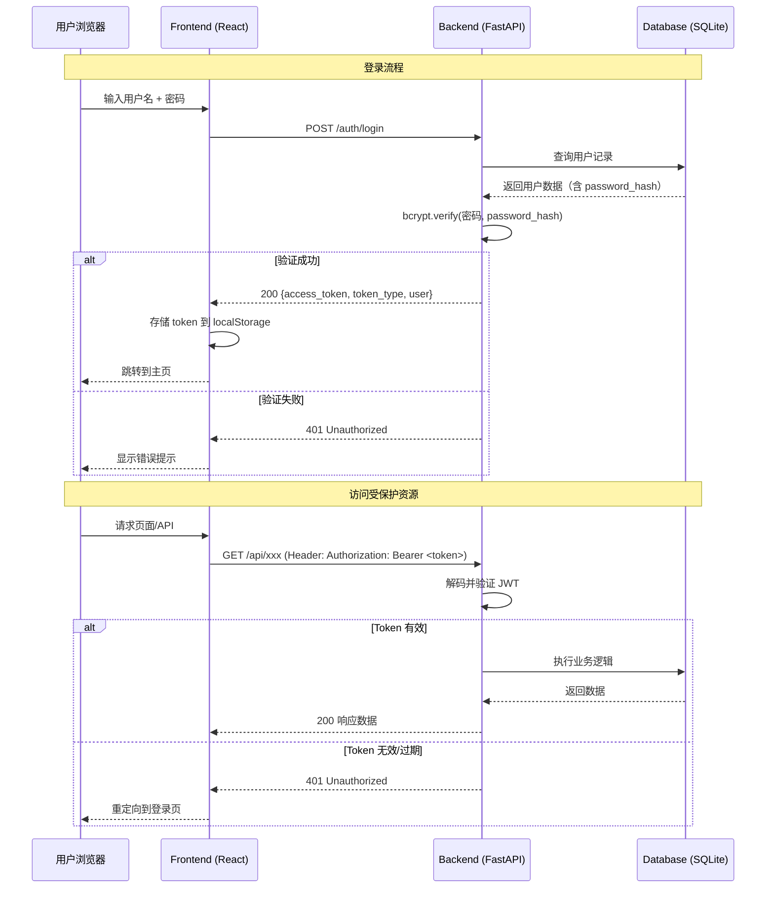
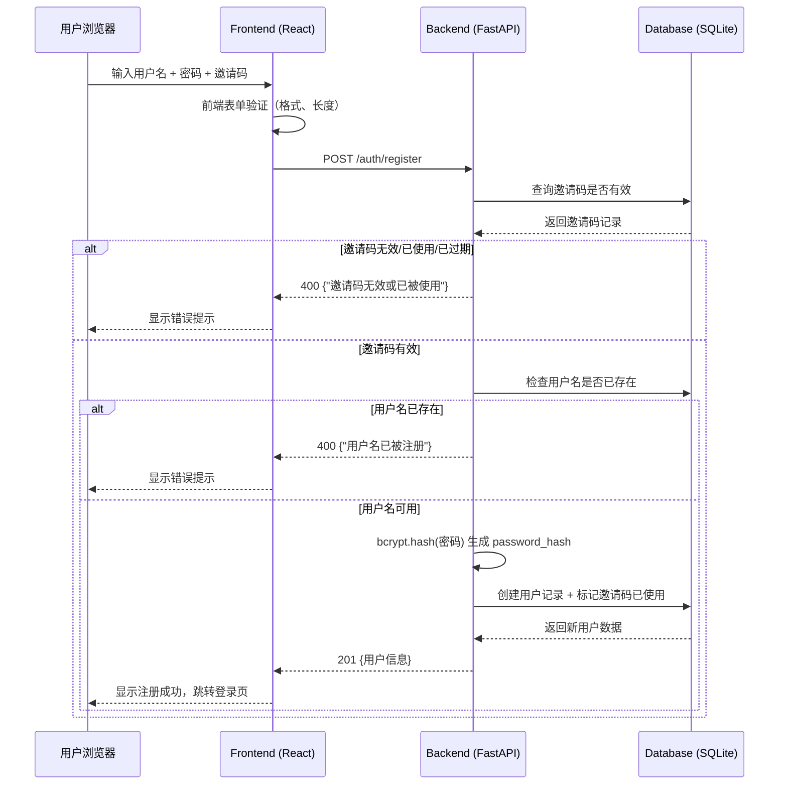

# 系统登录验证功能详细设计文档

> **版本**：v1.0.0  
> **日期**：2026-02-28  
> **状态**：设计中  
> **作者**：AI Hedge Fund Team  
> **评审状态**：待评审

---

## 术语约定

本文档中，以下术语统一使用：

| 术语 | 含义 |
|------|------|
| **JWT**（JSON Web Token） | 无状态访问令牌，用于前后端认证 |
| **bcrypt** | 密码哈希算法，自带盐值 |
| **邀请码**（Invitation Code） | 管理员生成的一次性注册凭证 |
| **访问令牌**（Access Token） | 登录成功后颁发的 JWT 令牌 |
| **中间件**（Middleware） | 请求到达路由前自动执行的过滤/验证函数 |

---

## 目录

- [1. 概述](#1-概述)
- [2. 需求分析](#2-需求分析)
- [3. 系统架构设计](#3-系统架构设计)
- [4. 数据模型设计](#4-数据模型设计)
- [5. API 接口设计](#5-api-接口设计)
- [6. 前端页面设计](#6-前端页面设计)
- [7. 安全设计](#7-安全设计)
- [8. CLI 命令设计](#8-cli-命令设计)
- [9. 实现计划](#9-实现计划)
- [10. 常见问题与自测](#10-常见问题与自测)

---

## 1. 概述

### 1.1 背景

AI Hedge Fund 系统当前所有 Web 端点完全公开，无任何身份验证机制（后端 AGENTS.md 中明确标注 "No auth — All backend endpoints public"）。随着系统功能扩展和数据价值增加，需要引入用户认证系统，确保只有授权用户才能访问系统资源。

#### 为什么现在需要认证？

> 💡 **类比理解**：当前系统就像一间没有门锁的办公室——任何知道地址的人都能进来操作所有设备。  
> 认证系统相当于给办公室装上门禁：需要工卡（令牌）才能进入，而工卡需要管理员审批（邀请码）才能办理。

| 风险场景 | 无认证时 | 有认证后 |
|----------|----------|----------|
| 第三方 API 密钥泄露 | 任何人可通过 `/api-keys` 读取所有密钥 | 仅登录用户可见 |
| 恶意操作 | 任何人可删除流程、伪造运行记录 | 操作可追溯到具体用户 |
| 数据安全 | 量化分析结果完全公开 | 仅授权用户可访问 |

### 1.2 学习目标

阅读本文档后，你将能够：

- **基础目标**：理解认证系统的整体架构和各模块职责
- **进阶目标**：掌握 JWT 令牌认证流程和安全设计要点
- **专家目标**：能够独立实现并扩展认证系统的各个组件

### 1.3 设计原则

| 原则 | 说明 |
|------|------|
| **最小权限** | 用户只能访问其权限范围内的资源 |
| **安全优先** | 密码加密存储，令牌有过期机制 |
| **操作简洁** | 登录/注册流程步骤最少化 |
| **管理可控** | 管理员通过 CLI 控制核心安全操作 |

---

## 2. 需求分析

### 2.1 功能需求

#### 2.1.1 用户角色

系统定义两种角色：

| 角色 | 用户名 | 数量 | 权限 |
|------|--------|------|------|
| **管理员（Admin）** | `einstein` | 固定 1 个 | 全部功能 + 生成邀请码 |
| **普通用户（User）** | 自定义 | 不限 | 使用系统功能 |

#### 2.1.2 核心功能清单

| 编号 | 功能 | 角色 | 入口 | 描述 |
|------|------|------|------|------|
| F-01 | 用户登录 | 所有用户 | Web 登录页 | 用户名 + 密码登录，获取访问令牌 |
| F-02 | 用户注册 | 新用户 | Web 注册页 | 需要邀请码，创建账户 |
| F-03 | 生成邀请码 | 管理员 | CLI 命令 | 只能通过服务器命令行生成 |
| F-04 | 修改密码 | 普通用户 | Web 设置页 | 输入旧密码 + 新密码 |
| F-05 | 绑定邮箱 | 普通用户 | Web 设置页 | 可选绑定，用于密码找回 |
| F-06 | 忘记密码 | 已绑定邮箱的用户 | Web 登录页 | 通过邮箱验证重置密码 |
| F-07 | 管理员密码修改 | 管理员 | CLI 命令 | 只能通过服务器命令行修改，重启生效 |
| F-08 | 访问控制 | 系统 | 中间件 | 未登录用户重定向到登录页 |

#### 2.1.3 约束条件

1. **邀请码注册制**：没有邀请码无法注册，防止未授权用户访问
2. **管理员唯一性**：只有一个管理员 `einstein`，系统初始化时创建
3. **管理员密码安全**：管理员密码只能通过服务器 CLI 修改，修改后需重启服务
4. **邮箱可选绑定**：普通用户可以选择绑定邮箱；未绑定邮箱则无法使用忘记密码功能

### 2.2 非功能需求

| 维度 | 要求 |
|------|------|
| **安全性** | 密码 bcrypt 加密存储；JWT 令牌有效期 24 小时；敏感操作需重新验证 |
| **性能** | 登录响应时间 < 500ms；令牌验证 < 50ms |
| **可用性** | 登录/注册表单符合 Web 无障碍标准（WCAG 2.1 AA） |
| **兼容性** | 支持主流浏览器（Chrome、Firefox、Safari、Edge 最新两个版本） |

---

## 3. 系统架构设计

### 3.1 认证流程概览

```
┌─────────────┐     ┌─────────────┐     ┌─────────────┐
│   Frontend   │────▶│   Backend   │────▶│   Database   │
│  (React)     │◀────│  (FastAPI)  │◀────│  (SQLite)    │
└─────────────┘     └─────────────┘     └─────────────┘
       │                    │
       │  JWT Token         │  bcrypt hash
       │  localStorage      │  SQLAlchemy ORM
```

### 3.2 认证流程时序图



### 3.3 技术选型

#### 为什么选这些技术？

每个选型背后都有 **权衡取舍**（Trade-off）。以下表格不仅列出选择，还说明了放弃了什么：

| 组件 | 技术方案 | 选择理由 | 放弃的替代方案 |
|------|----------|----------|----------------|
| **密码哈希** | `bcrypt`（via `passlib`） | 业界标准，自带盐值，抗彩虹表攻击 | Argon2（更新但生态支持少）、SHA-256（不安全） |
| **访问令牌** | JWT（via `python-jose[cryptography]`） | **无状态**认证，适合前后端分离架构 | Session Cookie（需服务端存储）、OAuth2（过于复杂） |
| **前端存储** | `localStorage` | 简单可靠，页面刷新后保持登录状态 | Cookie（需处理 CSRF）、sessionStorage（关闭标签页后丢失） |
| **中间件** | FastAPI `Depends` | 与现有架构一致，声明式依赖注入 | 全局中间件（粒度太粗，无法区分公开/受保护路由） |

> ⚠️ **代价说明**：选择 `localStorage` 存储令牌的代价是容易受 XSS 攻击。在本项目中，系统部署在内网/本地环境，风险可控。如果未来需要公网部署，应切换为 HttpOnly Cookie 方案。

### 3.4 与现有系统的集成

认证系统作为横切关注点，需要集成到现有架构的多个层面：

```
现有架构：
  Routes → Services → Repositories → Database

增加认证后：
  Routes → [AuthMiddleware] → Services → Repositories → Database
                ↓
          auth_routes.py（新增）
                ↓
          auth_service.py（新增）
                ↓
          user_repository.py（新增）
```

**集成要点**：

1. **路由层**：所有现有的 7 个路由模块（`health`、`hedge_fund`、`flows`、`flow_runs`、`api_keys`、`storage`、`language_models`）添加 `Depends(get_current_user)` 依赖
2. **新增路由**：`/auth/*` 端点不需要认证（登录、注册、忘记密码）
3. **前端层**：添加 `AuthContext`（认证状态管理）+ `AuthGuard`（路由守卫）组件
4. **数据库层**：新增 `users` 和 `invitation_codes` 两张表

> 📋 **[下一节：数据模型设计](#4-数据模型设计)**

### 3.5 注册流程时序图

注册流程比登录多了「邀请码验证」环节，理解这个流程有助于把握系统的访问控制设计：



---

## 4. 数据模型设计

### 4.1 数据库表结构

#### 4.1.1 用户表（`users`）

```sql
CREATE TABLE users (
    id              INTEGER PRIMARY KEY AUTOINCREMENT,
    username        VARCHAR(50) UNIQUE NOT NULL,
    password_hash   VARCHAR(255) NOT NULL,      -- bcrypt 哈希值，禁止存储明文密码
    email           VARCHAR(255) UNIQUE,        -- 可选绑定，用于密码找回
    role            VARCHAR(20) NOT NULL DEFAULT 'user',  -- 'admin' | 'user'
    is_active       BOOLEAN NOT NULL DEFAULT TRUE,
    login_attempts  INTEGER NOT NULL DEFAULT 0,  -- 登录失败计数
    locked_until    DATETIME,                    -- 账户锁定截止时间
    created_at      DATETIME NOT NULL DEFAULT CURRENT_TIMESTAMP,
    updated_at      DATETIME NOT NULL DEFAULT CURRENT_TIMESTAMP
);
```

#### 4.1.2 邀请码表（`invitation_codes`）

```sql
CREATE TABLE invitation_codes (
    id          INTEGER PRIMARY KEY AUTOINCREMENT,
    code        VARCHAR(32) UNIQUE NOT NULL,   -- 随机生成的邀请码
    created_by  INTEGER NOT NULL,              -- 创建者（管理员）ID
    used_by     INTEGER,                       -- 使用者 ID（NULL 表示未使用）
    is_used     BOOLEAN NOT NULL DEFAULT FALSE,
    expires_at  DATETIME,                      -- 过期时间（可选）
    created_at  DATETIME NOT NULL DEFAULT CURRENT_TIMESTAMP,
    FOREIGN KEY (created_by) REFERENCES users(id),
    FOREIGN KEY (used_by) REFERENCES users(id)
);
```

### 4.2 SQLAlchemy 模型

```python
from sqlalchemy import Boolean, Column, DateTime, ForeignKey, Integer, String
from sqlalchemy.orm import relationship
from sqlalchemy.sql import func
from app.backend.database.connection import Base


class User(Base):
    """用户模型"""
    __tablename__ = "users"

    id = Column(Integer, primary_key=True, autoincrement=True)
    username = Column(String(50), unique=True, nullable=False, index=True)
    password_hash = Column(String(255), nullable=False)  # bcrypt 哈希值，禁止明文
    email = Column(String(255), unique=True, nullable=True)
    role = Column(String(20), nullable=False, default="user")
    is_active = Column(Boolean, nullable=False, default=True)
    login_attempts = Column(Integer, nullable=False, default=0)
    locked_until = Column(DateTime, nullable=True)
    created_at = Column(DateTime, server_default=func.now())
    updated_at = Column(DateTime, server_default=func.now(), onupdate=func.now())

    # 关系
    created_codes = relationship("InvitationCode", foreign_keys="InvitationCode.created_by")


class InvitationCode(Base):
    """邀请码模型"""
    __tablename__ = "invitation_codes"

    id = Column(Integer, primary_key=True, autoincrement=True)
    code = Column(String(32), unique=True, nullable=False, index=True)
    created_by = Column(Integer, ForeignKey("users.id"), nullable=False)
    used_by = Column(Integer, ForeignKey("users.id"), nullable=True)
    is_used = Column(Boolean, nullable=False, default=False)
    expires_at = Column(DateTime, nullable=True)
    created_at = Column(DateTime, server_default=func.now())

    # 关系
    creator = relationship("User", foreign_keys=[created_by])
    consumer = relationship("User", foreign_keys=[used_by])
```

### 4.3 Pydantic Schema

```python
from pydantic import BaseModel, EmailStr, Field
from datetime import datetime
from typing import Optional


# ---- 请求 Schema ----

class LoginRequest(BaseModel):
    """登录请求"""
    username: str = Field(..., min_length=3, max_length=50)
    password: str = Field(..., min_length=6, max_length=128)


class RegisterRequest(BaseModel):
    """注册请求"""
    username: str = Field(..., min_length=3, max_length=50, pattern=r"^[a-zA-Z0-9_]+$")
    password: str = Field(..., min_length=6, max_length=128)
    invitation_code: str = Field(..., min_length=8, max_length=32)


class ChangePasswordRequest(BaseModel):
    """修改密码请求"""
    old_password: str = Field(..., min_length=6)
    new_password: str = Field(..., min_length=6, max_length=128)


class BindEmailRequest(BaseModel):
    """绑定邮箱请求"""
    email: EmailStr


class ForgotPasswordRequest(BaseModel):
    """忘记密码请求"""
    username: str
    email: EmailStr


class ResetPasswordRequest(BaseModel):
    """重置密码请求"""
    token: str
    new_password: str = Field(..., min_length=6, max_length=128)


# ---- 响应 Schema ----

class UserResponse(BaseModel):
    """用户信息响应"""
    id: int
    username: str
    email: Optional[str] = None
    role: str
    created_at: datetime

    model_config = {"from_attributes": True}


class TokenResponse(BaseModel):
    """登录令牌响应"""
    access_token: str
    token_type: str = "bearer"
    user: UserResponse


class InvitationCodeResponse(BaseModel):
    """邀请码响应"""
    code: str
    expires_at: Optional[datetime] = None
    created_at: datetime
```

---

## 5. API 接口设计

### 5.1 接口总览

| 方法 | 路径 | 认证 | 描述 |
|------|------|------|------|
| `POST` | `/auth/login` | 否 | 用户登录 |
| `POST` | `/auth/register` | 否 | 用户注册（需邀请码） |
| `GET` | `/auth/me` | 是 | 获取当前用户信息 |
| `PUT` | `/auth/password` | 是 | 修改密码 |
| `PUT` | `/auth/email` | 是 | 绑定/更新邮箱 |
| `POST` | `/auth/forgot-password` | 否 | 发起密码重置 |
| `POST` | `/auth/reset-password` | 否 | 重置密码（需重置令牌） |

### 5.2 接口详细定义

#### 5.2.1 用户登录

```
POST /auth/login
Content-Type: application/json
```

**请求体**：

```json
{
  "username": "alice",
  "password": "mySecureP@ss"
}
```

**成功响应**（200）：

```json
{
  "access_token": "eyJhbGciOiJIUzI1NiIsInR5cCI6IkpXVCJ9...",
  "token_type": "bearer",
  "user": {
    "id": 2,
    "username": "alice",
    "email": "alice@example.com",
    "role": "user",
    "created_at": "2026-02-28T10:00:00"
  }
}
```

**错误响应**（401）：

```json
{
  "detail": "用户名或密码错误"
}
```

#### 5.2.2 用户注册

```
POST /auth/register
Content-Type: application/json
```

**请求体**：

```json
{
  "username": "alice",
  "password": "mySecureP@ss",
  "invitation_code": "INV-A3B7C9D1"
}
```

**成功响应**（201）：

```json
{
  "id": 2,
  "username": "alice",
  "email": null,
  "role": "user",
  "created_at": "2026-02-28T10:00:00"
}
```

**错误响应**：

| 状态码 | 场景 | 响应 |
|--------|------|------|
| 400 | 用户名已存在 | `{"detail": "用户名已被注册"}` |
| 400 | 邀请码无效 | `{"detail": "邀请码无效或已被使用"}` |
| 400 | 邀请码过期 | `{"detail": "邀请码已过期"}` |

#### 5.2.3 获取当前用户信息

```
GET /auth/me
Authorization: Bearer <access_token>
```

**成功响应**（200）：

```json
{
  "id": 2,
  "username": "alice",
  "email": "alice@example.com",
  "role": "user",
  "created_at": "2026-02-28T10:00:00"
}
```

#### 5.2.4 修改密码

```
PUT /auth/password
Authorization: Bearer <access_token>
Content-Type: application/json
```

**请求体**：

```json
{
  "old_password": "myOldP@ss",
  "new_password": "myNewSecureP@ss"
}
```

**成功响应**（200）：

```json
{
  "message": "密码修改成功"
}
```

> ⚠️ **注意**：管理员 `einstein` 不能通过此接口修改密码，返回 403。

#### 5.2.5 绑定邮箱

```
PUT /auth/email
Authorization: Bearer <access_token>
Content-Type: application/json
```

**请求体**：

```json
{
  "email": "alice@example.com"
}
```

**成功响应**（200）：

```json
{
  "message": "邮箱绑定成功"
}
```

#### 5.2.6 忘记密码

```
POST /auth/forgot-password
Content-Type: application/json
```

**请求体**：

```json
{
  "username": "alice",
  "email": "alice@example.com"
}
```

**成功响应**（200）：

```json
{
  "message": "密码重置邮件已发送，请查收"
}
```

> 💡 **安全设计**：无论用户名/邮箱是否匹配，都返回相同的成功消息，防止用户枚举攻击。

#### 5.2.7 重置密码

```
POST /auth/reset-password
Content-Type: application/json
```

**请求体**：

```json
{
  "token": "reset-token-xxxxx",
  "new_password": "myNewSecureP@ss"
}
```

**成功响应**（200）：

```json
{
  "message": "密码重置成功，请使用新密码登录"
}
```

### 5.3 认证中间件

所有现有路由需要添加认证保护。以下是完整的中间件实现：

```python
# app/backend/auth/dependencies.py
"""FastAPI 认证依赖注入"""

import os
from datetime import datetime, timedelta

from fastapi import Depends, HTTPException, status
from fastapi.security import HTTPBearer, HTTPAuthorizationCredentials
from jose import JWTError, jwt
from sqlalchemy.orm import Session

from app.backend.database.connection import get_db
from app.backend.models.user import User

# 从环境变量读取配置，禁止硬编码
SECRET_KEY = os.getenv("AUTH_SECRET_KEY", "change-me-in-production")
ALGORITHM = "HS256"

security = HTTPBearer()


async def get_current_user(
    credentials: HTTPAuthorizationCredentials = Depends(security),
    db: Session = Depends(get_db),
) -> User:
    """从 JWT 访问令牌中提取并验证当前用户

    验证流程：
    1. 解码 JWT → 提取 username
    2. 查询数据库 → 确认用户存在且未被禁用
    3. 检查账户是否被锁定（防暴力破解）
    """
    token = credentials.credentials
    try:
        payload = jwt.decode(token, SECRET_KEY, algorithms=[ALGORITHM])
        username: str = payload.get("sub")
        if username is None:
            raise HTTPException(status_code=401, detail="无效的认证令牌")
    except JWTError:
        raise HTTPException(status_code=401, detail="无效的认证令牌")

    user = db.query(User).filter(User.username == username).first()
    if user is None or not user.is_active:
        raise HTTPException(status_code=401, detail="用户不存在或已禁用")

    # 检查账户是否被锁定
    if user.locked_until and user.locked_until > datetime.utcnow():
        raise HTTPException(status_code=423, detail="账户已锁定，请稍后重试")

    return user


def require_role(role: str):
    """角色权限检查装饰器（预留扩展）"""
    async def role_checker(current_user: User = Depends(get_current_user)):
        if current_user.role != role:
            raise HTTPException(status_code=403, detail="权限不足")
        return current_user
    return role_checker
```

**路由保护示例**：

```python
# 现有路由添加认证依赖（仅需修改一行）
from app.backend.auth.dependencies import get_current_user

@router.get("/flows")
async def list_flows(
    current_user: User = Depends(get_current_user),  # ← 新增这一行
    db: Session = Depends(get_db),
):
    return flow_service.list_flows(db)
```

> 📋 **[下一节：前端页面设计](#6-前端页面设计)**

---

## 6. 前端页面设计

### 6.1 页面规划

新增以下页面/组件：

| 页面 | 路径 | 描述 |
|------|------|------|
| 登录页 | `/login` | 用户名 + 密码登录表单 |
| 注册页 | `/register` | 用户名 + 密码 + 邀请码注册表单 |
| 忘记密码页 | `/forgot-password` | 用户名 + 邮箱输入表单 |
| 重置密码页 | `/reset-password` | 新密码输入表单 |
| 用户设置页 | 主界面内嵌 | 修改密码、绑定邮箱 |

### 6.2 登录页设计

#### 6.2.1 布局结构

```
┌─────────────────────────────────────────┐
│              AI Hedge Fund              │  ← 品牌标识
│                                         │
│  ┌─────────────────────────────────┐    │
│  │  用户名                         │    │  ← <input type="text">
│  │  ┌───────────────────────────┐  │    │
│  │  │ alice                     │  │    │
│  │  └───────────────────────────┘  │    │
│  │                                 │    │
│  │  密码                           │    │  ← <input type="password">
│  │  ┌───────────────────────────┐  │    │
│  │  │ ••••••••                  │  │    │
│  │  └───────────────────────────┘  │    │
│  │                                 │    │
│  │  [        登  录        ]       │    │  ← <button>
│  │                                 │    │
│  │  忘记密码？    还没有账户？注册  │    │  ← <a>
│  └─────────────────────────────────┘    │
└─────────────────────────────────────────┘
```

#### 6.2.2 UI 规范（Web Interface Guidelines 合规）

- **表单无障碍**：每个 `<input>` 绑定 `<label>`（使用 `htmlFor`）
- **自动完成**：用户名 `autocomplete="username"`，密码 `autocomplete="current-password"`
- **输入类型**：密码字段 `type="password"`，禁用拼写检查 `spellCheck={false}`
- **焦点状态**：所有交互元素使用 `focus-visible:ring-2 focus-visible:ring-blue-500`
- **错误提示**：错误信息内联显示在对应字段下方，提交时聚焦第一个错误字段
- **按钮状态**：提交前按钮可用；请求中显示加载旋转图标，按钮禁用
- **占位符**：以 `…` 结尾，展示示例格式，如 `请输入用户名…`
- **键盘支持**：Enter 键提交表单
- **暗色模式**：适配 `dark:` 主题变量，与系统现有主题一致
- **响应式**：移动端表单全宽，桌面端居中最大宽度 400px

#### 6.2.3 React 组件结构

```tsx
// app/frontend/src/pages/LoginPage.tsx

export function LoginPage() {
  const [username, setUsername] = useState("");
  const [password, setPassword] = useState("");
  const [error, setError] = useState<string | null>(null);
  const [isLoading, setIsLoading] = useState(false);
  const { login } = useAuth();

  const handleSubmit = async (e: React.FormEvent) => {
    e.preventDefault();
    setError(null);
    setIsLoading(true);
    try {
      await login(username, password);
    } catch (err) {
      setError("用户名或密码错误，请重试");
      // 聚焦用户名输入框
      document.getElementById("username")?.focus();
    } finally {
      setIsLoading(false);
    }
  };

  return (
    <div className="min-h-screen flex items-center justify-center bg-background">
      <form onSubmit={handleSubmit} className="w-full max-w-[400px] p-8 space-y-6">
        <h1 className="text-2xl font-bold text-center">AI Hedge Fund</h1>

        {error && (
          <div role="alert" aria-live="polite" className="text-red-500 text-sm">
            {error}
          </div>
        )}

        <div className="space-y-2">
          <label htmlFor="username" className="text-sm font-medium">
            用户名
          </label>
          <input
            id="username"
            name="username"
            type="text"
            autoComplete="username"
            spellCheck={false}
            required
            value={username}
            onChange={(e) => setUsername(e.target.value)}
            placeholder="请输入用户名…"
            className="w-full rounded-md border px-3 py-2
              focus-visible:ring-2 focus-visible:ring-blue-500 focus-visible:outline-none"
          />
        </div>

        <div className="space-y-2">
          <label htmlFor="password" className="text-sm font-medium">
            密码
          </label>
          <input
            id="password"
            name="password"
            type="password"
            autoComplete="current-password"
            spellCheck={false}
            required
            value={password}
            onChange={(e) => setPassword(e.target.value)}
            placeholder="请输入密码…"
            className="w-full rounded-md border px-3 py-2
              focus-visible:ring-2 focus-visible:ring-blue-500 focus-visible:outline-none"
          />
        </div>

        <button
          type="submit"
          disabled={isLoading}
          className="w-full rounded-md bg-primary text-primary-foreground py-2
            hover:bg-primary/90 focus-visible:ring-2 focus-visible:ring-blue-500
            disabled:opacity-50 disabled:cursor-not-allowed"
        >
          {isLoading ? "登录中…" : "登录"}
        </button>

        <div className="flex justify-between text-sm text-muted-foreground">
          <a href="/forgot-password" className="hover:underline focus-visible:ring-2">
            忘记密码？
          </a>
          <a href="/register" className="hover:underline focus-visible:ring-2">
            还没有账户？注册
          </a>
        </div>
      </form>
    </div>
  );
}
```

### 6.3 注册页设计

注册表单包含三个字段：用户名、密码、邀请码。

```
┌─────────────────────────────────────────┐
│              创建账户                    │
│                                         │
│  ┌─────────────────────────────────┐    │
│  │  用户名                         │    │
│  │  ┌───────────────────────────┐  │    │
│  │  │                           │  │    │
│  │  └───────────────────────────┘  │    │
│  │                                 │    │
│  │  密码                           │    │
│  │  ┌───────────────────────────┐  │    │
│  │  │                           │  │    │
│  │  └───────────────────────────┘  │    │
│  │                                 │    │
│  │  邀请码                         │    │
│  │  ┌───────────────────────────┐  │    │
│  │  │                           │  │    │
│  │  └───────────────────────────┘  │    │
│  │                                 │    │
│  │  [        注  册        ]       │    │
│  │                                 │    │
│  │  已有账户？登录                  │    │
│  └─────────────────────────────────┘    │
└─────────────────────────────────────────┘
```

**验证规则**：

| 字段 | 规则 | 错误提示 |
|------|------|----------|
| 用户名 | 3-50 字符，仅字母/数字/下划线 | "用户名长度 3-50，只能包含字母、数字和下划线" |
| 密码 | 至少 6 字符 | "密码长度至少 6 位" |
| 邀请码 | 8-32 字符，必填 | "请输入有效的邀请码" |

### 6.4 AuthContext 设计

`AuthContext` 是前端认证状态的核心，负责令牌管理和用户状态维护：

```tsx
// app/frontend/src/contexts/AuthContext.tsx

import { createContext, useContext, useEffect, useState, useCallback } from "react";

const API_URL = import.meta.env.VITE_API_URL || "http://localhost:8000";
const TOKEN_KEY = "hedge_fund_token";  // localStorage 键名

interface User {
  id: number;
  username: string;
  email: string | null;
  role: "admin" | "user";
  created_at: string;
}

interface AuthState {
  user: User | null;
  token: string | null;
  isAuthenticated: boolean;
  isLoading: boolean;  // 初始化时验证令牌有效性
}

interface AuthContextType extends AuthState {
  login: (username: string, password: string) => Promise<void>;
  register: (username: string, password: string, invitationCode: string) => Promise<void>;
  logout: () => void;
  updateUser: (user: User) => void;
}

const AuthContext = createContext<AuthContextType | null>(null);

export function useAuth(): AuthContextType {
  const context = useContext(AuthContext);
  if (!context) {
    throw new Error("useAuth 必须在 AuthProvider 内部使用");
  }
  return context;
}

export function AuthProvider({ children }: { children: React.ReactNode }) {
  const [state, setState] = useState<AuthState>({
    user: null,
    token: localStorage.getItem(TOKEN_KEY),
    isAuthenticated: false,
    isLoading: true,  // 初始为 true，等待令牌验证
  });

  // 初始化时验证本地存储的令牌
  useEffect(() => {
    const token = localStorage.getItem(TOKEN_KEY);
    if (token) {
      fetch(`${API_URL}/auth/me`, {
        headers: { Authorization: `Bearer ${token}` },
      })
        .then((res) => (res.ok ? res.json() : Promise.reject()))
        .then((user) => setState({ user, token, isAuthenticated: true, isLoading: false }))
        .catch(() => {
          localStorage.removeItem(TOKEN_KEY);
          setState({ user: null, token: null, isAuthenticated: false, isLoading: false });
        });
    } else {
      setState((s) => ({ ...s, isLoading: false }));
    }
  }, []);

  const login = useCallback(async (username: string, password: string) => {
    const res = await fetch(`${API_URL}/auth/login`, {
      method: "POST",
      headers: { "Content-Type": "application/json" },
      body: JSON.stringify({ username, password }),
    });
    if (!res.ok) {
      const error = await res.json();
      throw new Error(error.detail || "登录失败");
    }
    const data = await res.json();
    localStorage.setItem(TOKEN_KEY, data.access_token);
    setState({ user: data.user, token: data.access_token, isAuthenticated: true, isLoading: false });
  }, []);

  const register = useCallback(async (username: string, password: string, invitationCode: string) => {
    const res = await fetch(`${API_URL}/auth/register`, {
      method: "POST",
      headers: { "Content-Type": "application/json" },
      body: JSON.stringify({ username, password, invitation_code: invitationCode }),
    });
    if (!res.ok) {
      const error = await res.json();
      throw new Error(error.detail || "注册失败");
    }
  }, []);

  const logout = useCallback(() => {
    localStorage.removeItem(TOKEN_KEY);
    setState({ user: null, token: null, isAuthenticated: false, isLoading: false });
    window.location.href = "/login";
  }, []);

  const updateUser = useCallback((user: User) => {
    setState((s) => ({ ...s, user }));
  }, []);

  return (
    <AuthContext.Provider value={{ ...state, login, register, logout, updateUser }}>
      {children}
    </AuthContext.Provider>
  );
}
```

> 💡 **设计要点**：初始化时 `isLoading = true`，等待 `/auth/me` 验证完成后才渲染子组件。避免用户刷新页面时闪现登录页再跳转主页的问题。

### 6.5 路由守卫

```tsx
// app/frontend/src/components/AuthGuard.tsx

export function AuthGuard({ children }: { children: React.ReactNode }) {
  const { isAuthenticated, isLoading } = useAuth();

  if (isLoading) {
    return <LoadingSpinner />;
  }

  if (!isAuthenticated) {
    // 重定向到登录页
    window.location.href = "/login";
    return null;
  }

  return <>{children}</>;
}
```

---

## 7. 安全设计

### 7.1 密码安全

| 措施 | 实现方式 |
|------|----------|
| **加密存储** | 使用 bcrypt 哈希，自动加盐，work factor = 12 |
| **传输安全** | HTTPS 传输（生产环境），请求体 JSON 格式 |
| **强度要求** | 最少 6 字符（可扩展为复杂度校验） |
| **防暴力破解** | 登录失败 5 次后，账户锁定 15 分钟 |

### 7.2 JWT 访问令牌安全

```python
# app/backend/auth/utils.py
"""密码哈希 + JWT 令牌工具"""

import os
from datetime import datetime, timedelta
from passlib.context import CryptContext
from jose import jwt

# 密码哈希配置
pwd_context = CryptContext(schemes=["bcrypt"], deprecated="auto")

# JWT 配置
SECRET_KEY = os.getenv("AUTH_SECRET_KEY", "change-me-in-production")
ALGORITHM = "HS256"
ACCESS_TOKEN_EXPIRE_MINUTES = int(os.getenv("AUTH_TOKEN_EXPIRE_MINUTES", "1440"))  # 24 小时


def hash_password(plain_password: str) -> str:
    """生成 bcrypt 哈希值"""
    return pwd_context.hash(plain_password)


def verify_password(plain_password: str, password_hash: str) -> bool:
    """验证密码与哈希是否匹配"""
    return pwd_context.verify(plain_password, password_hash)


def create_access_token(data: dict) -> str:
    """创建 JWT 访问令牌

    Args:
        data: 令牌载荷，通常包含 {"sub": username, "role": role}

    Returns:
        编码后的 JWT 字符串
    """
    to_encode = data.copy()
    expire = datetime.utcnow() + timedelta(minutes=ACCESS_TOKEN_EXPIRE_MINUTES)
    to_encode.update({"exp": expire, "iat": datetime.utcnow()})
    return jwt.encode(to_encode, SECRET_KEY, algorithm=ALGORITHM)
```

**令牌载荷（Payload）**：

```json
{
  "sub": "alice",
  "role": "user",
  "exp": 1740700800,
  "iat": 1740614400
}
```

### 7.3 安全清单

实现过程中，使用以下清单逐项验收：

- [ ] 密码使用 bcrypt 哈希存储（字段名 `password_hash`），禁止明文
- [ ] JWT 密钥通过环境变量 `AUTH_SECRET_KEY` 配置，禁止硬编码
- [ ] 所有敏感端点要求 `Authorization: Bearer <token>` 请求头
- [ ] 登录失败响应统一返回「用户名或密码错误」，不区分具体原因
- [ ] 忘记密码接口无论用户是否存在都返回相同响应
- [ ] 密码重置令牌一次性使用，有效期不超过 1 小时
- [ ] 管理员密码只能通过 CLI 修改，`PUT /auth/password` 对 admin 用户返回 403
- [ ] 前端不存储明文密码，不使用 `dangerouslySetInnerHTML`
- [ ] CORS 白名单仅允许 `localhost:5173`，生产环境配置具体域名
- [ ] 登录失败 5 次后账户锁定 15 分钟（防暴力破解）

### 7.4 环境变量配置

认证系统需要以下环境变量，在 `.env` 文件中配置：

```bash
# === 认证配置 ===

# JWT 签名密钥（必填，至少 32 字符的随机字符串）
# 生成方法：python -c "import secrets; print(secrets.token_urlsafe(32))"
AUTH_SECRET_KEY=your-secret-key-change-in-production

# 访问令牌有效期（分钟，默认 1440 = 24 小时）
AUTH_TOKEN_EXPIRE_MINUTES=1440

# 管理员初始密码（仅首次 init 时使用）
AUTH_ADMIN_DEFAULT_PASSWORD=Hedge@2026!

# 关闭认证（仅开发环境）
# AUTH_DISABLED=true

# === 邮件配置（密码找回功能） ===
# SMTP_HOST=smtp.example.com
# SMTP_PORT=587
# SMTP_USER=noreply@example.com
# SMTP_PASSWORD=your-smtp-password
# SMTP_FROM=AI Hedge Fund <noreply@example.com>
```

### 7.5 故障排查指南

开发和部署过程中常见的认证问题及解决方法：

| 错误现象 | 可能原因 | 排查步骤 |
|----------|----------|----------|
| 登录始终返回 401 | 1. 密码错误 2. 用户不存在 3. 账户被锁定 | ① `auth list-users` 确认用户存在 ② 检查 `locked_until` 字段 ③ 重置密码 |
| 前端请求 401 但 Token 未过期 | 1. `AUTH_SECRET_KEY` 变更 2. 服务重启后密钥变化 | ① 确认 `.env` 中密钥未变 ② 清除 `localStorage` 重新登录 |
| 注册时「邀请码无效」 | 1. 邀请码已使用 2. 邀请码已过期 3. 输入有误 | ① `auth list-invites` 查看状态 ② 重新生成邀请码 |
| 管理员密码重置后无效 | 未重启服务 | ① 执行 `systemctl restart hedge-fund` 或重启 uvicorn ② 重新登录 |
| CORS 错误 | 前端 URL 不在白名单 | ① 检查 `main.py` 中 `allow_origins` 配置 ② 确认前端端口号 |
| `AUTH_SECRET_KEY` 未配置警告 | `.env` 缺少密钥配置 | ① 复制示例配置到 `.env` ② 生成随机密钥填入 |

---

## 8. CLI 命令设计

### 8.1 命令总览

| 命令 | 描述 | 使用场景 |
|------|------|----------|
| `auth init` | 初始化认证系统，创建管理员账户 | 首次部署 |
| `auth gen-invite` | 生成邀请码 | 邀请新用户 |
| `auth reset-admin-password` | 重置管理员密码 | 管理员忘记密码 |
| `auth list-users` | 列出所有用户 | 用户管理 |
| `auth list-invites` | 列出所有邀请码 | 邀请码管理 |

### 8.2 命令详细定义

#### 8.2.1 初始化认证系统

```bash
# 首次部署时运行
uv run python -m app.backend.auth init

# 输出示例：
# ✓ 数据库表已创建
# ✓ 管理员 einstein 已创建
# ✓ 默认密码: Hedge@2026!
# ⚠ 请及时修改管理员默认密码
```

#### 8.2.2 生成邀请码

```bash
# 生成一个邀请码（默认 7 天有效）
uv run python -m app.backend.auth gen-invite

# 生成指定有效期的邀请码
uv run python -m app.backend.auth gen-invite --expires-in 30d

# 批量生成
uv run python -m app.backend.auth gen-invite --count 5

# 输出示例：
# ✓ 邀请码已生成
# 邀请码: INV-A3B7C9D1E5F2
# 有效期: 2026-03-07 00:00:00
# 状态: 未使用
```

#### 8.2.3 重置管理员密码

```bash
# 重置管理员密码
uv run python -m app.backend.auth reset-admin-password

# 交互式输入新密码：
# 请输入新密码: ********
# 请确认新密码: ********
# ✓ 管理员密码已更新
# ⚠ 请重启服务以使新密码生效
```

> ⚠️ **重要**：修改管理员密码后必须重启服务才能生效。这是设计上的安全限制，确保密码修改需要服务器物理访问权限。

#### 8.2.4 列出用户

```bash
uv run python -m app.backend.auth list-users

# 输出示例：
# ID  用户名      角色    邮箱                 创建时间
# --  --------    ------  -----------------    -------------------
# 1   einstein    admin   -                    2026-02-28 10:00:00
# 2   alice       user    alice@example.com    2026-02-28 12:00:00
# 3   bob         user    -                    2026-02-28 14:00:00
```

#### 8.2.5 列出邀请码

```bash
uv run python -m app.backend.auth list-invites

# 输出示例：
# 邀请码              状态    使用者    创建时间              过期时间
# ------------------  ------  ------    -------------------   -------------------
# INV-A3B7C9D1E5F2    已使用  alice     2026-02-28 10:00:00   2026-03-07 00:00:00
# INV-X1Y2Z3W4V5U6    未使用  -         2026-02-28 14:00:00   2026-03-07 00:00:00
```

### 8.3 CLI 实现方案

```python
# app/backend/auth/__init__.py
# 使用 Python 标准库 argparse 实现

import argparse
import sys


def main():
    parser = argparse.ArgumentParser(description="AI Hedge Fund 认证管理")
    subparsers = parser.add_subparsers(dest="command")

    # init 命令
    subparsers.add_parser("init", help="初始化认证系统")

    # gen-invite 命令
    invite_parser = subparsers.add_parser("gen-invite", help="生成邀请码")
    invite_parser.add_argument("--expires-in", default="7d", help="有效期（如 7d, 30d）")
    invite_parser.add_argument("--count", type=int, default=1, help="生成数量")

    # reset-admin-password 命令
    subparsers.add_parser("reset-admin-password", help="重置管理员密码")

    # list-users 命令
    subparsers.add_parser("list-users", help="列出所有用户")

    # list-invites 命令
    subparsers.add_parser("list-invites", help="列出所有邀请码")

    args = parser.parse_args()
    # ... 执行对应命令
```

---

## 9. 实现计划

### 9.1 开发阶段

| 阶段 | 内容 | 预估工时 | 优先级 |
|------|------|----------|--------|
| **P1：基础认证** | 用户模型 + 登录/注册 API + JWT 中间件 | 2 天 | 高 |
| **P2：前端集成** | 登录页 + 注册页 + AuthContext + 路由守卫 | 2 天 | 高 |
| **P3：CLI 工具** | 初始化 + 邀请码生成 + 管理员密码管理 | 1 天 | 高 |
| **P4：密码管理** | 修改密码 + 绑定邮箱 + 用户设置页 | 1 天 | 中 |
| **P5：密码找回** | 忘记密码 + 邮件发送 + 密码重置 | 1 天 | 低 |
| **P6：安全加固** | 登录限流 + 日志审计 + 安全测试 | 1 天 | 中 |

### 9.2 反模式清单

实现时必须避免以下做法：

| 编号 | 反模式 | 正确做法 |
|------|----------|----------|
| A-01 | 明文存储密码 | 使用 `password_hash` 字段，bcrypt 哈希 |
| A-02 | 硬编码 JWT 密钥 | 从 `AUTH_SECRET_KEY` 环境变量读取 |
| A-03 | 登录失败时告诉用户「用户名不存在」 | 统一返回「用户名或密码错误」 |
| A-04 | 前端用 `dangerouslySetInnerHTML` 渲染用户数据 | 使用 React 默认的 XSS 防护 |
| A-05 | `<div onClick>` 代替 `<button>` / `<a>` | 语义化 HTML：操作用 `<button>`，导航用 `<a>` |
| A-06 | 表单 `<input>` 无 `<label>` | 每个输入框绑定 `<label htmlFor="...">`|
| A-07 | `outline-none` 无焦点替代 | 使用 `focus-visible:ring-*` |
| A-08 | 管理员可通过 Web 接口改密码 | admin 用户 `PUT /auth/password` 返回 403 |

### 9.2 数据库迁移

使用 Alembic 创建迁移脚本：

```bash
# 生成迁移
cd app/backend
alembic revision --autogenerate -m "add auth tables"

# 执行迁移
alembic upgrade head
```

### 9.3 文件变更清单

| 操作 | 文件路径 | 描述 |
|------|----------|------|
| **新增** | `app/backend/auth/__init__.py` | CLI 入口 |
| **新增** | `app/backend/auth/service.py` | 认证服务 |
| **新增** | `app/backend/auth/utils.py` | JWT + 密码工具 |
| **新增** | `app/backend/models/user.py` | User + InvitationCode 模型 |
| **新增** | `app/backend/routes/auth.py` | 认证路由 |
| **新增** | `app/backend/repositories/user_repository.py` | 用户数据仓库 |
| **修改** | `app/backend/routes/__init__.py` | 注册 auth 路由 |
| **修改** | `app/backend/main.py` | 添加认证中间件 |
| **修改** | `app/backend/database/models.py` | 导入新模型 |
| **新增** | `app/frontend/src/pages/LoginPage.tsx` | 登录页 |
| **新增** | `app/frontend/src/pages/RegisterPage.tsx` | 注册页 |
| **新增** | `app/frontend/src/pages/ForgotPasswordPage.tsx` | 忘记密码页 |
| **新增** | `app/frontend/src/contexts/AuthContext.tsx` | 认证上下文 |
| **新增** | `app/frontend/src/components/AuthGuard.tsx` | 路由守卫 |
| **新增** | `app/frontend/src/services/auth-api.ts` | 认证 API 服务 |
| **修改** | `app/frontend/src/main.tsx` | 包裹 AuthProvider |
| **修改** | `app/frontend/src/services/api.ts` | 请求拦截器添加 Token |

### 9.4 依赖新增

**后端**（`pyproject.toml`）：

```toml
[tool.poetry.dependencies]
passlib = {extras = ["bcrypt"], version = "^1.7.4"}    # 密码哈希
python-jose = {extras = ["cryptography"], version = "^3.3.0"}  # JWT 令牌
python-multipart = "^0.0.6"    # 表单数据解析
```

**前端**（无新增依赖）：使用现有的 React + Tailwind + shadcn/ui 栈，无需额外安装认证相关库。

### 9.5 验收标准

每个开发阶段完成后，按以下标准验收：

| 阶段 | 验收项 | 通过标准 |
|------|---------|----------|
| **P1** | 登录 API | `curl -X POST /auth/login` 返回有效 JWT |
| **P1** | 注册 API | 使用有效邀请码注册成功，无效码返回 400 |
| **P1** | 中间件 | 无 Token 访问受保护路由返回 401 |
| **P2** | 登录页 | 能登录并跳转主页，错误密码显示提示 |
| **P2** | 路由守卫 | 未登录状态访问任何页面重定向到登录页 |
| **P3** | CLI init | `auth init` 创建管理员账户 |
| **P3** | CLI invite | `auth gen-invite` 生成可用邀请码 |
| **P4** | 修改密码 | 旧密码正确时可修改，管理员返回 403 |
| **P5** | 密码找回 | 绑定邮箱后能收到重置邮件 |
| **P6** | 防暴力 | 5 次失败后账户锁定，15 分钟后自动解锁 |

---

## 10. 常见问题与自测

### 10.1 常见问题（FAQ）

### Q1：为什么管理员密码只能通过 CLI 修改？

**安全考量**。管理员密码是系统最高权限凭证。通过限制修改入口为服务器 CLI，确保只有物理接触服务器的人才能修改管理员密码，即使系统被入侵（如 JWT 密钥泄露），攻击者也无法通过 Web 接口修改管理员密码。

### Q2：为什么需要邀请码才能注册？

**访问控制**。此系统面向特定团队使用，不是公开服务。邀请码机制确保只有经管理员授权的人才能创建账户，避免未知用户访问敏感的量化分析数据。

### Q3：忘记密码功能为什么要求绑定邮箱？

**身份验证**。密码重置需要一种独立于密码本身的身份验证途径。邮箱验证是最简单可靠的方式。选择不绑定邮箱的用户，在忘记密码后需联系管理员通过 CLI 处理。

### Q4：JWT 访问令牌过期后如何处理？

前端在收到 401 响应后，自动清除本地存储的访问令牌并重定向到登录页。用户需要重新登录获取新令牌。当前设计不包含 Refresh Token 机制，如后续需要可扩展。

### Q5：如何在开发环境跳过认证？

可通过环境变量 `AUTH_DISABLED=true` 关闭认证中间件，仅限开发环境使用：

```python
AUTH_DISABLED = os.getenv("AUTH_DISABLED", "false").lower() == "true"

if not AUTH_DISABLED:
    app.add_middleware(AuthMiddleware)
```

### Q6：`localStorage` 存储令牌安全吗？

在本项目场景下（内网/本地部署、非公开服务）风险可控。`localStorage` 的主要风险是 XSS 攻击——如果攻击者能在页面中注入 JavaScript 代码，就能读取令牌。缓解措施：

1. 前端不使用 `dangerouslySetInnerHTML` 渲染用户输入
2. CSP（Content Security Policy）限制脚本来源
3. 如需更高安全性，可改为 HttpOnly Cookie + CSRF Token 方案

### 10.2 自测练习

完成以下练习，验证你对认证系统设计的理解：

#### ⭐ 理解型

1. 认证系统中，**管理员**和**普通用户**在密码管理上有哪些差异？列出至少 3 点。
2. 用户登录后，前端如何在后续请求中携带身份信息？

#### ⭐⭐ 应用型

3. 假设你需要为现有路由 `GET /flows` 添加认证保护，需要修改哪些地方？写出关键代码片段。

<details>
<summary>💡 提示</summary>

查看 [5.3 认证中间件](#53-认证中间件) 中的路由保护示例。核心是添加 `Depends(get_current_user)` 参数。

</details>

4. 如果管理员 `einstein` 尝试通过 `PUT /auth/password` 接口修改密码，系统应该如何响应？为什么？

#### ⭐⭐⭐ 分析型

5. 当前设计中，忘记密码接口无论用户名/邮箱是否匹配都返回相同的成功响应。这样做的安全意义是什么？如果不这样做，会暴露什么信息？

6. 对比以下两种令牌存储方案的优缺点，说明在什么场景下应该选择哪种：
   - 方案 A：JWT 存储在 `localStorage`
   - 方案 B：JWT 存储在 HttpOnly Cookie

#### ⭐⭐⭐⭐ 创造型

7. 如果要在本系统上增加「多因素认证（MFA）」功能，你会如何设计？请画出时序图或写出关键 API 变更。

---

## 附录：章节导航

| 上一节 | 当前节 | 下一节 |
|--------|--------|--------|
| — | [1. 概述](#1-概述) | [2. 需求分析](#2-需求分析) |
| [1. 概述](#1-概述) | [2. 需求分析](#2-需求分析) | [3. 系统架构设计](#3-系统架构设计) |
| [2. 需求分析](#2-需求分析) | [3. 系统架构设计](#3-系统架构设计) | [4. 数据模型设计](#4-数据模型设计) |
| [3. 系统架构设计](#3-系统架构设计) | [4. 数据模型设计](#4-数据模型设计) | [5. API 接口设计](#5-api-接口设计) |
| [4. 数据模型设计](#4-数据模型设计) | [5. API 接口设计](#5-api-接口设计) | [6. 前端页面设计](#6-前端页面设计) |
| [5. API 接口设计](#5-api-接口设计) | [6. 前端页面设计](#6-前端页面设计) | [7. 安全设计](#7-安全设计) |
| [6. 前端页面设计](#6-前端页面设计) | [7. 安全设计](#7-安全设计) | [8. CLI 命令设计](#8-cli-命令设计) |
| [7. 安全设计](#7-安全设计) | [8. CLI 命令设计](#8-cli-命令设计) | [9. 实现计划](#9-实现计划) |
| [8. CLI 命令设计](#8-cli-命令设计) | [9. 实现计划](#9-实现计划) | [10. 常见问题与自测](#10-常见问题与自测) |
| [9. 实现计划](#9-实现计划) | [10. 常见问题与自测](#10-常见问题与自测) | — |

---

> **文档结束**  
> 如有问题或建议，请提交 Issue 或联系开发团队。
